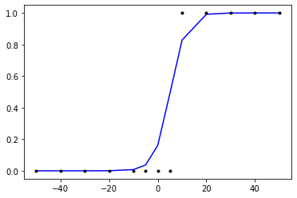

```python
#자동 미분
import tensorflow as tf

w = tf.Variable(2.)

def f(w):
  y = w**2
  z = 2*y + 5
  return z
```


```python
with tf.GradientTape() as tape:
  z = f(w)

gradients = tape.gradient(z, [w])
print(gradients)
```

    [<tf.Tensor: shape=(), dtype=float32, numpy=8.0>]
    


```python
W = tf.Variable(4.0)
b = tf.Variable(1.0)
```


```python
@tf.function
def hypothesis(x):
  return W*x + b
```


```python
x_test = [3.5, 5, 5.5, 6]
print(hypothesis(x_test).numpy())
```

    [15. 21. 23. 25.]
    


```python
@tf.function
def mse_loss(y_pred, y):
  # 두 개의 차이값을 제곱을 해서 평균을 취한다.
  return tf.reduce_mean(tf.square(y_pred - y))
```


```python
X=[1,2,3,4,5,6,7,8,9] # 공부하는 시간
y=[11,22,33,44,53,66,77,87,95] # 각 공부하는 시간에 맵핑되는 성적
```


```python
optimizer = tf.optimizers.SGD(0.01)
```


```python
for i in range(301):
  with tf.GradientTape() as tape:
    # 현재 파라미터에 기반한 입력 x에 대한 예측값을 y_pred
    y_pred = hypothesis(X)

    # 평균 제곱 오차를 계산
    cost = mse_loss(y_pred, y)

  # 손실 함수에 대한 파라미터의 미분값 계산
  gradients = tape.gradient(cost, [W, b])

  # 파라미터 업데이트
  optimizer.apply_gradients(zip(gradients, [W, b]))

  if i % 10 == 0:
    print("epoch : {:3} | W의 값 : {:5.4f} | b의 값 : {:5.4} | cost : {:5.6f}".format(i, W.numpy(), b.numpy(), cost))
```

    epoch :   0 | W의 값 : 8.2133 | b의 값 : 1.664 | cost : 1402.555542
    epoch :  10 | W의 값 : 10.4971 | b의 값 : 1.977 | cost : 1.351182
    epoch :  20 | W의 값 : 10.5047 | b의 값 :  1.93 | cost : 1.328165
    epoch :  30 | W의 값 : 10.5119 | b의 값 : 1.884 | cost : 1.306967
    epoch :  40 | W의 값 : 10.5188 | b의 값 : 1.841 | cost : 1.287436
    epoch :  50 | W의 값 : 10.5254 | b의 값 : 1.799 | cost : 1.269459
    epoch :  60 | W의 값 : 10.5318 | b의 값 : 1.759 | cost : 1.252898
    epoch :  70 | W의 값 : 10.5379 | b의 값 : 1.721 | cost : 1.237644
    epoch :  80 | W의 값 : 10.5438 | b의 값 : 1.684 | cost : 1.223598
    epoch :  90 | W의 값 : 10.5494 | b의 값 : 1.648 | cost : 1.210658
    epoch : 100 | W의 값 : 10.5548 | b의 값 : 1.614 | cost : 1.198740
    epoch : 110 | W의 값 : 10.5600 | b의 값 : 1.582 | cost : 1.187767
    epoch : 120 | W의 값 : 10.5650 | b의 값 :  1.55 | cost : 1.177665
    epoch : 130 | W의 값 : 10.5697 | b의 값 :  1.52 | cost : 1.168354
    epoch : 140 | W의 값 : 10.5743 | b의 값 : 1.492 | cost : 1.159782
    epoch : 150 | W의 값 : 10.5787 | b의 값 : 1.464 | cost : 1.151890
    epoch : 160 | W의 값 : 10.5829 | b의 값 : 1.437 | cost : 1.144619
    epoch : 170 | W의 값 : 10.5870 | b의 값 : 1.412 | cost : 1.137924
    epoch : 180 | W의 값 : 10.5909 | b의 값 : 1.387 | cost : 1.131752
    epoch : 190 | W의 값 : 10.5946 | b의 값 : 1.364 | cost : 1.126073
    epoch : 200 | W의 값 : 10.5982 | b의 값 : 1.341 | cost : 1.120843
    epoch : 210 | W의 값 : 10.6016 | b의 값 :  1.32 | cost : 1.116026
    epoch : 220 | W의 값 : 10.6049 | b의 값 : 1.299 | cost : 1.111589
    epoch : 230 | W의 값 : 10.6081 | b의 값 : 1.279 | cost : 1.107504
    epoch : 240 | W의 값 : 10.6111 | b의 값 :  1.26 | cost : 1.103736
    epoch : 250 | W의 값 : 10.6140 | b의 값 : 1.242 | cost : 1.100273
    epoch : 260 | W의 값 : 10.6168 | b의 값 : 1.224 | cost : 1.097082
    epoch : 270 | W의 값 : 10.6195 | b의 값 : 1.207 | cost : 1.094143
    epoch : 280 | W의 값 : 10.6221 | b의 값 : 1.191 | cost : 1.091434
    epoch : 290 | W의 값 : 10.6245 | b의 값 : 1.176 | cost : 1.088940
    epoch : 300 | W의 값 : 10.6269 | b의 값 : 1.161 | cost : 1.086645
    


```python
x_test = [3.5, 5, 5.5, 6]
print(hypothesis(x_test).numpy())
```

    [38.35479  54.295143 59.608593 64.92204 ]
    


```python
import keras
model = keras.models.Sequential()
model.add(keras.layers.Dense(1, input_dim=1))
```


```python
model
```


    <keras.engine.sequential.Sequential at 0x25a364326a0>


```python
import numpy as np
from tensorflow.keras.models import Sequential
from tensorflow.keras.layers import Dense
from tensorflow.keras import optimizers
```


```python
X=[1,2,3,4,5,6,7,8,9] # 공부하는 시간
y=[11,22,33,44,53,66,77,87,95] # 각 공부하는 시간에 맵핑되는 성적

model = Sequential()

# 입력 x의 차원은 1, 출력 y의 차원도 1. 선형 회귀이므로 activation은 'linear'
model.add(Dense(1, input_dim=1, activation='linear'))

# sgd는 경사 하강법을 의미. 학습률(learning rate, lr)은 0.01.
sgd = optimizers.SGD(lr=0.01)

# 손실 함수(Loss function)은 평균제곱오차 mse를 사용합니다.
model.compile(optimizer=sgd ,loss='mse',metrics=['mse'])

# 주어진 X와 y데이터에 대해서 오차를 최소화하는 작업을 300번 시도합니다.
model.fit(X,y, batch_size=1, epochs=300, shuffle=False)
```

    C:\Users\user\anaconda3\lib\site-packages\tensorflow\python\keras\optimizer_v2\optimizer_v2.py:374: UserWarning: The `lr` argument is deprecated, use `learning_rate` instead.
      warnings.warn(
    

    Epoch 1/300
    9/9 [==============================] - 0s 998us/step - loss: 370.2478 - mse: 370.2478
    Epoch 2/300
    9/9 [==============================] - 0s 998us/step - loss: 2.2756 - mse: 2.2756
    Epoch 3/300
    9/9 [==============================] - 0s 1ms/step - loss: 2.2709 - mse: 2.2709
    Epoch 4/300
    9/9 [==============================] - 0s 873us/step - loss: 2.2664 - mse: 2.2664
    Epoch 5/300
    9/9 [==============================] - 0s 997us/step - loss: 2.2621 - mse: 2.2621
    Epoch 6/300
    9/9 [==============================] - 0s 997us/step - loss: 2.2579 - mse: 2.2579
    Epoch 7/300
    9/9 [==============================] - 0s 872us/step - loss: 2.2539 - mse: 2.2539
    Epoch 8/300
    9/9 [==============================] - 0s 871us/step - loss: 2.2500 - mse: 2.2500
    Epoch 9/300
    9/9 [==============================] - 0s 1ms/step - loss: 2.2463 - mse: 2.2463
    Epoch 10/300
    9/9 [==============================] - 0s 1ms/step - loss: 2.2427 - mse: 2.2427
    Epoch 11/300
    9/9 [==============================] - 0s 3ms/step - loss: 2.2393 - mse: 2.2393
    Epoch 12/300
    9/9 [==============================] - 0s 1ms/step - loss: 2.2360 - mse: 2.2360
    Epoch 13/300
    9/9 [==============================] - 0s 1ms/step - loss: 2.2328 - mse: 2.2328
    Epoch 14/300
    9/9 [==============================] - 0s 997us/step - loss: 2.2297 - mse: 2.2297
    Epoch 15/300
    9/9 [==============================] - 0s 872us/step - loss: 2.2268 - mse: 2.2268
    Epoch 16/300
    9/9 [==============================] - 0s 1ms/step - loss: 2.2239 - mse: 2.2239
    Epoch 17/300
    9/9 [==============================] - 0s 3ms/step - loss: 2.2212 - mse: 2.2212
    Epoch 18/300
    9/9 [==============================] - 0s 2ms/step - loss: 2.2185 - mse: 2.2185
    Epoch 19/300
    9/9 [==============================] - 0s 1ms/step - loss: 2.2160 - mse: 2.2160
    Epoch 20/300
    9/9 [==============================] - 0s 997us/step - loss: 2.2136 - mse: 2.2136
    Epoch 21/300
    9/9 [==============================] - 0s 873us/step - loss: 2.2112 - mse: 2.2112
    Epoch 22/300
    9/9 [==============================] - 0s 1ms/step - loss: 2.2089 - mse: 2.2089
    Epoch 23/300
    9/9 [==============================] - 0s 1ms/step - loss: 2.2067 - mse: 2.2067
    Epoch 24/300
    9/9 [==============================] - 0s 1ms/step - loss: 2.2046 - mse: 2.2046
    Epoch 25/300
    9/9 [==============================] - 0s 1ms/step - loss: 2.2026 - mse: 2.2026
    Epoch 26/300
    9/9 [==============================] - 0s 1ms/step - loss: 2.2007 - mse: 2.2007
    Epoch 27/300
    9/9 [==============================] - 0s 1ms/step - loss: 2.1988 - mse: 2.1988
    Epoch 28/300
    9/9 [==============================] - 0s 1ms/step - loss: 2.1969 - mse: 2.1969
    Epoch 29/300
    9/9 [==============================] - 0s 1ms/step - loss: 2.1952 - mse: 2.1952
    Epoch 30/300
    9/9 [==============================] - 0s 1ms/step - loss: 2.1935 - mse: 2.1935
    Epoch 31/300
    9/9 [==============================] - 0s 1ms/step - loss: 2.1919 - mse: 2.1919
    Epoch 32/300
    9/9 [==============================] - 0s 1ms/step - loss: 2.1903 - mse: 2.1903
    Epoch 33/300
    9/9 [==============================] - 0s 1ms/step - loss: 2.1888 - mse: 2.1888
    Epoch 34/300
    9/9 [==============================] - 0s 1ms/step - loss: 2.1873 - mse: 2.1873
    Epoch 35/300
    9/9 [==============================] - 0s 1ms/step - loss: 2.1859 - mse: 2.1859
    Epoch 36/300
    9/9 [==============================] - 0s 1ms/step - loss: 2.1845 - mse: 2.1845
    Epoch 37/300
    9/9 [==============================] - 0s 997us/step - loss: 2.1832 - mse: 2.1832
    Epoch 38/300
    9/9 [==============================] - 0s 1ms/step - loss: 2.1820 - mse: 2.1820
    Epoch 39/300
    9/9 [==============================] - 0s 1ms/step - loss: 2.1807 - mse: 2.1807
    Epoch 40/300
    9/9 [==============================] - 0s 1ms/step - loss: 2.1796 - mse: 2.1796
    Epoch 41/300
    9/9 [==============================] - 0s 873us/step - loss: 2.1784 - mse: 2.1784
    Epoch 42/300
    9/9 [==============================] - 0s 1ms/step - loss: 2.1773 - mse: 2.1773
    Epoch 43/300
    9/9 [==============================] - 0s 1ms/step - loss: 2.1763 - mse: 2.1763
    Epoch 44/300
    9/9 [==============================] - 0s 873us/step - loss: 2.1752 - mse: 2.1752
    Epoch 45/300
    9/9 [==============================] - 0s 997us/step - loss: 2.1743 - mse: 2.1743
    Epoch 46/300
    9/9 [==============================] - 0s 1ms/step - loss: 2.1733 - mse: 2.1733
    Epoch 47/300
    9/9 [==============================] - 0s 748us/step - loss: 2.1724 - mse: 2.1724
    Epoch 48/300
    9/9 [==============================] - 0s 873us/step - loss: 2.1715 - mse: 2.1715
    Epoch 49/300
    9/9 [==============================] - 0s 1ms/step - loss: 2.1706 - mse: 2.1706
    Epoch 50/300
    9/9 [==============================] - 0s 872us/step - loss: 2.1698 - mse: 2.1698
    Epoch 51/300
    9/9 [==============================] - 0s 1ms/step - loss: 2.1690 - mse: 2.1690
    Epoch 52/300
    9/9 [==============================] - 0s 997us/step - loss: 2.1682 - mse: 2.1682
    Epoch 53/300
    9/9 [==============================] - 0s 997us/step - loss: 2.1675 - mse: 2.1675
    Epoch 54/300
    9/9 [==============================] - 0s 1ms/step - loss: 2.1668 - mse: 2.1668
    Epoch 55/300
    9/9 [==============================] - 0s 872us/step - loss: 2.1661 - mse: 2.1661
    Epoch 56/300
    9/9 [==============================] - 0s 997us/step - loss: 2.1654 - mse: 2.1654
    Epoch 57/300
    9/9 [==============================] - 0s 1ms/step - loss: 2.1647 - mse: 2.1647
    Epoch 58/300
    9/9 [==============================] - 0s 1ms/step - loss: 2.1641 - mse: 2.1641
    Epoch 59/300
    9/9 [==============================] - 0s 997us/step - loss: 2.1635 - mse: 2.1635
    Epoch 60/300
    9/9 [==============================] - 0s 1ms/step - loss: 2.1629 - mse: 2.1629
    Epoch 61/300
    9/9 [==============================] - 0s 2ms/step - loss: 2.1624 - mse: 2.1624
    Epoch 62/300
    9/9 [==============================] - 0s 1ms/step - loss: 2.1618 - mse: 2.1618
    Epoch 63/300
    9/9 [==============================] - 0s 1ms/step - loss: 2.1613 - mse: 2.1613
    Epoch 64/300
    9/9 [==============================] - 0s 1ms/step - loss: 2.1608 - mse: 2.1608
    Epoch 65/300
    9/9 [==============================] - 0s 872us/step - loss: 2.1603 - mse: 2.1603
    Epoch 66/300
    9/9 [==============================] - 0s 1ms/step - loss: 2.1598 - mse: 2.1598
    Epoch 67/300
    9/9 [==============================] - 0s 873us/step - loss: 2.1593 - mse: 2.1593
    Epoch 68/300
    9/9 [==============================] - 0s 997us/step - loss: 2.1589 - mse: 2.1589
    Epoch 69/300
    9/9 [==============================] - 0s 1ms/step - loss: 2.1585 - mse: 2.1585
    Epoch 70/300
    9/9 [==============================] - 0s 873us/step - loss: 2.1581 - mse: 2.1581
    Epoch 71/300
    9/9 [==============================] - 0s 997us/step - loss: 2.1577 - mse: 2.1577
    Epoch 72/300
    9/9 [==============================] - 0s 1ms/step - loss: 2.1573 - mse: 2.1573
    Epoch 73/300
    9/9 [==============================] - 0s 872us/step - loss: 2.1569 - mse: 2.1569
    Epoch 74/300
    9/9 [==============================] - 0s 1ms/step - loss: 2.1565 - mse: 2.1565
    Epoch 75/300
    9/9 [==============================] - 0s 1ms/step - loss: 2.1562 - mse: 2.1562
    Epoch 76/300
    9/9 [==============================] - 0s 1ms/step - loss: 2.1558 - mse: 2.1558
    Epoch 77/300
    9/9 [==============================] - 0s 997us/step - loss: 2.1555 - mse: 2.1555
    Epoch 78/300
    9/9 [==============================] - 0s 997us/step - loss: 2.1552 - mse: 2.1552
    Epoch 79/300
    9/9 [==============================] - 0s 1ms/step - loss: 2.1549 - mse: 2.1549
    Epoch 80/300
    9/9 [==============================] - 0s 873us/step - loss: 2.1546 - mse: 2.1546
    Epoch 81/300
    9/9 [==============================] - 0s 997us/step - loss: 2.1543 - mse: 2.1543
    Epoch 82/300
    9/9 [==============================] - 0s 997us/step - loss: 2.1540 - mse: 2.1540
    Epoch 83/300
    9/9 [==============================] - 0s 997us/step - loss: 2.1538 - mse: 2.1538
    Epoch 84/300
    9/9 [==============================] - 0s 1ms/step - loss: 2.1535 - mse: 2.1535
    Epoch 85/300
    9/9 [==============================] - 0s 1ms/step - loss: 2.1533 - mse: 2.1533
    Epoch 86/300
    9/9 [==============================] - 0s 1ms/step - loss: 2.1530 - mse: 2.1530
    Epoch 87/300
    9/9 [==============================] - 0s 2ms/step - loss: 2.1528 - mse: 2.1528
    Epoch 88/300
    9/9 [==============================] - 0s 1ms/step - loss: 2.1526 - mse: 2.1526
    Epoch 89/300
    9/9 [==============================] - 0s 997us/step - loss: 2.1524 - mse: 2.1524
    Epoch 90/300
    9/9 [==============================] - 0s 1ms/step - loss: 2.1521 - mse: 2.1521
    Epoch 91/300
    9/9 [==============================] - 0s 873us/step - loss: 2.1519 - mse: 2.1519
    Epoch 92/300
    9/9 [==============================] - 0s 998us/step - loss: 2.1517 - mse: 2.1517
    Epoch 93/300
    9/9 [==============================] - 0s 748us/step - loss: 2.1516 - mse: 2.1516
    Epoch 94/300
    9/9 [==============================] - 0s 872us/step - loss: 2.1514 - mse: 2.1514
    Epoch 95/300
    9/9 [==============================] - 0s 1ms/step - loss: 2.1512 - mse: 2.1512
    Epoch 96/300
    9/9 [==============================] - 0s 873us/step - loss: 2.1510 - mse: 2.1510
    Epoch 97/300
    9/9 [==============================] - 0s 873us/step - loss: 2.1509 - mse: 2.1509
    Epoch 98/300
    9/9 [==============================] - 0s 873us/step - loss: 2.1507 - mse: 2.1507
    Epoch 99/300
    9/9 [==============================] - 0s 873us/step - loss: 2.1505 - mse: 2.1505
    Epoch 100/300
    9/9 [==============================] - 0s 1ms/step - loss: 2.1504 - mse: 2.1504
    Epoch 101/300
    9/9 [==============================] - 0s 872us/step - loss: 2.1503 - mse: 2.1503
    Epoch 102/300
    9/9 [==============================] - 0s 1ms/step - loss: 2.1501 - mse: 2.1501
    Epoch 103/300
    9/9 [==============================] - 0s 748us/step - loss: 2.1500 - mse: 2.1500
    Epoch 104/300
    9/9 [==============================] - 0s 1ms/step - loss: 2.1498 - mse: 2.1498
    Epoch 105/300
    9/9 [==============================] - 0s 872us/step - loss: 2.1497 - mse: 2.1497
    Epoch 106/300
    9/9 [==============================] - 0s 872us/step - loss: 2.1496 - mse: 2.1496
    Epoch 107/300
    9/9 [==============================] - 0s 1ms/step - loss: 2.1495 - mse: 2.1495
    Epoch 108/300
    9/9 [==============================] - 0s 872us/step - loss: 2.1494 - mse: 2.1494
    Epoch 109/300
    9/9 [==============================] - 0s 1ms/step - loss: 2.1493 - mse: 2.1493
    Epoch 110/300
    9/9 [==============================] - 0s 873us/step - loss: 2.1491 - mse: 2.1491
    Epoch 111/300
    9/9 [==============================] - 0s 997us/step - loss: 2.1490 - mse: 2.1490
    Epoch 112/300
    9/9 [==============================] - 0s 997us/step - loss: 2.1489 - mse: 2.1489
    Epoch 113/300
    9/9 [==============================] - 0s 1ms/step - loss: 2.1488 - mse: 2.1488
    Epoch 114/300
    9/9 [==============================] - 0s 874us/step - loss: 2.1487 - mse: 2.1487
    Epoch 115/300
    9/9 [==============================] - 0s 1ms/step - loss: 2.1487 - mse: 2.1487
    Epoch 116/300
    9/9 [==============================] - 0s 873us/step - loss: 2.1486 - mse: 2.1486
    Epoch 117/300
    9/9 [==============================] - 0s 997us/step - loss: 2.1485 - mse: 2.1485
    Epoch 118/300
    9/9 [==============================] - 0s 748us/step - loss: 2.1484 - mse: 2.1484
    Epoch 119/300
    9/9 [==============================] - 0s 1ms/step - loss: 2.1483 - mse: 2.1483
    Epoch 120/300
    9/9 [==============================] - 0s 873us/step - loss: 2.1483 - mse: 2.1483
    Epoch 121/300
    9/9 [==============================] - 0s 1ms/step - loss: 2.1482 - mse: 2.1482
    Epoch 122/300
    9/9 [==============================] - 0s 873us/step - loss: 2.1481 - mse: 2.1481
    Epoch 123/300
    9/9 [==============================] - 0s 872us/step - loss: 2.1480 - mse: 2.1480
    Epoch 124/300
    9/9 [==============================] - 0s 873us/step - loss: 2.1480 - mse: 2.1480
    Epoch 125/300
    9/9 [==============================] - 0s 873us/step - loss: 2.1479 - mse: 2.1479
    Epoch 126/300
    9/9 [==============================] - 0s 873us/step - loss: 2.1478 - mse: 2.1478
    Epoch 127/300
    9/9 [==============================] - 0s 997us/step - loss: 2.1478 - mse: 2.1478
    Epoch 128/300
    9/9 [==============================] - 0s 997us/step - loss: 2.1477 - mse: 2.1477
    Epoch 129/300
    9/9 [==============================] - 0s 873us/step - loss: 2.1477 - mse: 2.1477
    Epoch 130/300
    9/9 [==============================] - 0s 997us/step - loss: 2.1476 - mse: 2.1476
    Epoch 131/300
    9/9 [==============================] - 0s 872us/step - loss: 2.1476 - mse: 2.1476
    Epoch 132/300
    9/9 [==============================] - 0s 1ms/step - loss: 2.1475 - mse: 2.1475
    Epoch 133/300
    9/9 [==============================] - 0s 748us/step - loss: 2.1475 - mse: 2.1475
    Epoch 134/300
    9/9 [==============================] - 0s 1ms/step - loss: 2.1474 - mse: 2.1474
    Epoch 135/300
    9/9 [==============================] - 0s 872us/step - loss: 2.1474 - mse: 2.1474
    Epoch 136/300
    9/9 [==============================] - 0s 997us/step - loss: 2.1473 - mse: 2.1473
    Epoch 137/300
    9/9 [==============================] - 0s 873us/step - loss: 2.1473 - mse: 2.1473
    Epoch 138/300
    9/9 [==============================] - 0s 997us/step - loss: 2.1472 - mse: 2.1472
    Epoch 139/300
    9/9 [==============================] - 0s 997us/step - loss: 2.1472 - mse: 2.1472
    Epoch 140/300
    9/9 [==============================] - 0s 873us/step - loss: 2.1472 - mse: 2.1472
    Epoch 141/300
    9/9 [==============================] - 0s 873us/step - loss: 2.1471 - mse: 2.1471
    Epoch 142/300
    9/9 [==============================] - 0s 871us/step - loss: 2.1471 - mse: 2.1471
    Epoch 143/300
    9/9 [==============================] - 0s 997us/step - loss: 2.1470 - mse: 2.1470
    Epoch 144/300
    9/9 [==============================] - 0s 748us/step - loss: 2.1470 - mse: 2.1470
    Epoch 145/300
    9/9 [==============================] - 0s 997us/step - loss: 2.1470 - mse: 2.1470
    Epoch 146/300
    9/9 [==============================] - 0s 873us/step - loss: 2.1470 - mse: 2.1470
    Epoch 147/300
    9/9 [==============================] - 0s 1ms/step - loss: 2.1469 - mse: 2.1469
    Epoch 148/300
    9/9 [==============================] - 0s 873us/step - loss: 2.1469 - mse: 2.1469
    Epoch 149/300
    9/9 [==============================] - 0s 997us/step - loss: 2.1469 - mse: 2.1469
    Epoch 150/300
    9/9 [==============================] - 0s 997us/step - loss: 2.1468 - mse: 2.1468
    Epoch 151/300
    9/9 [==============================] - 0s 872us/step - loss: 2.1468 - mse: 2.1468
    Epoch 152/300
    9/9 [==============================] - 0s 997us/step - loss: 2.1468 - mse: 2.1468
    Epoch 153/300
    9/9 [==============================] - 0s 873us/step - loss: 2.1468 - mse: 2.1468
    Epoch 154/300
    9/9 [==============================] - 0s 872us/step - loss: 2.1467 - mse: 2.1467
    Epoch 155/300
    9/9 [==============================] - 0s 997us/step - loss: 2.1467 - mse: 2.1467
    Epoch 156/300
    9/9 [==============================] - 0s 997us/step - loss: 2.1467 - mse: 2.1467
    Epoch 157/300
    9/9 [==============================] - 0s 873us/step - loss: 2.1467 - mse: 2.1467
    Epoch 158/300
    9/9 [==============================] - 0s 997us/step - loss: 2.1467 - mse: 2.1467
    Epoch 159/300
    9/9 [==============================] - 0s 873us/step - loss: 2.1466 - mse: 2.1466
    Epoch 160/300
    9/9 [==============================] - 0s 997us/step - loss: 2.1466 - mse: 2.1466
    Epoch 161/300
    9/9 [==============================] - 0s 873us/step - loss: 2.1466 - mse: 2.1466
    Epoch 162/300
    9/9 [==============================] - 0s 997us/step - loss: 2.1466 - mse: 2.1466
    Epoch 163/300
    9/9 [==============================] - 0s 997us/step - loss: 2.1465 - mse: 2.1465
    Epoch 164/300
    9/9 [==============================] - 0s 871us/step - loss: 2.1465 - mse: 2.1465
    Epoch 165/300
    9/9 [==============================] - 0s 873us/step - loss: 2.1465 - mse: 2.1465
    Epoch 166/300
    9/9 [==============================] - 0s 872us/step - loss: 2.1465 - mse: 2.1465
    Epoch 167/300
    9/9 [==============================] - 0s 998us/step - loss: 2.1465 - mse: 2.1465
    Epoch 168/300
    9/9 [==============================] - 0s 748us/step - loss: 2.1465 - mse: 2.1465
    Epoch 169/300
    9/9 [==============================] - 0s 1ms/step - loss: 2.1465 - mse: 2.1465
    Epoch 170/300
    9/9 [==============================] - 0s 748us/step - loss: 2.1464 - mse: 2.1464
    Epoch 171/300
    9/9 [==============================] - 0s 1ms/step - loss: 2.1464 - mse: 2.1464
    Epoch 172/300
    9/9 [==============================] - 0s 997us/step - loss: 2.1464 - mse: 2.1464
    Epoch 173/300
    9/9 [==============================] - 0s 997us/step - loss: 2.1464 - mse: 2.1464
    Epoch 174/300
    9/9 [==============================] - 0s 997us/step - loss: 2.1464 - mse: 2.1464
    Epoch 175/300
    9/9 [==============================] - 0s 872us/step - loss: 2.1464 - mse: 2.1464
    Epoch 176/300
    9/9 [==============================] - 0s 997us/step - loss: 2.1464 - mse: 2.1464
    Epoch 177/300
    9/9 [==============================] - 0s 748us/step - loss: 2.1464 - mse: 2.1464
    Epoch 178/300
    9/9 [==============================] - 0s 1ms/step - loss: 2.1463 - mse: 2.1463
    Epoch 179/300
    9/9 [==============================] - 0s 873us/step - loss: 2.1463 - mse: 2.1463
    Epoch 180/300
    9/9 [==============================] - 0s 872us/step - loss: 2.1463 - mse: 2.1463
    Epoch 181/300
    9/9 [==============================] - ETA: 0s - loss: 2.5251 - mse: 2.525 - 0s 1ms/step - loss: 2.1463 - mse: 2.1463
    Epoch 182/300
    9/9 [==============================] - 0s 1ms/step - loss: 2.1463 - mse: 2.1463
    Epoch 183/300
    9/9 [==============================] - 0s 748us/step - loss: 2.1463 - mse: 2.1463
    Epoch 184/300
    9/9 [==============================] - 0s 1ms/step - loss: 2.1463 - mse: 2.1463
    Epoch 185/300
    9/9 [==============================] - 0s 1ms/step - loss: 2.1463 - mse: 2.1463
    Epoch 186/300
    9/9 [==============================] - 0s 996us/step - loss: 2.1463 - mse: 2.1463
    Epoch 187/300
    9/9 [==============================] - 0s 1ms/step - loss: 2.1462 - mse: 2.1462
    Epoch 188/300
    9/9 [==============================] - 0s 997us/step - loss: 2.1463 - mse: 2.1463
    Epoch 189/300
    9/9 [==============================] - 0s 873us/step - loss: 2.1462 - mse: 2.1462
    Epoch 190/300
    9/9 [==============================] - 0s 1ms/step - loss: 2.1462 - mse: 2.1462
    Epoch 191/300
    9/9 [==============================] - 0s 997us/step - loss: 2.1462 - mse: 2.1462
    Epoch 192/300
    9/9 [==============================] - 0s 997us/step - loss: 2.1462 - mse: 2.1462
    Epoch 193/300
    9/9 [==============================] - 0s 997us/step - loss: 2.1462 - mse: 2.1462
    Epoch 194/300
    9/9 [==============================] - 0s 748us/step - loss: 2.1462 - mse: 2.1462
    Epoch 195/300
    9/9 [==============================] - 0s 997us/step - loss: 2.1462 - mse: 2.1462
    Epoch 196/300
    9/9 [==============================] - 0s 997us/step - loss: 2.1462 - mse: 2.1462
    Epoch 197/300
    9/9 [==============================] - 0s 1ms/step - loss: 2.1462 - mse: 2.1462
    Epoch 198/300
    9/9 [==============================] - 0s 872us/step - loss: 2.1462 - mse: 2.1462
    Epoch 199/300
    9/9 [==============================] - 0s 873us/step - loss: 2.1462 - mse: 2.1462
    Epoch 200/300
    9/9 [==============================] - 0s 1ms/step - loss: 2.1462 - mse: 2.1462
    Epoch 201/300
    9/9 [==============================] - 0s 873us/step - loss: 2.1462 - mse: 2.1462
    Epoch 202/300
    9/9 [==============================] - 0s 997us/step - loss: 2.1462 - mse: 2.1462
    Epoch 203/300
    9/9 [==============================] - 0s 997us/step - loss: 2.1462 - mse: 2.1462
    Epoch 204/300
    9/9 [==============================] - 0s 873us/step - loss: 2.1462 - mse: 2.1462
    Epoch 205/300
    9/9 [==============================] - 0s 1ms/step - loss: 2.1462 - mse: 2.1462
    Epoch 206/300
    9/9 [==============================] - 0s 873us/step - loss: 2.1462 - mse: 2.1462
    Epoch 207/300
    9/9 [==============================] - 0s 997us/step - loss: 2.1461 - mse: 2.1461
    Epoch 208/300
    9/9 [==============================] - 0s 873us/step - loss: 2.1461 - mse: 2.1461
    Epoch 209/300
    9/9 [==============================] - 0s 873us/step - loss: 2.1461 - mse: 2.1461
    Epoch 210/300
    9/9 [==============================] - 0s 1ms/step - loss: 2.1461 - mse: 2.1461
    Epoch 211/300
    9/9 [==============================] - 0s 872us/step - loss: 2.1461 - mse: 2.1461
    Epoch 212/300
    9/9 [==============================] - 0s 1ms/step - loss: 2.1461 - mse: 2.1461
    Epoch 213/300
    9/9 [==============================] - 0s 1ms/step - loss: 2.1461 - mse: 2.1461
    Epoch 214/300
    9/9 [==============================] - 0s 997us/step - loss: 2.1461 - mse: 2.1461
    Epoch 215/300
    9/9 [==============================] - 0s 1ms/step - loss: 2.1461 - mse: 2.1461
    Epoch 216/300
    9/9 [==============================] - 0s 997us/step - loss: 2.1461 - mse: 2.1461
    Epoch 217/300
    9/9 [==============================] - 0s 748us/step - loss: 2.1461 - mse: 2.1461
    Epoch 218/300
    9/9 [==============================] - 0s 1ms/step - loss: 2.1461 - mse: 2.1461
    Epoch 219/300
    9/9 [==============================] - 0s 997us/step - loss: 2.1461 - mse: 2.1461
    Epoch 220/300
    9/9 [==============================] - 0s 873us/step - loss: 2.1461 - mse: 2.1461
    Epoch 221/300
    9/9 [==============================] - 0s 1ms/step - loss: 2.1461 - mse: 2.1461
    Epoch 222/300
    9/9 [==============================] - 0s 872us/step - loss: 2.1461 - mse: 2.1461
    Epoch 223/300
    9/9 [==============================] - 0s 873us/step - loss: 2.1461 - mse: 2.1461
    Epoch 224/300
    9/9 [==============================] - 0s 748us/step - loss: 2.1461 - mse: 2.1461
    Epoch 225/300
    9/9 [==============================] - 0s 1ms/step - loss: 2.1461 - mse: 2.1461
    Epoch 226/300
    9/9 [==============================] - 0s 1ms/step - loss: 2.1461 - mse: 2.1461
    Epoch 227/300
    9/9 [==============================] - 0s 997us/step - loss: 2.1461 - mse: 2.1461
    Epoch 228/300
    9/9 [==============================] - 0s 872us/step - loss: 2.1461 - mse: 2.1461
    Epoch 229/300
    9/9 [==============================] - 0s 1ms/step - loss: 2.1461 - mse: 2.1461
    Epoch 230/300
    9/9 [==============================] - 0s 997us/step - loss: 2.1461 - mse: 2.1461
    Epoch 231/300
    9/9 [==============================] - 0s 872us/step - loss: 2.1461 - mse: 2.1461
    Epoch 232/300
    9/9 [==============================] - 0s 1ms/step - loss: 2.1461 - mse: 2.1461
    Epoch 233/300
    9/9 [==============================] - 0s 997us/step - loss: 2.1461 - mse: 2.1461
    Epoch 234/300
    9/9 [==============================] - 0s 1ms/step - loss: 2.1461 - mse: 2.1461
    Epoch 235/300
    9/9 [==============================] - 0s 1ms/step - loss: 2.1461 - mse: 2.1461
    Epoch 236/300
    9/9 [==============================] - 0s 2ms/step - loss: 2.1461 - mse: 2.1461
    Epoch 237/300
    9/9 [==============================] - 0s 1ms/step - loss: 2.1461 - mse: 2.1461
    Epoch 238/300
    9/9 [==============================] - 0s 1ms/step - loss: 2.1461 - mse: 2.1461
    Epoch 239/300
    9/9 [==============================] - 0s 1ms/step - loss: 2.1461 - mse: 2.1461
    Epoch 240/300
    9/9 [==============================] - 0s 873us/step - loss: 2.1461 - mse: 2.1461
    Epoch 241/300
    9/9 [==============================] - 0s 872us/step - loss: 2.1461 - mse: 2.1461
    Epoch 242/300
    9/9 [==============================] - 0s 1ms/step - loss: 2.1461 - mse: 2.1461
    Epoch 243/300
    9/9 [==============================] - 0s 873us/step - loss: 2.1461 - mse: 2.1461
    Epoch 244/300
    9/9 [==============================] - 0s 997us/step - loss: 2.1461 - mse: 2.1461
    Epoch 245/300
    9/9 [==============================] - 0s 1ms/step - loss: 2.1461 - mse: 2.1461
    Epoch 246/300
    9/9 [==============================] - 0s 997us/step - loss: 2.1461 - mse: 2.1461
    Epoch 247/300
    9/9 [==============================] - 0s 997us/step - loss: 2.1461 - mse: 2.1461
    Epoch 248/300
    9/9 [==============================] - 0s 2ms/step - loss: 2.1461 - mse: 2.1461
    Epoch 249/300
    9/9 [==============================] - 0s 1ms/step - loss: 2.1461 - mse: 2.1461
    Epoch 250/300
    9/9 [==============================] - 0s 872us/step - loss: 2.1461 - mse: 2.1461
    Epoch 251/300
    9/9 [==============================] - 0s 997us/step - loss: 2.1461 - mse: 2.1461
    Epoch 252/300
    9/9 [==============================] - 0s 748us/step - loss: 2.1461 - mse: 2.1461
    Epoch 253/300
    9/9 [==============================] - 0s 997us/step - loss: 2.1461 - mse: 2.1461
    Epoch 254/300
    9/9 [==============================] - 0s 872us/step - loss: 2.1460 - mse: 2.1460
    Epoch 255/300
    9/9 [==============================] - 0s 872us/step - loss: 2.1460 - mse: 2.1460
    Epoch 256/300
    9/9 [==============================] - 0s 1ms/step - loss: 2.1460 - mse: 2.1460
    Epoch 257/300
    9/9 [==============================] - 0s 997us/step - loss: 2.1460 - mse: 2.1460
    Epoch 258/300
    9/9 [==============================] - 0s 873us/step - loss: 2.1460 - mse: 2.1460
    Epoch 259/300
    9/9 [==============================] - 0s 873us/step - loss: 2.1460 - mse: 2.1460
    Epoch 260/300
    9/9 [==============================] - 0s 1ms/step - loss: 2.1460 - mse: 2.1460
    Epoch 261/300
    9/9 [==============================] - 0s 873us/step - loss: 2.1460 - mse: 2.1460
    Epoch 262/300
    9/9 [==============================] - 0s 1ms/step - loss: 2.1460 - mse: 2.1460
    Epoch 263/300
    9/9 [==============================] - 0s 873us/step - loss: 2.1460 - mse: 2.1460
    Epoch 264/300
    9/9 [==============================] - 0s 1ms/step - loss: 2.1460 - mse: 2.1460
    Epoch 265/300
    9/9 [==============================] - 0s 997us/step - loss: 2.1460 - mse: 2.1460
    Epoch 266/300
    9/9 [==============================] - 0s 873us/step - loss: 2.1460 - mse: 2.1460
    Epoch 267/300
    9/9 [==============================] - 0s 998us/step - loss: 2.1460 - mse: 2.1460
    Epoch 268/300
    9/9 [==============================] - 0s 873us/step - loss: 2.1460 - mse: 2.1460
    Epoch 269/300
    9/9 [==============================] - 0s 1ms/step - loss: 2.1460 - mse: 2.1460
    Epoch 270/300
    9/9 [==============================] - 0s 747us/step - loss: 2.1460 - mse: 2.1460
    Epoch 271/300
    9/9 [==============================] - 0s 1ms/step - loss: 2.1460 - mse: 2.1460
    Epoch 272/300
    9/9 [==============================] - 0s 998us/step - loss: 2.1460 - mse: 2.1460
    Epoch 273/300
    9/9 [==============================] - 0s 997us/step - loss: 2.1460 - mse: 2.1460
    Epoch 274/300
    9/9 [==============================] - 0s 1ms/step - loss: 2.1460 - mse: 2.1460
    Epoch 275/300
    9/9 [==============================] - 0s 1ms/step - loss: 2.1460 - mse: 2.1460
    Epoch 276/300
    9/9 [==============================] - 0s 873us/step - loss: 2.1460 - mse: 2.1460
    Epoch 277/300
    9/9 [==============================] - 0s 1ms/step - loss: 2.1460 - mse: 2.1460
    Epoch 278/300
    9/9 [==============================] - 0s 997us/step - loss: 2.1460 - mse: 2.1460
    Epoch 279/300
    9/9 [==============================] - 0s 873us/step - loss: 2.1460 - mse: 2.1460
    Epoch 280/300
    9/9 [==============================] - 0s 1ms/step - loss: 2.1460 - mse: 2.1460
    Epoch 281/300
    9/9 [==============================] - 0s 872us/step - loss: 2.1460 - mse: 2.1460
    Epoch 282/300
    9/9 [==============================] - 0s 1ms/step - loss: 2.1460 - mse: 2.1460
    Epoch 283/300
    9/9 [==============================] - 0s 1ms/step - loss: 2.1460 - mse: 2.1460
    Epoch 284/300
    9/9 [==============================] - 0s 873us/step - loss: 2.1460 - mse: 2.1460
    Epoch 285/300
    9/9 [==============================] - 0s 1ms/step - loss: 2.1460 - mse: 2.1460
    Epoch 286/300
    9/9 [==============================] - 0s 997us/step - loss: 2.1460 - mse: 2.1460
    Epoch 287/300
    9/9 [==============================] - 0s 873us/step - loss: 2.1460 - mse: 2.1460
    Epoch 288/300
    9/9 [==============================] - 0s 997us/step - loss: 2.1460 - mse: 2.1460
    Epoch 289/300
    9/9 [==============================] - 0s 872us/step - loss: 2.1460 - mse: 2.1460
    Epoch 290/300
    9/9 [==============================] - 0s 997us/step - loss: 2.1460 - mse: 2.1460
    Epoch 291/300
    9/9 [==============================] - 0s 873us/step - loss: 2.1460 - mse: 2.1460
    Epoch 292/300
    9/9 [==============================] - 0s 997us/step - loss: 2.1460 - mse: 2.1460
    Epoch 293/300
    9/9 [==============================] - 0s 873us/step - loss: 2.1460 - mse: 2.1460
    Epoch 294/300
    9/9 [==============================] - 0s 1ms/step - loss: 2.1460 - mse: 2.1460
    Epoch 295/300
    9/9 [==============================] - 0s 997us/step - loss: 2.1460 - mse: 2.1460
    Epoch 296/300
    9/9 [==============================] - 0s 749us/step - loss: 2.1460 - mse: 2.1460
    Epoch 297/300
    9/9 [==============================] - 0s 997us/step - loss: 2.1460 - mse: 2.1460
    Epoch 298/300
    9/9 [==============================] - 0s 873us/step - loss: 2.1460 - mse: 2.1460
    Epoch 299/300
    9/9 [==============================] - 0s 1ms/step - loss: 2.1460 - mse: 2.1460
    Epoch 300/300
    9/9 [==============================] - 0s 873us/step - loss: 2.1460 - mse: 2.1460
    


    <tensorflow.python.keras.callbacks.History at 0x25a37c51ee0>


```python
%matplotlib inline
import matplotlib.pyplot as plt
plt.plot(X, model.predict(X), 'b', X,y, 'k.')
```


    [<matplotlib.lines.Line2D at 0x25a3994c730>,
     <matplotlib.lines.Line2D at 0x25a3994c7c0>]


    

    


```python
print(model.predict([9.5]))
```

    [[98.55646]]
    


```python
#로지스틱 회귀
#시그모이드 함수
def sigmoid(x):
    return 1/(1+np.exp(-x))
x = np.arange(-5.0, 5.0, 0.1)
y = sigmoid(x)

plt.plot(x, y, 'g')
plt.plot([0,0],[1.0,0.0], ':') # 가운데 점선 추가
plt.title('Sigmoid Function')
plt.show()
```


    

    


```python
def sigmoid(x):
    return 1/(1+np.exp(-x))
x = np.arange(-5.0, 5.0, 0.1)
y1 = sigmoid(0.5*x)
y2 = sigmoid(x)
y3 = sigmoid(2*x)

plt.plot(x, y1, 'r', linestyle='--') # W의 값이 0.5일때
plt.plot(x, y2, 'g') # W의 값이 1일때
plt.plot(x, y3, 'b', linestyle='--') # W의 값이 2일때
plt.plot([0,0],[1.0,0.0], ':') # 가운데 점선 추가
plt.title('Sigmoid Function')
plt.show()
```


    

    


```python
def sigmoid(x):
    return 1/(1+np.exp(-x))
x = np.arange(-5.0, 5.0, 0.1)
y1 = sigmoid(x+0.5)
y2 = sigmoid(x+1)
y3 = sigmoid(x+1.5)

plt.plot(x, y1, 'r', linestyle='--') # x + 0.5
plt.plot(x, y2, 'g') # x + 1
plt.plot(x, y3, 'b', linestyle='--') # x + 1.5
plt.plot([0,0],[1.0,0.0], ':') # 가운데 점선 추가
plt.title('Sigmoid Function')
plt.show()
```


    

    


```python
#로지스틱 회귀 실습
from tensorflow.keras.models import Sequential
from tensorflow.keras.layers import Dense
from tensorflow.keras import optimizers
```


```python
X = np.array([-50, -40, -30, -20, -10, -5, 0, 5, 10, 20, 30, 40, 50])
y = np.array([0, 0, 0, 0, 0, 0, 0, 0, 1, 1, 1, 1, 1])
```


```python
model = Sequential()
model.add(Dense(1, input_dim=1, activation='sigmoid'))
```


```python
sgd = optimizers.SGD(lr=0.01)
model.compile(optimizer=sgd ,loss='binary_crossentropy',
              metrics=['binary_accuracy'])
model.fit(X,y, batch_size=1, epochs=200, shuffle=False)
```

    C:\Users\user\anaconda3\lib\site-packages\tensorflow\python\keras\optimizer_v2\optimizer_v2.py:374: UserWarning: The `lr` argument is deprecated, use `learning_rate` instead.
      warnings.warn(
    

    Epoch 1/200
    13/13 [==============================] - 0s 1ms/step - loss: 13.4395 - binary_accuracy: 0.3846
    Epoch 2/200
    13/13 [==============================] - 0s 1ms/step - loss: 0.2159 - binary_accuracy: 0.9231
    Epoch 3/200
    13/13 [==============================] - 0s 1ms/step - loss: 0.2031 - binary_accuracy: 0.9231
    Epoch 4/200
    13/13 [==============================] - 0s 1ms/step - loss: 0.1993 - binary_accuracy: 0.9231
    Epoch 5/200
    13/13 [==============================] - 0s 1ms/step - loss: 0.1970 - binary_accuracy: 0.9231
    Epoch 6/200
    13/13 [==============================] - 0s 1ms/step - loss: 0.1951 - binary_accuracy: 0.9231
    Epoch 7/200
    13/13 [==============================] - 0s 997us/step - loss: 0.1935 - binary_accuracy: 0.9231
    Epoch 8/200
    13/13 [==============================] - 0s 997us/step - loss: 0.1919 - binary_accuracy: 0.9231
    Epoch 9/200
    13/13 [==============================] - 0s 1ms/step - loss: 0.1904 - binary_accuracy: 0.9231
    Epoch 10/200
    13/13 [==============================] - 0s 1ms/step - loss: 0.1889 - binary_accuracy: 0.9231
    Epoch 11/200
    13/13 [==============================] - 0s 1ms/step - loss: 0.1874 - binary_accuracy: 0.9231
    Epoch 12/200
    13/13 [==============================] - 0s 1ms/step - loss: 0.1860 - binary_accuracy: 0.9231
    Epoch 13/200
    13/13 [==============================] - 0s 1ms/step - loss: 0.1846 - binary_accuracy: 0.9231
    Epoch 14/200
    13/13 [==============================] - 0s 1ms/step - loss: 0.1832 - binary_accuracy: 0.9231
    Epoch 15/200
    13/13 [==============================] - 0s 1ms/step - loss: 0.1818 - binary_accuracy: 0.9231
    Epoch 16/200
    13/13 [==============================] - 0s 1ms/step - loss: 0.1805 - binary_accuracy: 0.9231
    Epoch 17/200
    13/13 [==============================] - 0s 1ms/step - loss: 0.1792 - binary_accuracy: 0.9231
    Epoch 18/200
    13/13 [==============================] - 0s 1ms/step - loss: 0.1779 - binary_accuracy: 0.9231
    Epoch 19/200
    13/13 [==============================] - 0s 1ms/step - loss: 0.1766 - binary_accuracy: 0.9231
    Epoch 20/200
    13/13 [==============================] - 0s 1ms/step - loss: 0.1753 - binary_accuracy: 0.9231
    Epoch 21/200
    13/13 [==============================] - 0s 1ms/step - loss: 0.1741 - binary_accuracy: 0.9231
    Epoch 22/200
    13/13 [==============================] - 0s 1ms/step - loss: 0.1729 - binary_accuracy: 0.9231
    Epoch 23/200
    13/13 [==============================] - 0s 1ms/step - loss: 0.1717 - binary_accuracy: 0.9231
    Epoch 24/200
    13/13 [==============================] - 0s 1ms/step - loss: 0.1705 - binary_accuracy: 0.9231
    Epoch 25/200
    13/13 [==============================] - 0s 1ms/step - loss: 0.1693 - binary_accuracy: 0.9231
    Epoch 26/200
    13/13 [==============================] - 0s 1ms/step - loss: 0.1682 - binary_accuracy: 0.9231
    Epoch 27/200
    13/13 [==============================] - 0s 1ms/step - loss: 0.1671 - binary_accuracy: 0.9231
    Epoch 28/200
    13/13 [==============================] - 0s 1ms/step - loss: 0.1660 - binary_accuracy: 0.9231
    Epoch 29/200
    13/13 [==============================] - 0s 2ms/step - loss: 0.1649 - binary_accuracy: 0.9231
    Epoch 30/200
    13/13 [==============================] - 0s 1ms/step - loss: 0.1638 - binary_accuracy: 0.9231
    Epoch 31/200
    13/13 [==============================] - 0s 1ms/step - loss: 0.1628 - binary_accuracy: 0.9231
    Epoch 32/200
    13/13 [==============================] - 0s 1ms/step - loss: 0.1617 - binary_accuracy: 0.9231
    Epoch 33/200
    13/13 [==============================] - 0s 1ms/step - loss: 0.1607 - binary_accuracy: 0.9231
    Epoch 34/200
    13/13 [==============================] - 0s 1ms/step - loss: 0.1597 - binary_accuracy: 0.9231
    Epoch 35/200
    13/13 [==============================] - 0s 1ms/step - loss: 0.1587 - binary_accuracy: 0.9231
    Epoch 36/200
    13/13 [==============================] - 0s 1ms/step - loss: 0.1577 - binary_accuracy: 0.9231
    Epoch 37/200
    13/13 [==============================] - 0s 914us/step - loss: 0.1567 - binary_accuracy: 0.9231
    Epoch 38/200
    13/13 [==============================] - 0s 1ms/step - loss: 0.1558 - binary_accuracy: 0.9231
    Epoch 39/200
    13/13 [==============================] - 0s 997us/step - loss: 0.1549 - binary_accuracy: 0.9231
    Epoch 40/200
    13/13 [==============================] - 0s 1ms/step - loss: 0.1539 - binary_accuracy: 0.9231
    Epoch 41/200
    13/13 [==============================] - 0s 1ms/step - loss: 0.1530 - binary_accuracy: 0.9231
    Epoch 42/200
    13/13 [==============================] - 0s 1ms/step - loss: 0.1521 - binary_accuracy: 0.9231
    Epoch 43/200
    13/13 [==============================] - ETA: 0s - loss: 4.0545e-06 - binary_accuracy: 1.000 - 0s 1ms/step - loss: 0.1513 - binary_accuracy: 0.9231
    Epoch 44/200
    13/13 [==============================] - 0s 997us/step - loss: 0.1504 - binary_accuracy: 0.9231
    Epoch 45/200
    13/13 [==============================] - 0s 997us/step - loss: 0.1495 - binary_accuracy: 0.9231
    Epoch 46/200
    13/13 [==============================] - 0s 997us/step - loss: 0.1487 - binary_accuracy: 0.9231
    Epoch 47/200
    13/13 [==============================] - 0s 997us/step - loss: 0.1479 - binary_accuracy: 0.9231
    Epoch 48/200
    13/13 [==============================] - 0s 914us/step - loss: 0.1470 - binary_accuracy: 0.9231
    Epoch 49/200
    13/13 [==============================] - 0s 1ms/step - loss: 0.1462 - binary_accuracy: 0.9231
    Epoch 50/200
    13/13 [==============================] - 0s 997us/step - loss: 0.1454 - binary_accuracy: 0.9231
    Epoch 51/200
    13/13 [==============================] - 0s 1ms/step - loss: 0.1446 - binary_accuracy: 0.9231
    Epoch 52/200
    13/13 [==============================] - 0s 1ms/step - loss: 0.1439 - binary_accuracy: 0.9231
    Epoch 53/200
    13/13 [==============================] - 0s 1ms/step - loss: 0.1431 - binary_accuracy: 0.9231
    Epoch 54/200
    13/13 [==============================] - 0s 1ms/step - loss: 0.1423 - binary_accuracy: 0.9231
    Epoch 55/200
    13/13 [==============================] - 0s 1ms/step - loss: 0.1416 - binary_accuracy: 0.9231
    Epoch 56/200
    13/13 [==============================] - 0s 1ms/step - loss: 0.1409 - binary_accuracy: 0.9231
    Epoch 57/200
    13/13 [==============================] - 0s 1ms/step - loss: 0.1401 - binary_accuracy: 0.9231
    Epoch 58/200
    13/13 [==============================] - 0s 1ms/step - loss: 0.1394 - binary_accuracy: 0.9231
    Epoch 59/200
    13/13 [==============================] - 0s 997us/step - loss: 0.1387 - binary_accuracy: 0.9231
    Epoch 60/200
    13/13 [==============================] - 0s 1ms/step - loss: 0.1380 - binary_accuracy: 0.9231
    Epoch 61/200
    13/13 [==============================] - 0s 997us/step - loss: 0.1373 - binary_accuracy: 0.9231
    Epoch 62/200
    13/13 [==============================] - 0s 1ms/step - loss: 0.1367 - binary_accuracy: 0.9231
    Epoch 63/200
    13/13 [==============================] - 0s 1ms/step - loss: 0.1360 - binary_accuracy: 0.9231
    Epoch 64/200
    13/13 [==============================] - 0s 1ms/step - loss: 0.1353 - binary_accuracy: 0.9231
    Epoch 65/200
    13/13 [==============================] - 0s 1ms/step - loss: 0.1347 - binary_accuracy: 0.9231
    Epoch 66/200
    13/13 [==============================] - 0s 1ms/step - loss: 0.1340 - binary_accuracy: 0.9231
    Epoch 67/200
    13/13 [==============================] - 0s 1ms/step - loss: 0.1334 - binary_accuracy: 0.9231
    Epoch 68/200
    13/13 [==============================] - 0s 1ms/step - loss: 0.1328 - binary_accuracy: 0.9231
    Epoch 69/200
    13/13 [==============================] - 0s 998us/step - loss: 0.1322 - binary_accuracy: 0.9231
    Epoch 70/200
    13/13 [==============================] - 0s 914us/step - loss: 0.1315 - binary_accuracy: 0.9231
    Epoch 71/200
    13/13 [==============================] - 0s 1ms/step - loss: 0.1309 - binary_accuracy: 0.9231
    Epoch 72/200
    13/13 [==============================] - 0s 1ms/step - loss: 0.1303 - binary_accuracy: 0.9231
    Epoch 73/200
    13/13 [==============================] - 0s 1ms/step - loss: 0.1298 - binary_accuracy: 0.9231
    Epoch 74/200
    13/13 [==============================] - 0s 1ms/step - loss: 0.1292 - binary_accuracy: 0.9231
    Epoch 75/200
    13/13 [==============================] - 0s 1ms/step - loss: 0.1286 - binary_accuracy: 0.9231
    Epoch 76/200
    13/13 [==============================] - 0s 1ms/step - loss: 0.1280 - binary_accuracy: 0.9231
    Epoch 77/200
    13/13 [==============================] - 0s 1ms/step - loss: 0.1275 - binary_accuracy: 0.9231
    Epoch 78/200
    13/13 [==============================] - 0s 914us/step - loss: 0.1269 - binary_accuracy: 0.9231
    Epoch 79/200
    13/13 [==============================] - 0s 997us/step - loss: 0.1264 - binary_accuracy: 0.9231
    Epoch 80/200
    13/13 [==============================] - 0s 1ms/step - loss: 0.1258 - binary_accuracy: 0.9231
    Epoch 81/200
    13/13 [==============================] - 0s 831us/step - loss: 0.1253 - binary_accuracy: 0.9231
    Epoch 82/200
    13/13 [==============================] - 0s 831us/step - loss: 0.1248 - binary_accuracy: 0.9231
    Epoch 83/200
    13/13 [==============================] - 0s 914us/step - loss: 0.1242 - binary_accuracy: 0.9231
    Epoch 84/200
    13/13 [==============================] - 0s 914us/step - loss: 0.1237 - binary_accuracy: 0.9231
    Epoch 85/200
    13/13 [==============================] - 0s 1ms/step - loss: 0.1232 - binary_accuracy: 0.9231
    Epoch 86/200
    13/13 [==============================] - 0s 1ms/step - loss: 0.1227 - binary_accuracy: 0.9231
    Epoch 87/200
    13/13 [==============================] - 0s 1ms/step - loss: 0.1222 - binary_accuracy: 0.9231
    Epoch 88/200
    13/13 [==============================] - 0s 1ms/step - loss: 0.1217 - binary_accuracy: 0.9231
    Epoch 89/200
    13/13 [==============================] - 0s 2ms/step - loss: 0.1212 - binary_accuracy: 0.9231
    Epoch 90/200
    13/13 [==============================] - 0s 1ms/step - loss: 0.1208 - binary_accuracy: 0.9231
    Epoch 91/200
    13/13 [==============================] - 0s 1ms/step - loss: 0.1203 - binary_accuracy: 0.9231
    Epoch 92/200
    13/13 [==============================] - 0s 998us/step - loss: 0.1198 - binary_accuracy: 0.9231
    Epoch 93/200
    13/13 [==============================] - 0s 914us/step - loss: 0.1193 - binary_accuracy: 0.9231
    Epoch 94/200
    13/13 [==============================] - 0s 997us/step - loss: 0.1189 - binary_accuracy: 0.9231
    Epoch 95/200
    13/13 [==============================] - 0s 1ms/step - loss: 0.1184 - binary_accuracy: 0.9231
    Epoch 96/200
    13/13 [==============================] - 0s 997us/step - loss: 0.1180 - binary_accuracy: 0.9231
    Epoch 97/200
    13/13 [==============================] - 0s 1ms/step - loss: 0.1175 - binary_accuracy: 0.9231
    Epoch 98/200
    13/13 [==============================] - 0s 1ms/step - loss: 0.1171 - binary_accuracy: 0.9231
    Epoch 99/200
    13/13 [==============================] - 0s 997us/step - loss: 0.1167 - binary_accuracy: 0.9231
    Epoch 100/200
    13/13 [==============================] - 0s 997us/step - loss: 0.1162 - binary_accuracy: 0.9231
    Epoch 101/200
    13/13 [==============================] - 0s 997us/step - loss: 0.1158 - binary_accuracy: 0.9231
    Epoch 102/200
    13/13 [==============================] - 0s 997us/step - loss: 0.1154 - binary_accuracy: 0.9231
    Epoch 103/200
    13/13 [==============================] - 0s 1ms/step - loss: 0.1150 - binary_accuracy: 0.9231
    Epoch 104/200
    13/13 [==============================] - 0s 997us/step - loss: 0.1145 - binary_accuracy: 0.9231
    Epoch 105/200
    13/13 [==============================] - 0s 1ms/step - loss: 0.1141 - binary_accuracy: 0.9231
    Epoch 106/200
    13/13 [==============================] - 0s 997us/step - loss: 0.1137 - binary_accuracy: 0.9231
    Epoch 107/200
    13/13 [==============================] - 0s 997us/step - loss: 0.1133 - binary_accuracy: 0.9231
    Epoch 108/200
    13/13 [==============================] - 0s 997us/step - loss: 0.1129 - binary_accuracy: 0.9231
    Epoch 109/200
    13/13 [==============================] - 0s 1ms/step - loss: 0.1125 - binary_accuracy: 0.9231
    Epoch 110/200
    13/13 [==============================] - 0s 997us/step - loss: 0.1121 - binary_accuracy: 0.9231
    Epoch 111/200
    13/13 [==============================] - 0s 1ms/step - loss: 0.1118 - binary_accuracy: 0.9231
    Epoch 112/200
    13/13 [==============================] - 0s 1ms/step - loss: 0.1114 - binary_accuracy: 0.9231
    Epoch 113/200
    13/13 [==============================] - 0s 914us/step - loss: 0.1110 - binary_accuracy: 0.9231
    Epoch 114/200
    13/13 [==============================] - 0s 1ms/step - loss: 0.1106 - binary_accuracy: 0.9231
    Epoch 115/200
    13/13 [==============================] - 0s 1ms/step - loss: 0.1103 - binary_accuracy: 0.9231
    Epoch 116/200
    13/13 [==============================] - 0s 1ms/step - loss: 0.1099 - binary_accuracy: 0.9231
    Epoch 117/200
    13/13 [==============================] - 0s 1ms/step - loss: 0.1095 - binary_accuracy: 0.9231
    Epoch 118/200
    13/13 [==============================] - 0s 1ms/step - loss: 0.1092 - binary_accuracy: 0.9231
    Epoch 119/200
    13/13 [==============================] - 0s 1ms/step - loss: 0.1088 - binary_accuracy: 0.9231
    Epoch 120/200
    13/13 [==============================] - 0s 997us/step - loss: 0.1085 - binary_accuracy: 0.9231
    Epoch 121/200
    13/13 [==============================] - 0s 1ms/step - loss: 0.1081 - binary_accuracy: 0.9231
    Epoch 122/200
    13/13 [==============================] - 0s 1ms/step - loss: 0.1078 - binary_accuracy: 0.9231
    Epoch 123/200
    13/13 [==============================] - 0s 997us/step - loss: 0.1074 - binary_accuracy: 0.9231
    Epoch 124/200
    13/13 [==============================] - 0s 997us/step - loss: 0.1071 - binary_accuracy: 0.9231
    Epoch 125/200
    13/13 [==============================] - 0s 914us/step - loss: 0.1067 - binary_accuracy: 0.9231
    Epoch 126/200
    13/13 [==============================] - 0s 914us/step - loss: 0.1064 - binary_accuracy: 0.9231
    Epoch 127/200
    13/13 [==============================] - 0s 998us/step - loss: 0.1061 - binary_accuracy: 0.9231
    Epoch 128/200
    13/13 [==============================] - 0s 997us/step - loss: 0.1057 - binary_accuracy: 0.9231
    Epoch 129/200
    13/13 [==============================] - 0s 914us/step - loss: 0.1054 - binary_accuracy: 0.9231
    Epoch 130/200
    13/13 [==============================] - 0s 997us/step - loss: 0.1051 - binary_accuracy: 0.9231
    Epoch 131/200
    13/13 [==============================] - 0s 831us/step - loss: 0.1048 - binary_accuracy: 0.9231
    Epoch 132/200
    13/13 [==============================] - 0s 914us/step - loss: 0.1045 - binary_accuracy: 0.9231
    Epoch 133/200
    13/13 [==============================] - 0s 997us/step - loss: 0.1041 - binary_accuracy: 0.9231
    Epoch 134/200
    13/13 [==============================] - 0s 1ms/step - loss: 0.1038 - binary_accuracy: 0.9231
    Epoch 135/200
    13/13 [==============================] - 0s 1ms/step - loss: 0.1035 - binary_accuracy: 0.9231
    Epoch 136/200
    13/13 [==============================] - 0s 997us/step - loss: 0.1032 - binary_accuracy: 0.9231
    Epoch 137/200
    13/13 [==============================] - 0s 997us/step - loss: 0.1029 - binary_accuracy: 0.9231
    Epoch 138/200
    13/13 [==============================] - 0s 1ms/step - loss: 0.1026 - binary_accuracy: 0.9231
    Epoch 139/200
    13/13 [==============================] - 0s 997us/step - loss: 0.1023 - binary_accuracy: 0.9231
    Epoch 140/200
    13/13 [==============================] - 0s 914us/step - loss: 0.1020 - binary_accuracy: 0.9231
    Epoch 141/200
    13/13 [==============================] - 0s 1ms/step - loss: 0.1017 - binary_accuracy: 0.9231
    Epoch 142/200
    13/13 [==============================] - 0s 997us/step - loss: 0.1014 - binary_accuracy: 0.9231
    Epoch 143/200
    13/13 [==============================] - 0s 1ms/step - loss: 0.1012 - binary_accuracy: 0.9231
    Epoch 144/200
    13/13 [==============================] - 0s 1ms/step - loss: 0.1009 - binary_accuracy: 0.9231
    Epoch 145/200
    13/13 [==============================] - 0s 1ms/step - loss: 0.1006 - binary_accuracy: 0.9231
    Epoch 146/200
    13/13 [==============================] - 0s 1ms/step - loss: 0.1003 - binary_accuracy: 0.9231
    Epoch 147/200
    13/13 [==============================] - 0s 914us/step - loss: 0.1000 - binary_accuracy: 0.9231
    Epoch 148/200
    13/13 [==============================] - 0s 1ms/step - loss: 0.0998 - binary_accuracy: 0.9231
    Epoch 149/200
    13/13 [==============================] - 0s 1ms/step - loss: 0.0995 - binary_accuracy: 0.9231
    Epoch 150/200
    13/13 [==============================] - 0s 1ms/step - loss: 0.0992 - binary_accuracy: 0.9231
    Epoch 151/200
    13/13 [==============================] - 0s 1ms/step - loss: 0.0989 - binary_accuracy: 0.9231
    Epoch 152/200
    13/13 [==============================] - 0s 1ms/step - loss: 0.0987 - binary_accuracy: 0.9231
    Epoch 153/200
    13/13 [==============================] - 0s 1ms/step - loss: 0.0984 - binary_accuracy: 0.9231
    Epoch 154/200
    13/13 [==============================] - 0s 914us/step - loss: 0.0981 - binary_accuracy: 0.9231
    Epoch 155/200
    13/13 [==============================] - 0s 914us/step - loss: 0.0979 - binary_accuracy: 0.9231
    Epoch 156/200
    13/13 [==============================] - 0s 1ms/step - loss: 0.0976 - binary_accuracy: 0.9231
    Epoch 157/200
    13/13 [==============================] - 0s 1ms/step - loss: 0.0974 - binary_accuracy: 0.9231
    Epoch 158/200
    13/13 [==============================] - 0s 997us/step - loss: 0.0971 - binary_accuracy: 0.9231
    Epoch 159/200
    13/13 [==============================] - 0s 914us/step - loss: 0.0969 - binary_accuracy: 0.9231
    Epoch 160/200
    13/13 [==============================] - 0s 997us/step - loss: 0.0966 - binary_accuracy: 0.9231
    Epoch 161/200
    13/13 [==============================] - 0s 914us/step - loss: 0.0964 - binary_accuracy: 0.9231
    Epoch 162/200
    13/13 [==============================] - 0s 997us/step - loss: 0.0961 - binary_accuracy: 0.9231
    Epoch 163/200
    13/13 [==============================] - 0s 997us/step - loss: 0.0959 - binary_accuracy: 0.9231
    Epoch 164/200
    13/13 [==============================] - 0s 914us/step - loss: 0.0956 - binary_accuracy: 0.9231
    Epoch 165/200
    13/13 [==============================] - 0s 997us/step - loss: 0.0954 - binary_accuracy: 0.9231
    Epoch 166/200
    13/13 [==============================] - 0s 997us/step - loss: 0.0951 - binary_accuracy: 0.9231
    Epoch 167/200
    13/13 [==============================] - 0s 1ms/step - loss: 0.0949 - binary_accuracy: 0.9231
    Epoch 168/200
    13/13 [==============================] - 0s 1ms/step - loss: 0.0947 - binary_accuracy: 0.9231
    Epoch 169/200
    13/13 [==============================] - ETA: 0s - loss: 5.0636e-08 - binary_accuracy: 1.000 - 0s 1ms/step - loss: 0.0944 - binary_accuracy: 0.9231
    Epoch 170/200
    13/13 [==============================] - 0s 1ms/step - loss: 0.0942 - binary_accuracy: 0.9231
    Epoch 171/200
    13/13 [==============================] - 0s 997us/step - loss: 0.0940 - binary_accuracy: 0.9231
    Epoch 172/200
    13/13 [==============================] - 0s 1ms/step - loss: 0.0937 - binary_accuracy: 0.9231
    Epoch 173/200
    13/13 [==============================] - 0s 997us/step - loss: 0.0935 - binary_accuracy: 0.9231
    Epoch 174/200
    13/13 [==============================] - 0s 1ms/step - loss: 0.0933 - binary_accuracy: 0.9231
    Epoch 175/200
    13/13 [==============================] - 0s 1ms/step - loss: 0.0931 - binary_accuracy: 0.9231
    Epoch 176/200
    13/13 [==============================] - 0s 997us/step - loss: 0.0928 - binary_accuracy: 0.9231
    Epoch 177/200
    13/13 [==============================] - 0s 997us/step - loss: 0.0926 - binary_accuracy: 0.9231
    Epoch 178/200
    13/13 [==============================] - 0s 997us/step - loss: 0.0924 - binary_accuracy: 0.9231
    Epoch 179/200
    13/13 [==============================] - 0s 997us/step - loss: 0.0922 - binary_accuracy: 0.9231
    Epoch 180/200
    13/13 [==============================] - 0s 1ms/step - loss: 0.0920 - binary_accuracy: 0.9231
    Epoch 181/200
    13/13 [==============================] - 0s 1ms/step - loss: 0.0918 - binary_accuracy: 0.9231
    Epoch 182/200
    13/13 [==============================] - ETA: 0s - loss: 3.4032e-08 - binary_accuracy: 1.000 - 0s 997us/step - loss: 0.0915 - binary_accuracy: 0.9231
    Epoch 183/200
    13/13 [==============================] - 0s 997us/step - loss: 0.0913 - binary_accuracy: 0.9231
    Epoch 184/200
    13/13 [==============================] - 0s 1ms/step - loss: 0.0911 - binary_accuracy: 0.9231
    Epoch 185/200
    13/13 [==============================] - 0s 1ms/step - loss: 0.0909 - binary_accuracy: 0.9231
    Epoch 186/200
    13/13 [==============================] - 0s 914us/step - loss: 0.0907 - binary_accuracy: 0.9231
    Epoch 187/200
    13/13 [==============================] - 0s 997us/step - loss: 0.0905 - binary_accuracy: 0.9231
    Epoch 188/200
    13/13 [==============================] - 0s 1ms/step - loss: 0.0903 - binary_accuracy: 0.9231
    Epoch 189/200
    13/13 [==============================] - 0s 1ms/step - loss: 0.0901 - binary_accuracy: 0.9231
    Epoch 190/200
    13/13 [==============================] - 0s 1ms/step - loss: 0.0899 - binary_accuracy: 0.9231
    Epoch 191/200
    13/13 [==============================] - 0s 1ms/step - loss: 0.0897 - binary_accuracy: 1.0000
    Epoch 192/200
    13/13 [==============================] - 0s 997us/step - loss: 0.0895 - binary_accuracy: 1.0000
    Epoch 193/200
    13/13 [==============================] - 0s 1ms/step - loss: 0.0893 - binary_accuracy: 1.0000
    Epoch 194/200
    13/13 [==============================] - 0s 1ms/step - loss: 0.0891 - binary_accuracy: 1.0000
    Epoch 195/200
    13/13 [==============================] - 0s 1ms/step - loss: 0.0889 - binary_accuracy: 1.0000
    Epoch 196/200
    13/13 [==============================] - 0s 1ms/step - loss: 0.0887 - binary_accuracy: 1.0000
    Epoch 197/200
    13/13 [==============================] - 0s 1ms/step - loss: 0.0885 - binary_accuracy: 1.0000
    Epoch 198/200
    13/13 [==============================] - 0s 2ms/step - loss: 0.0883 - binary_accuracy: 1.0000
    Epoch 199/200
    13/13 [==============================] - 0s 1ms/step - loss: 0.0881 - binary_accuracy: 1.0000
    Epoch 200/200
    13/13 [==============================] - 0s 997us/step - loss: 0.0879 - binary_accuracy: 1.0000
    


    <tensorflow.python.keras.callbacks.History at 0x25a39b63f40>


```python
plt.plot(X, model.predict(X), 'b', X,y, 'k.')
```


    [<matplotlib.lines.Line2D at 0x25a3adc4b20>,
     <matplotlib.lines.Line2D at 0x25a3adc4be0>]


    

    


```python
print(model.predict([1, 2, 3, 4, 4.5]))
print(model.predict([11, 21, 31, 41, 500]))
```

    [[0.20953643]
     [0.2678491 ]
     [0.3355021 ]
     [0.41065833]
     [0.45012516]]
    [[0.86919606]
     [0.9940326 ]
     [0.9997606 ]
     [0.9999905 ]
     [1.        ]]
    


```python
#다중 선형 회귀
# 입력 벡터의 차원은 3입니다. 즉, input_dim은 3입니다.
X = np.array([[70,85,11],[71,89,18],[50,80,20],[99,20,10],[50,10,10]]) # 중간, 기말, 가산점

# 출력 벡터의 차원은 1입니다. 즉, output_dim은 1입니다.
y = np.array([73,82,72,57,34]) # 최종 성적

model=Sequential()
model.add(Dense(1, input_dim=3, activation='linear'))

# 학습률(learning rate, lr)은 0.00001로 합니다.
sgd=optimizers.SGD(lr=0.00001)

# 손실 함수(Loss function)은 평균제곱오차 mse를 사용합니다.
model.compile(optimizer = sgd ,loss='mse',metrics=['mse'])

# 주어진 X와 y데이터에 대해서 오차를 최소화하는 작업을 2,000번 시도합니다.
model.fit(X,y, batch_size=1, epochs=2000, shuffle=False)
```

    C:\Users\user\anaconda3\lib\site-packages\tensorflow\python\keras\optimizer_v2\optimizer_v2.py:374: UserWarning: The `lr` argument is deprecated, use `learning_rate` instead.
      warnings.warn(
    

    Epoch 1/2000
    5/5 [==============================] - 0s 997us/step - loss: 12603.4268 - mse: 12603.4268
    Epoch 2/2000
    5/5 [==============================] - 0s 997us/step - loss: 1742.2004 - mse: 1742.2004
    Epoch 3/2000
    5/5 [==============================] - 0s 1ms/step - loss: 296.4601 - mse: 296.4601
    Epoch 4/2000
    5/5 [==============================] - 0s 2ms/step - loss: 113.9055 - mse: 113.9055
    Epoch 5/2000
    5/5 [==============================] - 0s 997us/step - loss: 88.3238 - mse: 88.3238
    Epoch 6/2000
    5/5 [==============================] - 0s 2ms/step - loss: 78.7394 - mse: 78.7394
    Epoch 7/2000
    5/5 [==============================] - 0s 1ms/step - loss: 70.3230 - mse: 70.3230
    Epoch 8/2000
    5/5 [==============================] - 0s 1ms/step - loss: 62.5679 - mse: 62.5679
    Epoch 9/2000
    5/5 [==============================] - 0s 2ms/step - loss: 55.8023 - mse: 55.8023
    Epoch 10/2000
    5/5 [==============================] - 0s 1ms/step - loss: 50.0838 - mse: 50.0838
    Epoch 11/2000
    5/5 [==============================] - 0s 2ms/step - loss: 45.3177 - mse: 45.3177
    Epoch 12/2000
    5/5 [==============================] - 0s 1ms/step - loss: 41.3673 - mse: 41.3673
    Epoch 13/2000
    5/5 [==============================] - 0s 1ms/step - loss: 38.0983 - mse: 38.0983
    Epoch 14/2000
    5/5 [==============================] - 0s 2ms/step - loss: 35.3926 - mse: 35.3926
    Epoch 15/2000
    5/5 [==============================] - 0s 1ms/step - loss: 33.1507 - mse: 33.1507
    Epoch 16/2000
    5/5 [==============================] - 0s 1ms/step - loss: 31.2896 - mse: 31.2896
    Epoch 17/2000
    5/5 [==============================] - 0s 2ms/step - loss: 29.7417 - mse: 29.7417
    Epoch 18/2000
    5/5 [==============================] - 0s 1ms/step - loss: 28.4507 - mse: 28.4507
    Epoch 19/2000
    5/5 [==============================] - 0s 2ms/step - loss: 27.3711 - mse: 27.3711
    Epoch 20/2000
    5/5 [==============================] - 0s 2ms/step - loss: 26.4652 - mse: 26.4652
    Epoch 21/2000
    5/5 [==============================] - 0s 1ms/step - loss: 25.7021 - mse: 25.7021
    Epoch 22/2000
    5/5 [==============================] - 0s 2ms/step - loss: 25.0567 - mse: 25.0567
    Epoch 23/2000
    5/5 [==============================] - 0s 1ms/step - loss: 24.5081 - mse: 24.5081
    Epoch 24/2000
    5/5 [==============================] - 0s 2ms/step - loss: 24.0395 - mse: 24.0395
    Epoch 25/2000
    5/5 [==============================] - 0s 1ms/step - loss: 23.6367 - mse: 23.6367
    Epoch 26/2000
    5/5 [==============================] - 0s 1ms/step - loss: 23.2883 - mse: 23.2883
    Epoch 27/2000
    5/5 [==============================] - ETA: 0s - loss: 58.2152 - mse: 58.215 - 0s 2ms/step - loss: 22.9849 - mse: 22.9849
    Epoch 28/2000
    5/5 [==============================] - 0s 1ms/step - loss: 22.7188 - mse: 22.7188
    Epoch 29/2000
    5/5 [==============================] - 0s 1ms/step - loss: 22.4835 - mse: 22.4835
    Epoch 30/2000
    5/5 [==============================] - 0s 2ms/step - loss: 22.2739 - mse: 22.2739
    Epoch 31/2000
    5/5 [==============================] - 0s 998us/step - loss: 22.0855 - mse: 22.0855
    Epoch 32/2000
    5/5 [==============================] - 0s 2ms/step - loss: 21.9149 - mse: 21.9149
    Epoch 33/2000
    5/5 [==============================] - 0s 1ms/step - loss: 21.7591 - mse: 21.7591
    Epoch 34/2000
    5/5 [==============================] - 0s 1ms/step - loss: 21.6157 - mse: 21.6157
    Epoch 35/2000
    5/5 [==============================] - 0s 1ms/step - loss: 21.4827 - mse: 21.4827
    Epoch 36/2000
    5/5 [==============================] - 0s 2ms/step - loss: 21.3583 - mse: 21.3583
    Epoch 37/2000
    5/5 [==============================] - 0s 1ms/step - loss: 21.2413 - mse: 21.2413
    Epoch 38/2000
    5/5 [==============================] - 0s 1ms/step - loss: 21.1305 - mse: 21.1305
    Epoch 39/2000
    5/5 [==============================] - 0s 1ms/step - loss: 21.0249 - mse: 21.0249
    Epoch 40/2000
    5/5 [==============================] - 0s 2ms/step - loss: 20.9238 - mse: 20.9238
    Epoch 41/2000
    5/5 [==============================] - 0s 2ms/step - loss: 20.8265 - mse: 20.8265
    Epoch 42/2000
    5/5 [==============================] - 0s 1ms/step - loss: 20.7324 - mse: 20.7324
    Epoch 43/2000
    5/5 [==============================] - 0s 2ms/step - loss: 20.6412 - mse: 20.6412
    Epoch 44/2000
    5/5 [==============================] - 0s 1ms/step - loss: 20.5524 - mse: 20.5524
    Epoch 45/2000
    5/5 [==============================] - 0s 998us/step - loss: 20.4657 - mse: 20.4657
    Epoch 46/2000
    5/5 [==============================] - 0s 2ms/step - loss: 20.3807 - mse: 20.3807
    Epoch 47/2000
    5/5 [==============================] - 0s 1ms/step - loss: 20.2975 - mse: 20.2975
    Epoch 48/2000
    5/5 [==============================] - 0s 1ms/step - loss: 20.2156 - mse: 20.2156
    Epoch 49/2000
    5/5 [==============================] - 0s 2ms/step - loss: 20.1350 - mse: 20.1350
    Epoch 50/2000
    5/5 [==============================] - 0s 2ms/step - loss: 20.0555 - mse: 20.0555
    Epoch 51/2000
    5/5 [==============================] - 0s 1ms/step - loss: 19.9770 - mse: 19.9770
    Epoch 52/2000
    5/5 [==============================] - 0s 2ms/step - loss: 19.8994 - mse: 19.8994
    Epoch 53/2000
    5/5 [==============================] - 0s 1ms/step - loss: 19.8226 - mse: 19.8226
    Epoch 54/2000
    5/5 [==============================] - 0s 1ms/step - loss: 19.7465 - mse: 19.7465
    Epoch 55/2000
    5/5 [==============================] - 0s 1ms/step - loss: 19.6712 - mse: 19.6712
    Epoch 56/2000
    5/5 [==============================] - 0s 1ms/step - loss: 19.5965 - mse: 19.5965
    Epoch 57/2000
    5/5 [==============================] - 0s 2ms/step - loss: 19.5223 - mse: 19.5223
    Epoch 58/2000
    5/5 [==============================] - 0s 1ms/step - loss: 19.4487 - mse: 19.4487
    Epoch 59/2000
    5/5 [==============================] - 0s 1ms/step - loss: 19.3756 - mse: 19.3756
    Epoch 60/2000
    5/5 [==============================] - 0s 1ms/step - loss: 19.3030 - mse: 19.3030
    Epoch 61/2000
    5/5 [==============================] - 0s 2ms/step - loss: 19.2308 - mse: 19.2308
    Epoch 62/2000
    5/5 [==============================] - 0s 997us/step - loss: 19.1591 - mse: 19.1591
    Epoch 63/2000
    5/5 [==============================] - 0s 1ms/step - loss: 19.0877 - mse: 19.0877
    Epoch 64/2000
    5/5 [==============================] - 0s 2ms/step - loss: 19.0168 - mse: 19.0168
    Epoch 65/2000
    5/5 [==============================] - 0s 1ms/step - loss: 18.9462 - mse: 18.9462
    Epoch 66/2000
    5/5 [==============================] - 0s 1ms/step - loss: 18.8760 - mse: 18.8760
    Epoch 67/2000
    5/5 [==============================] - 0s 998us/step - loss: 18.8061 - mse: 18.8061
    Epoch 68/2000
    5/5 [==============================] - 0s 2ms/step - loss: 18.7366 - mse: 18.7366
    Epoch 69/2000
    5/5 [==============================] - 0s 1ms/step - loss: 18.6674 - mse: 18.6674
    Epoch 70/2000
    5/5 [==============================] - 0s 1ms/step - loss: 18.5985 - mse: 18.5985
    Epoch 71/2000
    5/5 [==============================] - 0s 1ms/step - loss: 18.5299 - mse: 18.5299
    Epoch 72/2000
    5/5 [==============================] - 0s 2ms/step - loss: 18.4617 - mse: 18.4617
    Epoch 73/2000
    5/5 [==============================] - 0s 1ms/step - loss: 18.3937 - mse: 18.3937
    Epoch 74/2000
    5/5 [==============================] - 0s 1ms/step - loss: 18.3260 - mse: 18.3260
    Epoch 75/2000
    5/5 [==============================] - 0s 2ms/step - loss: 18.2585 - mse: 18.2585
    Epoch 76/2000
    5/5 [==============================] - 0s 1ms/step - loss: 18.1914 - mse: 18.1914
    Epoch 77/2000
    5/5 [==============================] - 0s 1ms/step - loss: 18.1246 - mse: 18.1246
    Epoch 78/2000
    5/5 [==============================] - 0s 1ms/step - loss: 18.0580 - mse: 18.0580
    Epoch 79/2000
    5/5 [==============================] - 0s 998us/step - loss: 17.9917 - mse: 17.9917
    Epoch 80/2000
    5/5 [==============================] - 0s 2ms/step - loss: 17.9256 - mse: 17.9256
    Epoch 81/2000
    5/5 [==============================] - 0s 1ms/step - loss: 17.8599 - mse: 17.8599
    Epoch 82/2000
    5/5 [==============================] - 0s 1ms/step - loss: 17.7943 - mse: 17.7943
    Epoch 83/2000
    5/5 [==============================] - 0s 1ms/step - loss: 17.7290 - mse: 17.7290
    Epoch 84/2000
    5/5 [==============================] - 0s 1ms/step - loss: 17.6640 - mse: 17.6640
    Epoch 85/2000
    5/5 [==============================] - 0s 1ms/step - loss: 17.5992 - mse: 17.5992
    Epoch 86/2000
    5/5 [==============================] - 0s 2ms/step - loss: 17.5347 - mse: 17.5347
    Epoch 87/2000
    5/5 [==============================] - 0s 1ms/step - loss: 17.4705 - mse: 17.4705
    Epoch 88/2000
    5/5 [==============================] - 0s 1ms/step - loss: 17.4064 - mse: 17.4064
    Epoch 89/2000
    5/5 [==============================] - 0s 2ms/step - loss: 17.3426 - mse: 17.3426
    Epoch 90/2000
    5/5 [==============================] - 0s 1ms/step - loss: 17.2790 - mse: 17.2790
    Epoch 91/2000
    5/5 [==============================] - 0s 2ms/step - loss: 17.2157 - mse: 17.2157
    Epoch 92/2000
    5/5 [==============================] - 0s 996us/step - loss: 17.1527 - mse: 17.1527
    Epoch 93/2000
    5/5 [==============================] - 0s 1ms/step - loss: 17.0898 - mse: 17.0898
    Epoch 94/2000
    5/5 [==============================] - 0s 2ms/step - loss: 17.0272 - mse: 17.0272
    Epoch 95/2000
    5/5 [==============================] - 0s 1ms/step - loss: 16.9649 - mse: 16.9649
    Epoch 96/2000
    5/5 [==============================] - 0s 1ms/step - loss: 16.9027 - mse: 16.9027
    Epoch 97/2000
    5/5 [==============================] - 0s 1ms/step - loss: 16.8408 - mse: 16.8408
    Epoch 98/2000
    5/5 [==============================] - 0s 1ms/step - loss: 16.7791 - mse: 16.7791
    Epoch 99/2000
    5/5 [==============================] - 0s 2ms/step - loss: 16.7177 - mse: 16.7177
    Epoch 100/2000
    5/5 [==============================] - 0s 1ms/step - loss: 16.6565 - mse: 16.6565
    Epoch 101/2000
    5/5 [==============================] - 0s 1ms/step - loss: 16.5955 - mse: 16.5955
    Epoch 102/2000
    5/5 [==============================] - 0s 1ms/step - loss: 16.5347 - mse: 16.5347
    Epoch 103/2000
    5/5 [==============================] - 0s 1ms/step - loss: 16.4741 - mse: 16.4741
    Epoch 104/2000
    5/5 [==============================] - 0s 2ms/step - loss: 16.4139 - mse: 16.4139
    Epoch 105/2000
    5/5 [==============================] - 0s 1ms/step - loss: 16.3537 - mse: 16.3537
    Epoch 106/2000
    5/5 [==============================] - 0s 1ms/step - loss: 16.2939 - mse: 16.2939
    Epoch 107/2000
    5/5 [==============================] - 0s 1ms/step - loss: 16.2342 - mse: 16.2342
    Epoch 108/2000
    5/5 [==============================] - 0s 1ms/step - loss: 16.1748 - mse: 16.1748
    Epoch 109/2000
    5/5 [==============================] - 0s 1ms/step - loss: 16.1156 - mse: 16.1156
    Epoch 110/2000
    5/5 [==============================] - 0s 1ms/step - loss: 16.0566 - mse: 16.0566
    Epoch 111/2000
    5/5 [==============================] - 0s 1ms/step - loss: 15.9978 - mse: 15.9978
    Epoch 112/2000
    5/5 [==============================] - 0s 1ms/step - loss: 15.9392 - mse: 15.9392
    Epoch 113/2000
    5/5 [==============================] - 0s 1ms/step - loss: 15.8809 - mse: 15.8809
    Epoch 114/2000
    5/5 [==============================] - 0s 1ms/step - loss: 15.8227 - mse: 15.8227
    Epoch 115/2000
    5/5 [==============================] - 0s 1ms/step - loss: 15.7648 - mse: 15.7648
    Epoch 116/2000
    5/5 [==============================] - 0s 2ms/step - loss: 15.7071 - mse: 15.7071
    Epoch 117/2000
    5/5 [==============================] - 0s 1ms/step - loss: 15.6496 - mse: 15.6496
    Epoch 118/2000
    5/5 [==============================] - 0s 1ms/step - loss: 15.5923 - mse: 15.5923
    Epoch 119/2000
    5/5 [==============================] - 0s 1ms/step - loss: 15.5352 - mse: 15.5352
    Epoch 120/2000
    5/5 [==============================] - 0s 1ms/step - loss: 15.4784 - mse: 15.4784
    Epoch 121/2000
    5/5 [==============================] - 0s 2ms/step - loss: 15.4217 - mse: 15.4217
    Epoch 122/2000
    5/5 [==============================] - 0s 1ms/step - loss: 15.3653 - mse: 15.3653
    Epoch 123/2000
    5/5 [==============================] - 0s 1ms/step - loss: 15.3090 - mse: 15.3090
    Epoch 124/2000
    5/5 [==============================] - 0s 1ms/step - loss: 15.2530 - mse: 15.2530
    Epoch 125/2000
    5/5 [==============================] - 0s 1ms/step - loss: 15.1971 - mse: 15.1971
    Epoch 126/2000
    5/5 [==============================] - 0s 2ms/step - loss: 15.1415 - mse: 15.1415
    Epoch 127/2000
    5/5 [==============================] - 0s 997us/step - loss: 15.0861 - mse: 15.0861
    Epoch 128/2000
    5/5 [==============================] - 0s 1ms/step - loss: 15.0309 - mse: 15.0309
    Epoch 129/2000
    5/5 [==============================] - 0s 1ms/step - loss: 14.9759 - mse: 14.9759
    Epoch 130/2000
    5/5 [==============================] - 0s 1ms/step - loss: 14.9210 - mse: 14.9210
    Epoch 131/2000
    5/5 [==============================] - 0s 1ms/step - loss: 14.8664 - mse: 14.8664
    Epoch 132/2000
    5/5 [==============================] - 0s 2ms/step - loss: 14.8120 - mse: 14.8120
    Epoch 133/2000
    5/5 [==============================] - 0s 2ms/step - loss: 14.7578 - mse: 14.7578
    Epoch 134/2000
    5/5 [==============================] - 0s 1ms/step - loss: 14.7038 - mse: 14.7038
    Epoch 135/2000
    5/5 [==============================] - 0s 1ms/step - loss: 14.6499 - mse: 14.6499
    Epoch 136/2000
    5/5 [==============================] - 0s 1ms/step - loss: 14.5963 - mse: 14.5963
    Epoch 137/2000
    5/5 [==============================] - 0s 1ms/step - loss: 14.5429 - mse: 14.5429
    Epoch 138/2000
    5/5 [==============================] - 0s 1ms/step - loss: 14.4897 - mse: 14.4897
    Epoch 139/2000
    5/5 [==============================] - 0s 2ms/step - loss: 14.4366 - mse: 14.4366
    Epoch 140/2000
    5/5 [==============================] - 0s 1ms/step - loss: 14.3838 - mse: 14.3838
    Epoch 141/2000
    5/5 [==============================] - 0s 1ms/step - loss: 14.3312 - mse: 14.3312
    Epoch 142/2000
    5/5 [==============================] - 0s 2ms/step - loss: 14.2787 - mse: 14.2787
    Epoch 143/2000
    5/5 [==============================] - 0s 1ms/step - loss: 14.2264 - mse: 14.2264
    Epoch 144/2000
    5/5 [==============================] - 0s 1ms/step - loss: 14.1744 - mse: 14.1744
    Epoch 145/2000
    5/5 [==============================] - 0s 2ms/step - loss: 14.1225 - mse: 14.1225
    Epoch 146/2000
    5/5 [==============================] - ETA: 0s - loss: 32.0015 - mse: 32.001 - 0s 2ms/step - loss: 14.0708 - mse: 14.0708
    Epoch 147/2000
    5/5 [==============================] - 0s 1ms/step - loss: 14.0193 - mse: 14.0193
    Epoch 148/2000
    5/5 [==============================] - 0s 2ms/step - loss: 13.9680 - mse: 13.9680
    Epoch 149/2000
    5/5 [==============================] - 0s 2ms/step - loss: 13.9169 - mse: 13.9169
    Epoch 150/2000
    5/5 [==============================] - 0s 1ms/step - loss: 13.8659 - mse: 13.8659
    Epoch 151/2000
    5/5 [==============================] - 0s 1ms/step - loss: 13.8151 - mse: 13.8151
    Epoch 152/2000
    5/5 [==============================] - 0s 1ms/step - loss: 13.7646 - mse: 13.7646
    Epoch 153/2000
    5/5 [==============================] - 0s 997us/step - loss: 13.7142 - mse: 13.7142
    Epoch 154/2000
    5/5 [==============================] - 0s 1ms/step - loss: 13.6640 - mse: 13.6640
    Epoch 155/2000
    5/5 [==============================] - 0s 1ms/step - loss: 13.6140 - mse: 13.6140
    Epoch 156/2000
    5/5 [==============================] - 0s 1ms/step - loss: 13.5642 - mse: 13.5642
    Epoch 157/2000
    5/5 [==============================] - 0s 2ms/step - loss: 13.5145 - mse: 13.5145
    Epoch 158/2000
    5/5 [==============================] - 0s 1ms/step - loss: 13.4651 - mse: 13.4651
    Epoch 159/2000
    5/5 [==============================] - 0s 1ms/step - loss: 13.4158 - mse: 13.4158
    Epoch 160/2000
    5/5 [==============================] - 0s 2ms/step - loss: 13.3667 - mse: 13.3667
    Epoch 161/2000
    5/5 [==============================] - 0s 2ms/step - loss: 13.3178 - mse: 13.3178
    Epoch 162/2000
    5/5 [==============================] - 0s 1ms/step - loss: 13.2690 - mse: 13.2690
    Epoch 163/2000
    5/5 [==============================] - 0s 1ms/step - loss: 13.2204 - mse: 13.2204
    Epoch 164/2000
    5/5 [==============================] - 0s 1ms/step - loss: 13.1721 - mse: 13.1721
    Epoch 165/2000
    5/5 [==============================] - 0s 1ms/step - loss: 13.1239 - mse: 13.1239
    Epoch 166/2000
    5/5 [==============================] - 0s 1ms/step - loss: 13.0758 - mse: 13.0758
    Epoch 167/2000
    5/5 [==============================] - 0s 1ms/step - loss: 13.0280 - mse: 13.0280
    Epoch 168/2000
    5/5 [==============================] - 0s 1ms/step - loss: 12.9803 - mse: 12.9803
    Epoch 169/2000
    5/5 [==============================] - 0s 2ms/step - loss: 12.9327 - mse: 12.9327
    Epoch 170/2000
    5/5 [==============================] - 0s 1ms/step - loss: 12.8854 - mse: 12.8854
    Epoch 171/2000
    5/5 [==============================] - 0s 1ms/step - loss: 12.8383 - mse: 12.8383
    Epoch 172/2000
    5/5 [==============================] - 0s 1ms/step - loss: 12.7913 - mse: 12.7913
    Epoch 173/2000
    5/5 [==============================] - 0s 1ms/step - loss: 12.7445 - mse: 12.7445
    Epoch 174/2000
    5/5 [==============================] - 0s 2ms/step - loss: 12.6978 - mse: 12.6978
    Epoch 175/2000
    5/5 [==============================] - 0s 2ms/step - loss: 12.6513 - mse: 12.6513
    Epoch 176/2000
    5/5 [==============================] - 0s 1ms/step - loss: 12.6051 - mse: 12.6051
    Epoch 177/2000
    5/5 [==============================] - 0s 1ms/step - loss: 12.5589 - mse: 12.5589
    Epoch 178/2000
    5/5 [==============================] - 0s 2ms/step - loss: 12.5130 - mse: 12.5130
    Epoch 179/2000
    5/5 [==============================] - ETA: 0s - loss: 28.3030 - mse: 28.303 - 0s 1ms/step - loss: 12.4672 - mse: 12.4672
    Epoch 180/2000
    5/5 [==============================] - 0s 2ms/step - loss: 12.4215 - mse: 12.4215
    Epoch 181/2000
    5/5 [==============================] - 0s 1ms/step - loss: 12.3761 - mse: 12.3761
    Epoch 182/2000
    5/5 [==============================] - 0s 1ms/step - loss: 12.3308 - mse: 12.3308
    Epoch 183/2000
    5/5 [==============================] - 0s 1ms/step - loss: 12.2857 - mse: 12.2857
    Epoch 184/2000
    5/5 [==============================] - 0s 1ms/step - loss: 12.2407 - mse: 12.2407
    Epoch 185/2000
    5/5 [==============================] - 0s 1ms/step - loss: 12.1959 - mse: 12.1959
    Epoch 186/2000
    5/5 [==============================] - 0s 1ms/step - loss: 12.1513 - mse: 12.1513
    Epoch 187/2000
    5/5 [==============================] - 0s 2ms/step - loss: 12.1068 - mse: 12.1068
    Epoch 188/2000
    5/5 [==============================] - 0s 2ms/step - loss: 12.0625 - mse: 12.0625
    Epoch 189/2000
    5/5 [==============================] - 0s 1ms/step - loss: 12.0183 - mse: 12.0183
    Epoch 190/2000
    5/5 [==============================] - 0s 1ms/step - loss: 11.9744 - mse: 11.9744
    Epoch 191/2000
    5/5 [==============================] - 0s 2ms/step - loss: 11.9305 - mse: 11.9305
    Epoch 192/2000
    5/5 [==============================] - 0s 1ms/step - loss: 11.8869 - mse: 11.8869
    Epoch 193/2000
    5/5 [==============================] - 0s 4ms/step - loss: 11.8434 - mse: 11.8434
    Epoch 194/2000
    5/5 [==============================] - 0s 3ms/step - loss: 11.8000 - mse: 11.8000
    Epoch 195/2000
    5/5 [==============================] - 0s 3ms/step - loss: 11.7568 - mse: 11.7568
    Epoch 196/2000
    5/5 [==============================] - 0s 2ms/step - loss: 11.7138 - mse: 11.7138
    Epoch 197/2000
    5/5 [==============================] - 0s 1ms/step - loss: 11.6709 - mse: 11.6709
    Epoch 198/2000
    5/5 [==============================] - 0s 1ms/step - loss: 11.6283 - mse: 11.6283
    Epoch 199/2000
    5/5 [==============================] - 0s 1ms/step - loss: 11.5857 - mse: 11.5857
    Epoch 200/2000
    5/5 [==============================] - 0s 1ms/step - loss: 11.5433 - mse: 11.5433
    Epoch 201/2000
    5/5 [==============================] - 0s 1ms/step - loss: 11.5010 - mse: 11.5010
    Epoch 202/2000
    5/5 [==============================] - 0s 2ms/step - loss: 11.4589 - mse: 11.4589
    Epoch 203/2000
    5/5 [==============================] - 0s 1ms/step - loss: 11.4170 - mse: 11.4170
    Epoch 204/2000
    5/5 [==============================] - 0s 1ms/step - loss: 11.3752 - mse: 11.3752
    Epoch 205/2000
    5/5 [==============================] - 0s 2ms/step - loss: 11.3336 - mse: 11.3336
    Epoch 206/2000
    5/5 [==============================] - 0s 1ms/step - loss: 11.2921 - mse: 11.2921
    Epoch 207/2000
    5/5 [==============================] - 0s 1ms/step - loss: 11.2508 - mse: 11.2508
    Epoch 208/2000
    5/5 [==============================] - 0s 1ms/step - loss: 11.2096 - mse: 11.2096
    Epoch 209/2000
    5/5 [==============================] - 0s 1ms/step - loss: 11.1686 - mse: 11.1686
    Epoch 210/2000
    5/5 [==============================] - 0s 1ms/step - loss: 11.1277 - mse: 11.1277
    Epoch 211/2000
    5/5 [==============================] - 0s 1ms/step - loss: 11.0870 - mse: 11.0870
    Epoch 212/2000
    5/5 [==============================] - 0s 1ms/step - loss: 11.0464 - mse: 11.0464
    Epoch 213/2000
    5/5 [==============================] - 0s 1ms/step - loss: 11.0060 - mse: 11.0060
    Epoch 214/2000
    5/5 [==============================] - 0s 1ms/step - loss: 10.9657 - mse: 10.9657
    Epoch 215/2000
    5/5 [==============================] - 0s 1ms/step - loss: 10.9256 - mse: 10.9256
    Epoch 216/2000
    5/5 [==============================] - 0s 1ms/step - loss: 10.8856 - mse: 10.8856
    Epoch 217/2000
    5/5 [==============================] - 0s 1ms/step - loss: 10.8458 - mse: 10.8458
    Epoch 218/2000
    5/5 [==============================] - 0s 1ms/step - loss: 10.8061 - mse: 10.8061
    Epoch 219/2000
    5/5 [==============================] - 0s 1ms/step - loss: 10.7665 - mse: 10.7665
    Epoch 220/2000
    5/5 [==============================] - 0s 1ms/step - loss: 10.7272 - mse: 10.7272
    Epoch 221/2000
    5/5 [==============================] - 0s 1ms/step - loss: 10.6879 - mse: 10.6879
    Epoch 222/2000
    5/5 [==============================] - 0s 1ms/step - loss: 10.6488 - mse: 10.6488
    Epoch 223/2000
    5/5 [==============================] - 0s 1ms/step - loss: 10.6098 - mse: 10.6098
    Epoch 224/2000
    5/5 [==============================] - 0s 2ms/step - loss: 10.5710 - mse: 10.5710
    Epoch 225/2000
    5/5 [==============================] - 0s 1ms/step - loss: 10.5323 - mse: 10.5323
    Epoch 226/2000
    5/5 [==============================] - 0s 2ms/step - loss: 10.4938 - mse: 10.4938
    Epoch 227/2000
    5/5 [==============================] - 0s 1ms/step - loss: 10.4553 - mse: 10.4553
    Epoch 228/2000
    5/5 [==============================] - 0s 1ms/step - loss: 10.4171 - mse: 10.4171
    Epoch 229/2000
    5/5 [==============================] - 0s 2ms/step - loss: 10.3790 - mse: 10.3790
    Epoch 230/2000
    5/5 [==============================] - 0s 1ms/step - loss: 10.3410 - mse: 10.3410
    Epoch 231/2000
    5/5 [==============================] - 0s 1ms/step - loss: 10.3032 - mse: 10.3032
    Epoch 232/2000
    5/5 [==============================] - 0s 1ms/step - loss: 10.2655 - mse: 10.2655
    Epoch 233/2000
    5/5 [==============================] - 0s 1ms/step - loss: 10.2279 - mse: 10.2279
    Epoch 234/2000
    5/5 [==============================] - 0s 1ms/step - loss: 10.1905 - mse: 10.1905
    Epoch 235/2000
    5/5 [==============================] - 0s 1ms/step - loss: 10.1532 - mse: 10.1532
    Epoch 236/2000
    5/5 [==============================] - 0s 1ms/step - loss: 10.1160 - mse: 10.1160
    Epoch 237/2000
    5/5 [==============================] - 0s 2ms/step - loss: 10.0790 - mse: 10.0790
    Epoch 238/2000
    5/5 [==============================] - 0s 1ms/step - loss: 10.0421 - mse: 10.0421
    Epoch 239/2000
    5/5 [==============================] - 0s 1ms/step - loss: 10.0054 - mse: 10.0054
    Epoch 240/2000
    5/5 [==============================] - 0s 1ms/step - loss: 9.9688 - mse: 9.9688
    Epoch 241/2000
    5/5 [==============================] - 0s 1ms/step - loss: 9.9323 - mse: 9.9323
    Epoch 242/2000
    5/5 [==============================] - 0s 2ms/step - loss: 9.8960 - mse: 9.8960
    Epoch 243/2000
    5/5 [==============================] - 0s 1ms/step - loss: 9.8597 - mse: 9.8597
    Epoch 244/2000
    5/5 [==============================] - 0s 1ms/step - loss: 9.8236 - mse: 9.8236
    Epoch 245/2000
    5/5 [==============================] - 0s 2ms/step - loss: 9.7877 - mse: 9.7877
    Epoch 246/2000
    5/5 [==============================] - 0s 1ms/step - loss: 9.7519 - mse: 9.7519
    Epoch 247/2000
    5/5 [==============================] - 0s 1ms/step - loss: 9.7162 - mse: 9.7162
    Epoch 248/2000
    5/5 [==============================] - 0s 2ms/step - loss: 9.6806 - mse: 9.6806
    Epoch 249/2000
    5/5 [==============================] - 0s 1ms/step - loss: 9.6452 - mse: 9.6452
    Epoch 250/2000
    5/5 [==============================] - 0s 1ms/step - loss: 9.6099 - mse: 9.6099
    Epoch 251/2000
    5/5 [==============================] - 0s 1ms/step - loss: 9.5748 - mse: 9.5748
    Epoch 252/2000
    5/5 [==============================] - 0s 1ms/step - loss: 9.5398 - mse: 9.5398
    Epoch 253/2000
    5/5 [==============================] - 0s 1ms/step - loss: 9.5048 - mse: 9.5048
    Epoch 254/2000
    5/5 [==============================] - 0s 1ms/step - loss: 9.4701 - mse: 9.4701
    Epoch 255/2000
    5/5 [==============================] - 0s 997us/step - loss: 9.4354 - mse: 9.4354
    Epoch 256/2000
    5/5 [==============================] - 0s 2ms/step - loss: 9.4009 - mse: 9.4009
    Epoch 257/2000
    5/5 [==============================] - 0s 1ms/step - loss: 9.3665 - mse: 9.3665
    Epoch 258/2000
    5/5 [==============================] - 0s 1ms/step - loss: 9.3322 - mse: 9.3322
    Epoch 259/2000
    5/5 [==============================] - 0s 997us/step - loss: 9.2981 - mse: 9.2981
    Epoch 260/2000
    5/5 [==============================] - 0s 1ms/step - loss: 9.2640 - mse: 9.2640
    Epoch 261/2000
    5/5 [==============================] - 0s 997us/step - loss: 9.2302 - mse: 9.2302
    Epoch 262/2000
    5/5 [==============================] - 0s 1ms/step - loss: 9.1964 - mse: 9.1964
    Epoch 263/2000
    5/5 [==============================] - 0s 1ms/step - loss: 9.1627 - mse: 9.1627
    Epoch 264/2000
    5/5 [==============================] - 0s 1ms/step - loss: 9.1292 - mse: 9.1292
    Epoch 265/2000
    5/5 [==============================] - 0s 2ms/step - loss: 9.0958 - mse: 9.0958
    Epoch 266/2000
    5/5 [==============================] - 0s 997us/step - loss: 9.0625 - mse: 9.0625
    Epoch 267/2000
    5/5 [==============================] - 0s 1ms/step - loss: 9.0294 - mse: 9.0294
    Epoch 268/2000
    5/5 [==============================] - 0s 1ms/step - loss: 8.9963 - mse: 8.9963
    Epoch 269/2000
    5/5 [==============================] - 0s 1ms/step - loss: 8.9634 - mse: 8.9634
    Epoch 270/2000
    5/5 [==============================] - 0s 2ms/step - loss: 8.9306 - mse: 8.9306
    Epoch 271/2000
    5/5 [==============================] - 0s 995us/step - loss: 8.8980 - mse: 8.8980
    Epoch 272/2000
    5/5 [==============================] - 0s 1ms/step - loss: 8.8654 - mse: 8.8654
    Epoch 273/2000
    5/5 [==============================] - 0s 1ms/step - loss: 8.8330 - mse: 8.8330
    Epoch 274/2000
    5/5 [==============================] - 0s 1ms/step - loss: 8.8006 - mse: 8.8006
    Epoch 275/2000
    5/5 [==============================] - 0s 2ms/step - loss: 8.7684 - mse: 8.7684
    Epoch 276/2000
    5/5 [==============================] - 0s 997us/step - loss: 8.7364 - mse: 8.7364
    Epoch 277/2000
    5/5 [==============================] - 0s 1ms/step - loss: 8.7044 - mse: 8.7044
    Epoch 278/2000
    5/5 [==============================] - 0s 1ms/step - loss: 8.6725 - mse: 8.6725
    Epoch 279/2000
    5/5 [==============================] - 0s 1ms/step - loss: 8.6408 - mse: 8.6408
    Epoch 280/2000
    5/5 [==============================] - 0s 2ms/step - loss: 8.6092 - mse: 8.6092
    Epoch 281/2000
    5/5 [==============================] - 0s 997us/step - loss: 8.5777 - mse: 8.5777
    Epoch 282/2000
    5/5 [==============================] - 0s 1ms/step - loss: 8.5463 - mse: 8.5463
    Epoch 283/2000
    5/5 [==============================] - 0s 1ms/step - loss: 8.5150 - mse: 8.5150
    Epoch 284/2000
    5/5 [==============================] - 0s 1ms/step - loss: 8.4839 - mse: 8.4839
    Epoch 285/2000
    5/5 [==============================] - 0s 1ms/step - loss: 8.4529 - mse: 8.4529
    Epoch 286/2000
    5/5 [==============================] - 0s 997us/step - loss: 8.4219 - mse: 8.4219
    Epoch 287/2000
    5/5 [==============================] - 0s 1ms/step - loss: 8.3911 - mse: 8.3911
    Epoch 288/2000
    5/5 [==============================] - 0s 1ms/step - loss: 8.3604 - mse: 8.3604
    Epoch 289/2000
    5/5 [==============================] - 0s 1ms/step - loss: 8.3298 - mse: 8.3298
    Epoch 290/2000
    5/5 [==============================] - 0s 1ms/step - loss: 8.2994 - mse: 8.2994
    Epoch 291/2000
    5/5 [==============================] - 0s 1ms/step - loss: 8.2690 - mse: 8.2690
    Epoch 292/2000
    5/5 [==============================] - 0s 1ms/step - loss: 8.2387 - mse: 8.2387
    Epoch 293/2000
    5/5 [==============================] - 0s 2ms/step - loss: 8.2086 - mse: 8.2086
    Epoch 294/2000
    5/5 [==============================] - 0s 1ms/step - loss: 8.1786 - mse: 8.1786
    Epoch 295/2000
    5/5 [==============================] - 0s 1ms/step - loss: 8.1487 - mse: 8.1487
    Epoch 296/2000
    5/5 [==============================] - 0s 1ms/step - loss: 8.1188 - mse: 8.1188
    Epoch 297/2000
    5/5 [==============================] - 0s 1ms/step - loss: 8.0891 - mse: 8.0891
    Epoch 298/2000
    5/5 [==============================] - 0s 2ms/step - loss: 8.0596 - mse: 8.0596
    Epoch 299/2000
    5/5 [==============================] - 0s 1ms/step - loss: 8.0301 - mse: 8.0301
    Epoch 300/2000
    5/5 [==============================] - 0s 1ms/step - loss: 8.0007 - mse: 8.0007
    Epoch 301/2000
    5/5 [==============================] - 0s 2ms/step - loss: 7.9714 - mse: 7.9714
    Epoch 302/2000
    5/5 [==============================] - 0s 1ms/step - loss: 7.9423 - mse: 7.9423
    Epoch 303/2000
    5/5 [==============================] - 0s 997us/step - loss: 7.9132 - mse: 7.9132
    Epoch 304/2000
    5/5 [==============================] - 0s 2ms/step - loss: 7.8843 - mse: 7.8843
    Epoch 305/2000
    5/5 [==============================] - 0s 1ms/step - loss: 7.8554 - mse: 7.8554
    Epoch 306/2000
    5/5 [==============================] - 0s 1ms/step - loss: 7.8267 - mse: 7.8267
    Epoch 307/2000
    5/5 [==============================] - 0s 997us/step - loss: 7.7980 - mse: 7.7980
    Epoch 308/2000
    5/5 [==============================] - 0s 2ms/step - loss: 7.7695 - mse: 7.7695
    Epoch 309/2000
    5/5 [==============================] - 0s 2ms/step - loss: 7.7411 - mse: 7.7411
    Epoch 310/2000
    5/5 [==============================] - 0s 1ms/step - loss: 7.7128 - mse: 7.7128
    Epoch 311/2000
    5/5 [==============================] - 0s 1ms/step - loss: 7.6846 - mse: 7.6846
    Epoch 312/2000
    5/5 [==============================] - 0s 1ms/step - loss: 7.6564 - mse: 7.6564
    Epoch 313/2000
    5/5 [==============================] - 0s 1ms/step - loss: 7.6284 - mse: 7.6284
    Epoch 314/2000
    5/5 [==============================] - 0s 1ms/step - loss: 7.6005 - mse: 7.6005
    Epoch 315/2000
    5/5 [==============================] - 0s 1ms/step - loss: 7.5727 - mse: 7.5727
    Epoch 316/2000
    5/5 [==============================] - 0s 1ms/step - loss: 7.5450 - mse: 7.5450
    Epoch 317/2000
    5/5 [==============================] - 0s 2ms/step - loss: 7.5174 - mse: 7.5174
    Epoch 318/2000
    5/5 [==============================] - 0s 1ms/step - loss: 7.4900 - mse: 7.4900
    Epoch 319/2000
    5/5 [==============================] - 0s 997us/step - loss: 7.4626 - mse: 7.4626
    Epoch 320/2000
    5/5 [==============================] - 0s 2ms/step - loss: 7.4352 - mse: 7.4352
    Epoch 321/2000
    5/5 [==============================] - 0s 1ms/step - loss: 7.4081 - mse: 7.4081
    Epoch 322/2000
    5/5 [==============================] - 0s 1ms/step - loss: 7.3810 - mse: 7.3810
    Epoch 323/2000
    5/5 [==============================] - 0s 2ms/step - loss: 7.3539 - mse: 7.3539
    Epoch 324/2000
    5/5 [==============================] - 0s 1ms/step - loss: 7.3271 - mse: 7.3271
    Epoch 325/2000
    5/5 [==============================] - 0s 997us/step - loss: 7.3002 - mse: 7.3002
    Epoch 326/2000
    5/5 [==============================] - 0s 2ms/step - loss: 7.2736 - mse: 7.2736
    Epoch 327/2000
    5/5 [==============================] - 0s 2ms/step - loss: 7.2469 - mse: 7.2469
    Epoch 328/2000
    5/5 [==============================] - 0s 1ms/step - loss: 7.2204 - mse: 7.2204
    Epoch 329/2000
    5/5 [==============================] - 0s 1ms/step - loss: 7.1940 - mse: 7.1940
    Epoch 330/2000
    5/5 [==============================] - 0s 2ms/step - loss: 7.1677 - mse: 7.1677
    Epoch 331/2000
    5/5 [==============================] - 0s 1ms/step - loss: 7.1415 - mse: 7.1415
    Epoch 332/2000
    5/5 [==============================] - 0s 1ms/step - loss: 7.1154 - mse: 7.1154
    Epoch 333/2000
    5/5 [==============================] - 0s 1ms/step - loss: 7.0893 - mse: 7.0893
    Epoch 334/2000
    5/5 [==============================] - 0s 2ms/step - loss: 7.0634 - mse: 7.0634
    Epoch 335/2000
    5/5 [==============================] - 0s 1ms/step - loss: 7.0376 - mse: 7.0376
    Epoch 336/2000
    5/5 [==============================] - 0s 996us/step - loss: 7.0118 - mse: 7.0118
    Epoch 337/2000
    5/5 [==============================] - 0s 2ms/step - loss: 6.9862 - mse: 6.9862
    Epoch 338/2000
    5/5 [==============================] - 0s 1ms/step - loss: 6.9606 - mse: 6.9606
    Epoch 339/2000
    5/5 [==============================] - 0s 1ms/step - loss: 6.9352 - mse: 6.9352
    Epoch 340/2000
    5/5 [==============================] - 0s 2ms/step - loss: 6.9098 - mse: 6.9098
    Epoch 341/2000
    5/5 [==============================] - 0s 998us/step - loss: 6.8845 - mse: 6.8845
    Epoch 342/2000
    5/5 [==============================] - 0s 1ms/step - loss: 6.8594 - mse: 6.8594
    Epoch 343/2000
    5/5 [==============================] - 0s 2ms/step - loss: 6.8343 - mse: 6.8343
    Epoch 344/2000
    5/5 [==============================] - 0s 2ms/step - loss: 6.8093 - mse: 6.8093
    Epoch 345/2000
    5/5 [==============================] - 0s 1ms/step - loss: 6.7844 - mse: 6.7844
    Epoch 346/2000
    5/5 [==============================] - 0s 2ms/step - loss: 6.7596 - mse: 6.7596
    Epoch 347/2000
    5/5 [==============================] - 0s 2ms/step - loss: 6.7348 - mse: 6.7348
    Epoch 348/2000
    5/5 [==============================] - 0s 1ms/step - loss: 6.7102 - mse: 6.7102
    Epoch 349/2000
    5/5 [==============================] - 0s 997us/step - loss: 6.6857 - mse: 6.6857
    Epoch 350/2000
    5/5 [==============================] - 0s 2ms/step - loss: 6.6612 - mse: 6.6612
    Epoch 351/2000
    5/5 [==============================] - 0s 1ms/step - loss: 6.6368 - mse: 6.6368
    Epoch 352/2000
    5/5 [==============================] - 0s 1ms/step - loss: 6.6126 - mse: 6.6126
    Epoch 353/2000
    5/5 [==============================] - 0s 2ms/step - loss: 6.5884 - mse: 6.5884
    Epoch 354/2000
    5/5 [==============================] - 0s 999us/step - loss: 6.5643 - mse: 6.5643
    Epoch 355/2000
    5/5 [==============================] - 0s 1ms/step - loss: 6.5403 - mse: 6.5403
    Epoch 356/2000
    5/5 [==============================] - 0s 2ms/step - loss: 6.5164 - mse: 6.5164
    Epoch 357/2000
    5/5 [==============================] - 0s 1ms/step - loss: 6.4925 - mse: 6.4925
    Epoch 358/2000
    5/5 [==============================] - 0s 1ms/step - loss: 6.4688 - mse: 6.4688
    Epoch 359/2000
    5/5 [==============================] - 0s 1ms/step - loss: 6.4451 - mse: 6.4451
    Epoch 360/2000
    5/5 [==============================] - 0s 1ms/step - loss: 6.4216 - mse: 6.4216
    Epoch 361/2000
    5/5 [==============================] - 0s 2ms/step - loss: 6.3981 - mse: 6.3981
    Epoch 362/2000
    5/5 [==============================] - 0s 2ms/step - loss: 6.3747 - mse: 6.3747
    Epoch 363/2000
    5/5 [==============================] - 0s 1ms/step - loss: 6.3514 - mse: 6.3514
    Epoch 364/2000
    5/5 [==============================] - 0s 1ms/step - loss: 6.3281 - mse: 6.3281
    Epoch 365/2000
    5/5 [==============================] - 0s 2ms/step - loss: 6.3050 - mse: 6.3050
    Epoch 366/2000
    5/5 [==============================] - 0s 1ms/step - loss: 6.2820 - mse: 6.2820
    Epoch 367/2000
    5/5 [==============================] - 0s 1ms/step - loss: 6.2590 - mse: 6.2590
    Epoch 368/2000
    5/5 [==============================] - 0s 2ms/step - loss: 6.2361 - mse: 6.2361
    Epoch 369/2000
    5/5 [==============================] - 0s 997us/step - loss: 6.2133 - mse: 6.2133
    Epoch 370/2000
    5/5 [==============================] - 0s 1ms/step - loss: 6.1906 - mse: 6.1906
    Epoch 371/2000
    5/5 [==============================] - 0s 1ms/step - loss: 6.1679 - mse: 6.1679
    Epoch 372/2000
    5/5 [==============================] - 0s 2ms/step - loss: 6.1454 - mse: 6.1454
    Epoch 373/2000
    5/5 [==============================] - 0s 1ms/step - loss: 6.1229 - mse: 6.1229
    Epoch 374/2000
    5/5 [==============================] - 0s 1ms/step - loss: 6.1005 - mse: 6.1005
    Epoch 375/2000
    5/5 [==============================] - 0s 2ms/step - loss: 6.0782 - mse: 6.0782
    Epoch 376/2000
    5/5 [==============================] - 0s 1ms/step - loss: 6.0560 - mse: 6.0560
    Epoch 377/2000
    5/5 [==============================] - 0s 2ms/step - loss: 6.0338 - mse: 6.0338
    Epoch 378/2000
    5/5 [==============================] - 0s 998us/step - loss: 6.0118 - mse: 6.0118
    Epoch 379/2000
    5/5 [==============================] - 0s 1ms/step - loss: 5.9898 - mse: 5.9898
    Epoch 380/2000
    5/5 [==============================] - 0s 2ms/step - loss: 5.9679 - mse: 5.9679
    Epoch 381/2000
    5/5 [==============================] - 0s 1ms/step - loss: 5.9461 - mse: 5.9461
    Epoch 382/2000
    5/5 [==============================] - 0s 1ms/step - loss: 5.9243 - mse: 5.9243
    Epoch 383/2000
    5/5 [==============================] - 0s 1ms/step - loss: 5.9026 - mse: 5.9026
    Epoch 384/2000
    5/5 [==============================] - 0s 1ms/step - loss: 5.8810 - mse: 5.8810
    Epoch 385/2000
    5/5 [==============================] - 0s 2ms/step - loss: 5.8596 - mse: 5.8596
    Epoch 386/2000
    5/5 [==============================] - 0s 1ms/step - loss: 5.8381 - mse: 5.8381
    Epoch 387/2000
    5/5 [==============================] - 0s 997us/step - loss: 5.8168 - mse: 5.8168
    Epoch 388/2000
    5/5 [==============================] - 0s 1ms/step - loss: 5.7955 - mse: 5.7955
    Epoch 389/2000
    5/5 [==============================] - 0s 1ms/step - loss: 5.7743 - mse: 5.7743
    Epoch 390/2000
    5/5 [==============================] - 0s 1ms/step - loss: 5.7532 - mse: 5.7532
    Epoch 391/2000
    5/5 [==============================] - 0s 1ms/step - loss: 5.7322 - mse: 5.7322
    Epoch 392/2000
    5/5 [==============================] - 0s 1ms/step - loss: 5.7112 - mse: 5.7112
    Epoch 393/2000
    5/5 [==============================] - 0s 2ms/step - loss: 5.6903 - mse: 5.6903
    Epoch 394/2000
    5/5 [==============================] - 0s 1ms/step - loss: 5.6695 - mse: 5.6695
    Epoch 395/2000
    5/5 [==============================] - 0s 1ms/step - loss: 5.6488 - mse: 5.6488
    Epoch 396/2000
    5/5 [==============================] - 0s 2ms/step - loss: 5.6281 - mse: 5.6281
    Epoch 397/2000
    5/5 [==============================] - 0s 1ms/step - loss: 5.6076 - mse: 5.6076
    Epoch 398/2000
    5/5 [==============================] - 0s 1ms/step - loss: 5.5871 - mse: 5.5871
    Epoch 399/2000
    5/5 [==============================] - 0s 1ms/step - loss: 5.5666 - mse: 5.5666
    Epoch 400/2000
    5/5 [==============================] - 0s 1ms/step - loss: 5.5463 - mse: 5.5463
    Epoch 401/2000
    5/5 [==============================] - 0s 1ms/step - loss: 5.5260 - mse: 5.5260
    Epoch 402/2000
    5/5 [==============================] - 0s 997us/step - loss: 5.5058 - mse: 5.5058
    Epoch 403/2000
    5/5 [==============================] - 0s 1ms/step - loss: 5.4857 - mse: 5.4857
    Epoch 404/2000
    5/5 [==============================] - 0s 2ms/step - loss: 5.4656 - mse: 5.4656
    Epoch 405/2000
    5/5 [==============================] - 0s 1ms/step - loss: 5.4456 - mse: 5.4456
    Epoch 406/2000
    5/5 [==============================] - 0s 1ms/step - loss: 5.4257 - mse: 5.4257
    Epoch 407/2000
    5/5 [==============================] - 0s 1ms/step - loss: 5.4059 - mse: 5.4059
    Epoch 408/2000
    5/5 [==============================] - 0s 1ms/step - loss: 5.3861 - mse: 5.3861
    Epoch 409/2000
    5/5 [==============================] - 0s 1ms/step - loss: 5.3664 - mse: 5.3664
    Epoch 410/2000
    5/5 [==============================] - 0s 1ms/step - loss: 5.3468 - mse: 5.3468
    Epoch 411/2000
    5/5 [==============================] - 0s 1ms/step - loss: 5.3273 - mse: 5.3273
    Epoch 412/2000
    5/5 [==============================] - 0s 2ms/step - loss: 5.3078 - mse: 5.3078
    Epoch 413/2000
    5/5 [==============================] - 0s 1ms/step - loss: 5.2884 - mse: 5.2884
    Epoch 414/2000
    5/5 [==============================] - 0s 997us/step - loss: 5.2690 - mse: 5.2690
    Epoch 415/2000
    5/5 [==============================] - 0s 997us/step - loss: 5.2498 - mse: 5.2498
    Epoch 416/2000
    5/5 [==============================] - 0s 997us/step - loss: 5.2306 - mse: 5.2306
    Epoch 417/2000
    5/5 [==============================] - 0s 1ms/step - loss: 5.2115 - mse: 5.2115
    Epoch 418/2000
    5/5 [==============================] - 0s 1ms/step - loss: 5.1924 - mse: 5.1924
    Epoch 419/2000
    5/5 [==============================] - 0s 2ms/step - loss: 5.1734 - mse: 5.1734
    Epoch 420/2000
    5/5 [==============================] - 0s 1ms/step - loss: 5.1545 - mse: 5.1545
    Epoch 421/2000
    5/5 [==============================] - 0s 1ms/step - loss: 5.1357 - mse: 5.1357
    Epoch 422/2000
    5/5 [==============================] - 0s 2ms/step - loss: 5.1169 - mse: 5.1169
    Epoch 423/2000
    5/5 [==============================] - 0s 1ms/step - loss: 5.0982 - mse: 5.0982
    Epoch 424/2000
    5/5 [==============================] - 0s 1ms/step - loss: 5.0796 - mse: 5.0796
    Epoch 425/2000
    5/5 [==============================] - 0s 2ms/step - loss: 5.0610 - mse: 5.0610
    Epoch 426/2000
    5/5 [==============================] - 0s 1ms/step - loss: 5.0425 - mse: 5.0425
    Epoch 427/2000
    5/5 [==============================] - 0s 1ms/step - loss: 5.0241 - mse: 5.0241
    Epoch 428/2000
    5/5 [==============================] - 0s 2ms/step - loss: 5.0057 - mse: 5.0057
    Epoch 429/2000
    5/5 [==============================] - 0s 1ms/step - loss: 4.9874 - mse: 4.9874
    Epoch 430/2000
    5/5 [==============================] - 0s 1ms/step - loss: 4.9692 - mse: 4.9692
    Epoch 431/2000
    5/5 [==============================] - 0s 997us/step - loss: 4.9510 - mse: 4.9510
    Epoch 432/2000
    5/5 [==============================] - 0s 1ms/step - loss: 4.9329 - mse: 4.9329
    Epoch 433/2000
    5/5 [==============================] - 0s 2ms/step - loss: 4.9149 - mse: 4.9149
    Epoch 434/2000
    5/5 [==============================] - 0s 997us/step - loss: 4.8969 - mse: 4.8969
    Epoch 435/2000
    5/5 [==============================] - 0s 1ms/step - loss: 4.8790 - mse: 4.8790
    Epoch 436/2000
    5/5 [==============================] - 0s 1ms/step - loss: 4.8612 - mse: 4.8612
    Epoch 437/2000
    5/5 [==============================] - 0s 1ms/step - loss: 4.8434 - mse: 4.8434
    Epoch 438/2000
    5/5 [==============================] - 0s 1ms/step - loss: 4.8257 - mse: 4.8257
    Epoch 439/2000
    5/5 [==============================] - 0s 1ms/step - loss: 4.8081 - mse: 4.8081
    Epoch 440/2000
    5/5 [==============================] - 0s 1ms/step - loss: 4.7905 - mse: 4.7905
    Epoch 441/2000
    5/5 [==============================] - 0s 997us/step - loss: 4.7730 - mse: 4.7730
    Epoch 442/2000
    5/5 [==============================] - 0s 1ms/step - loss: 4.7555 - mse: 4.7555
    Epoch 443/2000
    5/5 [==============================] - 0s 1ms/step - loss: 4.7382 - mse: 4.7382
    Epoch 444/2000
    5/5 [==============================] - 0s 1ms/step - loss: 4.7208 - mse: 4.7208
    Epoch 445/2000
    5/5 [==============================] - 0s 1ms/step - loss: 4.7036 - mse: 4.7036
    Epoch 446/2000
    5/5 [==============================] - 0s 997us/step - loss: 4.6864 - mse: 4.6864
    Epoch 447/2000
    5/5 [==============================] - 0s 1ms/step - loss: 4.6693 - mse: 4.6693
    Epoch 448/2000
    5/5 [==============================] - 0s 2ms/step - loss: 4.6522 - mse: 4.6522
    Epoch 449/2000
    5/5 [==============================] - 0s 1ms/step - loss: 4.6352 - mse: 4.6352
    Epoch 450/2000
    5/5 [==============================] - 0s 1ms/step - loss: 4.6183 - mse: 4.6183
    Epoch 451/2000
    5/5 [==============================] - 0s 998us/step - loss: 4.6014 - mse: 4.6014
    Epoch 452/2000
    5/5 [==============================] - 0s 1ms/step - loss: 4.5846 - mse: 4.5846
    Epoch 453/2000
    5/5 [==============================] - 0s 2ms/step - loss: 4.5678 - mse: 4.5678
    Epoch 454/2000
    5/5 [==============================] - 0s 1ms/step - loss: 4.5511 - mse: 4.5511
    Epoch 455/2000
    5/5 [==============================] - 0s 2ms/step - loss: 4.5345 - mse: 4.5345
    Epoch 456/2000
    5/5 [==============================] - 0s 1ms/step - loss: 4.5179 - mse: 4.5179
    Epoch 457/2000
    5/5 [==============================] - 0s 1ms/step - loss: 4.5014 - mse: 4.5014
    Epoch 458/2000
    5/5 [==============================] - 0s 2ms/step - loss: 4.4850 - mse: 4.4850
    Epoch 459/2000
    5/5 [==============================] - 0s 1ms/step - loss: 4.4686 - mse: 4.4686
    Epoch 460/2000
    5/5 [==============================] - 0s 2ms/step - loss: 4.4522 - mse: 4.4522
    Epoch 461/2000
    5/5 [==============================] - 0s 2ms/step - loss: 4.4359 - mse: 4.4359
    Epoch 462/2000
    5/5 [==============================] - 0s 1ms/step - loss: 4.4198 - mse: 4.4198
    Epoch 463/2000
    5/5 [==============================] - 0s 1ms/step - loss: 4.4036 - mse: 4.4036
    Epoch 464/2000
    5/5 [==============================] - 0s 1ms/step - loss: 4.3875 - mse: 4.3875
    Epoch 465/2000
    5/5 [==============================] - 0s 1ms/step - loss: 4.3715 - mse: 4.3715
    Epoch 466/2000
    5/5 [==============================] - 0s 1ms/step - loss: 4.3555 - mse: 4.3555
    Epoch 467/2000
    5/5 [==============================] - 0s 1ms/step - loss: 4.3396 - mse: 4.3396
    Epoch 468/2000
    5/5 [==============================] - 0s 1ms/step - loss: 4.3237 - mse: 4.3237
    Epoch 469/2000
    5/5 [==============================] - 0s 2ms/step - loss: 4.3079 - mse: 4.3079
    Epoch 470/2000
    5/5 [==============================] - 0s 2ms/step - loss: 4.2922 - mse: 4.2922
    Epoch 471/2000
    5/5 [==============================] - 0s 1ms/step - loss: 4.2765 - mse: 4.2765
    Epoch 472/2000
    5/5 [==============================] - 0s 1ms/step - loss: 4.2609 - mse: 4.2609
    Epoch 473/2000
    5/5 [==============================] - 0s 1ms/step - loss: 4.2453 - mse: 4.2453
    Epoch 474/2000
    5/5 [==============================] - 0s 1ms/step - loss: 4.2298 - mse: 4.2298
    Epoch 475/2000
    5/5 [==============================] - 0s 1ms/step - loss: 4.2143 - mse: 4.2143
    Epoch 476/2000
    5/5 [==============================] - 0s 2ms/step - loss: 4.1989 - mse: 4.1989
    Epoch 477/2000
    5/5 [==============================] - 0s 997us/step - loss: 4.1836 - mse: 4.1836
    Epoch 478/2000
    5/5 [==============================] - 0s 1ms/step - loss: 4.1683 - mse: 4.1683
    Epoch 479/2000
    5/5 [==============================] - 0s 1ms/step - loss: 4.1531 - mse: 4.1531
    Epoch 480/2000
    5/5 [==============================] - 0s 1ms/step - loss: 4.1379 - mse: 4.1379
    Epoch 481/2000
    5/5 [==============================] - 0s 1ms/step - loss: 4.1228 - mse: 4.1228
    Epoch 482/2000
    5/5 [==============================] - 0s 997us/step - loss: 4.1077 - mse: 4.1077
    Epoch 483/2000
    5/5 [==============================] - 0s 1ms/step - loss: 4.0927 - mse: 4.0927
    Epoch 484/2000
    5/5 [==============================] - 0s 2ms/step - loss: 4.0778 - mse: 4.0778
    Epoch 485/2000
    5/5 [==============================] - 0s 1ms/step - loss: 4.0629 - mse: 4.0629
    Epoch 486/2000
    5/5 [==============================] - 0s 1ms/step - loss: 4.0480 - mse: 4.0480
    Epoch 487/2000
    5/5 [==============================] - 0s 1ms/step - loss: 4.0332 - mse: 4.0332
    Epoch 488/2000
    5/5 [==============================] - 0s 1ms/step - loss: 4.0185 - mse: 4.0185
    Epoch 489/2000
    5/5 [==============================] - 0s 2ms/step - loss: 4.0038 - mse: 4.0038
    Epoch 490/2000
    5/5 [==============================] - 0s 997us/step - loss: 3.9892 - mse: 3.9892
    Epoch 491/2000
    5/5 [==============================] - 0s 1ms/step - loss: 3.9746 - mse: 3.9746
    Epoch 492/2000
    5/5 [==============================] - 0s 2ms/step - loss: 3.9601 - mse: 3.9601
    Epoch 493/2000
    5/5 [==============================] - 0s 1ms/step - loss: 3.9456 - mse: 3.9456
    Epoch 494/2000
    5/5 [==============================] - 0s 1ms/step - loss: 3.9312 - mse: 3.9312
    Epoch 495/2000
    5/5 [==============================] - 0s 1ms/step - loss: 3.9169 - mse: 3.9169
    Epoch 496/2000
    5/5 [==============================] - 0s 1ms/step - loss: 3.9025 - mse: 3.9025
    Epoch 497/2000
    5/5 [==============================] - 0s 1ms/step - loss: 3.8883 - mse: 3.8883
    Epoch 498/2000
    5/5 [==============================] - 0s 1ms/step - loss: 3.8741 - mse: 3.8741
    Epoch 499/2000
    5/5 [==============================] - 0s 1ms/step - loss: 3.8599 - mse: 3.8599
    Epoch 500/2000
    5/5 [==============================] - 0s 2ms/step - loss: 3.8458 - mse: 3.8458
    Epoch 501/2000
    5/5 [==============================] - 0s 1ms/step - loss: 3.8318 - mse: 3.8318
    Epoch 502/2000
    5/5 [==============================] - 0s 1ms/step - loss: 3.8178 - mse: 3.8178
    Epoch 503/2000
    5/5 [==============================] - 0s 1ms/step - loss: 3.8038 - mse: 3.8038
    Epoch 504/2000
    5/5 [==============================] - 0s 1ms/step - loss: 3.7899 - mse: 3.7899
    Epoch 505/2000
    5/5 [==============================] - 0s 2ms/step - loss: 3.7761 - mse: 3.7761
    Epoch 506/2000
    5/5 [==============================] - 0s 1ms/step - loss: 3.7623 - mse: 3.7623
    Epoch 507/2000
    5/5 [==============================] - 0s 1ms/step - loss: 3.7486 - mse: 3.7486
    Epoch 508/2000
    5/5 [==============================] - 0s 2ms/step - loss: 3.7349 - mse: 3.7349
    Epoch 509/2000
    5/5 [==============================] - 0s 1ms/step - loss: 3.7212 - mse: 3.7212
    Epoch 510/2000
    5/5 [==============================] - 0s 997us/step - loss: 3.7076 - mse: 3.7076
    Epoch 511/2000
    5/5 [==============================] - 0s 2ms/step - loss: 3.6941 - mse: 3.6941
    Epoch 512/2000
    5/5 [==============================] - 0s 1ms/step - loss: 3.6806 - mse: 3.6806
    Epoch 513/2000
    5/5 [==============================] - 0s 1ms/step - loss: 3.6672 - mse: 3.6672
    Epoch 514/2000
    5/5 [==============================] - 0s 1ms/step - loss: 3.6538 - mse: 3.6538
    Epoch 515/2000
    5/5 [==============================] - 0s 1ms/step - loss: 3.6404 - mse: 3.6404
    Epoch 516/2000
    5/5 [==============================] - 0s 1ms/step - loss: 3.6271 - mse: 3.6271
    Epoch 517/2000
    5/5 [==============================] - 0s 1ms/step - loss: 3.6139 - mse: 3.6139
    Epoch 518/2000
    5/5 [==============================] - 0s 2ms/step - loss: 3.6007 - mse: 3.6007
    Epoch 519/2000
    5/5 [==============================] - 0s 997us/step - loss: 3.5875 - mse: 3.5875
    Epoch 520/2000
    5/5 [==============================] - 0s 1ms/step - loss: 3.5744 - mse: 3.5744
    Epoch 521/2000
    5/5 [==============================] - 0s 1ms/step - loss: 3.5614 - mse: 3.5614
    Epoch 522/2000
    5/5 [==============================] - 0s 1ms/step - loss: 3.5484 - mse: 3.5484
    Epoch 523/2000
    5/5 [==============================] - 0s 1ms/step - loss: 3.5354 - mse: 3.5354
    Epoch 524/2000
    5/5 [==============================] - 0s 997us/step - loss: 3.5225 - mse: 3.5225
    Epoch 525/2000
    5/5 [==============================] - 0s 1ms/step - loss: 3.5096 - mse: 3.5096
    Epoch 526/2000
    5/5 [==============================] - 0s 1ms/step - loss: 3.4968 - mse: 3.4968
    Epoch 527/2000
    5/5 [==============================] - 0s 1ms/step - loss: 3.4841 - mse: 3.4841
    Epoch 528/2000
    5/5 [==============================] - 0s 1ms/step - loss: 3.4713 - mse: 3.4713
    Epoch 529/2000
    5/5 [==============================] - 0s 1ms/step - loss: 3.4586 - mse: 3.4586
    Epoch 530/2000
    5/5 [==============================] - 0s 1ms/step - loss: 3.4460 - mse: 3.4460
    Epoch 531/2000
    5/5 [==============================] - 0s 1ms/step - loss: 3.4334 - mse: 3.4334
    Epoch 532/2000
    5/5 [==============================] - 0s 1ms/step - loss: 3.4209 - mse: 3.4209
    Epoch 533/2000
    5/5 [==============================] - 0s 1ms/step - loss: 3.4084 - mse: 3.4084
    Epoch 534/2000
    5/5 [==============================] - 0s 2ms/step - loss: 3.3960 - mse: 3.3960
    Epoch 535/2000
    5/5 [==============================] - 0s 1ms/step - loss: 3.3836 - mse: 3.3836
    Epoch 536/2000
    5/5 [==============================] - 0s 1ms/step - loss: 3.3712 - mse: 3.3712
    Epoch 537/2000
    5/5 [==============================] - 0s 1ms/step - loss: 3.3589 - mse: 3.3589
    Epoch 538/2000
    5/5 [==============================] - 0s 997us/step - loss: 3.3466 - mse: 3.3466
    Epoch 539/2000
    5/5 [==============================] - 0s 1ms/step - loss: 3.3344 - mse: 3.3344
    Epoch 540/2000
    5/5 [==============================] - 0s 1ms/step - loss: 3.3222 - mse: 3.3222
    Epoch 541/2000
    5/5 [==============================] - 0s 2ms/step - loss: 3.3101 - mse: 3.3101
    Epoch 542/2000
    5/5 [==============================] - 0s 1ms/step - loss: 3.2980 - mse: 3.2980
    Epoch 543/2000
    5/5 [==============================] - 0s 2ms/step - loss: 3.2860 - mse: 3.2860
    Epoch 544/2000
    5/5 [==============================] - 0s 1ms/step - loss: 3.2740 - mse: 3.2740
    Epoch 545/2000
    5/5 [==============================] - 0s 997us/step - loss: 3.2620 - mse: 3.2620
    Epoch 546/2000
    5/5 [==============================] - 0s 1ms/step - loss: 3.2501 - mse: 3.2501
    Epoch 547/2000
    5/5 [==============================] - 0s 1ms/step - loss: 3.2383 - mse: 3.2383
    Epoch 548/2000
    5/5 [==============================] - 0s 1ms/step - loss: 3.2264 - mse: 3.2264
    Epoch 549/2000
    5/5 [==============================] - 0s 1ms/step - loss: 3.2147 - mse: 3.2147
    Epoch 550/2000
    5/5 [==============================] - 0s 997us/step - loss: 3.2029 - mse: 3.2029
    Epoch 551/2000
    5/5 [==============================] - 0s 1ms/step - loss: 3.1912 - mse: 3.1912
    Epoch 552/2000
    5/5 [==============================] - 0s 1ms/step - loss: 3.1796 - mse: 3.1796
    Epoch 553/2000
    5/5 [==============================] - 0s 1ms/step - loss: 3.1680 - mse: 3.1680
    Epoch 554/2000
    5/5 [==============================] - 0s 2ms/step - loss: 3.1564 - mse: 3.1564
    Epoch 555/2000
    5/5 [==============================] - 0s 997us/step - loss: 3.1449 - mse: 3.1449
    Epoch 556/2000
    5/5 [==============================] - 0s 1ms/step - loss: 3.1334 - mse: 3.1334
    Epoch 557/2000
    5/5 [==============================] - 0s 2ms/step - loss: 3.1220 - mse: 3.1220
    Epoch 558/2000
    5/5 [==============================] - 0s 1ms/step - loss: 3.1106 - mse: 3.1106
    Epoch 559/2000
    5/5 [==============================] - 0s 1ms/step - loss: 3.0992 - mse: 3.0992
    Epoch 560/2000
    5/5 [==============================] - 0s 1ms/step - loss: 3.0879 - mse: 3.0879
    Epoch 561/2000
    5/5 [==============================] - 0s 1ms/step - loss: 3.0766 - mse: 3.0766
    Epoch 562/2000
    5/5 [==============================] - 0s 2ms/step - loss: 3.0654 - mse: 3.0654
    Epoch 563/2000
    5/5 [==============================] - 0s 1ms/step - loss: 3.0542 - mse: 3.0542
    Epoch 564/2000
    5/5 [==============================] - 0s 1ms/step - loss: 3.0431 - mse: 3.0431
    Epoch 565/2000
    5/5 [==============================] - ETA: 0s - loss: 6.6574 - mse: 6.657 - 0s 1ms/step - loss: 3.0319 - mse: 3.0319
    Epoch 566/2000
    5/5 [==============================] - 0s 1ms/step - loss: 3.0209 - mse: 3.0209
    Epoch 567/2000
    5/5 [==============================] - 0s 1ms/step - loss: 3.0099 - mse: 3.0099
    Epoch 568/2000
    5/5 [==============================] - 0s 2ms/step - loss: 2.9989 - mse: 2.9989
    Epoch 569/2000
    5/5 [==============================] - 0s 1ms/step - loss: 2.9879 - mse: 2.9879
    Epoch 570/2000
    5/5 [==============================] - 0s 1ms/step - loss: 2.9770 - mse: 2.9770
    Epoch 571/2000
    5/5 [==============================] - 0s 997us/step - loss: 2.9662 - mse: 2.9662
    Epoch 572/2000
    5/5 [==============================] - 0s 1ms/step - loss: 2.9553 - mse: 2.9553
    Epoch 573/2000
    5/5 [==============================] - 0s 2ms/step - loss: 2.9446 - mse: 2.9446
    Epoch 574/2000
    5/5 [==============================] - 0s 1ms/step - loss: 2.9338 - mse: 2.9338
    Epoch 575/2000
    5/5 [==============================] - 0s 997us/step - loss: 2.9231 - mse: 2.9231
    Epoch 576/2000
    5/5 [==============================] - 0s 1ms/step - loss: 2.9124 - mse: 2.9124
    Epoch 577/2000
    5/5 [==============================] - 0s 998us/step - loss: 2.9018 - mse: 2.9018
    Epoch 578/2000
    5/5 [==============================] - 0s 2ms/step - loss: 2.8912 - mse: 2.8912
    Epoch 579/2000
    5/5 [==============================] - 0s 1ms/step - loss: 2.8807 - mse: 2.8807
    Epoch 580/2000
    5/5 [==============================] - 0s 1ms/step - loss: 2.8701 - mse: 2.8701
    Epoch 581/2000
    5/5 [==============================] - 0s 2ms/step - loss: 2.8597 - mse: 2.8597
    Epoch 582/2000
    5/5 [==============================] - 0s 1ms/step - loss: 2.8492 - mse: 2.8492
    Epoch 583/2000
    5/5 [==============================] - 0s 1ms/step - loss: 2.8388 - mse: 2.8388
    Epoch 584/2000
    5/5 [==============================] - 0s 1ms/step - loss: 2.8285 - mse: 2.8285
    Epoch 585/2000
    5/5 [==============================] - 0s 1ms/step - loss: 2.8182 - mse: 2.8182
    Epoch 586/2000
    5/5 [==============================] - 0s 2ms/step - loss: 2.8079 - mse: 2.8079
    Epoch 587/2000
    5/5 [==============================] - 0s 1ms/step - loss: 2.7976 - mse: 2.7976
    Epoch 588/2000
    5/5 [==============================] - 0s 1ms/step - loss: 2.7874 - mse: 2.7874
    Epoch 589/2000
    5/5 [==============================] - 0s 2ms/step - loss: 2.7773 - mse: 2.7773
    Epoch 590/2000
    5/5 [==============================] - 0s 1ms/step - loss: 2.7671 - mse: 2.7671
    Epoch 591/2000
    5/5 [==============================] - 0s 1ms/step - loss: 2.7570 - mse: 2.7570
    Epoch 592/2000
    5/5 [==============================] - 0s 1ms/step - loss: 2.7470 - mse: 2.7470
    Epoch 593/2000
    5/5 [==============================] - 0s 1ms/step - loss: 2.7369 - mse: 2.7369
    Epoch 594/2000
    5/5 [==============================] - 0s 1ms/step - loss: 2.7270 - mse: 2.7270
    Epoch 595/2000
    5/5 [==============================] - 0s 1ms/step - loss: 2.7170 - mse: 2.7170
    Epoch 596/2000
    5/5 [==============================] - 0s 1ms/step - loss: 2.7071 - mse: 2.7071
    Epoch 597/2000
    5/5 [==============================] - 0s 2ms/step - loss: 2.6972 - mse: 2.6972
    Epoch 598/2000
    5/5 [==============================] - 0s 1ms/step - loss: 2.6874 - mse: 2.6874
    Epoch 599/2000
    5/5 [==============================] - 0s 2ms/step - loss: 2.6776 - mse: 2.6776
    Epoch 600/2000
    5/5 [==============================] - 0s 1ms/step - loss: 2.6678 - mse: 2.6678
    Epoch 601/2000
    5/5 [==============================] - 0s 1ms/step - loss: 2.6581 - mse: 2.6581
    Epoch 602/2000
    5/5 [==============================] - 0s 2ms/step - loss: 2.6484 - mse: 2.6484
    Epoch 603/2000
    5/5 [==============================] - 0s 1ms/step - loss: 2.6387 - mse: 2.6387
    Epoch 604/2000
    5/5 [==============================] - 0s 1ms/step - loss: 2.6291 - mse: 2.6291
    Epoch 605/2000
    5/5 [==============================] - 0s 1ms/step - loss: 2.6195 - mse: 2.6195
    Epoch 606/2000
    5/5 [==============================] - 0s 1ms/step - loss: 2.6100 - mse: 2.6100
    Epoch 607/2000
    5/5 [==============================] - 0s 2ms/step - loss: 2.6004 - mse: 2.6004
    Epoch 608/2000
    5/5 [==============================] - 0s 997us/step - loss: 2.5909 - mse: 2.5909
    Epoch 609/2000
    5/5 [==============================] - 0s 1ms/step - loss: 2.5815 - mse: 2.5815
    Epoch 610/2000
    5/5 [==============================] - 0s 1ms/step - loss: 2.5721 - mse: 2.5721
    Epoch 611/2000
    5/5 [==============================] - 0s 1ms/step - loss: 2.5627 - mse: 2.5627
    Epoch 612/2000
    5/5 [==============================] - 0s 1ms/step - loss: 2.5533 - mse: 2.5533
    Epoch 613/2000
    5/5 [==============================] - 0s 1ms/step - loss: 2.5440 - mse: 2.5440
    Epoch 614/2000
    5/5 [==============================] - 0s 1ms/step - loss: 2.5348 - mse: 2.5348
    Epoch 615/2000
    5/5 [==============================] - 0s 1ms/step - loss: 2.5255 - mse: 2.5255
    Epoch 616/2000
    5/5 [==============================] - 0s 1ms/step - loss: 2.5163 - mse: 2.5163
    Epoch 617/2000
    5/5 [==============================] - 0s 2ms/step - loss: 2.5071 - mse: 2.5071
    Epoch 618/2000
    5/5 [==============================] - 0s 1ms/step - loss: 2.4980 - mse: 2.4980
    Epoch 619/2000
    5/5 [==============================] - 0s 1ms/step - loss: 2.4889 - mse: 2.4889
    Epoch 620/2000
    5/5 [==============================] - 0s 1ms/step - loss: 2.4798 - mse: 2.4798
    Epoch 621/2000
    5/5 [==============================] - 0s 1ms/step - loss: 2.4707 - mse: 2.4707
    Epoch 622/2000
    5/5 [==============================] - 0s 1ms/step - loss: 2.4617 - mse: 2.4617
    Epoch 623/2000
    5/5 [==============================] - 0s 1ms/step - loss: 2.4528 - mse: 2.4528
    Epoch 624/2000
    5/5 [==============================] - 0s 1ms/step - loss: 2.4438 - mse: 2.4438
    Epoch 625/2000
    5/5 [==============================] - 0s 1ms/step - loss: 2.4349 - mse: 2.4349
    Epoch 626/2000
    5/5 [==============================] - 0s 1ms/step - loss: 2.4260 - mse: 2.4260
    Epoch 627/2000
    5/5 [==============================] - 0s 2ms/step - loss: 2.4172 - mse: 2.4172
    Epoch 628/2000
    5/5 [==============================] - 0s 1ms/step - loss: 2.4084 - mse: 2.4084
    Epoch 629/2000
    5/5 [==============================] - 0s 1ms/step - loss: 2.3996 - mse: 2.3996
    Epoch 630/2000
    5/5 [==============================] - 0s 2ms/step - loss: 2.3908 - mse: 2.3908
    Epoch 631/2000
    5/5 [==============================] - 0s 997us/step - loss: 2.3821 - mse: 2.3821
    Epoch 632/2000
    5/5 [==============================] - 0s 1ms/step - loss: 2.3734 - mse: 2.3734
    Epoch 633/2000
    5/5 [==============================] - 0s 2ms/step - loss: 2.3648 - mse: 2.3648
    Epoch 634/2000
    5/5 [==============================] - 0s 1ms/step - loss: 2.3562 - mse: 2.3562
    Epoch 635/2000
    5/5 [==============================] - 0s 1ms/step - loss: 2.3476 - mse: 2.3476
    Epoch 636/2000
    5/5 [==============================] - 0s 1ms/step - loss: 2.3390 - mse: 2.3390
    Epoch 637/2000
    5/5 [==============================] - 0s 1ms/step - loss: 2.3305 - mse: 2.3305
    Epoch 638/2000
    5/5 [==============================] - 0s 2ms/step - loss: 2.3220 - mse: 2.3220
    Epoch 639/2000
    5/5 [==============================] - 0s 1ms/step - loss: 2.3135 - mse: 2.3135
    Epoch 640/2000
    5/5 [==============================] - 0s 1ms/step - loss: 2.3051 - mse: 2.3051
    Epoch 641/2000
    5/5 [==============================] - 0s 1ms/step - loss: 2.2967 - mse: 2.2967
    Epoch 642/2000
    5/5 [==============================] - 0s 1ms/step - loss: 2.2883 - mse: 2.2883
    Epoch 643/2000
    5/5 [==============================] - 0s 2ms/step - loss: 2.2800 - mse: 2.2800
    Epoch 644/2000
    5/5 [==============================] - 0s 1ms/step - loss: 2.2717 - mse: 2.2717
    Epoch 645/2000
    5/5 [==============================] - 0s 1ms/step - loss: 2.2634 - mse: 2.2634
    Epoch 646/2000
    5/5 [==============================] - 0s 2ms/step - loss: 2.2551 - mse: 2.2551
    Epoch 647/2000
    5/5 [==============================] - 0s 1ms/step - loss: 2.2469 - mse: 2.2469
    Epoch 648/2000
    5/5 [==============================] - 0s 1ms/step - loss: 2.2387 - mse: 2.2387
    Epoch 649/2000
    5/5 [==============================] - 0s 2ms/step - loss: 2.2306 - mse: 2.2306
    Epoch 650/2000
    5/5 [==============================] - 0s 1ms/step - loss: 2.2224 - mse: 2.2224
    Epoch 651/2000
    5/5 [==============================] - 0s 2ms/step - loss: 2.2143 - mse: 2.2143
    Epoch 652/2000
    5/5 [==============================] - 0s 1ms/step - loss: 2.2063 - mse: 2.2063
    Epoch 653/2000
    5/5 [==============================] - 0s 997us/step - loss: 2.1982 - mse: 2.1982
    Epoch 654/2000
    5/5 [==============================] - 0s 2ms/step - loss: 2.1902 - mse: 2.1902
    Epoch 655/2000
    5/5 [==============================] - 0s 1ms/step - loss: 2.1822 - mse: 2.1822
    Epoch 656/2000
    5/5 [==============================] - 0s 1ms/step - loss: 2.1743 - mse: 2.1743
    Epoch 657/2000
    5/5 [==============================] - 0s 1ms/step - loss: 2.1664 - mse: 2.1664
    Epoch 658/2000
    5/5 [==============================] - 0s 1ms/step - loss: 2.1585 - mse: 2.1585
    Epoch 659/2000
    5/5 [==============================] - 0s 2ms/step - loss: 2.1506 - mse: 2.1506
    Epoch 660/2000
    5/5 [==============================] - 0s 1ms/step - loss: 2.1428 - mse: 2.1428
    Epoch 661/2000
    5/5 [==============================] - 0s 1ms/step - loss: 2.1350 - mse: 2.1350
    Epoch 662/2000
    5/5 [==============================] - 0s 1ms/step - loss: 2.1272 - mse: 2.1272
    Epoch 663/2000
    5/5 [==============================] - 0s 1ms/step - loss: 2.1194 - mse: 2.1194
    Epoch 664/2000
    5/5 [==============================] - 0s 2ms/step - loss: 2.1117 - mse: 2.1117
    Epoch 665/2000
    5/5 [==============================] - 0s 1ms/step - loss: 2.1040 - mse: 2.1040
    Epoch 666/2000
    5/5 [==============================] - 0s 1ms/step - loss: 2.0963 - mse: 2.0963
    Epoch 667/2000
    5/5 [==============================] - 0s 3ms/step - loss: 2.0887 - mse: 2.0887
    Epoch 668/2000
    5/5 [==============================] - 0s 1ms/step - loss: 2.0811 - mse: 2.0811
    Epoch 669/2000
    5/5 [==============================] - 0s 1ms/step - loss: 2.0735 - mse: 2.0735
    Epoch 670/2000
    5/5 [==============================] - 0s 2ms/step - loss: 2.0660 - mse: 2.0660
    Epoch 671/2000
    5/5 [==============================] - 0s 997us/step - loss: 2.0584 - mse: 2.0584
    Epoch 672/2000
    5/5 [==============================] - 0s 1ms/step - loss: 2.0509 - mse: 2.0509
    Epoch 673/2000
    5/5 [==============================] - 0s 1ms/step - loss: 2.0435 - mse: 2.0435
    Epoch 674/2000
    5/5 [==============================] - 0s 1ms/step - loss: 2.0360 - mse: 2.0360
    Epoch 675/2000
    5/5 [==============================] - 0s 1ms/step - loss: 2.0286 - mse: 2.0286
    Epoch 676/2000
    5/5 [==============================] - 0s 1ms/step - loss: 2.0212 - mse: 2.0212
    Epoch 677/2000
    5/5 [==============================] - 0s 2ms/step - loss: 2.0138 - mse: 2.0138
    Epoch 678/2000
    5/5 [==============================] - 0s 997us/step - loss: 2.0065 - mse: 2.0065
    Epoch 679/2000
    5/5 [==============================] - 0s 1ms/step - loss: 1.9992 - mse: 1.9992
    Epoch 680/2000
    5/5 [==============================] - 0s 2ms/step - loss: 1.9919 - mse: 1.9919
    Epoch 681/2000
    5/5 [==============================] - 0s 1ms/step - loss: 1.9847 - mse: 1.9847
    Epoch 682/2000
    5/5 [==============================] - 0s 2ms/step - loss: 1.9774 - mse: 1.9774
    Epoch 683/2000
    5/5 [==============================] - 0s 2ms/step - loss: 1.9702 - mse: 1.9702
    Epoch 684/2000
    5/5 [==============================] - 0s 1ms/step - loss: 1.9631 - mse: 1.9631
    Epoch 685/2000
    5/5 [==============================] - 0s 1ms/step - loss: 1.9559 - mse: 1.9559
    Epoch 686/2000
    5/5 [==============================] - 0s 2ms/step - loss: 1.9488 - mse: 1.9488
    Epoch 687/2000
    5/5 [==============================] - 0s 1ms/step - loss: 1.9417 - mse: 1.9417
    Epoch 688/2000
    5/5 [==============================] - 0s 1ms/step - loss: 1.9346 - mse: 1.9346
    Epoch 689/2000
    5/5 [==============================] - 0s 997us/step - loss: 1.9276 - mse: 1.9276
    Epoch 690/2000
    5/5 [==============================] - 0s 1ms/step - loss: 1.9205 - mse: 1.9205
    Epoch 691/2000
    5/5 [==============================] - 0s 2ms/step - loss: 1.9136 - mse: 1.9136
    Epoch 692/2000
    5/5 [==============================] - 0s 997us/step - loss: 1.9066 - mse: 1.9066
    Epoch 693/2000
    5/5 [==============================] - 0s 1ms/step - loss: 1.8996 - mse: 1.8996
    Epoch 694/2000
    5/5 [==============================] - 0s 997us/step - loss: 1.8927 - mse: 1.8927
    Epoch 695/2000
    5/5 [==============================] - 0s 1ms/step - loss: 1.8858 - mse: 1.8858
    Epoch 696/2000
    5/5 [==============================] - 0s 1ms/step - loss: 1.8790 - mse: 1.8790
    Epoch 697/2000
    5/5 [==============================] - 0s 1ms/step - loss: 1.8721 - mse: 1.8721
    Epoch 698/2000
    5/5 [==============================] - 0s 2ms/step - loss: 1.8653 - mse: 1.8653
    Epoch 699/2000
    5/5 [==============================] - 0s 997us/step - loss: 1.8585 - mse: 1.8585
    Epoch 700/2000
    5/5 [==============================] - 0s 1ms/step - loss: 1.8518 - mse: 1.8518
    Epoch 701/2000
    5/5 [==============================] - 0s 1ms/step - loss: 1.8450 - mse: 1.8450
    Epoch 702/2000
    5/5 [==============================] - 0s 1ms/step - loss: 1.8383 - mse: 1.8383
    Epoch 703/2000
    5/5 [==============================] - 0s 1ms/step - loss: 1.8316 - mse: 1.8316
    Epoch 704/2000
    5/5 [==============================] - 0s 1ms/step - loss: 1.8249 - mse: 1.8249
    Epoch 705/2000
    5/5 [==============================] - 0s 1ms/step - loss: 1.8183 - mse: 1.8183
    Epoch 706/2000
    5/5 [==============================] - 0s 1ms/step - loss: 1.8117 - mse: 1.8117
    Epoch 707/2000
    5/5 [==============================] - 0s 1ms/step - loss: 1.8051 - mse: 1.8051
    Epoch 708/2000
    5/5 [==============================] - 0s 1ms/step - loss: 1.7985 - mse: 1.7985
    Epoch 709/2000
    5/5 [==============================] - 0s 997us/step - loss: 1.7920 - mse: 1.7920
    Epoch 710/2000
    5/5 [==============================] - 0s 1ms/step - loss: 1.7854 - mse: 1.7854
    Epoch 711/2000
    5/5 [==============================] - 0s 2ms/step - loss: 1.7789 - mse: 1.7789
    Epoch 712/2000
    5/5 [==============================] - 0s 1ms/step - loss: 1.7725 - mse: 1.7725
    Epoch 713/2000
    5/5 [==============================] - 0s 1ms/step - loss: 1.7660 - mse: 1.7660
    Epoch 714/2000
    5/5 [==============================] - 0s 1ms/step - loss: 1.7596 - mse: 1.7596
    Epoch 715/2000
    5/5 [==============================] - 0s 1ms/step - loss: 1.7532 - mse: 1.7532
    Epoch 716/2000
    5/5 [==============================] - 0s 2ms/step - loss: 1.7468 - mse: 1.7468
    Epoch 717/2000
    5/5 [==============================] - 0s 1ms/step - loss: 1.7405 - mse: 1.7405
    Epoch 718/2000
    5/5 [==============================] - 0s 1ms/step - loss: 1.7341 - mse: 1.7341
    Epoch 719/2000
    5/5 [==============================] - 0s 1ms/step - loss: 1.7278 - mse: 1.7278
    Epoch 720/2000
    5/5 [==============================] - 0s 1ms/step - loss: 1.7215 - mse: 1.7215
    Epoch 721/2000
    5/5 [==============================] - 0s 1ms/step - loss: 1.7153 - mse: 1.7153
    Epoch 722/2000
    5/5 [==============================] - 0s 997us/step - loss: 1.7090 - mse: 1.7090
    Epoch 723/2000
    5/5 [==============================] - 0s 1ms/step - loss: 1.7028 - mse: 1.7028
    Epoch 724/2000
    5/5 [==============================] - 0s 2ms/step - loss: 1.6966 - mse: 1.6966
    Epoch 725/2000
    5/5 [==============================] - 0s 1ms/step - loss: 1.6904 - mse: 1.6904
    Epoch 726/2000
    5/5 [==============================] - 0s 1ms/step - loss: 1.6843 - mse: 1.6843
    Epoch 727/2000
    5/5 [==============================] - 0s 997us/step - loss: 1.6782 - mse: 1.6782
    Epoch 728/2000
    5/5 [==============================] - 0s 1ms/step - loss: 1.6720 - mse: 1.6720
    Epoch 729/2000
    5/5 [==============================] - 0s 2ms/step - loss: 1.6660 - mse: 1.6660
    Epoch 730/2000
    5/5 [==============================] - 0s 1ms/step - loss: 1.6599 - mse: 1.6599
    Epoch 731/2000
    5/5 [==============================] - 0s 1ms/step - loss: 1.6539 - mse: 1.6539
    Epoch 732/2000
    5/5 [==============================] - 0s 1ms/step - loss: 1.6479 - mse: 1.6479
    Epoch 733/2000
    5/5 [==============================] - 0s 1ms/step - loss: 1.6419 - mse: 1.6419
    Epoch 734/2000
    5/5 [==============================] - 0s 2ms/step - loss: 1.6359 - mse: 1.6359
    Epoch 735/2000
    5/5 [==============================] - 0s 1ms/step - loss: 1.6299 - mse: 1.6299
    Epoch 736/2000
    5/5 [==============================] - 0s 1ms/step - loss: 1.6240 - mse: 1.6240
    Epoch 737/2000
    5/5 [==============================] - 0s 2ms/step - loss: 1.6181 - mse: 1.6181
    Epoch 738/2000
    5/5 [==============================] - 0s 1ms/step - loss: 1.6122 - mse: 1.6122
    Epoch 739/2000
    5/5 [==============================] - 0s 1ms/step - loss: 1.6064 - mse: 1.6064
    Epoch 740/2000
    5/5 [==============================] - 0s 1ms/step - loss: 1.6005 - mse: 1.6005
    Epoch 741/2000
    5/5 [==============================] - 0s 1ms/step - loss: 1.5947 - mse: 1.5947
    Epoch 742/2000
    5/5 [==============================] - 0s 2ms/step - loss: 1.5889 - mse: 1.5889
    Epoch 743/2000
    5/5 [==============================] - 0s 1ms/step - loss: 1.5831 - mse: 1.5831
    Epoch 744/2000
    5/5 [==============================] - 0s 1ms/step - loss: 1.5773 - mse: 1.5773
    Epoch 745/2000
    5/5 [==============================] - 0s 1ms/step - loss: 1.5716 - mse: 1.5716
    Epoch 746/2000
    5/5 [==============================] - 0s 1ms/step - loss: 1.5659 - mse: 1.5659
    Epoch 747/2000
    5/5 [==============================] - 0s 998us/step - loss: 1.5602 - mse: 1.5602
    Epoch 748/2000
    5/5 [==============================] - 0s 997us/step - loss: 1.5545 - mse: 1.5545
    Epoch 749/2000
    5/5 [==============================] - 0s 1ms/step - loss: 1.5489 - mse: 1.5489
    Epoch 750/2000
    5/5 [==============================] - 0s 2ms/step - loss: 1.5432 - mse: 1.5432
    Epoch 751/2000
    5/5 [==============================] - 0s 1ms/step - loss: 1.5376 - mse: 1.5376
    Epoch 752/2000
    5/5 [==============================] - 0s 1ms/step - loss: 1.5320 - mse: 1.5320
    Epoch 753/2000
    5/5 [==============================] - 0s 1ms/step - loss: 1.5265 - mse: 1.5265
    Epoch 754/2000
    5/5 [==============================] - 0s 1ms/step - loss: 1.5209 - mse: 1.5209
    Epoch 755/2000
    5/5 [==============================] - 0s 1ms/step - loss: 1.5154 - mse: 1.5154
    Epoch 756/2000
    5/5 [==============================] - 0s 1ms/step - loss: 1.5099 - mse: 1.5099
    Epoch 757/2000
    5/5 [==============================] - 0s 1ms/step - loss: 1.5044 - mse: 1.5044
    Epoch 758/2000
    5/5 [==============================] - 0s 1ms/step - loss: 1.4989 - mse: 1.4989
    Epoch 759/2000
    5/5 [==============================] - 0s 1ms/step - loss: 1.4935 - mse: 1.4935
    Epoch 760/2000
    5/5 [==============================] - 0s 1ms/step - loss: 1.4881 - mse: 1.4881
    Epoch 761/2000
    5/5 [==============================] - 0s 1ms/step - loss: 1.4827 - mse: 1.4827
    Epoch 762/2000
    5/5 [==============================] - 0s 1ms/step - loss: 1.4773 - mse: 1.4773
    Epoch 763/2000
    5/5 [==============================] - 0s 2ms/step - loss: 1.4719 - mse: 1.4719
    Epoch 764/2000
    5/5 [==============================] - 0s 1ms/step - loss: 1.4665 - mse: 1.4665
    Epoch 765/2000
    5/5 [==============================] - 0s 1ms/step - loss: 1.4612 - mse: 1.4612
    Epoch 766/2000
    5/5 [==============================] - 0s 2ms/step - loss: 1.4559 - mse: 1.4559
    Epoch 767/2000
    5/5 [==============================] - 0s 1ms/step - loss: 1.4506 - mse: 1.4506
    Epoch 768/2000
    5/5 [==============================] - 0s 2ms/step - loss: 1.4453 - mse: 1.4453
    Epoch 769/2000
    5/5 [==============================] - 0s 1ms/step - loss: 1.4401 - mse: 1.4401
    Epoch 770/2000
    5/5 [==============================] - 0s 1ms/step - loss: 1.4349 - mse: 1.4349
    Epoch 771/2000
    5/5 [==============================] - 0s 1ms/step - loss: 1.4296 - mse: 1.4296
    Epoch 772/2000
    5/5 [==============================] - 0s 1ms/step - loss: 1.4245 - mse: 1.4245
    Epoch 773/2000
    5/5 [==============================] - 0s 1ms/step - loss: 1.4193 - mse: 1.4193
    Epoch 774/2000
    5/5 [==============================] - 0s 1ms/step - loss: 1.4141 - mse: 1.4141
    Epoch 775/2000
    5/5 [==============================] - 0s 1ms/step - loss: 1.4090 - mse: 1.4090
    Epoch 776/2000
    5/5 [==============================] - 0s 1ms/step - loss: 1.4039 - mse: 1.4039
    Epoch 777/2000
    5/5 [==============================] - 0s 1ms/step - loss: 1.3988 - mse: 1.3988
    Epoch 778/2000
    5/5 [==============================] - 0s 1ms/step - loss: 1.3937 - mse: 1.3937
    Epoch 779/2000
    5/5 [==============================] - 0s 1ms/step - loss: 1.3886 - mse: 1.3886
    Epoch 780/2000
    5/5 [==============================] - 0s 1ms/step - loss: 1.3836 - mse: 1.3836
    Epoch 781/2000
    5/5 [==============================] - 0s 1ms/step - loss: 1.3786 - mse: 1.3786
    Epoch 782/2000
    5/5 [==============================] - 0s 1ms/step - loss: 1.3735 - mse: 1.3735
    Epoch 783/2000
    5/5 [==============================] - 0s 1ms/step - loss: 1.3686 - mse: 1.3686
    Epoch 784/2000
    5/5 [==============================] - 0s 997us/step - loss: 1.3636 - mse: 1.3636
    Epoch 785/2000
    5/5 [==============================] - 0s 1ms/step - loss: 1.3586 - mse: 1.3586
    Epoch 786/2000
    5/5 [==============================] - 0s 1ms/step - loss: 1.3537 - mse: 1.3537
    Epoch 787/2000
    5/5 [==============================] - 0s 1ms/step - loss: 1.3488 - mse: 1.3488
    Epoch 788/2000
    5/5 [==============================] - 0s 2ms/step - loss: 1.3439 - mse: 1.3439
    Epoch 789/2000
    5/5 [==============================] - 0s 1ms/step - loss: 1.3390 - mse: 1.3390
    Epoch 790/2000
    5/5 [==============================] - 0s 1ms/step - loss: 1.3341 - mse: 1.3341
    Epoch 791/2000
    5/5 [==============================] - 0s 1ms/step - loss: 1.3293 - mse: 1.3293
    Epoch 792/2000
    5/5 [==============================] - 0s 1ms/step - loss: 1.3245 - mse: 1.3245
    Epoch 793/2000
    5/5 [==============================] - 0s 2ms/step - loss: 1.3197 - mse: 1.3197
    Epoch 794/2000
    5/5 [==============================] - 0s 997us/step - loss: 1.3149 - mse: 1.3149
    Epoch 795/2000
    5/5 [==============================] - 0s 1ms/step - loss: 1.3101 - mse: 1.3101
    Epoch 796/2000
    5/5 [==============================] - 0s 2ms/step - loss: 1.3053 - mse: 1.3053
    Epoch 797/2000
    5/5 [==============================] - 0s 1ms/step - loss: 1.3006 - mse: 1.3006
    Epoch 798/2000
    5/5 [==============================] - 0s 1ms/step - loss: 1.2959 - mse: 1.2959
    Epoch 799/2000
    5/5 [==============================] - 0s 1ms/step - loss: 1.2912 - mse: 1.2912
    Epoch 800/2000
    5/5 [==============================] - 0s 1ms/step - loss: 1.2865 - mse: 1.2865
    Epoch 801/2000
    5/5 [==============================] - 0s 2ms/step - loss: 1.2818 - mse: 1.2818
    Epoch 802/2000
    5/5 [==============================] - 0s 997us/step - loss: 1.2772 - mse: 1.2772
    Epoch 803/2000
    5/5 [==============================] - 0s 1ms/step - loss: 1.2725 - mse: 1.2725
    Epoch 804/2000
    5/5 [==============================] - 0s 1ms/step - loss: 1.2679 - mse: 1.2679
    Epoch 805/2000
    5/5 [==============================] - 0s 1ms/step - loss: 1.2633 - mse: 1.2633
    Epoch 806/2000
    5/5 [==============================] - 0s 2ms/step - loss: 1.2587 - mse: 1.2587
    Epoch 807/2000
    5/5 [==============================] - 0s 1ms/step - loss: 1.2542 - mse: 1.2542
    Epoch 808/2000
    5/5 [==============================] - 0s 1ms/step - loss: 1.2496 - mse: 1.2496
    Epoch 809/2000
    5/5 [==============================] - 0s 1ms/step - loss: 1.2451 - mse: 1.2451
    Epoch 810/2000
    5/5 [==============================] - 0s 1ms/step - loss: 1.2406 - mse: 1.2406
    Epoch 811/2000
    5/5 [==============================] - 0s 1ms/step - loss: 1.2361 - mse: 1.2361
    Epoch 812/2000
    5/5 [==============================] - 0s 997us/step - loss: 1.2316 - mse: 1.2316
    Epoch 813/2000
    5/5 [==============================] - 0s 1ms/step - loss: 1.2271 - mse: 1.2271
    Epoch 814/2000
    5/5 [==============================] - 0s 1ms/step - loss: 1.2227 - mse: 1.2227
    Epoch 815/2000
    5/5 [==============================] - 0s 1ms/step - loss: 1.2182 - mse: 1.2182
    Epoch 816/2000
    5/5 [==============================] - 0s 2ms/step - loss: 1.2138 - mse: 1.2138
    Epoch 817/2000
    5/5 [==============================] - 0s 1ms/step - loss: 1.2094 - mse: 1.2094
    Epoch 818/2000
    5/5 [==============================] - 0s 1ms/step - loss: 1.2050 - mse: 1.2050
    Epoch 819/2000
    5/5 [==============================] - 0s 1ms/step - loss: 1.2006 - mse: 1.2006
    Epoch 820/2000
    5/5 [==============================] - 0s 1ms/step - loss: 1.1963 - mse: 1.1963
    Epoch 821/2000
    5/5 [==============================] - 0s 2ms/step - loss: 1.1919 - mse: 1.1919
    Epoch 822/2000
    5/5 [==============================] - 0s 997us/step - loss: 1.1876 - mse: 1.1876
    Epoch 823/2000
    5/5 [==============================] - 0s 997us/step - loss: 1.1833 - mse: 1.1833
    Epoch 824/2000
    5/5 [==============================] - 0s 2ms/step - loss: 1.1790 - mse: 1.1790
    Epoch 825/2000
    5/5 [==============================] - 0s 1ms/step - loss: 1.1747 - mse: 1.1747
    Epoch 826/2000
    5/5 [==============================] - 0s 997us/step - loss: 1.1705 - mse: 1.1705
    Epoch 827/2000
    5/5 [==============================] - 0s 2ms/step - loss: 1.1662 - mse: 1.1662
    Epoch 828/2000
    5/5 [==============================] - 0s 1ms/step - loss: 1.1620 - mse: 1.1620
    Epoch 829/2000
    5/5 [==============================] - 0s 1ms/step - loss: 1.1578 - mse: 1.1578
    Epoch 830/2000
    5/5 [==============================] - 0s 1ms/step - loss: 1.1536 - mse: 1.1536
    Epoch 831/2000
    5/5 [==============================] - 0s 998us/step - loss: 1.1494 - mse: 1.1494
    Epoch 832/2000
    5/5 [==============================] - 0s 1ms/step - loss: 1.1452 - mse: 1.1452
    Epoch 833/2000
    5/5 [==============================] - 0s 1ms/step - loss: 1.1411 - mse: 1.1411
    Epoch 834/2000
    5/5 [==============================] - 0s 1ms/step - loss: 1.1370 - mse: 1.1370
    Epoch 835/2000
    5/5 [==============================] - 0s 997us/step - loss: 1.1328 - mse: 1.1328
    Epoch 836/2000
    5/5 [==============================] - 0s 1ms/step - loss: 1.1287 - mse: 1.1287
    Epoch 837/2000
    5/5 [==============================] - 0s 2ms/step - loss: 1.1246 - mse: 1.1246
    Epoch 838/2000
    5/5 [==============================] - 0s 1ms/step - loss: 1.1206 - mse: 1.1206
    Epoch 839/2000
    5/5 [==============================] - 0s 1ms/step - loss: 1.1165 - mse: 1.1165
    Epoch 840/2000
    5/5 [==============================] - 0s 1ms/step - loss: 1.1125 - mse: 1.1125
    Epoch 841/2000
    5/5 [==============================] - 0s 1ms/step - loss: 1.1084 - mse: 1.1084
    Epoch 842/2000
    5/5 [==============================] - 0s 1ms/step - loss: 1.1044 - mse: 1.1044
    Epoch 843/2000
    5/5 [==============================] - 0s 1ms/step - loss: 1.1004 - mse: 1.1004
    Epoch 844/2000
    5/5 [==============================] - 0s 1ms/step - loss: 1.0964 - mse: 1.0964
    Epoch 845/2000
    5/5 [==============================] - 0s 2ms/step - loss: 1.0924 - mse: 1.0924
    Epoch 846/2000
    5/5 [==============================] - 0s 1ms/step - loss: 1.0885 - mse: 1.0885
    Epoch 847/2000
    5/5 [==============================] - 0s 1ms/step - loss: 1.0845 - mse: 1.0845
    Epoch 848/2000
    5/5 [==============================] - 0s 997us/step - loss: 1.0806 - mse: 1.0806
    Epoch 849/2000
    5/5 [==============================] - 0s 997us/step - loss: 1.0767 - mse: 1.0767
    Epoch 850/2000
    5/5 [==============================] - 0s 1ms/step - loss: 1.0728 - mse: 1.0728
    Epoch 851/2000
    5/5 [==============================] - 0s 1ms/step - loss: 1.0689 - mse: 1.0689
    Epoch 852/2000
    5/5 [==============================] - 0s 1ms/step - loss: 1.0650 - mse: 1.0650
    Epoch 853/2000
    5/5 [==============================] - 0s 2ms/step - loss: 1.0612 - mse: 1.0612
    Epoch 854/2000
    5/5 [==============================] - 0s 1ms/step - loss: 1.0573 - mse: 1.0573
    Epoch 855/2000
    5/5 [==============================] - 0s 1ms/step - loss: 1.0535 - mse: 1.0535
    Epoch 856/2000
    5/5 [==============================] - 0s 1ms/step - loss: 1.0497 - mse: 1.0497
    Epoch 857/2000
    5/5 [==============================] - 0s 1ms/step - loss: 1.0459 - mse: 1.0459
    Epoch 858/2000
    5/5 [==============================] - 0s 1ms/step - loss: 1.0421 - mse: 1.0421
    Epoch 859/2000
    5/5 [==============================] - 0s 1ms/step - loss: 1.0383 - mse: 1.0383
    Epoch 860/2000
    5/5 [==============================] - 0s 1ms/step - loss: 1.0346 - mse: 1.0346
    Epoch 861/2000
    5/5 [==============================] - 0s 997us/step - loss: 1.0308 - mse: 1.0308
    Epoch 862/2000
    5/5 [==============================] - 0s 1ms/step - loss: 1.0271 - mse: 1.0271
    Epoch 863/2000
    5/5 [==============================] - 0s 2ms/step - loss: 1.0234 - mse: 1.0234
    Epoch 864/2000
    5/5 [==============================] - 0s 997us/step - loss: 1.0197 - mse: 1.0197
    Epoch 865/2000
    5/5 [==============================] - 0s 1ms/step - loss: 1.0160 - mse: 1.0160
    Epoch 866/2000
    5/5 [==============================] - 0s 997us/step - loss: 1.0123 - mse: 1.0123
    Epoch 867/2000
    5/5 [==============================] - 0s 1ms/step - loss: 1.0086 - mse: 1.0086
    Epoch 868/2000
    5/5 [==============================] - 0s 1ms/step - loss: 1.0050 - mse: 1.0050
    Epoch 869/2000
    5/5 [==============================] - 0s 1ms/step - loss: 1.0013 - mse: 1.0013
    Epoch 870/2000
    5/5 [==============================] - 0s 2ms/step - loss: 0.9977 - mse: 0.9977
    Epoch 871/2000
    5/5 [==============================] - 0s 1ms/step - loss: 0.9941 - mse: 0.9941
    Epoch 872/2000
    5/5 [==============================] - 0s 1ms/step - loss: 0.9905 - mse: 0.9905
    Epoch 873/2000
    5/5 [==============================] - 0s 1ms/step - loss: 0.9869 - mse: 0.9869
    Epoch 874/2000
    5/5 [==============================] - 0s 1ms/step - loss: 0.9834 - mse: 0.9834
    Epoch 875/2000
    5/5 [==============================] - 0s 1ms/step - loss: 0.9798 - mse: 0.9798
    Epoch 876/2000
    5/5 [==============================] - 0s 1ms/step - loss: 0.9763 - mse: 0.9763
    Epoch 877/2000
    5/5 [==============================] - 0s 1ms/step - loss: 0.9727 - mse: 0.9727
    Epoch 878/2000
    5/5 [==============================] - 0s 1ms/step - loss: 0.9692 - mse: 0.9692
    Epoch 879/2000
    5/5 [==============================] - 0s 1ms/step - loss: 0.9657 - mse: 0.9657
    Epoch 880/2000
    5/5 [==============================] - 0s 2ms/step - loss: 0.9622 - mse: 0.9622
    Epoch 881/2000
    5/5 [==============================] - 0s 997us/step - loss: 0.9587 - mse: 0.9587
    Epoch 882/2000
    5/5 [==============================] - 0s 1ms/step - loss: 0.9553 - mse: 0.9553
    Epoch 883/2000
    5/5 [==============================] - 0s 1ms/step - loss: 0.9518 - mse: 0.9518
    Epoch 884/2000
    5/5 [==============================] - 0s 1ms/step - loss: 0.9484 - mse: 0.9484
    Epoch 885/2000
    5/5 [==============================] - 0s 1ms/step - loss: 0.9449 - mse: 0.9449
    Epoch 886/2000
    5/5 [==============================] - 0s 997us/step - loss: 0.9415 - mse: 0.9415
    Epoch 887/2000
    5/5 [==============================] - 0s 1ms/step - loss: 0.9381 - mse: 0.9381
    Epoch 888/2000
    5/5 [==============================] - 0s 1ms/step - loss: 0.9347 - mse: 0.9347
    Epoch 889/2000
    5/5 [==============================] - 0s 1ms/step - loss: 0.9313 - mse: 0.9313
    Epoch 890/2000
    5/5 [==============================] - 0s 2ms/step - loss: 0.9280 - mse: 0.9280
    Epoch 891/2000
    5/5 [==============================] - 0s 997us/step - loss: 0.9246 - mse: 0.9246
    Epoch 892/2000
    5/5 [==============================] - 0s 1ms/step - loss: 0.9213 - mse: 0.9213
    Epoch 893/2000
    5/5 [==============================] - 0s 1ms/step - loss: 0.9179 - mse: 0.9179
    Epoch 894/2000
    5/5 [==============================] - 0s 1ms/step - loss: 0.9146 - mse: 0.9146
    Epoch 895/2000
    5/5 [==============================] - 0s 2ms/step - loss: 0.9113 - mse: 0.9113
    Epoch 896/2000
    5/5 [==============================] - 0s 1ms/step - loss: 0.9080 - mse: 0.9080
    Epoch 897/2000
    5/5 [==============================] - 0s 997us/step - loss: 0.9047 - mse: 0.9047
    Epoch 898/2000
    5/5 [==============================] - 0s 1ms/step - loss: 0.9015 - mse: 0.9015
    Epoch 899/2000
    5/5 [==============================] - ETA: 0s - loss: 1.8537 - mse: 1.853 - 0s 1ms/step - loss: 0.8982 - mse: 0.8982
    Epoch 900/2000
    5/5 [==============================] - 0s 1ms/step - loss: 0.8950 - mse: 0.8950
    Epoch 901/2000
    5/5 [==============================] - 0s 1ms/step - loss: 0.8917 - mse: 0.8917
    Epoch 902/2000
    5/5 [==============================] - 0s 1ms/step - loss: 0.8885 - mse: 0.8885
    Epoch 903/2000
    5/5 [==============================] - 0s 1ms/step - loss: 0.8853 - mse: 0.8853
    Epoch 904/2000
    5/5 [==============================] - 0s 1ms/step - loss: 0.8821 - mse: 0.8821
    Epoch 905/2000
    5/5 [==============================] - 0s 2ms/step - loss: 0.8789 - mse: 0.8789
    Epoch 906/2000
    5/5 [==============================] - 0s 1ms/step - loss: 0.8757 - mse: 0.8757
    Epoch 907/2000
    5/5 [==============================] - 0s 1ms/step - loss: 0.8726 - mse: 0.8726
    Epoch 908/2000
    5/5 [==============================] - 0s 1ms/step - loss: 0.8694 - mse: 0.8694
    Epoch 909/2000
    5/5 [==============================] - 0s 1ms/step - loss: 0.8663 - mse: 0.8663
    Epoch 910/2000
    5/5 [==============================] - 0s 2ms/step - loss: 0.8632 - mse: 0.8632
    Epoch 911/2000
    5/5 [==============================] - 0s 1ms/step - loss: 0.8600 - mse: 0.8600
    Epoch 912/2000
    5/5 [==============================] - 0s 1ms/step - loss: 0.8569 - mse: 0.8569
    Epoch 913/2000
    5/5 [==============================] - 0s 2ms/step - loss: 0.8538 - mse: 0.8538
    Epoch 914/2000
    5/5 [==============================] - 0s 1ms/step - loss: 0.8507 - mse: 0.8507
    Epoch 915/2000
    5/5 [==============================] - 0s 1ms/step - loss: 0.8477 - mse: 0.8477
    Epoch 916/2000
    5/5 [==============================] - 0s 2ms/step - loss: 0.8446 - mse: 0.8446
    Epoch 917/2000
    5/5 [==============================] - 0s 1ms/step - loss: 0.8416 - mse: 0.8416
    Epoch 918/2000
    5/5 [==============================] - 0s 1ms/step - loss: 0.8385 - mse: 0.8385
    Epoch 919/2000
    5/5 [==============================] - 0s 1ms/step - loss: 0.8355 - mse: 0.8355
    Epoch 920/2000
    5/5 [==============================] - 0s 997us/step - loss: 0.8325 - mse: 0.8325
    Epoch 921/2000
    5/5 [==============================] - 0s 1ms/step - loss: 0.8295 - mse: 0.8295
    Epoch 922/2000
    5/5 [==============================] - 0s 1ms/step - loss: 0.8265 - mse: 0.8265
    Epoch 923/2000
    5/5 [==============================] - 0s 1ms/step - loss: 0.8235 - mse: 0.8235
    Epoch 924/2000
    5/5 [==============================] - 0s 2ms/step - loss: 0.8205 - mse: 0.8205
    Epoch 925/2000
    5/5 [==============================] - 0s 1ms/step - loss: 0.8176 - mse: 0.8176
    Epoch 926/2000
    5/5 [==============================] - 0s 1ms/step - loss: 0.8146 - mse: 0.8146
    Epoch 927/2000
    5/5 [==============================] - 0s 1ms/step - loss: 0.8117 - mse: 0.8117
    Epoch 928/2000
    5/5 [==============================] - 0s 1ms/step - loss: 0.8088 - mse: 0.8088
    Epoch 929/2000
    5/5 [==============================] - 0s 2ms/step - loss: 0.8058 - mse: 0.8058
    Epoch 930/2000
    5/5 [==============================] - 0s 1ms/step - loss: 0.8029 - mse: 0.8029
    Epoch 931/2000
    5/5 [==============================] - 0s 1ms/step - loss: 0.8000 - mse: 0.8000
    Epoch 932/2000
    5/5 [==============================] - 0s 997us/step - loss: 0.7972 - mse: 0.7972
    Epoch 933/2000
    5/5 [==============================] - 0s 1ms/step - loss: 0.7943 - mse: 0.7943
    Epoch 934/2000
    5/5 [==============================] - 0s 1ms/step - loss: 0.7914 - mse: 0.7914
    Epoch 935/2000
    5/5 [==============================] - 0s 1ms/step - loss: 0.7886 - mse: 0.7886
    Epoch 936/2000
    5/5 [==============================] - 0s 2ms/step - loss: 0.7857 - mse: 0.7857
    Epoch 937/2000
    5/5 [==============================] - 0s 1ms/step - loss: 0.7829 - mse: 0.7829
    Epoch 938/2000
    5/5 [==============================] - 0s 1ms/step - loss: 0.7801 - mse: 0.7801
    Epoch 939/2000
    5/5 [==============================] - 0s 2ms/step - loss: 0.7772 - mse: 0.7772
    Epoch 940/2000
    5/5 [==============================] - 0s 1ms/step - loss: 0.7744 - mse: 0.7744
    Epoch 941/2000
    5/5 [==============================] - 0s 1ms/step - loss: 0.7717 - mse: 0.7717
    Epoch 942/2000
    5/5 [==============================] - 0s 997us/step - loss: 0.7689 - mse: 0.7689
    Epoch 943/2000
    5/5 [==============================] - 0s 1ms/step - loss: 0.7661 - mse: 0.7661
    Epoch 944/2000
    5/5 [==============================] - 0s 1ms/step - loss: 0.7633 - mse: 0.7633
    Epoch 945/2000
    5/5 [==============================] - 0s 1ms/step - loss: 0.7606 - mse: 0.7606
    Epoch 946/2000
    5/5 [==============================] - 0s 2ms/step - loss: 0.7578 - mse: 0.7578
    Epoch 947/2000
    5/5 [==============================] - 0s 1ms/step - loss: 0.7551 - mse: 0.7551
    Epoch 948/2000
    5/5 [==============================] - 0s 1ms/step - loss: 0.7524 - mse: 0.7524
    Epoch 949/2000
    5/5 [==============================] - 0s 1ms/step - loss: 0.7497 - mse: 0.7497
    Epoch 950/2000
    5/5 [==============================] - 0s 1ms/step - loss: 0.7470 - mse: 0.7470
    Epoch 951/2000
    5/5 [==============================] - 0s 1ms/step - loss: 0.7443 - mse: 0.7443
    Epoch 952/2000
    5/5 [==============================] - 0s 2ms/step - loss: 0.7416 - mse: 0.7416
    Epoch 953/2000
    5/5 [==============================] - 0s 997us/step - loss: 0.7389 - mse: 0.7389
    Epoch 954/2000
    5/5 [==============================] - 0s 1ms/step - loss: 0.7363 - mse: 0.7363
    Epoch 955/2000
    5/5 [==============================] - 0s 1ms/step - loss: 0.7336 - mse: 0.7336
    Epoch 956/2000
    5/5 [==============================] - 0s 1ms/step - loss: 0.7310 - mse: 0.7310
    Epoch 957/2000
    5/5 [==============================] - 0s 1ms/step - loss: 0.7283 - mse: 0.7283
    Epoch 958/2000
    5/5 [==============================] - 0s 1ms/step - loss: 0.7257 - mse: 0.7257
    Epoch 959/2000
    5/5 [==============================] - 0s 1ms/step - loss: 0.7231 - mse: 0.7231
    Epoch 960/2000
    5/5 [==============================] - 0s 997us/step - loss: 0.7205 - mse: 0.7205
    Epoch 961/2000
    5/5 [==============================] - 0s 1ms/step - loss: 0.7179 - mse: 0.7179
    Epoch 962/2000
    5/5 [==============================] - 0s 1ms/step - loss: 0.7153 - mse: 0.7153
    Epoch 963/2000
    5/5 [==============================] - 0s 1ms/step - loss: 0.7127 - mse: 0.7127
    Epoch 964/2000
    5/5 [==============================] - 0s 2ms/step - loss: 0.7102 - mse: 0.7102
    Epoch 965/2000
    5/5 [==============================] - 0s 1ms/step - loss: 0.7076 - mse: 0.7076
    Epoch 966/2000
    5/5 [==============================] - 0s 1ms/step - loss: 0.7051 - mse: 0.7051
    Epoch 967/2000
    5/5 [==============================] - 0s 997us/step - loss: 0.7025 - mse: 0.7025
    Epoch 968/2000
    5/5 [==============================] - 0s 1ms/step - loss: 0.7000 - mse: 0.7000
    Epoch 969/2000
    5/5 [==============================] - 0s 1ms/step - loss: 0.6975 - mse: 0.6975
    Epoch 970/2000
    5/5 [==============================] - 0s 1ms/step - loss: 0.6950 - mse: 0.6950
    Epoch 971/2000
    5/5 [==============================] - 0s 1ms/step - loss: 0.6925 - mse: 0.6925
    Epoch 972/2000
    5/5 [==============================] - 0s 997us/step - loss: 0.6900 - mse: 0.6900
    Epoch 973/2000
    5/5 [==============================] - 0s 1ms/step - loss: 0.6875 - mse: 0.6875
    Epoch 974/2000
    5/5 [==============================] - 0s 2ms/step - loss: 0.6850 - mse: 0.6850
    Epoch 975/2000
    5/5 [==============================] - 0s 1ms/step - loss: 0.6826 - mse: 0.6826
    Epoch 976/2000
    5/5 [==============================] - 0s 1ms/step - loss: 0.6801 - mse: 0.6801
    Epoch 977/2000
    5/5 [==============================] - 0s 1ms/step - loss: 0.6777 - mse: 0.6777
    Epoch 978/2000
    5/5 [==============================] - 0s 1ms/step - loss: 0.6752 - mse: 0.6752
    Epoch 979/2000
    5/5 [==============================] - 0s 2ms/step - loss: 0.6728 - mse: 0.6728
    Epoch 980/2000
    5/5 [==============================] - 0s 1ms/step - loss: 0.6704 - mse: 0.6704
    Epoch 981/2000
    5/5 [==============================] - 0s 1ms/step - loss: 0.6680 - mse: 0.6680
    Epoch 982/2000
    5/5 [==============================] - 0s 2ms/step - loss: 0.6656 - mse: 0.6656
    Epoch 983/2000
    5/5 [==============================] - 0s 1ms/step - loss: 0.6632 - mse: 0.6632
    Epoch 984/2000
    5/5 [==============================] - 0s 1ms/step - loss: 0.6608 - mse: 0.6608
    Epoch 985/2000
    5/5 [==============================] - 0s 997us/step - loss: 0.6584 - mse: 0.6584
    Epoch 986/2000
    5/5 [==============================] - 0s 1ms/step - loss: 0.6561 - mse: 0.6561
    Epoch 987/2000
    5/5 [==============================] - 0s 1ms/step - loss: 0.6537 - mse: 0.6537
    Epoch 988/2000
    5/5 [==============================] - 0s 1ms/step - loss: 0.6513 - mse: 0.6513
    Epoch 989/2000
    5/5 [==============================] - 0s 1ms/step - loss: 0.6490 - mse: 0.6490
    Epoch 990/2000
    5/5 [==============================] - 0s 1ms/step - loss: 0.6467 - mse: 0.6467
    Epoch 991/2000
    5/5 [==============================] - 0s 1ms/step - loss: 0.6443 - mse: 0.6443
    Epoch 992/2000
    5/5 [==============================] - 0s 1ms/step - loss: 0.6420 - mse: 0.6420
    Epoch 993/2000
    5/5 [==============================] - 0s 1ms/step - loss: 0.6397 - mse: 0.6397
    Epoch 994/2000
    5/5 [==============================] - 0s 1ms/step - loss: 0.6374 - mse: 0.6374
    Epoch 995/2000
    5/5 [==============================] - 0s 1ms/step - loss: 0.6351 - mse: 0.6351
    Epoch 996/2000
    5/5 [==============================] - 0s 1ms/step - loss: 0.6329 - mse: 0.6329
    Epoch 997/2000
    5/5 [==============================] - 0s 1ms/step - loss: 0.6306 - mse: 0.6306
    Epoch 998/2000
    5/5 [==============================] - 0s 997us/step - loss: 0.6283 - mse: 0.6283
    Epoch 999/2000
    5/5 [==============================] - 0s 1ms/step - loss: 0.6261 - mse: 0.6261
    Epoch 1000/2000
    5/5 [==============================] - 0s 1ms/step - loss: 0.6238 - mse: 0.6238
    Epoch 1001/2000
    5/5 [==============================] - 0s 1ms/step - loss: 0.6216 - mse: 0.6216
    Epoch 1002/2000
    5/5 [==============================] - 0s 1ms/step - loss: 0.6193 - mse: 0.6193
    Epoch 1003/2000
    5/5 [==============================] - 0s 2ms/step - loss: 0.6171 - mse: 0.6171
    Epoch 1004/2000
    5/5 [==============================] - 0s 1ms/step - loss: 0.6149 - mse: 0.6149
    Epoch 1005/2000
    5/5 [==============================] - 0s 1ms/step - loss: 0.6127 - mse: 0.6127
    Epoch 1006/2000
    5/5 [==============================] - 0s 997us/step - loss: 0.6105 - mse: 0.6105
    Epoch 1007/2000
    5/5 [==============================] - 0s 997us/step - loss: 0.6083 - mse: 0.6083
    Epoch 1008/2000
    5/5 [==============================] - 0s 2ms/step - loss: 0.6061 - mse: 0.6061
    Epoch 1009/2000
    5/5 [==============================] - 0s 1ms/step - loss: 0.6040 - mse: 0.6040
    Epoch 1010/2000
    5/5 [==============================] - 0s 997us/step - loss: 0.6018 - mse: 0.6018
    Epoch 1011/2000
    5/5 [==============================] - 0s 1ms/step - loss: 0.5996 - mse: 0.5996
    Epoch 1012/2000
    5/5 [==============================] - 0s 1ms/step - loss: 0.5975 - mse: 0.5975
    Epoch 1013/2000
    5/5 [==============================] - 0s 1ms/step - loss: 0.5953 - mse: 0.5953
    Epoch 1014/2000
    5/5 [==============================] - 0s 1ms/step - loss: 0.5932 - mse: 0.5932
    Epoch 1015/2000
    5/5 [==============================] - 0s 1ms/step - loss: 0.5911 - mse: 0.5911
    Epoch 1016/2000
    5/5 [==============================] - 0s 2ms/step - loss: 0.5890 - mse: 0.5890
    Epoch 1017/2000
    5/5 [==============================] - 0s 1ms/step - loss: 0.5868 - mse: 0.5868
    Epoch 1018/2000
    5/5 [==============================] - 0s 1ms/step - loss: 0.5847 - mse: 0.5847
    Epoch 1019/2000
    5/5 [==============================] - 0s 1ms/step - loss: 0.5826 - mse: 0.5826
    Epoch 1020/2000
    5/5 [==============================] - 0s 1ms/step - loss: 0.5806 - mse: 0.5806
    Epoch 1021/2000
    5/5 [==============================] - 0s 1ms/step - loss: 0.5785 - mse: 0.5785
    Epoch 1022/2000
    5/5 [==============================] - 0s 1ms/step - loss: 0.5764 - mse: 0.5764
    Epoch 1023/2000
    5/5 [==============================] - 0s 1ms/step - loss: 0.5743 - mse: 0.5743
    Epoch 1024/2000
    5/5 [==============================] - 0s 1ms/step - loss: 0.5723 - mse: 0.5723
    Epoch 1025/2000
    5/5 [==============================] - 0s 1ms/step - loss: 0.5702 - mse: 0.5702
    Epoch 1026/2000
    5/5 [==============================] - 0s 1ms/step - loss: 0.5682 - mse: 0.5682
    Epoch 1027/2000
    5/5 [==============================] - 0s 1ms/step - loss: 0.5661 - mse: 0.5661
    Epoch 1028/2000
    5/5 [==============================] - 0s 1ms/step - loss: 0.5641 - mse: 0.5641
    Epoch 1029/2000
    5/5 [==============================] - 0s 2ms/step - loss: 0.5621 - mse: 0.5621
    Epoch 1030/2000
    5/5 [==============================] - 0s 997us/step - loss: 0.5601 - mse: 0.5601
    Epoch 1031/2000
    5/5 [==============================] - 0s 1ms/step - loss: 0.5581 - mse: 0.5581
    Epoch 1032/2000
    5/5 [==============================] - 0s 2ms/step - loss: 0.5561 - mse: 0.5561
    Epoch 1033/2000
    5/5 [==============================] - 0s 1ms/step - loss: 0.5541 - mse: 0.5541
    Epoch 1034/2000
    5/5 [==============================] - 0s 2ms/step - loss: 0.5521 - mse: 0.5521
    Epoch 1035/2000
    5/5 [==============================] - 0s 997us/step - loss: 0.5501 - mse: 0.5501
    Epoch 1036/2000
    5/5 [==============================] - 0s 1ms/step - loss: 0.5482 - mse: 0.5482
    Epoch 1037/2000
    5/5 [==============================] - 0s 1ms/step - loss: 0.5462 - mse: 0.5462
    Epoch 1038/2000
    5/5 [==============================] - 0s 1ms/step - loss: 0.5442 - mse: 0.5442
    Epoch 1039/2000
    5/5 [==============================] - 0s 1ms/step - loss: 0.5423 - mse: 0.5423
    Epoch 1040/2000
    5/5 [==============================] - 0s 1ms/step - loss: 0.5404 - mse: 0.5404
    Epoch 1041/2000
    5/5 [==============================] - 0s 1ms/step - loss: 0.5384 - mse: 0.5384
    Epoch 1042/2000
    5/5 [==============================] - 0s 1ms/step - loss: 0.5365 - mse: 0.5365
    Epoch 1043/2000
    5/5 [==============================] - 0s 1ms/step - loss: 0.5346 - mse: 0.5346
    Epoch 1044/2000
    5/5 [==============================] - 0s 1ms/step - loss: 0.5327 - mse: 0.5327
    Epoch 1045/2000
    5/5 [==============================] - 0s 998us/step - loss: 0.5308 - mse: 0.5308
    Epoch 1046/2000
    5/5 [==============================] - 0s 1ms/step - loss: 0.5289 - mse: 0.5289
    Epoch 1047/2000
    5/5 [==============================] - 0s 2ms/step - loss: 0.5270 - mse: 0.5270
    Epoch 1048/2000
    5/5 [==============================] - 0s 998us/step - loss: 0.5251 - mse: 0.5251
    Epoch 1049/2000
    5/5 [==============================] - 0s 1ms/step - loss: 0.5232 - mse: 0.5232
    Epoch 1050/2000
    5/5 [==============================] - 0s 1ms/step - loss: 0.5213 - mse: 0.5213
    Epoch 1051/2000
    5/5 [==============================] - 0s 1ms/step - loss: 0.5195 - mse: 0.5195
    Epoch 1052/2000
    5/5 [==============================] - 0s 2ms/step - loss: 0.5176 - mse: 0.5176
    Epoch 1053/2000
    5/5 [==============================] - 0s 1ms/step - loss: 0.5158 - mse: 0.5158
    Epoch 1054/2000
    5/5 [==============================] - 0s 1ms/step - loss: 0.5139 - mse: 0.5139
    Epoch 1055/2000
    5/5 [==============================] - 0s 1ms/step - loss: 0.5121 - mse: 0.5121
    Epoch 1056/2000
    5/5 [==============================] - 0s 1ms/step - loss: 0.5103 - mse: 0.5103
    Epoch 1057/2000
    5/5 [==============================] - 0s 1ms/step - loss: 0.5084 - mse: 0.5084
    Epoch 1058/2000
    5/5 [==============================] - 0s 1ms/step - loss: 0.5066 - mse: 0.5066
    Epoch 1059/2000
    5/5 [==============================] - 0s 1ms/step - loss: 0.5048 - mse: 0.5048
    Epoch 1060/2000
    5/5 [==============================] - 0s 1ms/step - loss: 0.5030 - mse: 0.5030
    Epoch 1061/2000
    5/5 [==============================] - 0s 1ms/step - loss: 0.5012 - mse: 0.5012
    Epoch 1062/2000
    5/5 [==============================] - 0s 2ms/step - loss: 0.4994 - mse: 0.4994
    Epoch 1063/2000
    5/5 [==============================] - 0s 1ms/step - loss: 0.4976 - mse: 0.4976
    Epoch 1064/2000
    5/5 [==============================] - 0s 1ms/step - loss: 0.4959 - mse: 0.4959
    Epoch 1065/2000
    5/5 [==============================] - 0s 997us/step - loss: 0.4941 - mse: 0.4941
    Epoch 1066/2000
    5/5 [==============================] - 0s 1ms/step - loss: 0.4923 - mse: 0.4923
    Epoch 1067/2000
    5/5 [==============================] - 0s 2ms/step - loss: 0.4906 - mse: 0.4906
    Epoch 1068/2000
    5/5 [==============================] - 0s 1ms/step - loss: 0.4888 - mse: 0.4888
    Epoch 1069/2000
    5/5 [==============================] - 0s 1ms/step - loss: 0.4871 - mse: 0.4871
    Epoch 1070/2000
    5/5 [==============================] - 0s 1ms/step - loss: 0.4853 - mse: 0.4853
    Epoch 1071/2000
    5/5 [==============================] - 0s 1ms/step - loss: 0.4836 - mse: 0.4836
    Epoch 1072/2000
    5/5 [==============================] - 0s 1ms/step - loss: 0.4819 - mse: 0.4819
    Epoch 1073/2000
    5/5 [==============================] - 0s 1ms/step - loss: 0.4802 - mse: 0.4802
    Epoch 1074/2000
    5/5 [==============================] - 0s 1ms/step - loss: 0.4784 - mse: 0.4784
    Epoch 1075/2000
    5/5 [==============================] - 0s 1ms/step - loss: 0.4767 - mse: 0.4767
    Epoch 1076/2000
    5/5 [==============================] - 0s 1ms/step - loss: 0.4750 - mse: 0.4750
    Epoch 1077/2000
    5/5 [==============================] - 0s 2ms/step - loss: 0.4733 - mse: 0.4733
    Epoch 1078/2000
    5/5 [==============================] - 0s 1ms/step - loss: 0.4717 - mse: 0.4717
    Epoch 1079/2000
    5/5 [==============================] - 0s 1ms/step - loss: 0.4700 - mse: 0.4700
    Epoch 1080/2000
    5/5 [==============================] - 0s 1ms/step - loss: 0.4683 - mse: 0.4683
    Epoch 1081/2000
    5/5 [==============================] - 0s 1ms/step - loss: 0.4666 - mse: 0.4666
    Epoch 1082/2000
    5/5 [==============================] - 0s 1ms/step - loss: 0.4650 - mse: 0.4650
    Epoch 1083/2000
    5/5 [==============================] - 0s 1ms/step - loss: 0.4633 - mse: 0.4633
    Epoch 1084/2000
    5/5 [==============================] - 0s 1ms/step - loss: 0.4617 - mse: 0.4617
    Epoch 1085/2000
    5/5 [==============================] - 0s 2ms/step - loss: 0.4600 - mse: 0.4600
    Epoch 1086/2000
    5/5 [==============================] - 0s 1ms/step - loss: 0.4584 - mse: 0.4584
    Epoch 1087/2000
    5/5 [==============================] - 0s 1ms/step - loss: 0.4567 - mse: 0.4567
    Epoch 1088/2000
    5/5 [==============================] - 0s 2ms/step - loss: 0.4551 - mse: 0.4551
    Epoch 1089/2000
    5/5 [==============================] - 0s 2ms/step - loss: 0.4535 - mse: 0.4535
    Epoch 1090/2000
    5/5 [==============================] - 0s 1ms/step - loss: 0.4519 - mse: 0.4519
    Epoch 1091/2000
    5/5 [==============================] - 0s 1ms/step - loss: 0.4503 - mse: 0.4503
    Epoch 1092/2000
    5/5 [==============================] - 0s 997us/step - loss: 0.4487 - mse: 0.4487
    Epoch 1093/2000
    5/5 [==============================] - 0s 2ms/step - loss: 0.4471 - mse: 0.4471
    Epoch 1094/2000
    5/5 [==============================] - 0s 2ms/step - loss: 0.4455 - mse: 0.4455
    Epoch 1095/2000
    5/5 [==============================] - 0s 1ms/step - loss: 0.4439 - mse: 0.4439
    Epoch 1096/2000
    5/5 [==============================] - 0s 2ms/step - loss: 0.4423 - mse: 0.4423
    Epoch 1097/2000
    5/5 [==============================] - 0s 1ms/step - loss: 0.4407 - mse: 0.4407
    Epoch 1098/2000
    5/5 [==============================] - 0s 997us/step - loss: 0.4392 - mse: 0.4392
    Epoch 1099/2000
    5/5 [==============================] - 0s 2ms/step - loss: 0.4376 - mse: 0.4376
    Epoch 1100/2000
    5/5 [==============================] - 0s 1ms/step - loss: 0.4361 - mse: 0.4361
    Epoch 1101/2000
    5/5 [==============================] - 0s 1ms/step - loss: 0.4345 - mse: 0.4345
    Epoch 1102/2000
    5/5 [==============================] - 0s 1ms/step - loss: 0.4330 - mse: 0.4330
    Epoch 1103/2000
    5/5 [==============================] - 0s 997us/step - loss: 0.4314 - mse: 0.4314
    Epoch 1104/2000
    5/5 [==============================] - 0s 2ms/step - loss: 0.4299 - mse: 0.4299
    Epoch 1105/2000
    5/5 [==============================] - 0s 1ms/step - loss: 0.4284 - mse: 0.4284
    Epoch 1106/2000
    5/5 [==============================] - 0s 997us/step - loss: 0.4268 - mse: 0.4268
    Epoch 1107/2000
    5/5 [==============================] - 0s 2ms/step - loss: 0.4253 - mse: 0.4253
    Epoch 1108/2000
    5/5 [==============================] - 0s 1ms/step - loss: 0.4238 - mse: 0.4238
    Epoch 1109/2000
    5/5 [==============================] - 0s 1ms/step - loss: 0.4223 - mse: 0.4223
    Epoch 1110/2000
    5/5 [==============================] - 0s 1ms/step - loss: 0.4208 - mse: 0.4208
    Epoch 1111/2000
    5/5 [==============================] - 0s 1ms/step - loss: 0.4193 - mse: 0.4193
    Epoch 1112/2000
    5/5 [==============================] - 0s 1ms/step - loss: 0.4178 - mse: 0.4178
    Epoch 1113/2000
    5/5 [==============================] - 0s 997us/step - loss: 0.4163 - mse: 0.4163
    Epoch 1114/2000
    5/5 [==============================] - 0s 1ms/step - loss: 0.4149 - mse: 0.4149
    Epoch 1115/2000
    5/5 [==============================] - 0s 997us/step - loss: 0.4134 - mse: 0.4134
    Epoch 1116/2000
    5/5 [==============================] - 0s 1ms/step - loss: 0.4119 - mse: 0.4119
    Epoch 1117/2000
    5/5 [==============================] - 0s 1ms/step - loss: 0.4105 - mse: 0.4105
    Epoch 1118/2000
    5/5 [==============================] - 0s 1ms/step - loss: 0.4090 - mse: 0.4090
    Epoch 1119/2000
    5/5 [==============================] - 0s 1ms/step - loss: 0.4075 - mse: 0.4075
    Epoch 1120/2000
    5/5 [==============================] - 0s 997us/step - loss: 0.4061 - mse: 0.4061
    Epoch 1121/2000
    5/5 [==============================] - 0s 1ms/step - loss: 0.4047 - mse: 0.4047
    Epoch 1122/2000
    5/5 [==============================] - 0s 2ms/step - loss: 0.4032 - mse: 0.4032
    Epoch 1123/2000
    5/5 [==============================] - 0s 1ms/step - loss: 0.4018 - mse: 0.4018
    Epoch 1124/2000
    5/5 [==============================] - 0s 1ms/step - loss: 0.4004 - mse: 0.4004
    Epoch 1125/2000
    5/5 [==============================] - 0s 1ms/step - loss: 0.3989 - mse: 0.3989
    Epoch 1126/2000
    5/5 [==============================] - 0s 1ms/step - loss: 0.3975 - mse: 0.3975
    Epoch 1127/2000
    5/5 [==============================] - 0s 2ms/step - loss: 0.3961 - mse: 0.3961
    Epoch 1128/2000
    5/5 [==============================] - 0s 1ms/step - loss: 0.3947 - mse: 0.3947
    Epoch 1129/2000
    5/5 [==============================] - 0s 1ms/step - loss: 0.3933 - mse: 0.3933
    Epoch 1130/2000
    5/5 [==============================] - 0s 1ms/step - loss: 0.3919 - mse: 0.3919
    Epoch 1131/2000
    5/5 [==============================] - 0s 1ms/step - loss: 0.3905 - mse: 0.3905
    Epoch 1132/2000
    5/5 [==============================] - 0s 1ms/step - loss: 0.3892 - mse: 0.3892
    Epoch 1133/2000
    5/5 [==============================] - 0s 1ms/step - loss: 0.3878 - mse: 0.3878
    Epoch 1134/2000
    5/5 [==============================] - 0s 1ms/step - loss: 0.3864 - mse: 0.3864
    Epoch 1135/2000
    5/5 [==============================] - 0s 1ms/step - loss: 0.3850 - mse: 0.3850
    Epoch 1136/2000
    5/5 [==============================] - 0s 2ms/step - loss: 0.3837 - mse: 0.3837
    Epoch 1137/2000
    5/5 [==============================] - 0s 1ms/step - loss: 0.3823 - mse: 0.3823
    Epoch 1138/2000
    5/5 [==============================] - 0s 1ms/step - loss: 0.3810 - mse: 0.3810
    Epoch 1139/2000
    5/5 [==============================] - 0s 1ms/step - loss: 0.3796 - mse: 0.3796
    Epoch 1140/2000
    5/5 [==============================] - 0s 998us/step - loss: 0.3783 - mse: 0.3783
    Epoch 1141/2000
    5/5 [==============================] - 0s 1ms/step - loss: 0.3769 - mse: 0.3769
    Epoch 1142/2000
    5/5 [==============================] - 0s 1ms/step - loss: 0.3756 - mse: 0.3756
    Epoch 1143/2000
    5/5 [==============================] - 0s 1ms/step - loss: 0.3743 - mse: 0.3743
    Epoch 1144/2000
    5/5 [==============================] - 0s 2ms/step - loss: 0.3729 - mse: 0.3729
    Epoch 1145/2000
    5/5 [==============================] - 0s 998us/step - loss: 0.3716 - mse: 0.3716
    Epoch 1146/2000
    5/5 [==============================] - 0s 997us/step - loss: 0.3703 - mse: 0.3703
    Epoch 1147/2000
    5/5 [==============================] - 0s 1ms/step - loss: 0.3690 - mse: 0.3690
    Epoch 1148/2000
    5/5 [==============================] - 0s 1ms/step - loss: 0.3677 - mse: 0.3677
    Epoch 1149/2000
    5/5 [==============================] - 0s 1ms/step - loss: 0.3664 - mse: 0.3664
    Epoch 1150/2000
    5/5 [==============================] - 0s 1ms/step - loss: 0.3651 - mse: 0.3651
    Epoch 1151/2000
    5/5 [==============================] - 0s 1ms/step - loss: 0.3638 - mse: 0.3638
    Epoch 1152/2000
    5/5 [==============================] - 0s 2ms/step - loss: 0.3625 - mse: 0.3625
    Epoch 1153/2000
    5/5 [==============================] - 0s 1ms/step - loss: 0.3612 - mse: 0.3612
    Epoch 1154/2000
    5/5 [==============================] - 0s 1ms/step - loss: 0.3600 - mse: 0.3600
    Epoch 1155/2000
    5/5 [==============================] - 0s 1ms/step - loss: 0.3587 - mse: 0.3587
    Epoch 1156/2000
    5/5 [==============================] - 0s 2ms/step - loss: 0.3574 - mse: 0.3574
    Epoch 1157/2000
    5/5 [==============================] - 0s 1ms/step - loss: 0.3562 - mse: 0.3562
    Epoch 1158/2000
    5/5 [==============================] - 0s 997us/step - loss: 0.3549 - mse: 0.3549
    Epoch 1159/2000
    5/5 [==============================] - 0s 1ms/step - loss: 0.3537 - mse: 0.3537
    Epoch 1160/2000
    5/5 [==============================] - 0s 2ms/step - loss: 0.3524 - mse: 0.3524
    Epoch 1161/2000
    5/5 [==============================] - 0s 1ms/step - loss: 0.3512 - mse: 0.3512
    Epoch 1162/2000
    5/5 [==============================] - 0s 997us/step - loss: 0.3499 - mse: 0.3499
    Epoch 1163/2000
    5/5 [==============================] - 0s 2ms/step - loss: 0.3487 - mse: 0.3487
    Epoch 1164/2000
    5/5 [==============================] - 0s 1ms/step - loss: 0.3475 - mse: 0.3475
    Epoch 1165/2000
    5/5 [==============================] - 0s 1ms/step - loss: 0.3462 - mse: 0.3462
    Epoch 1166/2000
    5/5 [==============================] - 0s 1ms/step - loss: 0.3450 - mse: 0.3450
    Epoch 1167/2000
    5/5 [==============================] - 0s 1ms/step - loss: 0.3438 - mse: 0.3438
    Epoch 1168/2000
    5/5 [==============================] - 0s 1ms/step - loss: 0.3426 - mse: 0.3426
    Epoch 1169/2000
    5/5 [==============================] - 0s 997us/step - loss: 0.3414 - mse: 0.3414
    Epoch 1170/2000
    5/5 [==============================] - 0s 1ms/step - loss: 0.3402 - mse: 0.3402
    Epoch 1171/2000
    5/5 [==============================] - 0s 2ms/step - loss: 0.3390 - mse: 0.3390
    Epoch 1172/2000
    5/5 [==============================] - 0s 1ms/step - loss: 0.3378 - mse: 0.3378
    Epoch 1173/2000
    5/5 [==============================] - 0s 1ms/step - loss: 0.3366 - mse: 0.3366
    Epoch 1174/2000
    5/5 [==============================] - 0s 2ms/step - loss: 0.3354 - mse: 0.3354
    Epoch 1175/2000
    5/5 [==============================] - 0s 1ms/step - loss: 0.3342 - mse: 0.3342
    Epoch 1176/2000
    5/5 [==============================] - 0s 2ms/step - loss: 0.3330 - mse: 0.3330
    Epoch 1177/2000
    5/5 [==============================] - 0s 1ms/step - loss: 0.3319 - mse: 0.3319
    Epoch 1178/2000
    5/5 [==============================] - 0s 1ms/step - loss: 0.3307 - mse: 0.3307
    Epoch 1179/2000
    5/5 [==============================] - 0s 1ms/step - loss: 0.3295 - mse: 0.3295
    Epoch 1180/2000
    5/5 [==============================] - 0s 1ms/step - loss: 0.3284 - mse: 0.3284
    Epoch 1181/2000
    5/5 [==============================] - 0s 1ms/step - loss: 0.3272 - mse: 0.3272
    Epoch 1182/2000
    5/5 [==============================] - 0s 997us/step - loss: 0.3261 - mse: 0.3261
    Epoch 1183/2000
    5/5 [==============================] - 0s 1ms/step - loss: 0.3249 - mse: 0.3249
    Epoch 1184/2000
    5/5 [==============================] - 0s 1ms/step - loss: 0.3238 - mse: 0.3238
    Epoch 1185/2000
    5/5 [==============================] - 0s 1ms/step - loss: 0.3226 - mse: 0.3226
    Epoch 1186/2000
    5/5 [==============================] - 0s 1ms/step - loss: 0.3215 - mse: 0.3215
    Epoch 1187/2000
    5/5 [==============================] - 0s 1ms/step - loss: 0.3204 - mse: 0.3204
    Epoch 1188/2000
    5/5 [==============================] - 0s 1ms/step - loss: 0.3193 - mse: 0.3193
    Epoch 1189/2000
    5/5 [==============================] - 0s 1ms/step - loss: 0.3181 - mse: 0.3181
    Epoch 1190/2000
    5/5 [==============================] - 0s 1ms/step - loss: 0.3170 - mse: 0.3170
    Epoch 1191/2000
    5/5 [==============================] - 0s 1ms/step - loss: 0.3159 - mse: 0.3159
    Epoch 1192/2000
    5/5 [==============================] - 0s 1ms/step - loss: 0.3148 - mse: 0.3148
    Epoch 1193/2000
    5/5 [==============================] - 0s 1ms/step - loss: 0.3137 - mse: 0.3137
    Epoch 1194/2000
    5/5 [==============================] - 0s 1ms/step - loss: 0.3126 - mse: 0.3126
    Epoch 1195/2000
    5/5 [==============================] - 0s 2ms/step - loss: 0.3115 - mse: 0.3115
    Epoch 1196/2000
    5/5 [==============================] - 0s 1ms/step - loss: 0.3104 - mse: 0.3104
    Epoch 1197/2000
    5/5 [==============================] - 0s 1ms/step - loss: 0.3093 - mse: 0.3093
    Epoch 1198/2000
    5/5 [==============================] - 0s 997us/step - loss: 0.3082 - mse: 0.3082
    Epoch 1199/2000
    5/5 [==============================] - 0s 1ms/step - loss: 0.3071 - mse: 0.3071
    Epoch 1200/2000
    5/5 [==============================] - 0s 2ms/step - loss: 0.3061 - mse: 0.3061
    Epoch 1201/2000
    5/5 [==============================] - 0s 1ms/step - loss: 0.3050 - mse: 0.3050
    Epoch 1202/2000
    5/5 [==============================] - 0s 1ms/step - loss: 0.3039 - mse: 0.3039
    Epoch 1203/2000
    5/5 [==============================] - 0s 997us/step - loss: 0.3029 - mse: 0.3029
    Epoch 1204/2000
    5/5 [==============================] - 0s 1ms/step - loss: 0.3018 - mse: 0.3018
    Epoch 1205/2000
    5/5 [==============================] - 0s 1ms/step - loss: 0.3007 - mse: 0.3007
    Epoch 1206/2000
    5/5 [==============================] - 0s 1ms/step - loss: 0.2997 - mse: 0.2997
    Epoch 1207/2000
    5/5 [==============================] - 0s 2ms/step - loss: 0.2986 - mse: 0.2986
    Epoch 1208/2000
    5/5 [==============================] - 0s 997us/step - loss: 0.2976 - mse: 0.2976
    Epoch 1209/2000
    5/5 [==============================] - 0s 1ms/step - loss: 0.2965 - mse: 0.2965
    Epoch 1210/2000
    5/5 [==============================] - 0s 1ms/step - loss: 0.2955 - mse: 0.2955
    Epoch 1211/2000
    5/5 [==============================] - 0s 1ms/step - loss: 0.2945 - mse: 0.2945
    Epoch 1212/2000
    5/5 [==============================] - 0s 1ms/step - loss: 0.2934 - mse: 0.2934
    Epoch 1213/2000
    5/5 [==============================] - 0s 1ms/step - loss: 0.2924 - mse: 0.2924
    Epoch 1214/2000
    5/5 [==============================] - 0s 1ms/step - loss: 0.2914 - mse: 0.2914
    Epoch 1215/2000
    5/5 [==============================] - 0s 2ms/step - loss: 0.2904 - mse: 0.2904
    Epoch 1216/2000
    5/5 [==============================] - 0s 1ms/step - loss: 0.2893 - mse: 0.2893
    Epoch 1217/2000
    5/5 [==============================] - 0s 1ms/step - loss: 0.2883 - mse: 0.2883
    Epoch 1218/2000
    5/5 [==============================] - 0s 1ms/step - loss: 0.2873 - mse: 0.2873
    Epoch 1219/2000
    5/5 [==============================] - 0s 997us/step - loss: 0.2863 - mse: 0.2863
    Epoch 1220/2000
    5/5 [==============================] - 0s 2ms/step - loss: 0.2853 - mse: 0.2853
    Epoch 1221/2000
    5/5 [==============================] - 0s 1ms/step - loss: 0.2843 - mse: 0.2843
    Epoch 1222/2000
    5/5 [==============================] - 0s 1ms/step - loss: 0.2833 - mse: 0.2833
    Epoch 1223/2000
    5/5 [==============================] - 0s 998us/step - loss: 0.2823 - mse: 0.2823
    Epoch 1224/2000
    5/5 [==============================] - 0s 1ms/step - loss: 0.2814 - mse: 0.2814
    Epoch 1225/2000
    5/5 [==============================] - 0s 1ms/step - loss: 0.2804 - mse: 0.2804
    Epoch 1226/2000
    5/5 [==============================] - 0s 1ms/step - loss: 0.2794 - mse: 0.2794
    Epoch 1227/2000
    5/5 [==============================] - 0s 1ms/step - loss: 0.2784 - mse: 0.2784
    Epoch 1228/2000
    5/5 [==============================] - 0s 997us/step - loss: 0.2774 - mse: 0.2774
    Epoch 1229/2000
    5/5 [==============================] - 0s 1ms/step - loss: 0.2765 - mse: 0.2765
    Epoch 1230/2000
    5/5 [==============================] - 0s 2ms/step - loss: 0.2755 - mse: 0.2755
    Epoch 1231/2000
    5/5 [==============================] - 0s 1ms/step - loss: 0.2745 - mse: 0.2745
    Epoch 1232/2000
    5/5 [==============================] - 0s 1ms/step - loss: 0.2736 - mse: 0.2736
    Epoch 1233/2000
    5/5 [==============================] - 0s 997us/step - loss: 0.2726 - mse: 0.2726
    Epoch 1234/2000
    5/5 [==============================] - 0s 1ms/step - loss: 0.2717 - mse: 0.2717
    Epoch 1235/2000
    5/5 [==============================] - 0s 2ms/step - loss: 0.2707 - mse: 0.2707
    Epoch 1236/2000
    5/5 [==============================] - 0s 1ms/step - loss: 0.2698 - mse: 0.2698
    Epoch 1237/2000
    5/5 [==============================] - 0s 1ms/step - loss: 0.2689 - mse: 0.2689
    Epoch 1238/2000
    5/5 [==============================] - 0s 1ms/step - loss: 0.2679 - mse: 0.2679
    Epoch 1239/2000
    5/5 [==============================] - 0s 1ms/step - loss: 0.2670 - mse: 0.2670
    Epoch 1240/2000
    5/5 [==============================] - 0s 2ms/step - loss: 0.2661 - mse: 0.2661
    Epoch 1241/2000
    5/5 [==============================] - 0s 997us/step - loss: 0.2651 - mse: 0.2651
    Epoch 1242/2000
    5/5 [==============================] - 0s 1ms/step - loss: 0.2642 - mse: 0.2642
    Epoch 1243/2000
    5/5 [==============================] - 0s 1ms/step - loss: 0.2633 - mse: 0.2633
    Epoch 1244/2000
    5/5 [==============================] - 0s 1ms/step - loss: 0.2624 - mse: 0.2624
    Epoch 1245/2000
    5/5 [==============================] - 0s 1ms/step - loss: 0.2615 - mse: 0.2615
    Epoch 1246/2000
    5/5 [==============================] - 0s 1ms/step - loss: 0.2605 - mse: 0.2605
    Epoch 1247/2000
    5/5 [==============================] - 0s 1ms/step - loss: 0.2596 - mse: 0.2596
    Epoch 1248/2000
    5/5 [==============================] - 0s 1ms/step - loss: 0.2587 - mse: 0.2587
    Epoch 1249/2000
    5/5 [==============================] - 0s 1ms/step - loss: 0.2578 - mse: 0.2578
    Epoch 1250/2000
    5/5 [==============================] - 0s 1ms/step - loss: 0.2569 - mse: 0.2569
    Epoch 1251/2000
    5/5 [==============================] - 0s 1ms/step - loss: 0.2560 - mse: 0.2560
    Epoch 1252/2000
    5/5 [==============================] - 0s 1ms/step - loss: 0.2552 - mse: 0.2552
    Epoch 1253/2000
    5/5 [==============================] - 0s 1ms/step - loss: 0.2543 - mse: 0.2543
    Epoch 1254/2000
    5/5 [==============================] - 0s 1ms/step - loss: 0.2534 - mse: 0.2534
    Epoch 1255/2000
    5/5 [==============================] - 0s 2ms/step - loss: 0.2525 - mse: 0.2525
    Epoch 1256/2000
    5/5 [==============================] - 0s 1ms/step - loss: 0.2516 - mse: 0.2516
    Epoch 1257/2000
    5/5 [==============================] - 0s 1ms/step - loss: 0.2508 - mse: 0.2508
    Epoch 1258/2000
    5/5 [==============================] - 0s 2ms/step - loss: 0.2499 - mse: 0.2499
    Epoch 1259/2000
    5/5 [==============================] - 0s 1ms/step - loss: 0.2490 - mse: 0.2490
    Epoch 1260/2000
    5/5 [==============================] - 0s 1ms/step - loss: 0.2481 - mse: 0.2481
    Epoch 1261/2000
    5/5 [==============================] - 0s 1ms/step - loss: 0.2473 - mse: 0.2473
    Epoch 1262/2000
    5/5 [==============================] - 0s 1ms/step - loss: 0.2464 - mse: 0.2464
    Epoch 1263/2000
    5/5 [==============================] - 0s 1ms/step - loss: 0.2456 - mse: 0.2456
    Epoch 1264/2000
    5/5 [==============================] - 0s 1ms/step - loss: 0.2447 - mse: 0.2447
    Epoch 1265/2000
    5/5 [==============================] - 0s 1ms/step - loss: 0.2439 - mse: 0.2439
    Epoch 1266/2000
    5/5 [==============================] - 0s 2ms/step - loss: 0.2430 - mse: 0.2430
    Epoch 1267/2000
    5/5 [==============================] - 0s 1ms/step - loss: 0.2422 - mse: 0.2422
    Epoch 1268/2000
    5/5 [==============================] - 0s 1ms/step - loss: 0.2414 - mse: 0.2414
    Epoch 1269/2000
    5/5 [==============================] - 0s 1ms/step - loss: 0.2405 - mse: 0.2405
    Epoch 1270/2000
    5/5 [==============================] - 0s 997us/step - loss: 0.2397 - mse: 0.2397
    Epoch 1271/2000
    5/5 [==============================] - 0s 2ms/step - loss: 0.2388 - mse: 0.2388
    Epoch 1272/2000
    5/5 [==============================] - 0s 998us/step - loss: 0.2380 - mse: 0.2380
    Epoch 1273/2000
    5/5 [==============================] - 0s 2ms/step - loss: 0.2372 - mse: 0.2372
    Epoch 1274/2000
    5/5 [==============================] - 0s 1ms/step - loss: 0.2364 - mse: 0.2364
    Epoch 1275/2000
    5/5 [==============================] - 0s 1ms/step - loss: 0.2356 - mse: 0.2356
    Epoch 1276/2000
    5/5 [==============================] - 0s 1ms/step - loss: 0.2347 - mse: 0.2347
    Epoch 1277/2000
    5/5 [==============================] - 0s 1ms/step - loss: 0.2339 - mse: 0.2339
    Epoch 1278/2000
    5/5 [==============================] - 0s 2ms/step - loss: 0.2331 - mse: 0.2331
    Epoch 1279/2000
    5/5 [==============================] - 0s 1ms/step - loss: 0.2323 - mse: 0.2323
    Epoch 1280/2000
    5/5 [==============================] - 0s 1ms/step - loss: 0.2315 - mse: 0.2315
    Epoch 1281/2000
    5/5 [==============================] - 0s 1ms/step - loss: 0.2307 - mse: 0.2307
    Epoch 1282/2000
    5/5 [==============================] - 0s 1ms/step - loss: 0.2299 - mse: 0.2299
    Epoch 1283/2000
    5/5 [==============================] - 0s 2ms/step - loss: 0.2291 - mse: 0.2291
    Epoch 1284/2000
    5/5 [==============================] - 0s 1ms/step - loss: 0.2283 - mse: 0.2283
    Epoch 1285/2000
    5/5 [==============================] - 0s 1ms/step - loss: 0.2275 - mse: 0.2275
    Epoch 1286/2000
    5/5 [==============================] - 0s 997us/step - loss: 0.2268 - mse: 0.2268
    Epoch 1287/2000
    5/5 [==============================] - 0s 1ms/step - loss: 0.2260 - mse: 0.2260
    Epoch 1288/2000
    5/5 [==============================] - 0s 2ms/step - loss: 0.2252 - mse: 0.2252
    Epoch 1289/2000
    5/5 [==============================] - 0s 1ms/step - loss: 0.2244 - mse: 0.2244
    Epoch 1290/2000
    5/5 [==============================] - 0s 1ms/step - loss: 0.2237 - mse: 0.2237
    Epoch 1291/2000
    5/5 [==============================] - 0s 1ms/step - loss: 0.2229 - mse: 0.2229
    Epoch 1292/2000
    5/5 [==============================] - 0s 1ms/step - loss: 0.2221 - mse: 0.2221
    Epoch 1293/2000
    5/5 [==============================] - 0s 2ms/step - loss: 0.2213 - mse: 0.2213
    Epoch 1294/2000
    5/5 [==============================] - 0s 997us/step - loss: 0.2206 - mse: 0.2206
    Epoch 1295/2000
    5/5 [==============================] - 0s 1ms/step - loss: 0.2198 - mse: 0.2198
    Epoch 1296/2000
    5/5 [==============================] - 0s 1ms/step - loss: 0.2191 - mse: 0.2191
    Epoch 1297/2000
    5/5 [==============================] - 0s 1ms/step - loss: 0.2183 - mse: 0.2183
    Epoch 1298/2000
    5/5 [==============================] - 0s 1ms/step - loss: 0.2176 - mse: 0.2176
    Epoch 1299/2000
    5/5 [==============================] - 0s 997us/step - loss: 0.2168 - mse: 0.2168
    Epoch 1300/2000
    5/5 [==============================] - 0s 1ms/step - loss: 0.2161 - mse: 0.2161
    Epoch 1301/2000
    5/5 [==============================] - 0s 2ms/step - loss: 0.2153 - mse: 0.2153
    Epoch 1302/2000
    5/5 [==============================] - 0s 997us/step - loss: 0.2146 - mse: 0.2146
    Epoch 1303/2000
    5/5 [==============================] - 0s 2ms/step - loss: 0.2138 - mse: 0.2138
    Epoch 1304/2000
    5/5 [==============================] - 0s 1ms/step - loss: 0.2131 - mse: 0.2131
    Epoch 1305/2000
    5/5 [==============================] - 0s 1ms/step - loss: 0.2124 - mse: 0.2124
    Epoch 1306/2000
    5/5 [==============================] - 0s 2ms/step - loss: 0.2116 - mse: 0.2116
    Epoch 1307/2000
    5/5 [==============================] - 0s 1ms/step - loss: 0.2109 - mse: 0.2109
    Epoch 1308/2000
    5/5 [==============================] - 0s 1ms/step - loss: 0.2102 - mse: 0.2102
    Epoch 1309/2000
    5/5 [==============================] - 0s 1ms/step - loss: 0.2095 - mse: 0.2095
    Epoch 1310/2000
    5/5 [==============================] - 0s 1ms/step - loss: 0.2088 - mse: 0.2088
    Epoch 1311/2000
    5/5 [==============================] - 0s 2ms/step - loss: 0.2080 - mse: 0.2080
    Epoch 1312/2000
    5/5 [==============================] - 0s 1ms/step - loss: 0.2073 - mse: 0.2073
    Epoch 1313/2000
    5/5 [==============================] - 0s 1ms/step - loss: 0.2066 - mse: 0.2066
    Epoch 1314/2000
    5/5 [==============================] - 0s 1ms/step - loss: 0.2059 - mse: 0.2059
    Epoch 1315/2000
    5/5 [==============================] - 0s 1ms/step - loss: 0.2052 - mse: 0.2052
    Epoch 1316/2000
    5/5 [==============================] - 0s 1ms/step - loss: 0.2045 - mse: 0.2045
    Epoch 1317/2000
    5/5 [==============================] - 0s 1ms/step - loss: 0.2038 - mse: 0.2038
    Epoch 1318/2000
    5/5 [==============================] - 0s 1ms/step - loss: 0.2031 - mse: 0.2031
    Epoch 1319/2000
    5/5 [==============================] - 0s 1ms/step - loss: 0.2024 - mse: 0.2024
    Epoch 1320/2000
    5/5 [==============================] - 0s 1ms/step - loss: 0.2017 - mse: 0.2017
    Epoch 1321/2000
    5/5 [==============================] - 0s 2ms/step - loss: 0.2010 - mse: 0.2010
    Epoch 1322/2000
    5/5 [==============================] - 0s 1ms/step - loss: 0.2003 - mse: 0.2003
    Epoch 1323/2000
    5/5 [==============================] - 0s 1ms/step - loss: 0.1996 - mse: 0.1996
    Epoch 1324/2000
    5/5 [==============================] - 0s 1ms/step - loss: 0.1990 - mse: 0.1990
    Epoch 1325/2000
    5/5 [==============================] - 0s 1ms/step - loss: 0.1983 - mse: 0.1983
    Epoch 1326/2000
    5/5 [==============================] - 0s 2ms/step - loss: 0.1976 - mse: 0.1976
    Epoch 1327/2000
    5/5 [==============================] - 0s 1ms/step - loss: 0.1969 - mse: 0.1969
    Epoch 1328/2000
    5/5 [==============================] - 0s 1ms/step - loss: 0.1963 - mse: 0.1963
    Epoch 1329/2000
    5/5 [==============================] - 0s 2ms/step - loss: 0.1956 - mse: 0.1956
    Epoch 1330/2000
    5/5 [==============================] - 0s 1ms/step - loss: 0.1949 - mse: 0.1949
    Epoch 1331/2000
    5/5 [==============================] - 0s 1ms/step - loss: 0.1943 - mse: 0.1943
    Epoch 1332/2000
    5/5 [==============================] - 0s 1ms/step - loss: 0.1936 - mse: 0.1936
    Epoch 1333/2000
    5/5 [==============================] - 0s 1ms/step - loss: 0.1929 - mse: 0.1929
    Epoch 1334/2000
    5/5 [==============================] - 0s 1ms/step - loss: 0.1923 - mse: 0.1923
    Epoch 1335/2000
    5/5 [==============================] - 0s 1ms/step - loss: 0.1916 - mse: 0.1916
    Epoch 1336/2000
    5/5 [==============================] - 0s 1ms/step - loss: 0.1910 - mse: 0.1910
    Epoch 1337/2000
    5/5 [==============================] - 0s 1ms/step - loss: 0.1903 - mse: 0.1903
    Epoch 1338/2000
    5/5 [==============================] - 0s 1ms/step - loss: 0.1897 - mse: 0.1897
    Epoch 1339/2000
    5/5 [==============================] - 0s 2ms/step - loss: 0.1890 - mse: 0.1890
    Epoch 1340/2000
    5/5 [==============================] - 0s 1ms/step - loss: 0.1884 - mse: 0.1884
    Epoch 1341/2000
    5/5 [==============================] - 0s 1ms/step - loss: 0.1877 - mse: 0.1877
    Epoch 1342/2000
    5/5 [==============================] - 0s 1ms/step - loss: 0.1871 - mse: 0.1871
    Epoch 1343/2000
    5/5 [==============================] - 0s 1ms/step - loss: 0.1865 - mse: 0.1865
    Epoch 1344/2000
    5/5 [==============================] - 0s 2ms/step - loss: 0.1858 - mse: 0.1858
    Epoch 1345/2000
    5/5 [==============================] - 0s 1ms/step - loss: 0.1852 - mse: 0.1852
    Epoch 1346/2000
    5/5 [==============================] - 0s 1ms/step - loss: 0.1846 - mse: 0.1846
    Epoch 1347/2000
    5/5 [==============================] - 0s 2ms/step - loss: 0.1839 - mse: 0.1839
    Epoch 1348/2000
    5/5 [==============================] - 0s 1ms/step - loss: 0.1833 - mse: 0.1833
    Epoch 1349/2000
    5/5 [==============================] - 0s 1ms/step - loss: 0.1827 - mse: 0.1827
    Epoch 1350/2000
    5/5 [==============================] - 0s 1ms/step - loss: 0.1821 - mse: 0.1821
    Epoch 1351/2000
    5/5 [==============================] - 0s 1ms/step - loss: 0.1814 - mse: 0.1814
    Epoch 1352/2000
    5/5 [==============================] - 0s 2ms/step - loss: 0.1808 - mse: 0.1808
    Epoch 1353/2000
    5/5 [==============================] - 0s 1ms/step - loss: 0.1802 - mse: 0.1802
    Epoch 1354/2000
    5/5 [==============================] - 0s 1ms/step - loss: 0.1796 - mse: 0.1796
    Epoch 1355/2000
    5/5 [==============================] - 0s 2ms/step - loss: 0.1790 - mse: 0.1790
    Epoch 1356/2000
    5/5 [==============================] - 0s 997us/step - loss: 0.1784 - mse: 0.1784
    Epoch 1357/2000
    5/5 [==============================] - 0s 1ms/step - loss: 0.1778 - mse: 0.1778
    Epoch 1358/2000
    5/5 [==============================] - 0s 1ms/step - loss: 0.1772 - mse: 0.1772
    Epoch 1359/2000
    5/5 [==============================] - 0s 1ms/step - loss: 0.1766 - mse: 0.1766
    Epoch 1360/2000
    5/5 [==============================] - 0s 2ms/step - loss: 0.1760 - mse: 0.1760
    Epoch 1361/2000
    5/5 [==============================] - 0s 1ms/step - loss: 0.1754 - mse: 0.1754
    Epoch 1362/2000
    5/5 [==============================] - 0s 1ms/step - loss: 0.1748 - mse: 0.1748
    Epoch 1363/2000
    5/5 [==============================] - 0s 1ms/step - loss: 0.1742 - mse: 0.1742
    Epoch 1364/2000
    5/5 [==============================] - 0s 997us/step - loss: 0.1736 - mse: 0.1736
    Epoch 1365/2000
    5/5 [==============================] - 0s 1ms/step - loss: 0.1730 - mse: 0.1730
    Epoch 1366/2000
    5/5 [==============================] - 0s 1ms/step - loss: 0.1724 - mse: 0.1724
    Epoch 1367/2000
    5/5 [==============================] - 0s 1ms/step - loss: 0.1719 - mse: 0.1719
    Epoch 1368/2000
    5/5 [==============================] - 0s 2ms/step - loss: 0.1713 - mse: 0.1713
    Epoch 1369/2000
    5/5 [==============================] - 0s 1ms/step - loss: 0.1707 - mse: 0.1707
    Epoch 1370/2000
    5/5 [==============================] - 0s 1ms/step - loss: 0.1701 - mse: 0.1701
    Epoch 1371/2000
    5/5 [==============================] - 0s 2ms/step - loss: 0.1695 - mse: 0.1695
    Epoch 1372/2000
    5/5 [==============================] - 0s 1ms/step - loss: 0.1690 - mse: 0.1690
    Epoch 1373/2000
    5/5 [==============================] - 0s 1ms/step - loss: 0.1684 - mse: 0.1684
    Epoch 1374/2000
    5/5 [==============================] - 0s 997us/step - loss: 0.1678 - mse: 0.1678
    Epoch 1375/2000
    5/5 [==============================] - 0s 1ms/step - loss: 0.1673 - mse: 0.1673
    Epoch 1376/2000
    5/5 [==============================] - 0s 1ms/step - loss: 0.1667 - mse: 0.1667
    Epoch 1377/2000
    5/5 [==============================] - 0s 1ms/step - loss: 0.1661 - mse: 0.1661
    Epoch 1378/2000
    5/5 [==============================] - 0s 1ms/step - loss: 0.1656 - mse: 0.1656
    Epoch 1379/2000
    5/5 [==============================] - 0s 997us/step - loss: 0.1650 - mse: 0.1650
    Epoch 1380/2000
    5/5 [==============================] - 0s 1ms/step - loss: 0.1645 - mse: 0.1645
    Epoch 1381/2000
    5/5 [==============================] - 0s 1ms/step - loss: 0.1639 - mse: 0.1639
    Epoch 1382/2000
    5/5 [==============================] - 0s 1ms/step - loss: 0.1634 - mse: 0.1634
    Epoch 1383/2000
    5/5 [==============================] - 0s 2ms/step - loss: 0.1628 - mse: 0.1628
    Epoch 1384/2000
    5/5 [==============================] - 0s 997us/step - loss: 0.1623 - mse: 0.1623
    Epoch 1385/2000
    5/5 [==============================] - 0s 1ms/step - loss: 0.1617 - mse: 0.1617
    Epoch 1386/2000
    5/5 [==============================] - 0s 1ms/step - loss: 0.1612 - mse: 0.1612
    Epoch 1387/2000
    5/5 [==============================] - 0s 1ms/step - loss: 0.1606 - mse: 0.1606
    Epoch 1388/2000
    5/5 [==============================] - 0s 2ms/step - loss: 0.1601 - mse: 0.1601
    Epoch 1389/2000
    5/5 [==============================] - 0s 1ms/step - loss: 0.1596 - mse: 0.1596
    Epoch 1390/2000
    5/5 [==============================] - 0s 1ms/step - loss: 0.1590 - mse: 0.1590
    Epoch 1391/2000
    5/5 [==============================] - 0s 1ms/step - loss: 0.1585 - mse: 0.1585
    Epoch 1392/2000
    5/5 [==============================] - 0s 1ms/step - loss: 0.1580 - mse: 0.1580
    Epoch 1393/2000
    5/5 [==============================] - 0s 2ms/step - loss: 0.1574 - mse: 0.1574
    Epoch 1394/2000
    5/5 [==============================] - 0s 1ms/step - loss: 0.1569 - mse: 0.1569
    Epoch 1395/2000
    5/5 [==============================] - 0s 1ms/step - loss: 0.1564 - mse: 0.1564
    Epoch 1396/2000
    5/5 [==============================] - 0s 2ms/step - loss: 0.1559 - mse: 0.1559
    Epoch 1397/2000
    5/5 [==============================] - 0s 1ms/step - loss: 0.1553 - mse: 0.1553
    Epoch 1398/2000
    5/5 [==============================] - 0s 1ms/step - loss: 0.1548 - mse: 0.1548
    Epoch 1399/2000
    5/5 [==============================] - 0s 1ms/step - loss: 0.1543 - mse: 0.1543
    Epoch 1400/2000
    5/5 [==============================] - 0s 997us/step - loss: 0.1538 - mse: 0.1538
    Epoch 1401/2000
    5/5 [==============================] - 0s 1ms/step - loss: 0.1533 - mse: 0.1533
    Epoch 1402/2000
    5/5 [==============================] - 0s 1ms/step - loss: 0.1528 - mse: 0.1528
    Epoch 1403/2000
    5/5 [==============================] - 0s 1ms/step - loss: 0.1522 - mse: 0.1522
    Epoch 1404/2000
    5/5 [==============================] - 0s 1ms/step - loss: 0.1517 - mse: 0.1517
    Epoch 1405/2000
    5/5 [==============================] - 0s 997us/step - loss: 0.1512 - mse: 0.1512
    Epoch 1406/2000
    5/5 [==============================] - 0s 1ms/step - loss: 0.1507 - mse: 0.1507
    Epoch 1407/2000
    5/5 [==============================] - 0s 1ms/step - loss: 0.1502 - mse: 0.1502
    Epoch 1408/2000
    5/5 [==============================] - 0s 2ms/step - loss: 0.1497 - mse: 0.1497
    Epoch 1409/2000
    5/5 [==============================] - 0s 1ms/step - loss: 0.1492 - mse: 0.1492
    Epoch 1410/2000
    5/5 [==============================] - 0s 997us/step - loss: 0.1487 - mse: 0.1487
    Epoch 1411/2000
    5/5 [==============================] - 0s 1ms/step - loss: 0.1482 - mse: 0.1482
    Epoch 1412/2000
    5/5 [==============================] - 0s 1ms/step - loss: 0.1477 - mse: 0.1477
    Epoch 1413/2000
    5/5 [==============================] - 0s 1ms/step - loss: 0.1472 - mse: 0.1472
    Epoch 1414/2000
    5/5 [==============================] - 0s 1ms/step - loss: 0.1467 - mse: 0.1467
    Epoch 1415/2000
    5/5 [==============================] - 0s 1ms/step - loss: 0.1463 - mse: 0.1463
    Epoch 1416/2000
    5/5 [==============================] - 0s 2ms/step - loss: 0.1458 - mse: 0.1458
    Epoch 1417/2000
    5/5 [==============================] - 0s 1ms/step - loss: 0.1453 - mse: 0.1453
    Epoch 1418/2000
    5/5 [==============================] - 0s 1ms/step - loss: 0.1448 - mse: 0.1448
    Epoch 1419/2000
    5/5 [==============================] - 0s 1ms/step - loss: 0.1443 - mse: 0.1443
    Epoch 1420/2000
    5/5 [==============================] - 0s 1ms/step - loss: 0.1438 - mse: 0.1438
    Epoch 1421/2000
    5/5 [==============================] - 0s 2ms/step - loss: 0.1434 - mse: 0.1434
    Epoch 1422/2000
    5/5 [==============================] - 0s 1ms/step - loss: 0.1429 - mse: 0.1429
    Epoch 1423/2000
    5/5 [==============================] - 0s 1ms/step - loss: 0.1424 - mse: 0.1424
    Epoch 1424/2000
    5/5 [==============================] - 0s 1ms/step - loss: 0.1419 - mse: 0.1419
    Epoch 1425/2000
    5/5 [==============================] - 0s 1ms/step - loss: 0.1415 - mse: 0.1415
    Epoch 1426/2000
    5/5 [==============================] - 0s 1ms/step - loss: 0.1410 - mse: 0.1410
    Epoch 1427/2000
    5/5 [==============================] - 0s 1ms/step - loss: 0.1405 - mse: 0.1405
    Epoch 1428/2000
    5/5 [==============================] - 0s 1ms/step - loss: 0.1401 - mse: 0.1401
    Epoch 1429/2000
    5/5 [==============================] - 0s 1ms/step - loss: 0.1396 - mse: 0.1396
    Epoch 1430/2000
    5/5 [==============================] - 0s 997us/step - loss: 0.1391 - mse: 0.1391
    Epoch 1431/2000
    5/5 [==============================] - 0s 2ms/step - loss: 0.1387 - mse: 0.1387
    Epoch 1432/2000
    5/5 [==============================] - 0s 1ms/step - loss: 0.1382 - mse: 0.1382
    Epoch 1433/2000
    5/5 [==============================] - 0s 1ms/step - loss: 0.1378 - mse: 0.1378
    Epoch 1434/2000
    5/5 [==============================] - 0s 1ms/step - loss: 0.1373 - mse: 0.1373
    Epoch 1435/2000
    5/5 [==============================] - 0s 1ms/step - loss: 0.1369 - mse: 0.1369
    Epoch 1436/2000
    5/5 [==============================] - 0s 1ms/step - loss: 0.1364 - mse: 0.1364
    Epoch 1437/2000
    5/5 [==============================] - 0s 1ms/step - loss: 0.1360 - mse: 0.1360
    Epoch 1438/2000
    5/5 [==============================] - 0s 1ms/step - loss: 0.1355 - mse: 0.1355
    Epoch 1439/2000
    5/5 [==============================] - 0s 1ms/step - loss: 0.1351 - mse: 0.1351
    Epoch 1440/2000
    5/5 [==============================] - 0s 1ms/step - loss: 0.1346 - mse: 0.1346
    Epoch 1441/2000
    5/5 [==============================] - 0s 2ms/step - loss: 0.1342 - mse: 0.1342
    Epoch 1442/2000
    5/5 [==============================] - 0s 1ms/step - loss: 0.1337 - mse: 0.1337
    Epoch 1443/2000
    5/5 [==============================] - 0s 1ms/step - loss: 0.1333 - mse: 0.1333
    Epoch 1444/2000
    5/5 [==============================] - 0s 2ms/step - loss: 0.1329 - mse: 0.1329
    Epoch 1445/2000
    5/5 [==============================] - 0s 1ms/step - loss: 0.1324 - mse: 0.1324
    Epoch 1446/2000
    5/5 [==============================] - 0s 1ms/step - loss: 0.1320 - mse: 0.1320
    Epoch 1447/2000
    5/5 [==============================] - 0s 1ms/step - loss: 0.1315 - mse: 0.1315
    Epoch 1448/2000
    5/5 [==============================] - 0s 1ms/step - loss: 0.1311 - mse: 0.1311
    Epoch 1449/2000
    5/5 [==============================] - 0s 2ms/step - loss: 0.1307 - mse: 0.1307
    Epoch 1450/2000
    5/5 [==============================] - 0s 1ms/step - loss: 0.1303 - mse: 0.1303
    Epoch 1451/2000
    5/5 [==============================] - 0s 1ms/step - loss: 0.1298 - mse: 0.1298
    Epoch 1452/2000
    5/5 [==============================] - 0s 2ms/step - loss: 0.1294 - mse: 0.1294
    Epoch 1453/2000
    5/5 [==============================] - 0s 1ms/step - loss: 0.1290 - mse: 0.1290
    Epoch 1454/2000
    5/5 [==============================] - 0s 1ms/step - loss: 0.1285 - mse: 0.1285
    Epoch 1455/2000
    5/5 [==============================] - 0s 1ms/step - loss: 0.1281 - mse: 0.1281
    Epoch 1456/2000
    5/5 [==============================] - 0s 998us/step - loss: 0.1277 - mse: 0.1277
    Epoch 1457/2000
    5/5 [==============================] - 0s 1ms/step - loss: 0.1273 - mse: 0.1273
    Epoch 1458/2000
    5/5 [==============================] - 0s 1ms/step - loss: 0.1269 - mse: 0.1269
    Epoch 1459/2000
    5/5 [==============================] - 0s 2ms/step - loss: 0.1265 - mse: 0.1265
    Epoch 1460/2000
    5/5 [==============================] - 0s 997us/step - loss: 0.1260 - mse: 0.1260
    Epoch 1461/2000
    5/5 [==============================] - 0s 1ms/step - loss: 0.1256 - mse: 0.1256
    Epoch 1462/2000
    5/5 [==============================] - 0s 997us/step - loss: 0.1252 - mse: 0.1252
    Epoch 1463/2000
    5/5 [==============================] - 0s 1ms/step - loss: 0.1248 - mse: 0.1248
    Epoch 1464/2000
    5/5 [==============================] - 0s 1ms/step - loss: 0.1244 - mse: 0.1244
    Epoch 1465/2000
    5/5 [==============================] - 0s 1ms/step - loss: 0.1240 - mse: 0.1240
    Epoch 1466/2000
    5/5 [==============================] - 0s 1ms/step - loss: 0.1236 - mse: 0.1236
    Epoch 1467/2000
    5/5 [==============================] - 0s 997us/step - loss: 0.1232 - mse: 0.1232
    Epoch 1468/2000
    5/5 [==============================] - 0s 1ms/step - loss: 0.1228 - mse: 0.1228
    Epoch 1469/2000
    5/5 [==============================] - 0s 2ms/step - loss: 0.1224 - mse: 0.1224
    Epoch 1470/2000
    5/5 [==============================] - 0s 1ms/step - loss: 0.1220 - mse: 0.1220
    Epoch 1471/2000
    5/5 [==============================] - 0s 1ms/step - loss: 0.1216 - mse: 0.1216
    Epoch 1472/2000
    5/5 [==============================] - 0s 1ms/step - loss: 0.1212 - mse: 0.1212
    Epoch 1473/2000
    5/5 [==============================] - 0s 1ms/step - loss: 0.1208 - mse: 0.1208
    Epoch 1474/2000
    5/5 [==============================] - 0s 1ms/step - loss: 0.1204 - mse: 0.1204
    Epoch 1475/2000
    5/5 [==============================] - 0s 1ms/step - loss: 0.1200 - mse: 0.1200
    Epoch 1476/2000
    5/5 [==============================] - ETA: 0s - loss: 0.1764 - mse: 0.176 - 0s 1ms/step - loss: 0.1196 - mse: 0.1196
    Epoch 1477/2000
    5/5 [==============================] - 0s 997us/step - loss: 0.1192 - mse: 0.1192
    Epoch 1478/2000
    5/5 [==============================] - 0s 997us/step - loss: 0.1188 - mse: 0.1188
    Epoch 1479/2000
    5/5 [==============================] - 0s 2ms/step - loss: 0.1185 - mse: 0.1185
    Epoch 1480/2000
    5/5 [==============================] - 0s 1ms/step - loss: 0.1181 - mse: 0.1181
    Epoch 1481/2000
    5/5 [==============================] - 0s 2ms/step - loss: 0.1177 - mse: 0.1177
    Epoch 1482/2000
    5/5 [==============================] - 0s 997us/step - loss: 0.1173 - mse: 0.1173
    Epoch 1483/2000
    5/5 [==============================] - 0s 1ms/step - loss: 0.1169 - mse: 0.1169
    Epoch 1484/2000
    5/5 [==============================] - 0s 2ms/step - loss: 0.1166 - mse: 0.1166
    Epoch 1485/2000
    5/5 [==============================] - 0s 1ms/step - loss: 0.1162 - mse: 0.1162
    Epoch 1486/2000
    5/5 [==============================] - 0s 1ms/step - loss: 0.1158 - mse: 0.1158
    Epoch 1487/2000
    5/5 [==============================] - 0s 1ms/step - loss: 0.1154 - mse: 0.1154
    Epoch 1488/2000
    5/5 [==============================] - 0s 1ms/step - loss: 0.1151 - mse: 0.1151
    Epoch 1489/2000
    5/5 [==============================] - 0s 1ms/step - loss: 0.1147 - mse: 0.1147
    Epoch 1490/2000
    5/5 [==============================] - 0s 1ms/step - loss: 0.1143 - mse: 0.1143
    Epoch 1491/2000
    5/5 [==============================] - 0s 1ms/step - loss: 0.1139 - mse: 0.1139
    Epoch 1492/2000
    5/5 [==============================] - 0s 2ms/step - loss: 0.1136 - mse: 0.1136
    Epoch 1493/2000
    5/5 [==============================] - 0s 1ms/step - loss: 0.1132 - mse: 0.1132
    Epoch 1494/2000
    5/5 [==============================] - 0s 1ms/step - loss: 0.1128 - mse: 0.1128
    Epoch 1495/2000
    5/5 [==============================] - 0s 1ms/step - loss: 0.1125 - mse: 0.1125
    Epoch 1496/2000
    5/5 [==============================] - 0s 1ms/step - loss: 0.1121 - mse: 0.1121
    Epoch 1497/2000
    5/5 [==============================] - 0s 1ms/step - loss: 0.1118 - mse: 0.1118
    Epoch 1498/2000
    5/5 [==============================] - 0s 997us/step - loss: 0.1114 - mse: 0.1114
    Epoch 1499/2000
    5/5 [==============================] - 0s 1ms/step - loss: 0.1110 - mse: 0.1110
    Epoch 1500/2000
    5/5 [==============================] - 0s 1ms/step - loss: 0.1107 - mse: 0.1107
    Epoch 1501/2000
    5/5 [==============================] - 0s 1ms/step - loss: 0.1103 - mse: 0.1103
    Epoch 1502/2000
    5/5 [==============================] - 0s 997us/step - loss: 0.1100 - mse: 0.1100
    Epoch 1503/2000
    5/5 [==============================] - 0s 997us/step - loss: 0.1096 - mse: 0.1096
    Epoch 1504/2000
    5/5 [==============================] - 0s 1ms/step - loss: 0.1093 - mse: 0.1093
    Epoch 1505/2000
    5/5 [==============================] - 0s 2ms/step - loss: 0.1089 - mse: 0.1089
    Epoch 1506/2000
    5/5 [==============================] - 0s 1ms/step - loss: 0.1086 - mse: 0.1086
    Epoch 1507/2000
    5/5 [==============================] - 0s 1ms/step - loss: 0.1082 - mse: 0.1082
    Epoch 1508/2000
    5/5 [==============================] - 0s 1ms/step - loss: 0.1079 - mse: 0.1079
    Epoch 1509/2000
    5/5 [==============================] - 0s 997us/step - loss: 0.1075 - mse: 0.1075
    Epoch 1510/2000
    5/5 [==============================] - 0s 1ms/step - loss: 0.1072 - mse: 0.1072
    Epoch 1511/2000
    5/5 [==============================] - 0s 1ms/step - loss: 0.1068 - mse: 0.1068
    Epoch 1512/2000
    5/5 [==============================] - 0s 1ms/step - loss: 0.1065 - mse: 0.1065
    Epoch 1513/2000
    5/5 [==============================] - 0s 1ms/step - loss: 0.1062 - mse: 0.1062
    Epoch 1514/2000
    5/5 [==============================] - 0s 997us/step - loss: 0.1058 - mse: 0.1058
    Epoch 1515/2000
    5/5 [==============================] - 0s 2ms/step - loss: 0.1055 - mse: 0.1055
    Epoch 1516/2000
    5/5 [==============================] - 0s 1ms/step - loss: 0.1051 - mse: 0.1051
    Epoch 1517/2000
    5/5 [==============================] - 0s 1ms/step - loss: 0.1048 - mse: 0.1048
    Epoch 1518/2000
    5/5 [==============================] - 0s 2ms/step - loss: 0.1045 - mse: 0.1045
    Epoch 1519/2000
    5/5 [==============================] - 0s 1ms/step - loss: 0.1041 - mse: 0.1041
    Epoch 1520/2000
    5/5 [==============================] - 0s 1ms/step - loss: 0.1038 - mse: 0.1038
    Epoch 1521/2000
    5/5 [==============================] - 0s 1ms/step - loss: 0.1035 - mse: 0.1035
    Epoch 1522/2000
    5/5 [==============================] - 0s 1ms/step - loss: 0.1031 - mse: 0.1031
    Epoch 1523/2000
    5/5 [==============================] - 0s 2ms/step - loss: 0.1028 - mse: 0.1028
    Epoch 1524/2000
    5/5 [==============================] - 0s 1ms/step - loss: 0.1025 - mse: 0.1025
    Epoch 1525/2000
    5/5 [==============================] - 0s 1ms/step - loss: 0.1022 - mse: 0.1022
    Epoch 1526/2000
    5/5 [==============================] - 0s 997us/step - loss: 0.1018 - mse: 0.1018
    Epoch 1527/2000
    5/5 [==============================] - 0s 1ms/step - loss: 0.1015 - mse: 0.1015
    Epoch 1528/2000
    5/5 [==============================] - 0s 2ms/step - loss: 0.1012 - mse: 0.1012
    Epoch 1529/2000
    5/5 [==============================] - 0s 1ms/step - loss: 0.1009 - mse: 0.1009
    Epoch 1530/2000
    5/5 [==============================] - 0s 1000us/step - loss: 0.1006 - mse: 0.1006
    Epoch 1531/2000
    5/5 [==============================] - 0s 1ms/step - loss: 0.1002 - mse: 0.1002
    Epoch 1532/2000
    5/5 [==============================] - 0s 1ms/step - loss: 0.0999 - mse: 0.0999
    Epoch 1533/2000
    5/5 [==============================] - 0s 1ms/step - loss: 0.0996 - mse: 0.0996
    Epoch 1534/2000
    5/5 [==============================] - 0s 1ms/step - loss: 0.0993 - mse: 0.0993
    Epoch 1535/2000
    5/5 [==============================] - 0s 1ms/step - loss: 0.0990 - mse: 0.0990
    Epoch 1536/2000
    5/5 [==============================] - 0s 2ms/step - loss: 0.0987 - mse: 0.0987
    Epoch 1537/2000
    5/5 [==============================] - 0s 1ms/step - loss: 0.0984 - mse: 0.0984
    Epoch 1538/2000
    5/5 [==============================] - 0s 1ms/step - loss: 0.0980 - mse: 0.0980
    Epoch 1539/2000
    5/5 [==============================] - 0s 997us/step - loss: 0.0977 - mse: 0.0977
    Epoch 1540/2000
    5/5 [==============================] - 0s 1ms/step - loss: 0.0974 - mse: 0.0974
    Epoch 1541/2000
    5/5 [==============================] - 0s 2ms/step - loss: 0.0971 - mse: 0.0971
    Epoch 1542/2000
    5/5 [==============================] - 0s 997us/step - loss: 0.0968 - mse: 0.0968
    Epoch 1543/2000
    5/5 [==============================] - 0s 1ms/step - loss: 0.0965 - mse: 0.0965
    Epoch 1544/2000
    5/5 [==============================] - 0s 2ms/step - loss: 0.0962 - mse: 0.0962
    Epoch 1545/2000
    5/5 [==============================] - 0s 1ms/step - loss: 0.0959 - mse: 0.0959
    Epoch 1546/2000
    5/5 [==============================] - 0s 1ms/step - loss: 0.0956 - mse: 0.0956
    Epoch 1547/2000
    5/5 [==============================] - 0s 1ms/step - loss: 0.0953 - mse: 0.0953
    Epoch 1548/2000
    5/5 [==============================] - 0s 1ms/step - loss: 0.0950 - mse: 0.0950
    Epoch 1549/2000
    5/5 [==============================] - 0s 1ms/step - loss: 0.0947 - mse: 0.0947
    Epoch 1550/2000
    5/5 [==============================] - 0s 1ms/step - loss: 0.0944 - mse: 0.0944
    Epoch 1551/2000
    5/5 [==============================] - 0s 2ms/step - loss: 0.0941 - mse: 0.0941
    Epoch 1552/2000
    5/5 [==============================] - 0s 997us/step - loss: 0.0938 - mse: 0.0938
    Epoch 1553/2000
    5/5 [==============================] - 0s 998us/step - loss: 0.0935 - mse: 0.0935
    Epoch 1554/2000
    5/5 [==============================] - 0s 1ms/step - loss: 0.0932 - mse: 0.0932
    Epoch 1555/2000
    5/5 [==============================] - 0s 1ms/step - loss: 0.0929 - mse: 0.0929
    Epoch 1556/2000
    5/5 [==============================] - 0s 1ms/step - loss: 0.0926 - mse: 0.0926
    Epoch 1557/2000
    5/5 [==============================] - 0s 997us/step - loss: 0.0924 - mse: 0.0924
    Epoch 1558/2000
    5/5 [==============================] - 0s 1ms/step - loss: 0.0921 - mse: 0.0921
    Epoch 1559/2000
    5/5 [==============================] - 0s 997us/step - loss: 0.0918 - mse: 0.0918
    Epoch 1560/2000
    5/5 [==============================] - 0s 1ms/step - loss: 0.0915 - mse: 0.0915
    Epoch 1561/2000
    5/5 [==============================] - 0s 1ms/step - loss: 0.0912 - mse: 0.0912
    Epoch 1562/2000
    5/5 [==============================] - 0s 1ms/step - loss: 0.0909 - mse: 0.0909
    Epoch 1563/2000
    5/5 [==============================] - 0s 1ms/step - loss: 0.0906 - mse: 0.0906
    Epoch 1564/2000
    5/5 [==============================] - 0s 997us/step - loss: 0.0904 - mse: 0.0904
    Epoch 1565/2000
    5/5 [==============================] - 0s 997us/step - loss: 0.0901 - mse: 0.0901
    Epoch 1566/2000
    5/5 [==============================] - 0s 2ms/step - loss: 0.0898 - mse: 0.0898
    Epoch 1567/2000
    5/5 [==============================] - 0s 1ms/step - loss: 0.0895 - mse: 0.0895
    Epoch 1568/2000
    5/5 [==============================] - 0s 1ms/step - loss: 0.0892 - mse: 0.0892
    Epoch 1569/2000
    5/5 [==============================] - 0s 5ms/step - loss: 0.0890 - mse: 0.0890
    Epoch 1570/2000
    5/5 [==============================] - 0s 1ms/step - loss: 0.0887 - mse: 0.0887
    Epoch 1571/2000
    5/5 [==============================] - 0s 1ms/step - loss: 0.0884 - mse: 0.0884
    Epoch 1572/2000
    5/5 [==============================] - 0s 1ms/step - loss: 0.0881 - mse: 0.0881
    Epoch 1573/2000
    5/5 [==============================] - 0s 1ms/step - loss: 0.0879 - mse: 0.0879
    Epoch 1574/2000
    5/5 [==============================] - 0s 2ms/step - loss: 0.0876 - mse: 0.0876
    Epoch 1575/2000
    5/5 [==============================] - 0s 1ms/step - loss: 0.0873 - mse: 0.0873
    Epoch 1576/2000
    5/5 [==============================] - 0s 1ms/step - loss: 0.0871 - mse: 0.0871
    Epoch 1577/2000
    5/5 [==============================] - 0s 1ms/step - loss: 0.0868 - mse: 0.0868
    Epoch 1578/2000
    5/5 [==============================] - 0s 1ms/step - loss: 0.0865 - mse: 0.0865
    Epoch 1579/2000
    5/5 [==============================] - 0s 1ms/step - loss: 0.0863 - mse: 0.0863
    Epoch 1580/2000
    5/5 [==============================] - 0s 1ms/step - loss: 0.0860 - mse: 0.0860
    Epoch 1581/2000
    5/5 [==============================] - 0s 1ms/step - loss: 0.0857 - mse: 0.0857
    Epoch 1582/2000
    5/5 [==============================] - 0s 2ms/step - loss: 0.0855 - mse: 0.0855
    Epoch 1583/2000
    5/5 [==============================] - 0s 1ms/step - loss: 0.0852 - mse: 0.0852
    Epoch 1584/2000
    5/5 [==============================] - 0s 1ms/step - loss: 0.0849 - mse: 0.0849
    Epoch 1585/2000
    5/5 [==============================] - 0s 997us/step - loss: 0.0847 - mse: 0.0847
    Epoch 1586/2000
    5/5 [==============================] - 0s 1ms/step - loss: 0.0844 - mse: 0.0844
    Epoch 1587/2000
    5/5 [==============================] - 0s 1ms/step - loss: 0.0842 - mse: 0.0842
    Epoch 1588/2000
    5/5 [==============================] - 0s 1ms/step - loss: 0.0839 - mse: 0.0839
    Epoch 1589/2000
    5/5 [==============================] - 0s 1ms/step - loss: 0.0836 - mse: 0.0836
    Epoch 1590/2000
    5/5 [==============================] - 0s 997us/step - loss: 0.0834 - mse: 0.0834
    Epoch 1591/2000
    5/5 [==============================] - 0s 1ms/step - loss: 0.0831 - mse: 0.0831
    Epoch 1592/2000
    5/5 [==============================] - 0s 2ms/step - loss: 0.0829 - mse: 0.0829
    Epoch 1593/2000
    5/5 [==============================] - 0s 1ms/step - loss: 0.0826 - mse: 0.0826
    Epoch 1594/2000
    5/5 [==============================] - 0s 1ms/step - loss: 0.0824 - mse: 0.0824
    Epoch 1595/2000
    5/5 [==============================] - 0s 1ms/step - loss: 0.0821 - mse: 0.0821
    Epoch 1596/2000
    5/5 [==============================] - 0s 1ms/step - loss: 0.0819 - mse: 0.0819
    Epoch 1597/2000
    5/5 [==============================] - 0s 2ms/step - loss: 0.0816 - mse: 0.0816
    Epoch 1598/2000
    5/5 [==============================] - 0s 2ms/step - loss: 0.0814 - mse: 0.0814
    Epoch 1599/2000
    5/5 [==============================] - 0s 1ms/step - loss: 0.0811 - mse: 0.0811
    Epoch 1600/2000
    5/5 [==============================] - 0s 1ms/step - loss: 0.0809 - mse: 0.0809
    Epoch 1601/2000
    5/5 [==============================] - 0s 1ms/step - loss: 0.0806 - mse: 0.0806
    Epoch 1602/2000
    5/5 [==============================] - 0s 1ms/step - loss: 0.0804 - mse: 0.0804
    Epoch 1603/2000
    5/5 [==============================] - 0s 1ms/step - loss: 0.0801 - mse: 0.0801
    Epoch 1604/2000
    5/5 [==============================] - 0s 1ms/step - loss: 0.0799 - mse: 0.0799
    Epoch 1605/2000
    5/5 [==============================] - 0s 2ms/step - loss: 0.0797 - mse: 0.0797
    Epoch 1606/2000
    5/5 [==============================] - 0s 1ms/step - loss: 0.0794 - mse: 0.0794
    Epoch 1607/2000
    5/5 [==============================] - 0s 1ms/step - loss: 0.0792 - mse: 0.0792
    Epoch 1608/2000
    5/5 [==============================] - 0s 1ms/step - loss: 0.0789 - mse: 0.0789
    Epoch 1609/2000
    5/5 [==============================] - 0s 1ms/step - loss: 0.0787 - mse: 0.0787
    Epoch 1610/2000
    5/5 [==============================] - 0s 1ms/step - loss: 0.0785 - mse: 0.0785
    Epoch 1611/2000
    5/5 [==============================] - 0s 1ms/step - loss: 0.0782 - mse: 0.0782
    Epoch 1612/2000
    5/5 [==============================] - 0s 997us/step - loss: 0.0780 - mse: 0.0780
    Epoch 1613/2000
    5/5 [==============================] - 0s 2ms/step - loss: 0.0777 - mse: 0.0777
    Epoch 1614/2000
    5/5 [==============================] - 0s 1ms/step - loss: 0.0775 - mse: 0.0775
    Epoch 1615/2000
    5/5 [==============================] - 0s 997us/step - loss: 0.0773 - mse: 0.0773
    Epoch 1616/2000
    5/5 [==============================] - 0s 1ms/step - loss: 0.0770 - mse: 0.0770
    Epoch 1617/2000
    5/5 [==============================] - 0s 1ms/step - loss: 0.0768 - mse: 0.0768
    Epoch 1618/2000
    5/5 [==============================] - 0s 1ms/step - loss: 0.0766 - mse: 0.0766
    Epoch 1619/2000
    5/5 [==============================] - 0s 1ms/step - loss: 0.0763 - mse: 0.0763
    Epoch 1620/2000
    5/5 [==============================] - 0s 1ms/step - loss: 0.0761 - mse: 0.0761
    Epoch 1621/2000
    5/5 [==============================] - 0s 1ms/step - loss: 0.0759 - mse: 0.0759
    Epoch 1622/2000
    5/5 [==============================] - 0s 1ms/step - loss: 0.0757 - mse: 0.0757
    Epoch 1623/2000
    5/5 [==============================] - 0s 2ms/step - loss: 0.0754 - mse: 0.0754
    Epoch 1624/2000
    5/5 [==============================] - 0s 997us/step - loss: 0.0752 - mse: 0.0752
    Epoch 1625/2000
    5/5 [==============================] - 0s 1ms/step - loss: 0.0750 - mse: 0.0750
    Epoch 1626/2000
    5/5 [==============================] - 0s 1ms/step - loss: 0.0748 - mse: 0.0748
    Epoch 1627/2000
    5/5 [==============================] - 0s 1ms/step - loss: 0.0745 - mse: 0.0745
    Epoch 1628/2000
    5/5 [==============================] - 0s 1ms/step - loss: 0.0743 - mse: 0.0743
    Epoch 1629/2000
    5/5 [==============================] - 0s 1ms/step - loss: 0.0741 - mse: 0.0741
    Epoch 1630/2000
    5/5 [==============================] - 0s 1ms/step - loss: 0.0739 - mse: 0.0739
    Epoch 1631/2000
    5/5 [==============================] - 0s 997us/step - loss: 0.0736 - mse: 0.0736
    Epoch 1632/2000
    5/5 [==============================] - 0s 1ms/step - loss: 0.0734 - mse: 0.0734
    Epoch 1633/2000
    5/5 [==============================] - 0s 2ms/step - loss: 0.0732 - mse: 0.0732
    Epoch 1634/2000
    5/5 [==============================] - 0s 1ms/step - loss: 0.0730 - mse: 0.0730
    Epoch 1635/2000
    5/5 [==============================] - 0s 1ms/step - loss: 0.0728 - mse: 0.0728
    Epoch 1636/2000
    5/5 [==============================] - 0s 997us/step - loss: 0.0726 - mse: 0.0726
    Epoch 1637/2000
    5/5 [==============================] - 0s 1ms/step - loss: 0.0723 - mse: 0.0723
    Epoch 1638/2000
    5/5 [==============================] - 0s 2ms/step - loss: 0.0721 - mse: 0.0721
    Epoch 1639/2000
    5/5 [==============================] - ETA: 0s - loss: 0.0845 - mse: 0.084 - 0s 1ms/step - loss: 0.0719 - mse: 0.0719
    Epoch 1640/2000
    5/5 [==============================] - 0s 1ms/step - loss: 0.0717 - mse: 0.0717
    Epoch 1641/2000
    5/5 [==============================] - 0s 1ms/step - loss: 0.0715 - mse: 0.0715
    Epoch 1642/2000
    5/5 [==============================] - 0s 1ms/step - loss: 0.0713 - mse: 0.0713
    Epoch 1643/2000
    5/5 [==============================] - 0s 2ms/step - loss: 0.0711 - mse: 0.0711
    Epoch 1644/2000
    5/5 [==============================] - 0s 1ms/step - loss: 0.0709 - mse: 0.0709
    Epoch 1645/2000
    5/5 [==============================] - 0s 1ms/step - loss: 0.0707 - mse: 0.0707
    Epoch 1646/2000
    5/5 [==============================] - 0s 997us/step - loss: 0.0704 - mse: 0.0704
    Epoch 1647/2000
    5/5 [==============================] - 0s 997us/step - loss: 0.0702 - mse: 0.0702
    Epoch 1648/2000
    5/5 [==============================] - 0s 1ms/step - loss: 0.0700 - mse: 0.0700
    Epoch 1649/2000
    5/5 [==============================] - 0s 1ms/step - loss: 0.0698 - mse: 0.0698
    Epoch 1650/2000
    5/5 [==============================] - 0s 2ms/step - loss: 0.0696 - mse: 0.0696
    Epoch 1651/2000
    5/5 [==============================] - 0s 1ms/step - loss: 0.0694 - mse: 0.0694
    Epoch 1652/2000
    5/5 [==============================] - 0s 1ms/step - loss: 0.0692 - mse: 0.0692
    Epoch 1653/2000
    5/5 [==============================] - 0s 1ms/step - loss: 0.0690 - mse: 0.0690
    Epoch 1654/2000
    5/5 [==============================] - 0s 1ms/step - loss: 0.0688 - mse: 0.0688
    Epoch 1655/2000
    5/5 [==============================] - 0s 2ms/step - loss: 0.0686 - mse: 0.0686
    Epoch 1656/2000
    5/5 [==============================] - 0s 1ms/step - loss: 0.0684 - mse: 0.0684
    Epoch 1657/2000
    5/5 [==============================] - 0s 1ms/step - loss: 0.0682 - mse: 0.0682
    Epoch 1658/2000
    5/5 [==============================] - 0s 2ms/step - loss: 0.0680 - mse: 0.0680
    Epoch 1659/2000
    5/5 [==============================] - 0s 1ms/step - loss: 0.0678 - mse: 0.0678
    Epoch 1660/2000
    5/5 [==============================] - 0s 2ms/step - loss: 0.0676 - mse: 0.0676
    Epoch 1661/2000
    5/5 [==============================] - 0s 997us/step - loss: 0.0674 - mse: 0.0674
    Epoch 1662/2000
    5/5 [==============================] - 0s 1ms/step - loss: 0.0672 - mse: 0.0672
    Epoch 1663/2000
    5/5 [==============================] - 0s 997us/step - loss: 0.0670 - mse: 0.0670
    Epoch 1664/2000
    5/5 [==============================] - 0s 997us/step - loss: 0.0668 - mse: 0.0668
    Epoch 1665/2000
    5/5 [==============================] - 0s 2ms/step - loss: 0.0666 - mse: 0.0666
    Epoch 1666/2000
    5/5 [==============================] - 0s 1ms/step - loss: 0.0664 - mse: 0.0664
    Epoch 1667/2000
    5/5 [==============================] - 0s 1ms/step - loss: 0.0662 - mse: 0.0662
    Epoch 1668/2000
    5/5 [==============================] - 0s 2ms/step - loss: 0.0660 - mse: 0.0660
    Epoch 1669/2000
    5/5 [==============================] - 0s 1ms/step - loss: 0.0659 - mse: 0.0659
    Epoch 1670/2000
    5/5 [==============================] - 0s 1ms/step - loss: 0.0657 - mse: 0.0657
    Epoch 1671/2000
    5/5 [==============================] - 0s 1ms/step - loss: 0.0655 - mse: 0.0655
    Epoch 1672/2000
    5/5 [==============================] - 0s 1ms/step - loss: 0.0653 - mse: 0.0653
    Epoch 1673/2000
    5/5 [==============================] - 0s 2ms/step - loss: 0.0651 - mse: 0.0651
    Epoch 1674/2000
    5/5 [==============================] - 0s 1ms/step - loss: 0.0649 - mse: 0.0649
    Epoch 1675/2000
    5/5 [==============================] - 0s 1ms/step - loss: 0.0647 - mse: 0.0647
    Epoch 1676/2000
    5/5 [==============================] - 0s 1ms/step - loss: 0.0645 - mse: 0.0645
    Epoch 1677/2000
    5/5 [==============================] - 0s 1ms/step - loss: 0.0643 - mse: 0.0643
    Epoch 1678/2000
    5/5 [==============================] - 0s 2ms/step - loss: 0.0642 - mse: 0.0642
    Epoch 1679/2000
    5/5 [==============================] - 0s 1ms/step - loss: 0.0640 - mse: 0.0640
    Epoch 1680/2000
    5/5 [==============================] - 0s 1ms/step - loss: 0.0638 - mse: 0.0638
    Epoch 1681/2000
    5/5 [==============================] - 0s 997us/step - loss: 0.0636 - mse: 0.0636
    Epoch 1682/2000
    5/5 [==============================] - 0s 1ms/step - loss: 0.0634 - mse: 0.0634
    Epoch 1683/2000
    5/5 [==============================] - 0s 1ms/step - loss: 0.0632 - mse: 0.0632
    Epoch 1684/2000
    5/5 [==============================] - 0s 1ms/step - loss: 0.0631 - mse: 0.0631
    Epoch 1685/2000
    5/5 [==============================] - 0s 1ms/step - loss: 0.0629 - mse: 0.0629
    Epoch 1686/2000
    5/5 [==============================] - 0s 1ms/step - loss: 0.0627 - mse: 0.0627
    Epoch 1687/2000
    5/5 [==============================] - 0s 1ms/step - loss: 0.0625 - mse: 0.0625
    Epoch 1688/2000
    5/5 [==============================] - 0s 2ms/step - loss: 0.0623 - mse: 0.0623
    Epoch 1689/2000
    5/5 [==============================] - 0s 1ms/step - loss: 0.0622 - mse: 0.0622
    Epoch 1690/2000
    5/5 [==============================] - 0s 1ms/step - loss: 0.0620 - mse: 0.0620
    Epoch 1691/2000
    5/5 [==============================] - 0s 2ms/step - loss: 0.0618 - mse: 0.0618
    Epoch 1692/2000
    5/5 [==============================] - 0s 1ms/step - loss: 0.0616 - mse: 0.0616
    Epoch 1693/2000
    5/5 [==============================] - 0s 1ms/step - loss: 0.0615 - mse: 0.0615
    Epoch 1694/2000
    5/5 [==============================] - 0s 1ms/step - loss: 0.0613 - mse: 0.0613
    Epoch 1695/2000
    5/5 [==============================] - 0s 1ms/step - loss: 0.0611 - mse: 0.0611
    Epoch 1696/2000
    5/5 [==============================] - 0s 2ms/step - loss: 0.0609 - mse: 0.0609
    Epoch 1697/2000
    5/5 [==============================] - 0s 1ms/step - loss: 0.0608 - mse: 0.0608
    Epoch 1698/2000
    5/5 [==============================] - 0s 1ms/step - loss: 0.0606 - mse: 0.0606
    Epoch 1699/2000
    5/5 [==============================] - 0s 2ms/step - loss: 0.0604 - mse: 0.0604
    Epoch 1700/2000
    5/5 [==============================] - 0s 1ms/step - loss: 0.0603 - mse: 0.0603
    Epoch 1701/2000
    5/5 [==============================] - 0s 1ms/step - loss: 0.0601 - mse: 0.0601
    Epoch 1702/2000
    5/5 [==============================] - 0s 1ms/step - loss: 0.0599 - mse: 0.0599
    Epoch 1703/2000
    5/5 [==============================] - 0s 1ms/step - loss: 0.0597 - mse: 0.0597
    Epoch 1704/2000
    5/5 [==============================] - 0s 1ms/step - loss: 0.0596 - mse: 0.0596
    Epoch 1705/2000
    5/5 [==============================] - 0s 1ms/step - loss: 0.0594 - mse: 0.0594
    Epoch 1706/2000
    5/5 [==============================] - 0s 1ms/step - loss: 0.0592 - mse: 0.0592
    Epoch 1707/2000
    5/5 [==============================] - 0s 1ms/step - loss: 0.0591 - mse: 0.0591
    Epoch 1708/2000
    5/5 [==============================] - 0s 997us/step - loss: 0.0589 - mse: 0.0589
    Epoch 1709/2000
    5/5 [==============================] - 0s 2ms/step - loss: 0.0587 - mse: 0.0587
    Epoch 1710/2000
    5/5 [==============================] - 0s 1ms/step - loss: 0.0586 - mse: 0.0586
    Epoch 1711/2000
    5/5 [==============================] - 0s 1ms/step - loss: 0.0584 - mse: 0.0584
    Epoch 1712/2000
    5/5 [==============================] - 0s 997us/step - loss: 0.0583 - mse: 0.0583
    Epoch 1713/2000
    5/5 [==============================] - 0s 1ms/step - loss: 0.0581 - mse: 0.0581
    Epoch 1714/2000
    5/5 [==============================] - 0s 2ms/step - loss: 0.0579 - mse: 0.0579
    Epoch 1715/2000
    5/5 [==============================] - 0s 1ms/step - loss: 0.0578 - mse: 0.0578
    Epoch 1716/2000
    5/5 [==============================] - 0s 1ms/step - loss: 0.0576 - mse: 0.0576
    Epoch 1717/2000
    5/5 [==============================] - 0s 1ms/step - loss: 0.0574 - mse: 0.0574
    Epoch 1718/2000
    5/5 [==============================] - 0s 1ms/step - loss: 0.0573 - mse: 0.0573
    Epoch 1719/2000
    5/5 [==============================] - 0s 1ms/step - loss: 0.0571 - mse: 0.0571
    Epoch 1720/2000
    5/5 [==============================] - 0s 1ms/step - loss: 0.0570 - mse: 0.0570
    Epoch 1721/2000
    5/5 [==============================] - 0s 1ms/step - loss: 0.0568 - mse: 0.0568
    Epoch 1722/2000
    5/5 [==============================] - 0s 997us/step - loss: 0.0567 - mse: 0.0567
    Epoch 1723/2000
    5/5 [==============================] - 0s 1ms/step - loss: 0.0565 - mse: 0.0565
    Epoch 1724/2000
    5/5 [==============================] - 0s 2ms/step - loss: 0.0563 - mse: 0.0563
    Epoch 1725/2000
    5/5 [==============================] - 0s 1ms/step - loss: 0.0562 - mse: 0.0562
    Epoch 1726/2000
    5/5 [==============================] - 0s 2ms/step - loss: 0.0560 - mse: 0.0560
    Epoch 1727/2000
    5/5 [==============================] - 0s 1ms/step - loss: 0.0559 - mse: 0.0559
    Epoch 1728/2000
    5/5 [==============================] - 0s 1ms/step - loss: 0.0557 - mse: 0.0557
    Epoch 1729/2000
    5/5 [==============================] - 0s 1ms/step - loss: 0.0556 - mse: 0.0556
    Epoch 1730/2000
    5/5 [==============================] - 0s 1ms/step - loss: 0.0554 - mse: 0.0554
    Epoch 1731/2000
    5/5 [==============================] - 0s 1ms/step - loss: 0.0553 - mse: 0.0553
    Epoch 1732/2000
    5/5 [==============================] - 0s 995us/step - loss: 0.0551 - mse: 0.0551
    Epoch 1733/2000
    5/5 [==============================] - 0s 1ms/step - loss: 0.0550 - mse: 0.0550
    Epoch 1734/2000
    5/5 [==============================] - 0s 2ms/step - loss: 0.0548 - mse: 0.0548
    Epoch 1735/2000
    5/5 [==============================] - 0s 1ms/step - loss: 0.0547 - mse: 0.0547
    Epoch 1736/2000
    5/5 [==============================] - 0s 1ms/step - loss: 0.0545 - mse: 0.0545
    Epoch 1737/2000
    5/5 [==============================] - 0s 1ms/step - loss: 0.0544 - mse: 0.0544
    Epoch 1738/2000
    5/5 [==============================] - 0s 1ms/step - loss: 0.0542 - mse: 0.0542
    Epoch 1739/2000
    5/5 [==============================] - 0s 2ms/step - loss: 0.0541 - mse: 0.0541
    Epoch 1740/2000
    5/5 [==============================] - 0s 1ms/step - loss: 0.0539 - mse: 0.0539
    Epoch 1741/2000
    5/5 [==============================] - 0s 1ms/step - loss: 0.0538 - mse: 0.0538
    Epoch 1742/2000
    5/5 [==============================] - 0s 2ms/step - loss: 0.0536 - mse: 0.0536
    Epoch 1743/2000
    5/5 [==============================] - 0s 1ms/step - loss: 0.0535 - mse: 0.0535
    Epoch 1744/2000
    5/5 [==============================] - 0s 1ms/step - loss: 0.0533 - mse: 0.0533
    Epoch 1745/2000
    5/5 [==============================] - 0s 997us/step - loss: 0.0532 - mse: 0.0532
    Epoch 1746/2000
    5/5 [==============================] - 0s 1ms/step - loss: 0.0530 - mse: 0.0530
    Epoch 1747/2000
    5/5 [==============================] - 0s 2ms/step - loss: 0.0529 - mse: 0.0529
    Epoch 1748/2000
    5/5 [==============================] - 0s 997us/step - loss: 0.0528 - mse: 0.0528
    Epoch 1749/2000
    5/5 [==============================] - 0s 1ms/step - loss: 0.0526 - mse: 0.0526
    Epoch 1750/2000
    5/5 [==============================] - 0s 1ms/step - loss: 0.0525 - mse: 0.0525
    Epoch 1751/2000
    5/5 [==============================] - 0s 1ms/step - loss: 0.0523 - mse: 0.0523
    Epoch 1752/2000
    5/5 [==============================] - 0s 1ms/step - loss: 0.0522 - mse: 0.0522
    Epoch 1753/2000
    5/5 [==============================] - 0s 1ms/step - loss: 0.0521 - mse: 0.0521
    Epoch 1754/2000
    5/5 [==============================] - 0s 1ms/step - loss: 0.0519 - mse: 0.0519
    Epoch 1755/2000
    5/5 [==============================] - 0s 1ms/step - loss: 0.0518 - mse: 0.0518
    Epoch 1756/2000
    5/5 [==============================] - 0s 1ms/step - loss: 0.0516 - mse: 0.0516
    Epoch 1757/2000
    5/5 [==============================] - 0s 1ms/step - loss: 0.0515 - mse: 0.0515
    Epoch 1758/2000
    5/5 [==============================] - 0s 1ms/step - loss: 0.0514 - mse: 0.0514
    Epoch 1759/2000
    5/5 [==============================] - 0s 1ms/step - loss: 0.0512 - mse: 0.0512
    Epoch 1760/2000
    5/5 [==============================] - 0s 1ms/step - loss: 0.0511 - mse: 0.0511
    Epoch 1761/2000
    5/5 [==============================] - 0s 1ms/step - loss: 0.0509 - mse: 0.0509
    Epoch 1762/2000
    5/5 [==============================] - 0s 2ms/step - loss: 0.0508 - mse: 0.0508
    Epoch 1763/2000
    5/5 [==============================] - 0s 1ms/step - loss: 0.0507 - mse: 0.0507
    Epoch 1764/2000
    5/5 [==============================] - 0s 1ms/step - loss: 0.0505 - mse: 0.0505
    Epoch 1765/2000
    5/5 [==============================] - 0s 2ms/step - loss: 0.0504 - mse: 0.0504
    Epoch 1766/2000
    5/5 [==============================] - 0s 1ms/step - loss: 0.0503 - mse: 0.0503
    Epoch 1767/2000
    5/5 [==============================] - 0s 1ms/step - loss: 0.0501 - mse: 0.0501
    Epoch 1768/2000
    5/5 [==============================] - 0s 2ms/step - loss: 0.0500 - mse: 0.0500
    Epoch 1769/2000
    5/5 [==============================] - 0s 1ms/step - loss: 0.0499 - mse: 0.0499
    Epoch 1770/2000
    5/5 [==============================] - 0s 1ms/step - loss: 0.0497 - mse: 0.0497
    Epoch 1771/2000
    5/5 [==============================] - 0s 2ms/step - loss: 0.0496 - mse: 0.0496
    Epoch 1772/2000
    5/5 [==============================] - 0s 1ms/step - loss: 0.0495 - mse: 0.0495
    Epoch 1773/2000
    5/5 [==============================] - 0s 2ms/step - loss: 0.0494 - mse: 0.0494
    Epoch 1774/2000
    5/5 [==============================] - 0s 1ms/step - loss: 0.0492 - mse: 0.0492
    Epoch 1775/2000
    5/5 [==============================] - 0s 1ms/step - loss: 0.0491 - mse: 0.0491
    Epoch 1776/2000
    5/5 [==============================] - 0s 2ms/step - loss: 0.0490 - mse: 0.0490
    Epoch 1777/2000
    5/5 [==============================] - 0s 2ms/step - loss: 0.0488 - mse: 0.0488
    Epoch 1778/2000
    5/5 [==============================] - 0s 1ms/step - loss: 0.0487 - mse: 0.0487
    Epoch 1779/2000
    5/5 [==============================] - 0s 1ms/step - loss: 0.0486 - mse: 0.0486
    Epoch 1780/2000
    5/5 [==============================] - 0s 1ms/step - loss: 0.0485 - mse: 0.0485
    Epoch 1781/2000
    5/5 [==============================] - 0s 2ms/step - loss: 0.0483 - mse: 0.0483
    Epoch 1782/2000
    5/5 [==============================] - 0s 1ms/step - loss: 0.0482 - mse: 0.0482
    Epoch 1783/2000
    5/5 [==============================] - 0s 998us/step - loss: 0.0481 - mse: 0.0481
    Epoch 1784/2000
    5/5 [==============================] - 0s 2ms/step - loss: 0.0479 - mse: 0.0479
    Epoch 1785/2000
    5/5 [==============================] - 0s 2ms/step - loss: 0.0478 - mse: 0.0478
    Epoch 1786/2000
    5/5 [==============================] - 0s 1ms/step - loss: 0.0477 - mse: 0.0477
    Epoch 1787/2000
    5/5 [==============================] - 0s 1ms/step - loss: 0.0476 - mse: 0.0476
    Epoch 1788/2000
    5/5 [==============================] - 0s 2ms/step - loss: 0.0475 - mse: 0.0475
    Epoch 1789/2000
    5/5 [==============================] - 0s 1ms/step - loss: 0.0473 - mse: 0.0473
    Epoch 1790/2000
    5/5 [==============================] - 0s 1ms/step - loss: 0.0472 - mse: 0.0472
    Epoch 1791/2000
    5/5 [==============================] - 0s 2ms/step - loss: 0.0471 - mse: 0.0471
    Epoch 1792/2000
    5/5 [==============================] - 0s 1ms/step - loss: 0.0470 - mse: 0.0470
    Epoch 1793/2000
    5/5 [==============================] - 0s 1ms/step - loss: 0.0468 - mse: 0.0468
    Epoch 1794/2000
    5/5 [==============================] - 0s 1ms/step - loss: 0.0467 - mse: 0.0467
    Epoch 1795/2000
    5/5 [==============================] - 0s 1ms/step - loss: 0.0466 - mse: 0.0466
    Epoch 1796/2000
    5/5 [==============================] - 0s 2ms/step - loss: 0.0465 - mse: 0.0465
    Epoch 1797/2000
    5/5 [==============================] - 0s 2ms/step - loss: 0.0464 - mse: 0.0464
    Epoch 1798/2000
    5/5 [==============================] - 0s 1ms/step - loss: 0.0462 - mse: 0.0462
    Epoch 1799/2000
    5/5 [==============================] - 0s 997us/step - loss: 0.0461 - mse: 0.0461
    Epoch 1800/2000
    5/5 [==============================] - 0s 1ms/step - loss: 0.0460 - mse: 0.0460
    Epoch 1801/2000
    5/5 [==============================] - 0s 2ms/step - loss: 0.0459 - mse: 0.0459
    Epoch 1802/2000
    5/5 [==============================] - 0s 1ms/step - loss: 0.0458 - mse: 0.0458
    Epoch 1803/2000
    5/5 [==============================] - 0s 1ms/step - loss: 0.0457 - mse: 0.0457
    Epoch 1804/2000
    5/5 [==============================] - 0s 2ms/step - loss: 0.0455 - mse: 0.0455
    Epoch 1805/2000
    5/5 [==============================] - ETA: 0s - loss: 0.0373 - mse: 0.037 - 0s 1ms/step - loss: 0.0454 - mse: 0.0454
    Epoch 1806/2000
    5/5 [==============================] - 0s 1ms/step - loss: 0.0453 - mse: 0.0453
    Epoch 1807/2000
    5/5 [==============================] - 0s 2ms/step - loss: 0.0452 - mse: 0.0452
    Epoch 1808/2000
    5/5 [==============================] - 0s 2ms/step - loss: 0.0451 - mse: 0.0451
    Epoch 1809/2000
    5/5 [==============================] - 0s 1ms/step - loss: 0.0450 - mse: 0.0450
    Epoch 1810/2000
    5/5 [==============================] - 0s 1ms/step - loss: 0.0449 - mse: 0.0449
    Epoch 1811/2000
    5/5 [==============================] - 0s 1ms/step - loss: 0.0447 - mse: 0.0447
    Epoch 1812/2000
    5/5 [==============================] - 0s 2ms/step - loss: 0.0446 - mse: 0.0446
    Epoch 1813/2000
    5/5 [==============================] - 0s 2ms/step - loss: 0.0445 - mse: 0.0445
    Epoch 1814/2000
    5/5 [==============================] - 0s 2ms/step - loss: 0.0444 - mse: 0.0444
    Epoch 1815/2000
    5/5 [==============================] - 0s 1ms/step - loss: 0.0443 - mse: 0.0443
    Epoch 1816/2000
    5/5 [==============================] - 0s 1ms/step - loss: 0.0442 - mse: 0.0442
    Epoch 1817/2000
    5/5 [==============================] - 0s 2ms/step - loss: 0.0441 - mse: 0.0441
    Epoch 1818/2000
    5/5 [==============================] - 0s 2ms/step - loss: 0.0440 - mse: 0.0440
    Epoch 1819/2000
    5/5 [==============================] - 0s 2ms/step - loss: 0.0438 - mse: 0.0438
    Epoch 1820/2000
    5/5 [==============================] - 0s 1ms/step - loss: 0.0437 - mse: 0.0437
    Epoch 1821/2000
    5/5 [==============================] - 0s 2ms/step - loss: 0.0436 - mse: 0.0436
    Epoch 1822/2000
    5/5 [==============================] - 0s 1ms/step - loss: 0.0435 - mse: 0.0435
    Epoch 1823/2000
    5/5 [==============================] - 0s 1ms/step - loss: 0.0434 - mse: 0.0434
    Epoch 1824/2000
    5/5 [==============================] - 0s 2ms/step - loss: 0.0433 - mse: 0.0433
    Epoch 1825/2000
    5/5 [==============================] - 0s 1ms/step - loss: 0.0432 - mse: 0.0432
    Epoch 1826/2000
    5/5 [==============================] - 0s 1ms/step - loss: 0.0431 - mse: 0.0431
    Epoch 1827/2000
    5/5 [==============================] - 0s 2ms/step - loss: 0.0430 - mse: 0.0430
    Epoch 1828/2000
    5/5 [==============================] - 0s 2ms/step - loss: 0.0429 - mse: 0.0429
    Epoch 1829/2000
    5/5 [==============================] - 0s 1ms/step - loss: 0.0428 - mse: 0.0428
    Epoch 1830/2000
    5/5 [==============================] - 0s 2ms/step - loss: 0.0427 - mse: 0.0427
    Epoch 1831/2000
    5/5 [==============================] - 0s 2ms/step - loss: 0.0426 - mse: 0.0426
    Epoch 1832/2000
    5/5 [==============================] - 0s 1ms/step - loss: 0.0425 - mse: 0.0425
    Epoch 1833/2000
    5/5 [==============================] - 0s 1ms/step - loss: 0.0423 - mse: 0.0423
    Epoch 1834/2000
    5/5 [==============================] - 0s 2ms/step - loss: 0.0422 - mse: 0.0422
    Epoch 1835/2000
    5/5 [==============================] - 0s 2ms/step - loss: 0.0421 - mse: 0.0421
    Epoch 1836/2000
    5/5 [==============================] - 0s 1ms/step - loss: 0.0420 - mse: 0.0420
    Epoch 1837/2000
    5/5 [==============================] - 0s 2ms/step - loss: 0.0419 - mse: 0.0419
    Epoch 1838/2000
    5/5 [==============================] - 0s 2ms/step - loss: 0.0418 - mse: 0.0418
    Epoch 1839/2000
    5/5 [==============================] - 0s 2ms/step - loss: 0.0417 - mse: 0.0417
    Epoch 1840/2000
    5/5 [==============================] - 0s 2ms/step - loss: 0.0416 - mse: 0.0416
    Epoch 1841/2000
    5/5 [==============================] - 0s 2ms/step - loss: 0.0415 - mse: 0.0415
    Epoch 1842/2000
    5/5 [==============================] - 0s 2ms/step - loss: 0.0414 - mse: 0.0414
    Epoch 1843/2000
    5/5 [==============================] - 0s 1ms/step - loss: 0.0413 - mse: 0.0413
    Epoch 1844/2000
    5/5 [==============================] - 0s 2ms/step - loss: 0.0412 - mse: 0.0412
    Epoch 1845/2000
    5/5 [==============================] - 0s 2ms/step - loss: 0.0411 - mse: 0.0411
    Epoch 1846/2000
    5/5 [==============================] - 0s 1ms/step - loss: 0.0410 - mse: 0.0410
    Epoch 1847/2000
    5/5 [==============================] - 0s 1ms/step - loss: 0.0409 - mse: 0.0409
    Epoch 1848/2000
    5/5 [==============================] - 0s 2ms/step - loss: 0.0408 - mse: 0.0408
    Epoch 1849/2000
    5/5 [==============================] - 0s 2ms/step - loss: 0.0407 - mse: 0.0407
    Epoch 1850/2000
    5/5 [==============================] - 0s 1ms/step - loss: 0.0406 - mse: 0.0406
    Epoch 1851/2000
    5/5 [==============================] - 0s 1ms/step - loss: 0.0405 - mse: 0.0405
    Epoch 1852/2000
    5/5 [==============================] - 0s 2ms/step - loss: 0.0404 - mse: 0.0404
    Epoch 1853/2000
    5/5 [==============================] - 0s 2ms/step - loss: 0.0403 - mse: 0.0403
    Epoch 1854/2000
    5/5 [==============================] - 0s 1ms/step - loss: 0.0402 - mse: 0.0402
    Epoch 1855/2000
    5/5 [==============================] - 0s 1ms/step - loss: 0.0401 - mse: 0.0401
    Epoch 1856/2000
    5/5 [==============================] - 0s 2ms/step - loss: 0.0401 - mse: 0.0401
    Epoch 1857/2000
    5/5 [==============================] - 0s 1ms/step - loss: 0.0400 - mse: 0.0400
    Epoch 1858/2000
    5/5 [==============================] - 0s 997us/step - loss: 0.0399 - mse: 0.0399
    Epoch 1859/2000
    5/5 [==============================] - 0s 2ms/step - loss: 0.0398 - mse: 0.0398
    Epoch 1860/2000
    5/5 [==============================] - 0s 1ms/step - loss: 0.0397 - mse: 0.0397
    Epoch 1861/2000
    5/5 [==============================] - 0s 1ms/step - loss: 0.0396 - mse: 0.0396
    Epoch 1862/2000
    5/5 [==============================] - 0s 1ms/step - loss: 0.0395 - mse: 0.0395
    Epoch 1863/2000
    5/5 [==============================] - 0s 1ms/step - loss: 0.0394 - mse: 0.0394
    Epoch 1864/2000
    5/5 [==============================] - 0s 2ms/step - loss: 0.0393 - mse: 0.0393
    Epoch 1865/2000
    5/5 [==============================] - 0s 1ms/step - loss: 0.0392 - mse: 0.0392
    Epoch 1866/2000
    5/5 [==============================] - 0s 1ms/step - loss: 0.0391 - mse: 0.0391
    Epoch 1867/2000
    5/5 [==============================] - 0s 1ms/step - loss: 0.0390 - mse: 0.0390
    Epoch 1868/2000
    5/5 [==============================] - 0s 1ms/step - loss: 0.0389 - mse: 0.0389
    Epoch 1869/2000
    5/5 [==============================] - 0s 1ms/step - loss: 0.0388 - mse: 0.0388
    Epoch 1870/2000
    5/5 [==============================] - 0s 1ms/step - loss: 0.0387 - mse: 0.0387
    Epoch 1871/2000
    5/5 [==============================] - 0s 1ms/step - loss: 0.0387 - mse: 0.0387
    Epoch 1872/2000
    5/5 [==============================] - 0s 2ms/step - loss: 0.0386 - mse: 0.0386
    Epoch 1873/2000
    5/5 [==============================] - 0s 1ms/step - loss: 0.0385 - mse: 0.0385
    Epoch 1874/2000
    5/5 [==============================] - 0s 1ms/step - loss: 0.0384 - mse: 0.0384
    Epoch 1875/2000
    5/5 [==============================] - 0s 2ms/step - loss: 0.0383 - mse: 0.0383
    Epoch 1876/2000
    5/5 [==============================] - 0s 1ms/step - loss: 0.0382 - mse: 0.0382
    Epoch 1877/2000
    5/5 [==============================] - 0s 1ms/step - loss: 0.0381 - mse: 0.0381
    Epoch 1878/2000
    5/5 [==============================] - 0s 1ms/step - loss: 0.0380 - mse: 0.0380
    Epoch 1879/2000
    5/5 [==============================] - 0s 997us/step - loss: 0.0379 - mse: 0.0379
    Epoch 1880/2000
    5/5 [==============================] - 0s 2ms/step - loss: 0.0379 - mse: 0.0379
    Epoch 1881/2000
    5/5 [==============================] - 0s 1ms/step - loss: 0.0378 - mse: 0.0378
    Epoch 1882/2000
    5/5 [==============================] - 0s 1ms/step - loss: 0.0377 - mse: 0.0377
    Epoch 1883/2000
    5/5 [==============================] - 0s 997us/step - loss: 0.0376 - mse: 0.0376
    Epoch 1884/2000
    5/5 [==============================] - 0s 1ms/step - loss: 0.0375 - mse: 0.0375
    Epoch 1885/2000
    5/5 [==============================] - 0s 1ms/step - loss: 0.0374 - mse: 0.0374
    Epoch 1886/2000
    5/5 [==============================] - 0s 1ms/step - loss: 0.0373 - mse: 0.0373
    Epoch 1887/2000
    5/5 [==============================] - 0s 1ms/step - loss: 0.0372 - mse: 0.0372
    Epoch 1888/2000
    5/5 [==============================] - 0s 1ms/step - loss: 0.0372 - mse: 0.0372
    Epoch 1889/2000
    5/5 [==============================] - 0s 1ms/step - loss: 0.0371 - mse: 0.0371
    Epoch 1890/2000
    5/5 [==============================] - ETA: 0s - loss: 0.0236 - mse: 0.023 - 0s 1ms/step - loss: 0.0370 - mse: 0.0370
    Epoch 1891/2000
    5/5 [==============================] - 0s 1ms/step - loss: 0.0369 - mse: 0.0369
    Epoch 1892/2000
    5/5 [==============================] - 0s 2ms/step - loss: 0.0368 - mse: 0.0368
    Epoch 1893/2000
    5/5 [==============================] - 0s 1ms/step - loss: 0.0367 - mse: 0.0367
    Epoch 1894/2000
    5/5 [==============================] - 0s 1ms/step - loss: 0.0367 - mse: 0.0367
    Epoch 1895/2000
    5/5 [==============================] - 0s 1ms/step - loss: 0.0366 - mse: 0.0366
    Epoch 1896/2000
    5/5 [==============================] - 0s 1ms/step - loss: 0.0365 - mse: 0.0365
    Epoch 1897/2000
    5/5 [==============================] - 0s 2ms/step - loss: 0.0364 - mse: 0.0364
    Epoch 1898/2000
    5/5 [==============================] - 0s 1ms/step - loss: 0.0363 - mse: 0.0363
    Epoch 1899/2000
    5/5 [==============================] - 0s 1ms/step - loss: 0.0362 - mse: 0.0362
    Epoch 1900/2000
    5/5 [==============================] - 0s 2ms/step - loss: 0.0362 - mse: 0.0362
    Epoch 1901/2000
    5/5 [==============================] - 0s 1ms/step - loss: 0.0361 - mse: 0.0361
    Epoch 1902/2000
    5/5 [==============================] - 0s 1ms/step - loss: 0.0360 - mse: 0.0360
    Epoch 1903/2000
    5/5 [==============================] - 0s 1ms/step - loss: 0.0359 - mse: 0.0359
    Epoch 1904/2000
    5/5 [==============================] - 0s 997us/step - loss: 0.0358 - mse: 0.0358
    Epoch 1905/2000
    5/5 [==============================] - 0s 1ms/step - loss: 0.0358 - mse: 0.0358
    Epoch 1906/2000
    5/5 [==============================] - 0s 1ms/step - loss: 0.0357 - mse: 0.0357
    Epoch 1907/2000
    5/5 [==============================] - 0s 1ms/step - loss: 0.0356 - mse: 0.0356
    Epoch 1908/2000
    5/5 [==============================] - 0s 1ms/step - loss: 0.0355 - mse: 0.0355
    Epoch 1909/2000
    5/5 [==============================] - 0s 1ms/step - loss: 0.0354 - mse: 0.0354
    Epoch 1910/2000
    5/5 [==============================] - 0s 1ms/step - loss: 0.0354 - mse: 0.0354
    Epoch 1911/2000
    5/5 [==============================] - 0s 1ms/step - loss: 0.0353 - mse: 0.0353
    Epoch 1912/2000
    5/5 [==============================] - 0s 1ms/step - loss: 0.0352 - mse: 0.0352
    Epoch 1913/2000
    5/5 [==============================] - 0s 1ms/step - loss: 0.0351 - mse: 0.0351
    Epoch 1914/2000
    5/5 [==============================] - 0s 1ms/step - loss: 0.0351 - mse: 0.0351
    Epoch 1915/2000
    5/5 [==============================] - 0s 2ms/step - loss: 0.0350 - mse: 0.0350
    Epoch 1916/2000
    5/5 [==============================] - 0s 1ms/step - loss: 0.0349 - mse: 0.0349
    Epoch 1917/2000
    5/5 [==============================] - 0s 1ms/step - loss: 0.0348 - mse: 0.0348
    Epoch 1918/2000
    5/5 [==============================] - 0s 1ms/step - loss: 0.0347 - mse: 0.0347
    Epoch 1919/2000
    5/5 [==============================] - 0s 1ms/step - loss: 0.0347 - mse: 0.0347
    Epoch 1920/2000
    5/5 [==============================] - 0s 1ms/step - loss: 0.0346 - mse: 0.0346
    Epoch 1921/2000
    5/5 [==============================] - 0s 1ms/step - loss: 0.0345 - mse: 0.0345
    Epoch 1922/2000
    5/5 [==============================] - 0s 997us/step - loss: 0.0344 - mse: 0.0344
    Epoch 1923/2000
    5/5 [==============================] - 0s 2ms/step - loss: 0.0344 - mse: 0.0344
    Epoch 1924/2000
    5/5 [==============================] - 0s 1ms/step - loss: 0.0343 - mse: 0.0343
    Epoch 1925/2000
    5/5 [==============================] - 0s 1ms/step - loss: 0.0342 - mse: 0.0342
    Epoch 1926/2000
    5/5 [==============================] - 0s 2ms/step - loss: 0.0341 - mse: 0.0341
    Epoch 1927/2000
    5/5 [==============================] - 0s 1ms/step - loss: 0.0341 - mse: 0.0341
    Epoch 1928/2000
    5/5 [==============================] - 0s 1ms/step - loss: 0.0340 - mse: 0.0340
    Epoch 1929/2000
    5/5 [==============================] - 0s 1ms/step - loss: 0.0339 - mse: 0.0339
    Epoch 1930/2000
    5/5 [==============================] - 0s 1ms/step - loss: 0.0339 - mse: 0.0339
    Epoch 1931/2000
    5/5 [==============================] - 0s 2ms/step - loss: 0.0338 - mse: 0.0338
    Epoch 1932/2000
    5/5 [==============================] - 0s 1ms/step - loss: 0.0337 - mse: 0.0337
    Epoch 1933/2000
    5/5 [==============================] - 0s 1ms/step - loss: 0.0336 - mse: 0.0336
    Epoch 1934/2000
    5/5 [==============================] - 0s 2ms/step - loss: 0.0336 - mse: 0.0336
    Epoch 1935/2000
    5/5 [==============================] - 0s 1ms/step - loss: 0.0335 - mse: 0.0335
    Epoch 1936/2000
    5/5 [==============================] - 0s 1ms/step - loss: 0.0334 - mse: 0.0334
    Epoch 1937/2000
    5/5 [==============================] - 0s 1ms/step - loss: 0.0334 - mse: 0.0334
    Epoch 1938/2000
    5/5 [==============================] - 0s 1ms/step - loss: 0.0333 - mse: 0.0333
    Epoch 1939/2000
    5/5 [==============================] - 0s 2ms/step - loss: 0.0332 - mse: 0.0332
    Epoch 1940/2000
    5/5 [==============================] - 0s 1ms/step - loss: 0.0331 - mse: 0.0331
    Epoch 1941/2000
    5/5 [==============================] - 0s 1ms/step - loss: 0.0331 - mse: 0.0331
    Epoch 1942/2000
    5/5 [==============================] - 0s 2ms/step - loss: 0.0330 - mse: 0.0330
    Epoch 1943/2000
    5/5 [==============================] - 0s 1ms/step - loss: 0.0329 - mse: 0.0329
    Epoch 1944/2000
    5/5 [==============================] - 0s 1ms/step - loss: 0.0329 - mse: 0.0329
    Epoch 1945/2000
    5/5 [==============================] - 0s 1ms/step - loss: 0.0328 - mse: 0.0328
    Epoch 1946/2000
    5/5 [==============================] - 0s 1ms/step - loss: 0.0327 - mse: 0.0327
    Epoch 1947/2000
    5/5 [==============================] - 0s 2ms/step - loss: 0.0327 - mse: 0.0327
    Epoch 1948/2000
    5/5 [==============================] - 0s 1ms/step - loss: 0.0326 - mse: 0.0326
    Epoch 1949/2000
    5/5 [==============================] - 0s 997us/step - loss: 0.0325 - mse: 0.0325
    Epoch 1950/2000
    5/5 [==============================] - 0s 1ms/step - loss: 0.0325 - mse: 0.0325
    Epoch 1951/2000
    5/5 [==============================] - 0s 1ms/step - loss: 0.0324 - mse: 0.0324
    Epoch 1952/2000
    5/5 [==============================] - 0s 1ms/step - loss: 0.0323 - mse: 0.0323
    Epoch 1953/2000
    5/5 [==============================] - 0s 1ms/step - loss: 0.0323 - mse: 0.0323
    Epoch 1954/2000
    5/5 [==============================] - 0s 998us/step - loss: 0.0322 - mse: 0.0322
    Epoch 1955/2000
    5/5 [==============================] - 0s 2ms/step - loss: 0.0321 - mse: 0.0321
    Epoch 1956/2000
    5/5 [==============================] - 0s 1ms/step - loss: 0.0321 - mse: 0.0321
    Epoch 1957/2000
    5/5 [==============================] - 0s 997us/step - loss: 0.0320 - mse: 0.0320
    Epoch 1958/2000
    5/5 [==============================] - 0s 2ms/step - loss: 0.0319 - mse: 0.0319
    Epoch 1959/2000
    5/5 [==============================] - 0s 1ms/step - loss: 0.0319 - mse: 0.0319
    Epoch 1960/2000
    5/5 [==============================] - 0s 1ms/step - loss: 0.0318 - mse: 0.0318
    Epoch 1961/2000
    5/5 [==============================] - 0s 997us/step - loss: 0.0317 - mse: 0.0317
    Epoch 1962/2000
    5/5 [==============================] - 0s 1ms/step - loss: 0.0317 - mse: 0.0317
    Epoch 1963/2000
    5/5 [==============================] - 0s 1ms/step - loss: 0.0316 - mse: 0.0316
    Epoch 1964/2000
    5/5 [==============================] - 0s 997us/step - loss: 0.0315 - mse: 0.0315
    Epoch 1965/2000
    5/5 [==============================] - 0s 1ms/step - loss: 0.0315 - mse: 0.0315
    Epoch 1966/2000
    5/5 [==============================] - 0s 2ms/step - loss: 0.0314 - mse: 0.0314
    Epoch 1967/2000
    5/5 [==============================] - 0s 1ms/step - loss: 0.0313 - mse: 0.0313
    Epoch 1968/2000
    5/5 [==============================] - 0s 2ms/step - loss: 0.0313 - mse: 0.0313
    Epoch 1969/2000
    5/5 [==============================] - 0s 997us/step - loss: 0.0312 - mse: 0.0312
    Epoch 1970/2000
    5/5 [==============================] - 0s 1ms/step - loss: 0.0311 - mse: 0.0311
    Epoch 1971/2000
    5/5 [==============================] - 0s 1ms/step - loss: 0.0311 - mse: 0.0311
    Epoch 1972/2000
    5/5 [==============================] - 0s 1ms/step - loss: 0.0310 - mse: 0.0310
    Epoch 1973/2000
    5/5 [==============================] - 0s 1ms/step - loss: 0.0310 - mse: 0.0310
    Epoch 1974/2000
    5/5 [==============================] - 0s 1ms/step - loss: 0.0309 - mse: 0.0309
    Epoch 1975/2000
    5/5 [==============================] - 0s 1ms/step - loss: 0.0308 - mse: 0.0308
    Epoch 1976/2000
    5/5 [==============================] - 0s 1ms/step - loss: 0.0308 - mse: 0.0308
    Epoch 1977/2000
    5/5 [==============================] - 0s 1ms/step - loss: 0.0307 - mse: 0.0307
    Epoch 1978/2000
    5/5 [==============================] - 0s 1ms/step - loss: 0.0307 - mse: 0.0307
    Epoch 1979/2000
    5/5 [==============================] - 0s 2ms/step - loss: 0.0306 - mse: 0.0306
    Epoch 1980/2000
    5/5 [==============================] - 0s 1ms/step - loss: 0.0305 - mse: 0.0305
    Epoch 1981/2000
    5/5 [==============================] - 0s 2ms/step - loss: 0.0305 - mse: 0.0305
    Epoch 1982/2000
    5/5 [==============================] - 0s 997us/step - loss: 0.0304 - mse: 0.0304
    Epoch 1983/2000
    5/5 [==============================] - 0s 1ms/step - loss: 0.0304 - mse: 0.0304
    Epoch 1984/2000
    5/5 [==============================] - 0s 2ms/step - loss: 0.0303 - mse: 0.0303
    Epoch 1985/2000
    5/5 [==============================] - 0s 1ms/step - loss: 0.0302 - mse: 0.0302
    Epoch 1986/2000
    5/5 [==============================] - 0s 1ms/step - loss: 0.0302 - mse: 0.0302
    Epoch 1987/2000
    5/5 [==============================] - 0s 1ms/step - loss: 0.0301 - mse: 0.0301
    Epoch 1988/2000
    5/5 [==============================] - 0s 1ms/step - loss: 0.0301 - mse: 0.0301
    Epoch 1989/2000
    5/5 [==============================] - ETA: 0s - loss: 0.0132 - mse: 0.013 - 0s 1ms/step - loss: 0.0300 - mse: 0.0300
    Epoch 1990/2000
    5/5 [==============================] - 0s 1ms/step - loss: 0.0299 - mse: 0.0299
    Epoch 1991/2000
    5/5 [==============================] - 0s 2ms/step - loss: 0.0299 - mse: 0.0299
    Epoch 1992/2000
    5/5 [==============================] - 0s 1ms/step - loss: 0.0298 - mse: 0.0298
    Epoch 1993/2000
    5/5 [==============================] - 0s 1ms/step - loss: 0.0298 - mse: 0.0298
    Epoch 1994/2000
    5/5 [==============================] - 0s 997us/step - loss: 0.0297 - mse: 0.0297
    Epoch 1995/2000
    5/5 [==============================] - 0s 1ms/step - loss: 0.0297 - mse: 0.0297
    Epoch 1996/2000
    5/5 [==============================] - 0s 1ms/step - loss: 0.0296 - mse: 0.0296
    Epoch 1997/2000
    5/5 [==============================] - 0s 1ms/step - loss: 0.0295 - mse: 0.0295
    Epoch 1998/2000
    5/5 [==============================] - 0s 1ms/step - loss: 0.0295 - mse: 0.0295
    Epoch 1999/2000
    5/5 [==============================] - 0s 2ms/step - loss: 0.0294 - mse: 0.0294
    Epoch 2000/2000
    5/5 [==============================] - 0s 1ms/step - loss: 0.0294 - mse: 0.0294
    


    <tensorflow.python.keras.callbacks.History at 0x25a3af8d760>


```python
print(model.predict(X))
```

    WARNING:tensorflow:5 out of the last 6 calls to <function Model.make_predict_function.<locals>.predict_function at 0x0000025A3AFC34C0> triggered tf.function retracing. Tracing is expensive and the excessive number of tracings could be due to (1) creating @tf.function repeatedly in a loop, (2) passing tensors with different shapes, (3) passing Python objects instead of tensors. For (1), please define your @tf.function outside of the loop. For (2), @tf.function has experimental_relax_shapes=True option that relaxes argument shapes that can avoid unnecessary retracing. For (3), please refer to https://www.tensorflow.org/guide/function#controlling_retracing and https://www.tensorflow.org/api_docs/python/tf/function for  more details.
    [[73.11061 ]
     [81.97729 ]
     [71.958206]
     [57.154846]
     [33.69216 ]]
    


```python
X_test = np.array([[20,99,10],[40,50,20]]) # 각각 58점과 56점을 예측해야 합니다.
print(model.predict(X_test))
```

    [[58.042793]
     [55.790306]]
    


```python
#다중 로지스틱 회귀
# 입력 벡터의 차원은 2입니다. 즉, input_dim은 2입니다.
X=np.array([[0, 0], [0, 1], [1, 0], [1, 1]])

# 출력 벡터의 차원은 1입니다. 즉, output_dim은 1입니다.
y=np.array([0, 1, 1, 1])

model=Sequential()
model.add(Dense(1, input_dim=2, activation='sigmoid')) # 이제 입력의 차원은 2입니다.

# sgd는 경사 하강법을 의미.
# 손실 함수(Loss function)는 binary_crossentropy(이진 크로스 엔트로피)를 사용합니다.
model.compile(optimizer='sgd' ,loss='binary_crossentropy',metrics=['binary_accuracy'])

# 주어진 X와 y데이터에 대해서 오차를 최소화하는 작업을 800번 시도합니다.
model.fit(X, y, batch_size=1, epochs=800, shuffle=False)
```

    Epoch 1/800
    4/4 [==============================] - 0s 2ms/step - loss: 0.7144 - binary_accuracy: 0.5000
    Epoch 2/800
    4/4 [==============================] - 0s 1ms/step - loss: 0.7065 - binary_accuracy: 0.2500
    Epoch 3/800
    4/4 [==============================] - 0s 2ms/step - loss: 0.6988 - binary_accuracy: 0.2500
    Epoch 4/800
    4/4 [==============================] - 0s 1ms/step - loss: 0.6913 - binary_accuracy: 0.5000
    Epoch 5/800
    4/4 [==============================] - 0s 2ms/step - loss: 0.6841 - binary_accuracy: 0.5000
    Epoch 6/800
    4/4 [==============================] - 0s 2ms/step - loss: 0.6771 - binary_accuracy: 0.5000
    Epoch 7/800
    4/4 [==============================] - 0s 2ms/step - loss: 0.6703 - binary_accuracy: 0.5000
    Epoch 8/800
    4/4 [==============================] - 0s 2ms/step - loss: 0.6637 - binary_accuracy: 0.7500
    Epoch 9/800
    4/4 [==============================] - 0s 1ms/step - loss: 0.6573 - binary_accuracy: 0.7500
    Epoch 10/800
    4/4 [==============================] - 0s 2ms/step - loss: 0.6511 - binary_accuracy: 0.7500
    Epoch 11/800
    4/4 [==============================] - 0s 2ms/step - loss: 0.6450 - binary_accuracy: 0.7500
    Epoch 12/800
    4/4 [==============================] - 0s 2ms/step - loss: 0.6391 - binary_accuracy: 0.7500
    Epoch 13/800
    4/4 [==============================] - 0s 998us/step - loss: 0.6334 - binary_accuracy: 0.7500
    Epoch 14/800
    4/4 [==============================] - 0s 3ms/step - loss: 0.6279 - binary_accuracy: 0.7500
    Epoch 15/800
    4/4 [==============================] - 0s 1ms/step - loss: 0.6225 - binary_accuracy: 0.7500
    Epoch 16/800
    4/4 [==============================] - 0s 2ms/step - loss: 0.6173 - binary_accuracy: 0.7500
    Epoch 17/800
    4/4 [==============================] - 0s 2ms/step - loss: 0.6122 - binary_accuracy: 0.7500
    Epoch 18/800
    4/4 [==============================] - 0s 3ms/step - loss: 0.6073 - binary_accuracy: 0.7500
    Epoch 19/800
    4/4 [==============================] - 0s 1ms/step - loss: 0.6025 - binary_accuracy: 0.7500
    Epoch 20/800
    4/4 [==============================] - 0s 2ms/step - loss: 0.5978 - binary_accuracy: 0.7500
    Epoch 21/800
    4/4 [==============================] - 0s 1ms/step - loss: 0.5933 - binary_accuracy: 0.7500
    Epoch 22/800
    4/4 [==============================] - 0s 2ms/step - loss: 0.5889 - binary_accuracy: 0.7500
    Epoch 23/800
    4/4 [==============================] - 0s 2ms/step - loss: 0.5846 - binary_accuracy: 0.7500
    Epoch 24/800
    4/4 [==============================] - 0s 1ms/step - loss: 0.5804 - binary_accuracy: 0.7500
    Epoch 25/800
    4/4 [==============================] - 0s 2ms/step - loss: 0.5763 - binary_accuracy: 0.7500
    Epoch 26/800
    4/4 [==============================] - 0s 2ms/step - loss: 0.5724 - binary_accuracy: 0.7500
    Epoch 27/800
    4/4 [==============================] - 0s 2ms/step - loss: 0.5685 - binary_accuracy: 0.7500
    Epoch 28/800
    4/4 [==============================] - 0s 1ms/step - loss: 0.5648 - binary_accuracy: 0.7500
    Epoch 29/800
    4/4 [==============================] - ETA: 0s - loss: 0.8114 - binary_accuracy: 0.0000e+0 - 0s 3ms/step - loss: 0.5611 - binary_accuracy: 0.7500
    Epoch 30/800
    4/4 [==============================] - 0s 1ms/step - loss: 0.5576 - binary_accuracy: 0.7500
    Epoch 31/800
    4/4 [==============================] - 0s 2ms/step - loss: 0.5541 - binary_accuracy: 0.7500
    Epoch 32/800
    4/4 [==============================] - 0s 2ms/step - loss: 0.5507 - binary_accuracy: 0.7500
    Epoch 33/800
    4/4 [==============================] - 0s 1ms/step - loss: 0.5475 - binary_accuracy: 0.7500
    Epoch 34/800
    4/4 [==============================] - 0s 2ms/step - loss: 0.5442 - binary_accuracy: 0.7500
    Epoch 35/800
    4/4 [==============================] - 0s 1ms/step - loss: 0.5411 - binary_accuracy: 0.7500
    Epoch 36/800
    4/4 [==============================] - 0s 2ms/step - loss: 0.5381 - binary_accuracy: 0.7500
    Epoch 37/800
    4/4 [==============================] - 0s 3ms/step - loss: 0.5351 - binary_accuracy: 0.7500
    Epoch 38/800
    4/4 [==============================] - 0s 1ms/step - loss: 0.5322 - binary_accuracy: 0.7500
    Epoch 39/800
    4/4 [==============================] - 0s 3ms/step - loss: 0.5294 - binary_accuracy: 0.7500
    Epoch 40/800
    4/4 [==============================] - 0s 2ms/step - loss: 0.5266 - binary_accuracy: 0.7500
    Epoch 41/800
    4/4 [==============================] - 0s 2ms/step - loss: 0.5239 - binary_accuracy: 0.7500
    Epoch 42/800
    4/4 [==============================] - 0s 2ms/step - loss: 0.5213 - binary_accuracy: 0.7500
    Epoch 43/800
    4/4 [==============================] - 0s 2ms/step - loss: 0.5187 - binary_accuracy: 0.7500
    Epoch 44/800
    4/4 [==============================] - 0s 2ms/step - loss: 0.5162 - binary_accuracy: 0.7500
    Epoch 45/800
    4/4 [==============================] - 0s 1ms/step - loss: 0.5137 - binary_accuracy: 0.7500
    Epoch 46/800
    4/4 [==============================] - 0s 2ms/step - loss: 0.5113 - binary_accuracy: 0.7500
    Epoch 47/800
    4/4 [==============================] - 0s 2ms/step - loss: 0.5090 - binary_accuracy: 0.7500
    Epoch 48/800
    4/4 [==============================] - 0s 2ms/step - loss: 0.5067 - binary_accuracy: 0.7500
    Epoch 49/800
    4/4 [==============================] - 0s 2ms/step - loss: 0.5044 - binary_accuracy: 0.7500
    Epoch 50/800
    4/4 [==============================] - 0s 1ms/step - loss: 0.5022 - binary_accuracy: 0.7500
    Epoch 51/800
    4/4 [==============================] - 0s 2ms/step - loss: 0.5001 - binary_accuracy: 0.7500
    Epoch 52/800
    4/4 [==============================] - 0s 2ms/step - loss: 0.4980 - binary_accuracy: 0.7500
    Epoch 53/800
    4/4 [==============================] - 0s 1ms/step - loss: 0.4959 - binary_accuracy: 0.7500
    Epoch 54/800
    4/4 [==============================] - 0s 2ms/step - loss: 0.4939 - binary_accuracy: 0.7500
    Epoch 55/800
    4/4 [==============================] - 0s 2ms/step - loss: 0.4919 - binary_accuracy: 0.7500
    Epoch 56/800
    4/4 [==============================] - 0s 2ms/step - loss: 0.4900 - binary_accuracy: 0.7500
    Epoch 57/800
    4/4 [==============================] - 0s 3ms/step - loss: 0.4881 - binary_accuracy: 0.7500
    Epoch 58/800
    4/4 [==============================] - 0s 3ms/step - loss: 0.4862 - binary_accuracy: 0.7500
    Epoch 59/800
    4/4 [==============================] - 0s 1ms/step - loss: 0.4844 - binary_accuracy: 0.7500
    Epoch 60/800
    4/4 [==============================] - 0s 2ms/step - loss: 0.4826 - binary_accuracy: 0.7500
    Epoch 61/800
    4/4 [==============================] - 0s 3ms/step - loss: 0.4809 - binary_accuracy: 0.7500
    Epoch 62/800
    4/4 [==============================] - 0s 2ms/step - loss: 0.4792 - binary_accuracy: 0.7500
    Epoch 63/800
    4/4 [==============================] - 0s 1ms/step - loss: 0.4775 - binary_accuracy: 0.7500
    Epoch 64/800
    4/4 [==============================] - 0s 1ms/step - loss: 0.4758 - binary_accuracy: 0.7500
    Epoch 65/800
    4/4 [==============================] - 0s 2ms/step - loss: 0.4742 - binary_accuracy: 0.7500
    Epoch 66/800
    4/4 [==============================] - 0s 3ms/step - loss: 0.4726 - binary_accuracy: 0.7500
    Epoch 67/800
    4/4 [==============================] - 0s 2ms/step - loss: 0.4711 - binary_accuracy: 0.7500
    Epoch 68/800
    4/4 [==============================] - 0s 1ms/step - loss: 0.4695 - binary_accuracy: 0.7500
    Epoch 69/800
    4/4 [==============================] - 0s 2ms/step - loss: 0.4680 - binary_accuracy: 0.7500
    Epoch 70/800
    4/4 [==============================] - 0s 1ms/step - loss: 0.4665 - binary_accuracy: 0.7500
    Epoch 71/800
    4/4 [==============================] - 0s 1ms/step - loss: 0.4651 - binary_accuracy: 0.7500
    Epoch 72/800
    4/4 [==============================] - 0s 2ms/step - loss: 0.4636 - binary_accuracy: 0.7500
    Epoch 73/800
    4/4 [==============================] - 0s 1ms/step - loss: 0.4622 - binary_accuracy: 0.7500
    Epoch 74/800
    4/4 [==============================] - 0s 2ms/step - loss: 0.4609 - binary_accuracy: 0.7500
    Epoch 75/800
    4/4 [==============================] - 0s 2ms/step - loss: 0.4595 - binary_accuracy: 0.7500
    Epoch 76/800
    4/4 [==============================] - 0s 2ms/step - loss: 0.4582 - binary_accuracy: 0.7500
    Epoch 77/800
    4/4 [==============================] - 0s 2ms/step - loss: 0.4568 - binary_accuracy: 0.7500
    Epoch 78/800
    4/4 [==============================] - 0s 1ms/step - loss: 0.4556 - binary_accuracy: 0.7500
    Epoch 79/800
    4/4 [==============================] - 0s 2ms/step - loss: 0.4543 - binary_accuracy: 0.7500
    Epoch 80/800
    4/4 [==============================] - 0s 1ms/step - loss: 0.4530 - binary_accuracy: 0.7500
    Epoch 81/800
    4/4 [==============================] - 0s 2ms/step - loss: 0.4518 - binary_accuracy: 0.7500
    Epoch 82/800
    4/4 [==============================] - 0s 2ms/step - loss: 0.4506 - binary_accuracy: 0.7500
    Epoch 83/800
    4/4 [==============================] - 0s 2ms/step - loss: 0.4494 - binary_accuracy: 0.7500
    Epoch 84/800
    4/4 [==============================] - 0s 2ms/step - loss: 0.4482 - binary_accuracy: 0.7500
    Epoch 85/800
    4/4 [==============================] - 0s 2ms/step - loss: 0.4470 - binary_accuracy: 0.7500
    Epoch 86/800
    4/4 [==============================] - 0s 1ms/step - loss: 0.4459 - binary_accuracy: 0.7500
    Epoch 87/800
    4/4 [==============================] - 0s 2ms/step - loss: 0.4448 - binary_accuracy: 0.7500
    Epoch 88/800
    4/4 [==============================] - 0s 2ms/step - loss: 0.4437 - binary_accuracy: 0.7500
    Epoch 89/800
    4/4 [==============================] - 0s 2ms/step - loss: 0.4426 - binary_accuracy: 0.7500
    Epoch 90/800
    4/4 [==============================] - 0s 1ms/step - loss: 0.4415 - binary_accuracy: 0.7500
    Epoch 91/800
    4/4 [==============================] - 0s 2ms/step - loss: 0.4404 - binary_accuracy: 0.7500
    Epoch 92/800
    4/4 [==============================] - 0s 1ms/step - loss: 0.4394 - binary_accuracy: 0.7500
    Epoch 93/800
    4/4 [==============================] - 0s 1ms/step - loss: 0.4383 - binary_accuracy: 0.7500
    Epoch 94/800
    4/4 [==============================] - 0s 997us/step - loss: 0.4373 - binary_accuracy: 0.7500
    Epoch 95/800
    4/4 [==============================] - 0s 1ms/step - loss: 0.4363 - binary_accuracy: 0.7500
    Epoch 96/800
    4/4 [==============================] - 0s 997us/step - loss: 0.4353 - binary_accuracy: 0.7500
    Epoch 97/800
    4/4 [==============================] - 0s 2ms/step - loss: 0.4343 - binary_accuracy: 0.7500
    Epoch 98/800
    4/4 [==============================] - 0s 2ms/step - loss: 0.4333 - binary_accuracy: 0.7500
    Epoch 99/800
    4/4 [==============================] - 0s 2ms/step - loss: 0.4324 - binary_accuracy: 0.7500
    Epoch 100/800
    4/4 [==============================] - 0s 2ms/step - loss: 0.4314 - binary_accuracy: 0.7500
    Epoch 101/800
    4/4 [==============================] - 0s 2ms/step - loss: 0.4305 - binary_accuracy: 0.7500
    Epoch 102/800
    4/4 [==============================] - 0s 2ms/step - loss: 0.4296 - binary_accuracy: 0.7500
    Epoch 103/800
    4/4 [==============================] - 0s 1ms/step - loss: 0.4287 - binary_accuracy: 0.7500
    Epoch 104/800
    4/4 [==============================] - 0s 1ms/step - loss: 0.4278 - binary_accuracy: 0.7500
    Epoch 105/800
    4/4 [==============================] - 0s 2ms/step - loss: 0.4269 - binary_accuracy: 0.7500
    Epoch 106/800
    4/4 [==============================] - 0s 2ms/step - loss: 0.4260 - binary_accuracy: 0.7500
    Epoch 107/800
    4/4 [==============================] - 0s 2ms/step - loss: 0.4251 - binary_accuracy: 0.7500
    Epoch 108/800
    4/4 [==============================] - 0s 2ms/step - loss: 0.4242 - binary_accuracy: 0.7500
    Epoch 109/800
    4/4 [==============================] - 0s 1ms/step - loss: 0.4234 - binary_accuracy: 0.7500
    Epoch 110/800
    4/4 [==============================] - 0s 1ms/step - loss: 0.4225 - binary_accuracy: 0.7500
    Epoch 111/800
    4/4 [==============================] - 0s 1ms/step - loss: 0.4217 - binary_accuracy: 0.7500
    Epoch 112/800
    4/4 [==============================] - 0s 3ms/step - loss: 0.4209 - binary_accuracy: 0.7500
    Epoch 113/800
    4/4 [==============================] - 0s 3ms/step - loss: 0.4201 - binary_accuracy: 0.7500
    Epoch 114/800
    4/4 [==============================] - 0s 2ms/step - loss: 0.4193 - binary_accuracy: 0.7500
    Epoch 115/800
    4/4 [==============================] - 0s 2ms/step - loss: 0.4185 - binary_accuracy: 0.7500
    Epoch 116/800
    4/4 [==============================] - 0s 1ms/step - loss: 0.4177 - binary_accuracy: 0.7500
    Epoch 117/800
    4/4 [==============================] - 0s 1ms/step - loss: 0.4169 - binary_accuracy: 0.7500
    Epoch 118/800
    4/4 [==============================] - 0s 2ms/step - loss: 0.4161 - binary_accuracy: 0.7500
    Epoch 119/800
    4/4 [==============================] - 0s 3ms/step - loss: 0.4153 - binary_accuracy: 0.7500
    Epoch 120/800
    4/4 [==============================] - 0s 2ms/step - loss: 0.4146 - binary_accuracy: 0.7500
    Epoch 121/800
    4/4 [==============================] - 0s 2ms/step - loss: 0.4138 - binary_accuracy: 0.7500
    Epoch 122/800
    4/4 [==============================] - 0s 3ms/step - loss: 0.4131 - binary_accuracy: 0.7500
    Epoch 123/800
    4/4 [==============================] - 0s 2ms/step - loss: 0.4123 - binary_accuracy: 0.7500
    Epoch 124/800
    4/4 [==============================] - 0s 2ms/step - loss: 0.4116 - binary_accuracy: 0.7500
    Epoch 125/800
    4/4 [==============================] - 0s 2ms/step - loss: 0.4109 - binary_accuracy: 0.7500
    Epoch 126/800
    4/4 [==============================] - 0s 2ms/step - loss: 0.4101 - binary_accuracy: 0.7500
    Epoch 127/800
    4/4 [==============================] - 0s 2ms/step - loss: 0.4094 - binary_accuracy: 0.7500
    Epoch 128/800
    4/4 [==============================] - 0s 2ms/step - loss: 0.4087 - binary_accuracy: 0.7500
    Epoch 129/800
    4/4 [==============================] - 0s 1ms/step - loss: 0.4080 - binary_accuracy: 0.7500
    Epoch 130/800
    4/4 [==============================] - 0s 1ms/step - loss: 0.4073 - binary_accuracy: 0.7500
    Epoch 131/800
    4/4 [==============================] - 0s 2ms/step - loss: 0.4066 - binary_accuracy: 0.7500
    Epoch 132/800
    4/4 [==============================] - 0s 2ms/step - loss: 0.4059 - binary_accuracy: 0.7500
    Epoch 133/800
    4/4 [==============================] - 0s 2ms/step - loss: 0.4053 - binary_accuracy: 0.7500
    Epoch 134/800
    4/4 [==============================] - 0s 2ms/step - loss: 0.4046 - binary_accuracy: 0.7500
    Epoch 135/800
    4/4 [==============================] - 0s 2ms/step - loss: 0.4039 - binary_accuracy: 0.7500
    Epoch 136/800
    4/4 [==============================] - 0s 2ms/step - loss: 0.4032 - binary_accuracy: 0.7500
    Epoch 137/800
    4/4 [==============================] - 0s 2ms/step - loss: 0.4026 - binary_accuracy: 0.7500
    Epoch 138/800
    4/4 [==============================] - 0s 2ms/step - loss: 0.4019 - binary_accuracy: 0.7500
    Epoch 139/800
    4/4 [==============================] - 0s 1ms/step - loss: 0.4013 - binary_accuracy: 0.7500
    Epoch 140/800
    4/4 [==============================] - 0s 2ms/step - loss: 0.4006 - binary_accuracy: 0.7500
    Epoch 141/800
    4/4 [==============================] - 0s 2ms/step - loss: 0.4000 - binary_accuracy: 0.7500
    Epoch 142/800
    4/4 [==============================] - 0s 1ms/step - loss: 0.3994 - binary_accuracy: 0.7500
    Epoch 143/800
    4/4 [==============================] - 0s 2ms/step - loss: 0.3987 - binary_accuracy: 0.7500
    Epoch 144/800
    4/4 [==============================] - 0s 2ms/step - loss: 0.3981 - binary_accuracy: 0.7500
    Epoch 145/800
    4/4 [==============================] - 0s 2ms/step - loss: 0.3975 - binary_accuracy: 0.7500
    Epoch 146/800
    4/4 [==============================] - 0s 1ms/step - loss: 0.3969 - binary_accuracy: 0.7500
    Epoch 147/800
    4/4 [==============================] - 0s 2ms/step - loss: 0.3963 - binary_accuracy: 0.7500
    Epoch 148/800
    4/4 [==============================] - 0s 1ms/step - loss: 0.3957 - binary_accuracy: 0.7500
    Epoch 149/800
    4/4 [==============================] - 0s 1ms/step - loss: 0.3950 - binary_accuracy: 0.7500
    Epoch 150/800
    4/4 [==============================] - 0s 2ms/step - loss: 0.3944 - binary_accuracy: 0.7500
    Epoch 151/800
    4/4 [==============================] - 0s 1ms/step - loss: 0.3939 - binary_accuracy: 0.7500
    Epoch 152/800
    4/4 [==============================] - 0s 2ms/step - loss: 0.3933 - binary_accuracy: 0.7500
    Epoch 153/800
    4/4 [==============================] - 0s 2ms/step - loss: 0.3927 - binary_accuracy: 0.7500
    Epoch 154/800
    4/4 [==============================] - 0s 2ms/step - loss: 0.3921 - binary_accuracy: 0.7500
    Epoch 155/800
    4/4 [==============================] - 0s 1ms/step - loss: 0.3915 - binary_accuracy: 0.7500
    Epoch 156/800
    4/4 [==============================] - 0s 2ms/step - loss: 0.3909 - binary_accuracy: 0.7500
    Epoch 157/800
    4/4 [==============================] - 0s 2ms/step - loss: 0.3904 - binary_accuracy: 0.7500
    Epoch 158/800
    4/4 [==============================] - 0s 1ms/step - loss: 0.3898 - binary_accuracy: 0.7500
    Epoch 159/800
    4/4 [==============================] - 0s 1ms/step - loss: 0.3892 - binary_accuracy: 0.7500
    Epoch 160/800
    4/4 [==============================] - 0s 2ms/step - loss: 0.3886 - binary_accuracy: 0.7500
    Epoch 161/800
    4/4 [==============================] - 0s 1ms/step - loss: 0.3881 - binary_accuracy: 0.7500
    Epoch 162/800
    4/4 [==============================] - 0s 2ms/step - loss: 0.3875 - binary_accuracy: 0.7500
    Epoch 163/800
    4/4 [==============================] - 0s 2ms/step - loss: 0.3870 - binary_accuracy: 0.7500
    Epoch 164/800
    4/4 [==============================] - 0s 2ms/step - loss: 0.3864 - binary_accuracy: 0.7500
    Epoch 165/800
    4/4 [==============================] - 0s 2ms/step - loss: 0.3859 - binary_accuracy: 0.7500
    Epoch 166/800
    4/4 [==============================] - 0s 2ms/step - loss: 0.3853 - binary_accuracy: 0.7500
    Epoch 167/800
    4/4 [==============================] - 0s 2ms/step - loss: 0.3848 - binary_accuracy: 0.7500
    Epoch 168/800
    4/4 [==============================] - 0s 1ms/step - loss: 0.3842 - binary_accuracy: 0.7500
    Epoch 169/800
    4/4 [==============================] - 0s 1ms/step - loss: 0.3837 - binary_accuracy: 0.7500
    Epoch 170/800
    4/4 [==============================] - 0s 2ms/step - loss: 0.3832 - binary_accuracy: 0.7500
    Epoch 171/800
    4/4 [==============================] - 0s 2ms/step - loss: 0.3826 - binary_accuracy: 0.7500
    Epoch 172/800
    4/4 [==============================] - 0s 2ms/step - loss: 0.3821 - binary_accuracy: 0.7500
    Epoch 173/800
    4/4 [==============================] - 0s 2ms/step - loss: 0.3816 - binary_accuracy: 0.7500
    Epoch 174/800
    4/4 [==============================] - 0s 2ms/step - loss: 0.3811 - binary_accuracy: 0.7500
    Epoch 175/800
    4/4 [==============================] - 0s 2ms/step - loss: 0.3805 - binary_accuracy: 0.7500
    Epoch 176/800
    4/4 [==============================] - 0s 3ms/step - loss: 0.3800 - binary_accuracy: 0.7500
    Epoch 177/800
    4/4 [==============================] - 0s 2ms/step - loss: 0.3795 - binary_accuracy: 0.7500
    Epoch 178/800
    4/4 [==============================] - 0s 1ms/step - loss: 0.3790 - binary_accuracy: 0.7500
    Epoch 179/800
    4/4 [==============================] - 0s 2ms/step - loss: 0.3785 - binary_accuracy: 0.7500
    Epoch 180/800
    4/4 [==============================] - 0s 2ms/step - loss: 0.3780 - binary_accuracy: 0.7500
    Epoch 181/800
    4/4 [==============================] - 0s 1ms/step - loss: 0.3775 - binary_accuracy: 0.7500
    Epoch 182/800
    4/4 [==============================] - 0s 2ms/step - loss: 0.3770 - binary_accuracy: 0.7500
    Epoch 183/800
    4/4 [==============================] - 0s 2ms/step - loss: 0.3765 - binary_accuracy: 0.7500
    Epoch 184/800
    4/4 [==============================] - 0s 1ms/step - loss: 0.3760 - binary_accuracy: 0.7500
    Epoch 185/800
    4/4 [==============================] - 0s 2ms/step - loss: 0.3755 - binary_accuracy: 0.7500
    Epoch 186/800
    4/4 [==============================] - 0s 1ms/step - loss: 0.3750 - binary_accuracy: 0.7500
    Epoch 187/800
    4/4 [==============================] - 0s 2ms/step - loss: 0.3745 - binary_accuracy: 0.7500
    Epoch 188/800
    4/4 [==============================] - 0s 2ms/step - loss: 0.3740 - binary_accuracy: 0.7500
    Epoch 189/800
    4/4 [==============================] - 0s 2ms/step - loss: 0.3735 - binary_accuracy: 0.7500
    Epoch 190/800
    4/4 [==============================] - 0s 2ms/step - loss: 0.3730 - binary_accuracy: 0.7500
    Epoch 191/800
    4/4 [==============================] - 0s 1ms/step - loss: 0.3725 - binary_accuracy: 0.7500
    Epoch 192/800
    4/4 [==============================] - 0s 2ms/step - loss: 0.3721 - binary_accuracy: 0.7500
    Epoch 193/800
    4/4 [==============================] - 0s 2ms/step - loss: 0.3716 - binary_accuracy: 0.7500
    Epoch 194/800
    4/4 [==============================] - 0s 2ms/step - loss: 0.3711 - binary_accuracy: 0.7500
    Epoch 195/800
    4/4 [==============================] - 0s 2ms/step - loss: 0.3706 - binary_accuracy: 0.7500
    Epoch 196/800
    4/4 [==============================] - 0s 1ms/step - loss: 0.3702 - binary_accuracy: 0.7500
    Epoch 197/800
    4/4 [==============================] - 0s 2ms/step - loss: 0.3697 - binary_accuracy: 0.7500
    Epoch 198/800
    4/4 [==============================] - 0s 1ms/step - loss: 0.3692 - binary_accuracy: 0.7500
    Epoch 199/800
    4/4 [==============================] - 0s 2ms/step - loss: 0.3687 - binary_accuracy: 0.7500
    Epoch 200/800
    4/4 [==============================] - 0s 2ms/step - loss: 0.3683 - binary_accuracy: 0.7500
    Epoch 201/800
    4/4 [==============================] - 0s 1ms/step - loss: 0.3678 - binary_accuracy: 0.7500
    Epoch 202/800
    4/4 [==============================] - 0s 2ms/step - loss: 0.3674 - binary_accuracy: 0.7500
    Epoch 203/800
    4/4 [==============================] - 0s 2ms/step - loss: 0.3669 - binary_accuracy: 0.7500
    Epoch 204/800
    4/4 [==============================] - 0s 2ms/step - loss: 0.3664 - binary_accuracy: 0.7500
    Epoch 205/800
    4/4 [==============================] - 0s 2ms/step - loss: 0.3660 - binary_accuracy: 0.7500
    Epoch 206/800
    4/4 [==============================] - 0s 2ms/step - loss: 0.3655 - binary_accuracy: 0.7500
    Epoch 207/800
    4/4 [==============================] - 0s 1ms/step - loss: 0.3651 - binary_accuracy: 0.7500
    Epoch 208/800
    4/4 [==============================] - 0s 2ms/step - loss: 0.3646 - binary_accuracy: 0.7500
    Epoch 209/800
    4/4 [==============================] - 0s 1ms/step - loss: 0.3642 - binary_accuracy: 0.7500
    Epoch 210/800
    4/4 [==============================] - 0s 2ms/step - loss: 0.3637 - binary_accuracy: 0.7500
    Epoch 211/800
    4/4 [==============================] - 0s 1ms/step - loss: 0.3633 - binary_accuracy: 0.7500
    Epoch 212/800
    4/4 [==============================] - 0s 2ms/step - loss: 0.3628 - binary_accuracy: 0.7500
    Epoch 213/800
    4/4 [==============================] - 0s 2ms/step - loss: 0.3624 - binary_accuracy: 0.7500
    Epoch 214/800
    4/4 [==============================] - 0s 1ms/step - loss: 0.3619 - binary_accuracy: 0.7500
    Epoch 215/800
    4/4 [==============================] - 0s 2ms/step - loss: 0.3615 - binary_accuracy: 0.7500
    Epoch 216/800
    4/4 [==============================] - 0s 1ms/step - loss: 0.3611 - binary_accuracy: 0.7500
    Epoch 217/800
    4/4 [==============================] - 0s 2ms/step - loss: 0.3606 - binary_accuracy: 0.7500
    Epoch 218/800
    4/4 [==============================] - 0s 2ms/step - loss: 0.3602 - binary_accuracy: 0.7500
    Epoch 219/800
    4/4 [==============================] - 0s 2ms/step - loss: 0.3597 - binary_accuracy: 0.7500
    Epoch 220/800
    4/4 [==============================] - 0s 2ms/step - loss: 0.3593 - binary_accuracy: 0.7500
    Epoch 221/800
    4/4 [==============================] - 0s 2ms/step - loss: 0.3589 - binary_accuracy: 0.7500
    Epoch 222/800
    4/4 [==============================] - 0s 2ms/step - loss: 0.3584 - binary_accuracy: 0.7500
    Epoch 223/800
    4/4 [==============================] - ETA: 0s - loss: 0.9012 - binary_accuracy: 0.0000e+0 - 0s 2ms/step - loss: 0.3580 - binary_accuracy: 0.7500
    Epoch 224/800
    4/4 [==============================] - 0s 2ms/step - loss: 0.3576 - binary_accuracy: 0.7500
    Epoch 225/800
    4/4 [==============================] - 0s 2ms/step - loss: 0.3572 - binary_accuracy: 0.7500
    Epoch 226/800
    4/4 [==============================] - 0s 3ms/step - loss: 0.3567 - binary_accuracy: 0.7500
    Epoch 227/800
    4/4 [==============================] - 0s 2ms/step - loss: 0.3563 - binary_accuracy: 0.7500
    Epoch 228/800
    4/4 [==============================] - 0s 2ms/step - loss: 0.3559 - binary_accuracy: 0.7500
    Epoch 229/800
    4/4 [==============================] - 0s 2ms/step - loss: 0.3555 - binary_accuracy: 0.7500
    Epoch 230/800
    4/4 [==============================] - 0s 3ms/step - loss: 0.3550 - binary_accuracy: 0.7500
    Epoch 231/800
    4/4 [==============================] - 0s 1ms/step - loss: 0.3546 - binary_accuracy: 0.7500
    Epoch 232/800
    4/4 [==============================] - 0s 1ms/step - loss: 0.3542 - binary_accuracy: 0.7500
    Epoch 233/800
    4/4 [==============================] - 0s 3ms/step - loss: 0.3538 - binary_accuracy: 0.7500
    Epoch 234/800
    4/4 [==============================] - 0s 3ms/step - loss: 0.3534 - binary_accuracy: 0.7500
    Epoch 235/800
    4/4 [==============================] - 0s 2ms/step - loss: 0.3530 - binary_accuracy: 0.7500
    Epoch 236/800
    4/4 [==============================] - 0s 2ms/step - loss: 0.3525 - binary_accuracy: 0.7500
    Epoch 237/800
    4/4 [==============================] - 0s 3ms/step - loss: 0.3521 - binary_accuracy: 0.7500
    Epoch 238/800
    4/4 [==============================] - 0s 2ms/step - loss: 0.3517 - binary_accuracy: 0.7500
    Epoch 239/800
    4/4 [==============================] - 0s 2ms/step - loss: 0.3513 - binary_accuracy: 0.7500
    Epoch 240/800
    4/4 [==============================] - 0s 2ms/step - loss: 0.3509 - binary_accuracy: 0.7500
    Epoch 241/800
    4/4 [==============================] - 0s 1ms/step - loss: 0.3505 - binary_accuracy: 0.7500
    Epoch 242/800
    4/4 [==============================] - 0s 2ms/step - loss: 0.3501 - binary_accuracy: 0.7500
    Epoch 243/800
    4/4 [==============================] - 0s 3ms/step - loss: 0.3497 - binary_accuracy: 0.7500
    Epoch 244/800
    4/4 [==============================] - 0s 2ms/step - loss: 0.3493 - binary_accuracy: 0.7500
    Epoch 245/800
    4/4 [==============================] - 0s 2ms/step - loss: 0.3489 - binary_accuracy: 0.7500
    Epoch 246/800
    4/4 [==============================] - 0s 2ms/step - loss: 0.3485 - binary_accuracy: 0.7500
    Epoch 247/800
    4/4 [==============================] - 0s 2ms/step - loss: 0.3481 - binary_accuracy: 0.7500
    Epoch 248/800
    4/4 [==============================] - 0s 1ms/step - loss: 0.3477 - binary_accuracy: 0.7500
    Epoch 249/800
    4/4 [==============================] - 0s 2ms/step - loss: 0.3473 - binary_accuracy: 0.7500
    Epoch 250/800
    4/4 [==============================] - 0s 2ms/step - loss: 0.3469 - binary_accuracy: 0.7500
    Epoch 251/800
    4/4 [==============================] - 0s 2ms/step - loss: 0.3465 - binary_accuracy: 0.7500
    Epoch 252/800
    4/4 [==============================] - 0s 2ms/step - loss: 0.3461 - binary_accuracy: 0.7500
    Epoch 253/800
    4/4 [==============================] - 0s 1ms/step - loss: 0.3457 - binary_accuracy: 0.7500
    Epoch 254/800
    4/4 [==============================] - 0s 2ms/step - loss: 0.3453 - binary_accuracy: 0.7500
    Epoch 255/800
    4/4 [==============================] - 0s 2ms/step - loss: 0.3449 - binary_accuracy: 0.7500
    Epoch 256/800
    4/4 [==============================] - 0s 2ms/step - loss: 0.3445 - binary_accuracy: 0.7500
    Epoch 257/800
    4/4 [==============================] - 0s 2ms/step - loss: 0.3441 - binary_accuracy: 0.7500
    Epoch 258/800
    4/4 [==============================] - 0s 2ms/step - loss: 0.3437 - binary_accuracy: 0.7500
    Epoch 259/800
    4/4 [==============================] - 0s 1ms/step - loss: 0.3434 - binary_accuracy: 0.7500
    Epoch 260/800
    4/4 [==============================] - 0s 2ms/step - loss: 0.3430 - binary_accuracy: 0.7500
    Epoch 261/800
    4/4 [==============================] - 0s 1ms/step - loss: 0.3426 - binary_accuracy: 0.7500
    Epoch 262/800
    4/4 [==============================] - 0s 2ms/step - loss: 0.3422 - binary_accuracy: 0.7500
    Epoch 263/800
    4/4 [==============================] - 0s 2ms/step - loss: 0.3418 - binary_accuracy: 0.7500
    Epoch 264/800
    4/4 [==============================] - 0s 1ms/step - loss: 0.3414 - binary_accuracy: 0.7500
    Epoch 265/800
    4/4 [==============================] - 0s 1ms/step - loss: 0.3411 - binary_accuracy: 0.7500
    Epoch 266/800
    4/4 [==============================] - 0s 1ms/step - loss: 0.3407 - binary_accuracy: 0.7500
    Epoch 267/800
    4/4 [==============================] - 0s 2ms/step - loss: 0.3403 - binary_accuracy: 0.7500
    Epoch 268/800
    4/4 [==============================] - 0s 2ms/step - loss: 0.3399 - binary_accuracy: 0.7500
    Epoch 269/800
    4/4 [==============================] - 0s 2ms/step - loss: 0.3395 - binary_accuracy: 0.7500
    Epoch 270/800
    4/4 [==============================] - 0s 2ms/step - loss: 0.3392 - binary_accuracy: 0.7500
    Epoch 271/800
    4/4 [==============================] - 0s 2ms/step - loss: 0.3388 - binary_accuracy: 0.7500
    Epoch 272/800
    4/4 [==============================] - 0s 2ms/step - loss: 0.3384 - binary_accuracy: 0.7500
    Epoch 273/800
    4/4 [==============================] - 0s 2ms/step - loss: 0.3380 - binary_accuracy: 0.7500
    Epoch 274/800
    4/4 [==============================] - 0s 2ms/step - loss: 0.3377 - binary_accuracy: 0.7500
    Epoch 275/800
    4/4 [==============================] - 0s 2ms/step - loss: 0.3373 - binary_accuracy: 0.7500
    Epoch 276/800
    4/4 [==============================] - 0s 1ms/step - loss: 0.3369 - binary_accuracy: 0.7500
    Epoch 277/800
    4/4 [==============================] - 0s 2ms/step - loss: 0.3365 - binary_accuracy: 0.7500
    Epoch 278/800
    4/4 [==============================] - 0s 2ms/step - loss: 0.3362 - binary_accuracy: 0.7500
    Epoch 279/800
    4/4 [==============================] - 0s 2ms/step - loss: 0.3358 - binary_accuracy: 0.7500
    Epoch 280/800
    4/4 [==============================] - 0s 1ms/step - loss: 0.3354 - binary_accuracy: 0.7500
    Epoch 281/800
    4/4 [==============================] - 0s 2ms/step - loss: 0.3351 - binary_accuracy: 0.7500
    Epoch 282/800
    4/4 [==============================] - 0s 2ms/step - loss: 0.3347 - binary_accuracy: 0.7500
    Epoch 283/800
    4/4 [==============================] - 0s 2ms/step - loss: 0.3343 - binary_accuracy: 0.7500
    Epoch 284/800
    4/4 [==============================] - 0s 2ms/step - loss: 0.3340 - binary_accuracy: 0.7500
    Epoch 285/800
    4/4 [==============================] - 0s 1ms/step - loss: 0.3336 - binary_accuracy: 0.7500
    Epoch 286/800
    4/4 [==============================] - 0s 2ms/step - loss: 0.3332 - binary_accuracy: 0.7500
    Epoch 287/800
    4/4 [==============================] - 0s 2ms/step - loss: 0.3329 - binary_accuracy: 0.7500
    Epoch 288/800
    4/4 [==============================] - 0s 2ms/step - loss: 0.3325 - binary_accuracy: 0.7500
    Epoch 289/800
    4/4 [==============================] - 0s 2ms/step - loss: 0.3322 - binary_accuracy: 0.7500
    Epoch 290/800
    4/4 [==============================] - 0s 2ms/step - loss: 0.3318 - binary_accuracy: 0.7500
    Epoch 291/800
    4/4 [==============================] - 0s 2ms/step - loss: 0.3314 - binary_accuracy: 0.7500
    Epoch 292/800
    4/4 [==============================] - 0s 1ms/step - loss: 0.3311 - binary_accuracy: 0.7500
    Epoch 293/800
    4/4 [==============================] - 0s 2ms/step - loss: 0.3307 - binary_accuracy: 0.7500
    Epoch 294/800
    4/4 [==============================] - 0s 2ms/step - loss: 0.3304 - binary_accuracy: 0.7500
    Epoch 295/800
    4/4 [==============================] - 0s 2ms/step - loss: 0.3300 - binary_accuracy: 0.7500
    Epoch 296/800
    4/4 [==============================] - 0s 2ms/step - loss: 0.3297 - binary_accuracy: 0.7500
    Epoch 297/800
    4/4 [==============================] - 0s 2ms/step - loss: 0.3293 - binary_accuracy: 0.7500
    Epoch 298/800
    4/4 [==============================] - 0s 2ms/step - loss: 0.3290 - binary_accuracy: 0.7500
    Epoch 299/800
    4/4 [==============================] - 0s 1ms/step - loss: 0.3286 - binary_accuracy: 0.7500
    Epoch 300/800
    4/4 [==============================] - 0s 2ms/step - loss: 0.3282 - binary_accuracy: 0.7500
    Epoch 301/800
    4/4 [==============================] - 0s 2ms/step - loss: 0.3279 - binary_accuracy: 0.7500
    Epoch 302/800
    4/4 [==============================] - 0s 1ms/step - loss: 0.3275 - binary_accuracy: 0.7500
    Epoch 303/800
    4/4 [==============================] - 0s 2ms/step - loss: 0.3272 - binary_accuracy: 0.7500
    Epoch 304/800
    4/4 [==============================] - 0s 1ms/step - loss: 0.3268 - binary_accuracy: 0.7500
    Epoch 305/800
    4/4 [==============================] - 0s 2ms/step - loss: 0.3265 - binary_accuracy: 0.7500
    Epoch 306/800
    4/4 [==============================] - 0s 1ms/step - loss: 0.3262 - binary_accuracy: 0.7500
    Epoch 307/800
    4/4 [==============================] - 0s 2ms/step - loss: 0.3258 - binary_accuracy: 0.7500
    Epoch 308/800
    4/4 [==============================] - 0s 2ms/step - loss: 0.3255 - binary_accuracy: 0.7500
    Epoch 309/800
    4/4 [==============================] - 0s 1ms/step - loss: 0.3251 - binary_accuracy: 0.7500
    Epoch 310/800
    4/4 [==============================] - 0s 2ms/step - loss: 0.3248 - binary_accuracy: 0.7500
    Epoch 311/800
    4/4 [==============================] - 0s 2ms/step - loss: 0.3244 - binary_accuracy: 0.7500
    Epoch 312/800
    4/4 [==============================] - 0s 2ms/step - loss: 0.3241 - binary_accuracy: 0.7500
    Epoch 313/800
    4/4 [==============================] - 0s 2ms/step - loss: 0.3237 - binary_accuracy: 0.7500
    Epoch 314/800
    4/4 [==============================] - 0s 2ms/step - loss: 0.3234 - binary_accuracy: 0.7500
    Epoch 315/800
    4/4 [==============================] - 0s 2ms/step - loss: 0.3231 - binary_accuracy: 0.7500
    Epoch 316/800
    4/4 [==============================] - 0s 2ms/step - loss: 0.3227 - binary_accuracy: 0.7500
    Epoch 317/800
    4/4 [==============================] - 0s 1ms/step - loss: 0.3224 - binary_accuracy: 0.7500
    Epoch 318/800
    4/4 [==============================] - 0s 1ms/step - loss: 0.3220 - binary_accuracy: 0.7500
    Epoch 319/800
    4/4 [==============================] - 0s 2ms/step - loss: 0.3217 - binary_accuracy: 0.7500
    Epoch 320/800
    4/4 [==============================] - 0s 2ms/step - loss: 0.3214 - binary_accuracy: 0.7500
    Epoch 321/800
    4/4 [==============================] - 0s 2ms/step - loss: 0.3210 - binary_accuracy: 0.7500
    Epoch 322/800
    4/4 [==============================] - 0s 2ms/step - loss: 0.3207 - binary_accuracy: 0.7500
    Epoch 323/800
    4/4 [==============================] - 0s 2ms/step - loss: 0.3204 - binary_accuracy: 0.7500
    Epoch 324/800
    4/4 [==============================] - 0s 2ms/step - loss: 0.3200 - binary_accuracy: 0.7500
    Epoch 325/800
    4/4 [==============================] - 0s 2ms/step - loss: 0.3197 - binary_accuracy: 0.7500
    Epoch 326/800
    4/4 [==============================] - 0s 1ms/step - loss: 0.3194 - binary_accuracy: 0.7500
    Epoch 327/800
    4/4 [==============================] - 0s 3ms/step - loss: 0.3190 - binary_accuracy: 0.7500
    Epoch 328/800
    4/4 [==============================] - 0s 2ms/step - loss: 0.3187 - binary_accuracy: 0.7500
    Epoch 329/800
    4/4 [==============================] - 0s 2ms/step - loss: 0.3184 - binary_accuracy: 0.7500
    Epoch 330/800
    4/4 [==============================] - 0s 3ms/step - loss: 0.3180 - binary_accuracy: 0.7500
    Epoch 331/800
    4/4 [==============================] - 0s 2ms/step - loss: 0.3177 - binary_accuracy: 0.7500
    Epoch 332/800
    4/4 [==============================] - 0s 2ms/step - loss: 0.3174 - binary_accuracy: 0.7500
    Epoch 333/800
    4/4 [==============================] - 0s 2ms/step - loss: 0.3170 - binary_accuracy: 0.7500
    Epoch 334/800
    4/4 [==============================] - 0s 2ms/step - loss: 0.3167 - binary_accuracy: 0.7500
    Epoch 335/800
    4/4 [==============================] - 0s 1ms/step - loss: 0.3164 - binary_accuracy: 0.7500
    Epoch 336/800
    4/4 [==============================] - 0s 2ms/step - loss: 0.3161 - binary_accuracy: 0.7500
    Epoch 337/800
    4/4 [==============================] - 0s 1ms/step - loss: 0.3157 - binary_accuracy: 0.7500
    Epoch 338/800
    4/4 [==============================] - 0s 2ms/step - loss: 0.3154 - binary_accuracy: 0.7500
    Epoch 339/800
    4/4 [==============================] - 0s 2ms/step - loss: 0.3151 - binary_accuracy: 0.7500
    Epoch 340/800
    4/4 [==============================] - 0s 2ms/step - loss: 0.3148 - binary_accuracy: 0.7500
    Epoch 341/800
    4/4 [==============================] - 0s 2ms/step - loss: 0.3144 - binary_accuracy: 0.7500
    Epoch 342/800
    4/4 [==============================] - 0s 2ms/step - loss: 0.3141 - binary_accuracy: 0.7500
    Epoch 343/800
    4/4 [==============================] - 0s 2ms/step - loss: 0.3138 - binary_accuracy: 0.7500
    Epoch 344/800
    4/4 [==============================] - 0s 2ms/step - loss: 0.3135 - binary_accuracy: 0.7500
    Epoch 345/800
    4/4 [==============================] - 0s 2ms/step - loss: 0.3131 - binary_accuracy: 0.7500
    Epoch 346/800
    4/4 [==============================] - 0s 2ms/step - loss: 0.3128 - binary_accuracy: 0.7500
    Epoch 347/800
    4/4 [==============================] - 0s 2ms/step - loss: 0.3125 - binary_accuracy: 0.7500
    Epoch 348/800
    4/4 [==============================] - 0s 2ms/step - loss: 0.3122 - binary_accuracy: 0.7500
    Epoch 349/800
    4/4 [==============================] - 0s 1ms/step - loss: 0.3119 - binary_accuracy: 0.7500
    Epoch 350/800
    4/4 [==============================] - 0s 3ms/step - loss: 0.3116 - binary_accuracy: 0.7500
    Epoch 351/800
    4/4 [==============================] - 0s 2ms/step - loss: 0.3112 - binary_accuracy: 0.7500
    Epoch 352/800
    4/4 [==============================] - 0s 1ms/step - loss: 0.3109 - binary_accuracy: 0.7500
    Epoch 353/800
    4/4 [==============================] - 0s 2ms/step - loss: 0.3106 - binary_accuracy: 0.7500
    Epoch 354/800
    4/4 [==============================] - ETA: 0s - loss: 0.7998 - binary_accuracy: 0.0000e+0 - 0s 2ms/step - loss: 0.3103 - binary_accuracy: 0.7500
    Epoch 355/800
    4/4 [==============================] - 0s 2ms/step - loss: 0.3100 - binary_accuracy: 0.7500
    Epoch 356/800
    4/4 [==============================] - 0s 2ms/step - loss: 0.3097 - binary_accuracy: 0.7500
    Epoch 357/800
    4/4 [==============================] - 0s 1ms/step - loss: 0.3093 - binary_accuracy: 0.7500
    Epoch 358/800
    4/4 [==============================] - 0s 2ms/step - loss: 0.3090 - binary_accuracy: 0.7500
    Epoch 359/800
    4/4 [==============================] - 0s 2ms/step - loss: 0.3087 - binary_accuracy: 0.7500
    Epoch 360/800
    4/4 [==============================] - 0s 1ms/step - loss: 0.3084 - binary_accuracy: 0.7500
    Epoch 361/800
    4/4 [==============================] - 0s 2ms/step - loss: 0.3081 - binary_accuracy: 0.7500
    Epoch 362/800
    4/4 [==============================] - 0s 1ms/step - loss: 0.3078 - binary_accuracy: 0.7500
    Epoch 363/800
    4/4 [==============================] - 0s 2ms/step - loss: 0.3075 - binary_accuracy: 0.7500
    Epoch 364/800
    4/4 [==============================] - 0s 2ms/step - loss: 0.3072 - binary_accuracy: 0.7500
    Epoch 365/800
    4/4 [==============================] - 0s 2ms/step - loss: 0.3069 - binary_accuracy: 0.7500
    Epoch 366/800
    4/4 [==============================] - 0s 2ms/step - loss: 0.3066 - binary_accuracy: 0.7500
    Epoch 367/800
    4/4 [==============================] - 0s 1ms/step - loss: 0.3062 - binary_accuracy: 0.7500
    Epoch 368/800
    4/4 [==============================] - 0s 2ms/step - loss: 0.3059 - binary_accuracy: 0.7500
    Epoch 369/800
    4/4 [==============================] - 0s 2ms/step - loss: 0.3056 - binary_accuracy: 0.7500
    Epoch 370/800
    4/4 [==============================] - 0s 2ms/step - loss: 0.3053 - binary_accuracy: 0.7500
    Epoch 371/800
    4/4 [==============================] - 0s 1ms/step - loss: 0.3050 - binary_accuracy: 0.7500
    Epoch 372/800
    4/4 [==============================] - 0s 2ms/step - loss: 0.3047 - binary_accuracy: 0.7500
    Epoch 373/800
    4/4 [==============================] - 0s 2ms/step - loss: 0.3044 - binary_accuracy: 0.7500
    Epoch 374/800
    4/4 [==============================] - 0s 1ms/step - loss: 0.3041 - binary_accuracy: 0.7500
    Epoch 375/800
    4/4 [==============================] - 0s 2ms/step - loss: 0.3038 - binary_accuracy: 0.7500
    Epoch 376/800
    4/4 [==============================] - 0s 1ms/step - loss: 0.3035 - binary_accuracy: 0.7500
    Epoch 377/800
    4/4 [==============================] - 0s 2ms/step - loss: 0.3032 - binary_accuracy: 0.7500
    Epoch 378/800
    4/4 [==============================] - 0s 1ms/step - loss: 0.3029 - binary_accuracy: 0.7500
    Epoch 379/800
    4/4 [==============================] - 0s 1ms/step - loss: 0.3026 - binary_accuracy: 0.7500
    Epoch 380/800
    4/4 [==============================] - 0s 2ms/step - loss: 0.3023 - binary_accuracy: 0.7500
    Epoch 381/800
    4/4 [==============================] - 0s 1ms/step - loss: 0.3020 - binary_accuracy: 0.7500
    Epoch 382/800
    4/4 [==============================] - 0s 2ms/step - loss: 0.3017 - binary_accuracy: 0.7500
    Epoch 383/800
    4/4 [==============================] - 0s 2ms/step - loss: 0.3014 - binary_accuracy: 0.7500
    Epoch 384/800
    4/4 [==============================] - 0s 1ms/step - loss: 0.3011 - binary_accuracy: 0.7500
    Epoch 385/800
    4/4 [==============================] - 0s 2ms/step - loss: 0.3008 - binary_accuracy: 0.7500
    Epoch 386/800
    4/4 [==============================] - 0s 2ms/step - loss: 0.3005 - binary_accuracy: 0.7500
    Epoch 387/800
    4/4 [==============================] - 0s 2ms/step - loss: 0.3002 - binary_accuracy: 0.7500
    Epoch 388/800
    4/4 [==============================] - 0s 1ms/step - loss: 0.2999 - binary_accuracy: 0.7500
    Epoch 389/800
    4/4 [==============================] - 0s 2ms/step - loss: 0.2996 - binary_accuracy: 0.7500
    Epoch 390/800
    4/4 [==============================] - 0s 2ms/step - loss: 0.2993 - binary_accuracy: 0.7500
    Epoch 391/800
    4/4 [==============================] - 0s 1ms/step - loss: 0.2990 - binary_accuracy: 0.7500
    Epoch 392/800
    4/4 [==============================] - 0s 1ms/step - loss: 0.2987 - binary_accuracy: 0.7500
    Epoch 393/800
    4/4 [==============================] - 0s 1ms/step - loss: 0.2984 - binary_accuracy: 0.7500
    Epoch 394/800
    4/4 [==============================] - 0s 2ms/step - loss: 0.2982 - binary_accuracy: 0.7500
    Epoch 395/800
    4/4 [==============================] - 0s 2ms/step - loss: 0.2979 - binary_accuracy: 0.7500
    Epoch 396/800
    4/4 [==============================] - 0s 2ms/step - loss: 0.2976 - binary_accuracy: 0.7500
    Epoch 397/800
    4/4 [==============================] - 0s 2ms/step - loss: 0.2973 - binary_accuracy: 0.7500
    Epoch 398/800
    4/4 [==============================] - 0s 1ms/step - loss: 0.2970 - binary_accuracy: 0.7500
    Epoch 399/800
    4/4 [==============================] - 0s 1ms/step - loss: 0.2967 - binary_accuracy: 0.7500
    Epoch 400/800
    4/4 [==============================] - 0s 2ms/step - loss: 0.2964 - binary_accuracy: 0.7500
    Epoch 401/800
    4/4 [==============================] - 0s 2ms/step - loss: 0.2961 - binary_accuracy: 0.7500
    Epoch 402/800
    4/4 [==============================] - 0s 2ms/step - loss: 0.2958 - binary_accuracy: 0.7500
    Epoch 403/800
    4/4 [==============================] - 0s 2ms/step - loss: 0.2955 - binary_accuracy: 0.7500
    Epoch 404/800
    4/4 [==============================] - 0s 2ms/step - loss: 0.2953 - binary_accuracy: 0.7500
    Epoch 405/800
    4/4 [==============================] - 0s 1ms/step - loss: 0.2950 - binary_accuracy: 0.7500
    Epoch 406/800
    4/4 [==============================] - 0s 1ms/step - loss: 0.2947 - binary_accuracy: 0.7500
    Epoch 407/800
    4/4 [==============================] - 0s 2ms/step - loss: 0.2944 - binary_accuracy: 0.7500
    Epoch 408/800
    4/4 [==============================] - 0s 2ms/step - loss: 0.2941 - binary_accuracy: 0.7500
    Epoch 409/800
    4/4 [==============================] - 0s 1ms/step - loss: 0.2938 - binary_accuracy: 0.7500
    Epoch 410/800
    4/4 [==============================] - 0s 2ms/step - loss: 0.2935 - binary_accuracy: 0.7500
    Epoch 411/800
    4/4 [==============================] - 0s 1ms/step - loss: 0.2933 - binary_accuracy: 0.7500
    Epoch 412/800
    4/4 [==============================] - 0s 2ms/step - loss: 0.2930 - binary_accuracy: 0.7500
    Epoch 413/800
    4/4 [==============================] - 0s 2ms/step - loss: 0.2927 - binary_accuracy: 0.7500
    Epoch 414/800
    4/4 [==============================] - 0s 2ms/step - loss: 0.2924 - binary_accuracy: 0.7500
    Epoch 415/800
    4/4 [==============================] - 0s 2ms/step - loss: 0.2921 - binary_accuracy: 0.7500
    Epoch 416/800
    4/4 [==============================] - 0s 3ms/step - loss: 0.2918 - binary_accuracy: 0.7500
    Epoch 417/800
    4/4 [==============================] - 0s 2ms/step - loss: 0.2916 - binary_accuracy: 0.7500
    Epoch 418/800
    4/4 [==============================] - 0s 1ms/step - loss: 0.2913 - binary_accuracy: 0.7500
    Epoch 419/800
    4/4 [==============================] - 0s 3ms/step - loss: 0.2910 - binary_accuracy: 0.7500
    Epoch 420/800
    4/4 [==============================] - 0s 2ms/step - loss: 0.2907 - binary_accuracy: 0.7500
    Epoch 421/800
    4/4 [==============================] - 0s 2ms/step - loss: 0.2904 - binary_accuracy: 0.7500
    Epoch 422/800
    4/4 [==============================] - 0s 3ms/step - loss: 0.2902 - binary_accuracy: 0.7500
    Epoch 423/800
    4/4 [==============================] - 0s 2ms/step - loss: 0.2899 - binary_accuracy: 0.7500
    Epoch 424/800
    4/4 [==============================] - 0s 2ms/step - loss: 0.2896 - binary_accuracy: 0.7500
    Epoch 425/800
    4/4 [==============================] - 0s 2ms/step - loss: 0.2893 - binary_accuracy: 0.7500
    Epoch 426/800
    4/4 [==============================] - 0s 2ms/step - loss: 0.2891 - binary_accuracy: 0.7500
    Epoch 427/800
    4/4 [==============================] - 0s 1ms/step - loss: 0.2888 - binary_accuracy: 0.7500
    Epoch 428/800
    4/4 [==============================] - 0s 2ms/step - loss: 0.2885 - binary_accuracy: 0.7500
    Epoch 429/800
    4/4 [==============================] - 0s 2ms/step - loss: 0.2882 - binary_accuracy: 0.7500
    Epoch 430/800
    4/4 [==============================] - 0s 2ms/step - loss: 0.2880 - binary_accuracy: 0.7500
    Epoch 431/800
    4/4 [==============================] - 0s 2ms/step - loss: 0.2877 - binary_accuracy: 0.7500
    Epoch 432/800
    4/4 [==============================] - 0s 1ms/step - loss: 0.2874 - binary_accuracy: 0.7500
    Epoch 433/800
    4/4 [==============================] - 0s 2ms/step - loss: 0.2871 - binary_accuracy: 0.7500
    Epoch 434/800
    4/4 [==============================] - 0s 1ms/step - loss: 0.2869 - binary_accuracy: 0.7500
    Epoch 435/800
    4/4 [==============================] - 0s 2ms/step - loss: 0.2866 - binary_accuracy: 0.7500
    Epoch 436/800
    4/4 [==============================] - 0s 2ms/step - loss: 0.2863 - binary_accuracy: 0.7500
    Epoch 437/800
    4/4 [==============================] - 0s 2ms/step - loss: 0.2860 - binary_accuracy: 0.7500
    Epoch 438/800
    4/4 [==============================] - 0s 1ms/step - loss: 0.2858 - binary_accuracy: 0.7500
    Epoch 439/800
    4/4 [==============================] - 0s 1ms/step - loss: 0.2855 - binary_accuracy: 0.7500
    Epoch 440/800
    4/4 [==============================] - 0s 2ms/step - loss: 0.2852 - binary_accuracy: 0.7500
    Epoch 441/800
    4/4 [==============================] - 0s 2ms/step - loss: 0.2850 - binary_accuracy: 0.7500
    Epoch 442/800
    4/4 [==============================] - 0s 2ms/step - loss: 0.2847 - binary_accuracy: 0.7500
    Epoch 443/800
    4/4 [==============================] - 0s 2ms/step - loss: 0.2844 - binary_accuracy: 0.7500
    Epoch 444/800
    4/4 [==============================] - 0s 1ms/step - loss: 0.2842 - binary_accuracy: 0.7500
    Epoch 445/800
    4/4 [==============================] - 0s 2ms/step - loss: 0.2839 - binary_accuracy: 0.7500
    Epoch 446/800
    4/4 [==============================] - 0s 1ms/step - loss: 0.2836 - binary_accuracy: 0.7500
    Epoch 447/800
    4/4 [==============================] - 0s 2ms/step - loss: 0.2834 - binary_accuracy: 0.7500
    Epoch 448/800
    4/4 [==============================] - 0s 1ms/step - loss: 0.2831 - binary_accuracy: 0.7500
    Epoch 449/800
    4/4 [==============================] - 0s 2ms/step - loss: 0.2828 - binary_accuracy: 0.7500
    Epoch 450/800
    4/4 [==============================] - 0s 2ms/step - loss: 0.2826 - binary_accuracy: 0.7500
    Epoch 451/800
    4/4 [==============================] - 0s 2ms/step - loss: 0.2823 - binary_accuracy: 0.7500
    Epoch 452/800
    4/4 [==============================] - 0s 2ms/step - loss: 0.2820 - binary_accuracy: 0.7500
    Epoch 453/800
    4/4 [==============================] - 0s 1ms/step - loss: 0.2818 - binary_accuracy: 0.7500
    Epoch 454/800
    4/4 [==============================] - 0s 2ms/step - loss: 0.2815 - binary_accuracy: 0.7500
    Epoch 455/800
    4/4 [==============================] - 0s 1ms/step - loss: 0.2812 - binary_accuracy: 0.7500
    Epoch 456/800
    4/4 [==============================] - 0s 2ms/step - loss: 0.2810 - binary_accuracy: 0.7500
    Epoch 457/800
    4/4 [==============================] - 0s 2ms/step - loss: 0.2807 - binary_accuracy: 0.7500
    Epoch 458/800
    4/4 [==============================] - 0s 1ms/step - loss: 0.2805 - binary_accuracy: 0.7500
    Epoch 459/800
    4/4 [==============================] - 0s 3ms/step - loss: 0.2802 - binary_accuracy: 0.7500
    Epoch 460/800
    4/4 [==============================] - 0s 1ms/step - loss: 0.2799 - binary_accuracy: 0.7500
    Epoch 461/800
    4/4 [==============================] - 0s 2ms/step - loss: 0.2797 - binary_accuracy: 0.7500
    Epoch 462/800
    4/4 [==============================] - 0s 3ms/step - loss: 0.2794 - binary_accuracy: 0.7500
    Epoch 463/800
    4/4 [==============================] - 0s 2ms/step - loss: 0.2792 - binary_accuracy: 0.7500
    Epoch 464/800
    4/4 [==============================] - 0s 2ms/step - loss: 0.2789 - binary_accuracy: 0.7500
    Epoch 465/800
    4/4 [==============================] - 0s 2ms/step - loss: 0.2786 - binary_accuracy: 0.7500
    Epoch 466/800
    4/4 [==============================] - 0s 2ms/step - loss: 0.2784 - binary_accuracy: 0.7500
    Epoch 467/800
    4/4 [==============================] - 0s 1ms/step - loss: 0.2781 - binary_accuracy: 0.7500
    Epoch 468/800
    4/4 [==============================] - 0s 2ms/step - loss: 0.2779 - binary_accuracy: 0.7500
    Epoch 469/800
    4/4 [==============================] - 0s 2ms/step - loss: 0.2776 - binary_accuracy: 0.7500
    Epoch 470/800
    4/4 [==============================] - 0s 2ms/step - loss: 0.2774 - binary_accuracy: 0.7500
    Epoch 471/800
    4/4 [==============================] - 0s 2ms/step - loss: 0.2771 - binary_accuracy: 0.7500
    Epoch 472/800
    4/4 [==============================] - 0s 2ms/step - loss: 0.2768 - binary_accuracy: 0.7500
    Epoch 473/800
    4/4 [==============================] - 0s 2ms/step - loss: 0.2766 - binary_accuracy: 0.7500
    Epoch 474/800
    4/4 [==============================] - 0s 2ms/step - loss: 0.2763 - binary_accuracy: 0.7500
    Epoch 475/800
    4/4 [==============================] - 0s 2ms/step - loss: 0.2761 - binary_accuracy: 0.7500
    Epoch 476/800
    4/4 [==============================] - 0s 2ms/step - loss: 0.2758 - binary_accuracy: 0.7500
    Epoch 477/800
    4/4 [==============================] - 0s 2ms/step - loss: 0.2756 - binary_accuracy: 0.7500
    Epoch 478/800
    4/4 [==============================] - 0s 1ms/step - loss: 0.2753 - binary_accuracy: 0.7500
    Epoch 479/800
    4/4 [==============================] - 0s 2ms/step - loss: 0.2751 - binary_accuracy: 0.7500
    Epoch 480/800
    4/4 [==============================] - 0s 2ms/step - loss: 0.2748 - binary_accuracy: 0.7500
    Epoch 481/800
    4/4 [==============================] - 0s 2ms/step - loss: 0.2746 - binary_accuracy: 0.7500
    Epoch 482/800
    4/4 [==============================] - 0s 2ms/step - loss: 0.2743 - binary_accuracy: 0.7500
    Epoch 483/800
    4/4 [==============================] - 0s 1ms/step - loss: 0.2741 - binary_accuracy: 0.7500
    Epoch 484/800
    4/4 [==============================] - 0s 2ms/step - loss: 0.2738 - binary_accuracy: 0.7500
    Epoch 485/800
    4/4 [==============================] - 0s 1ms/step - loss: 0.2736 - binary_accuracy: 0.7500
    Epoch 486/800
    4/4 [==============================] - 0s 2ms/step - loss: 0.2733 - binary_accuracy: 0.7500
    Epoch 487/800
    4/4 [==============================] - 0s 2ms/step - loss: 0.2731 - binary_accuracy: 0.7500
    Epoch 488/800
    4/4 [==============================] - 0s 2ms/step - loss: 0.2728 - binary_accuracy: 0.7500
    Epoch 489/800
    4/4 [==============================] - 0s 2ms/step - loss: 0.2726 - binary_accuracy: 0.7500
    Epoch 490/800
    4/4 [==============================] - 0s 1ms/step - loss: 0.2723 - binary_accuracy: 0.7500
    Epoch 491/800
    4/4 [==============================] - 0s 1ms/step - loss: 0.2721 - binary_accuracy: 0.7500
    Epoch 492/800
    4/4 [==============================] - 0s 2ms/step - loss: 0.2718 - binary_accuracy: 0.7500
    Epoch 493/800
    4/4 [==============================] - 0s 1ms/step - loss: 0.2716 - binary_accuracy: 0.7500
    Epoch 494/800
    4/4 [==============================] - 0s 2ms/step - loss: 0.2713 - binary_accuracy: 0.7500
    Epoch 495/800
    4/4 [==============================] - 0s 2ms/step - loss: 0.2711 - binary_accuracy: 1.0000
    Epoch 496/800
    4/4 [==============================] - 0s 2ms/step - loss: 0.2708 - binary_accuracy: 1.0000
    Epoch 497/800
    4/4 [==============================] - 0s 2ms/step - loss: 0.2706 - binary_accuracy: 1.0000
    Epoch 498/800
    4/4 [==============================] - 0s 2ms/step - loss: 0.2704 - binary_accuracy: 1.0000
    Epoch 499/800
    4/4 [==============================] - 0s 1ms/step - loss: 0.2701 - binary_accuracy: 1.0000
    Epoch 500/800
    4/4 [==============================] - 0s 1ms/step - loss: 0.2699 - binary_accuracy: 1.0000
    Epoch 501/800
    4/4 [==============================] - 0s 2ms/step - loss: 0.2696 - binary_accuracy: 1.0000
    Epoch 502/800
    4/4 [==============================] - 0s 2ms/step - loss: 0.2694 - binary_accuracy: 1.0000
    Epoch 503/800
    4/4 [==============================] - 0s 2ms/step - loss: 0.2691 - binary_accuracy: 1.0000
    Epoch 504/800
    4/4 [==============================] - 0s 2ms/step - loss: 0.2689 - binary_accuracy: 1.0000
    Epoch 505/800
    4/4 [==============================] - 0s 1ms/step - loss: 0.2686 - binary_accuracy: 1.0000
    Epoch 506/800
    4/4 [==============================] - 0s 1ms/step - loss: 0.2684 - binary_accuracy: 1.0000
    Epoch 507/800
    4/4 [==============================] - 0s 2ms/step - loss: 0.2682 - binary_accuracy: 1.0000
    Epoch 508/800
    4/4 [==============================] - 0s 2ms/step - loss: 0.2679 - binary_accuracy: 1.0000
    Epoch 509/800
    4/4 [==============================] - 0s 2ms/step - loss: 0.2677 - binary_accuracy: 1.0000
    Epoch 510/800
    4/4 [==============================] - 0s 2ms/step - loss: 0.2674 - binary_accuracy: 1.0000
    Epoch 511/800
    4/4 [==============================] - 0s 1ms/step - loss: 0.2672 - binary_accuracy: 1.0000
    Epoch 512/800
    4/4 [==============================] - 0s 2ms/step - loss: 0.2670 - binary_accuracy: 1.0000
    Epoch 513/800
    4/4 [==============================] - 0s 2ms/step - loss: 0.2667 - binary_accuracy: 1.0000
    Epoch 514/800
    4/4 [==============================] - 0s 2ms/step - loss: 0.2665 - binary_accuracy: 1.0000
    Epoch 515/800
    4/4 [==============================] - 0s 2ms/step - loss: 0.2663 - binary_accuracy: 1.0000
    Epoch 516/800
    4/4 [==============================] - 0s 1ms/step - loss: 0.2660 - binary_accuracy: 1.0000
    Epoch 517/800
    4/4 [==============================] - 0s 2ms/step - loss: 0.2658 - binary_accuracy: 1.0000
    Epoch 518/800
    4/4 [==============================] - 0s 1ms/step - loss: 0.2655 - binary_accuracy: 1.0000
    Epoch 519/800
    4/4 [==============================] - 0s 2ms/step - loss: 0.2653 - binary_accuracy: 1.0000
    Epoch 520/800
    4/4 [==============================] - 0s 2ms/step - loss: 0.2651 - binary_accuracy: 1.0000
    Epoch 521/800
    4/4 [==============================] - 0s 1ms/step - loss: 0.2648 - binary_accuracy: 1.0000
    Epoch 522/800
    4/4 [==============================] - 0s 1ms/step - loss: 0.2646 - binary_accuracy: 1.0000
    Epoch 523/800
    4/4 [==============================] - 0s 2ms/step - loss: 0.2644 - binary_accuracy: 1.0000
    Epoch 524/800
    4/4 [==============================] - 0s 3ms/step - loss: 0.2641 - binary_accuracy: 1.0000
    Epoch 525/800
    4/4 [==============================] - 0s 2ms/step - loss: 0.2639 - binary_accuracy: 1.0000
    Epoch 526/800
    4/4 [==============================] - 0s 2ms/step - loss: 0.2637 - binary_accuracy: 1.0000
    Epoch 527/800
    4/4 [==============================] - 0s 2ms/step - loss: 0.2634 - binary_accuracy: 1.0000
    Epoch 528/800
    4/4 [==============================] - 0s 1ms/step - loss: 0.2632 - binary_accuracy: 1.0000
    Epoch 529/800
    4/4 [==============================] - 0s 2ms/step - loss: 0.2630 - binary_accuracy: 1.0000
    Epoch 530/800
    4/4 [==============================] - 0s 2ms/step - loss: 0.2627 - binary_accuracy: 1.0000
    Epoch 531/800
    4/4 [==============================] - 0s 2ms/step - loss: 0.2625 - binary_accuracy: 1.0000
    Epoch 532/800
    4/4 [==============================] - 0s 1ms/step - loss: 0.2623 - binary_accuracy: 1.0000
    Epoch 533/800
    4/4 [==============================] - 0s 1ms/step - loss: 0.2620 - binary_accuracy: 1.0000
    Epoch 534/800
    4/4 [==============================] - 0s 1ms/step - loss: 0.2618 - binary_accuracy: 1.0000
    Epoch 535/800
    4/4 [==============================] - 0s 2ms/step - loss: 0.2616 - binary_accuracy: 1.0000
    Epoch 536/800
    4/4 [==============================] - 0s 1ms/step - loss: 0.2613 - binary_accuracy: 1.0000
    Epoch 537/800
    4/4 [==============================] - 0s 2ms/step - loss: 0.2611 - binary_accuracy: 1.0000
    Epoch 538/800
    4/4 [==============================] - 0s 2ms/step - loss: 0.2609 - binary_accuracy: 1.0000
    Epoch 539/800
    4/4 [==============================] - 0s 1ms/step - loss: 0.2607 - binary_accuracy: 1.0000
    Epoch 540/800
    4/4 [==============================] - 0s 2ms/step - loss: 0.2604 - binary_accuracy: 1.0000
    Epoch 541/800
    4/4 [==============================] - 0s 2ms/step - loss: 0.2602 - binary_accuracy: 1.0000
    Epoch 542/800
    4/4 [==============================] - 0s 2ms/step - loss: 0.2600 - binary_accuracy: 1.0000
    Epoch 543/800
    4/4 [==============================] - 0s 2ms/step - loss: 0.2597 - binary_accuracy: 1.0000
    Epoch 544/800
    4/4 [==============================] - 0s 2ms/step - loss: 0.2595 - binary_accuracy: 1.0000
    Epoch 545/800
    4/4 [==============================] - 0s 2ms/step - loss: 0.2593 - binary_accuracy: 1.0000
    Epoch 546/800
    4/4 [==============================] - 0s 2ms/step - loss: 0.2591 - binary_accuracy: 1.0000
    Epoch 547/800
    4/4 [==============================] - 0s 2ms/step - loss: 0.2588 - binary_accuracy: 1.0000
    Epoch 548/800
    4/4 [==============================] - 0s 1ms/step - loss: 0.2586 - binary_accuracy: 1.0000
    Epoch 549/800
    4/4 [==============================] - 0s 1ms/step - loss: 0.2584 - binary_accuracy: 1.0000
    Epoch 550/800
    4/4 [==============================] - 0s 1ms/step - loss: 0.2582 - binary_accuracy: 1.0000
    Epoch 551/800
    4/4 [==============================] - 0s 1ms/step - loss: 0.2579 - binary_accuracy: 1.0000
    Epoch 552/800
    4/4 [==============================] - 0s 9ms/step - loss: 0.2577 - binary_accuracy: 1.0000
    Epoch 553/800
    4/4 [==============================] - 0s 2ms/step - loss: 0.2575 - binary_accuracy: 1.0000
    Epoch 554/800
    4/4 [==============================] - 0s 1ms/step - loss: 0.2573 - binary_accuracy: 1.0000
    Epoch 555/800
    4/4 [==============================] - 0s 1ms/step - loss: 0.2570 - binary_accuracy: 1.0000
    Epoch 556/800
    4/4 [==============================] - 0s 2ms/step - loss: 0.2568 - binary_accuracy: 1.0000
    Epoch 557/800
    4/4 [==============================] - 0s 1ms/step - loss: 0.2566 - binary_accuracy: 1.0000
    Epoch 558/800
    4/4 [==============================] - 0s 2ms/step - loss: 0.2564 - binary_accuracy: 1.0000
    Epoch 559/800
    4/4 [==============================] - 0s 1ms/step - loss: 0.2562 - binary_accuracy: 1.0000
    Epoch 560/800
    4/4 [==============================] - 0s 2ms/step - loss: 0.2559 - binary_accuracy: 1.0000
    Epoch 561/800
    4/4 [==============================] - 0s 2ms/step - loss: 0.2557 - binary_accuracy: 1.0000
    Epoch 562/800
    4/4 [==============================] - 0s 1ms/step - loss: 0.2555 - binary_accuracy: 1.0000
    Epoch 563/800
    4/4 [==============================] - 0s 2ms/step - loss: 0.2553 - binary_accuracy: 1.0000
    Epoch 564/800
    4/4 [==============================] - 0s 1ms/step - loss: 0.2551 - binary_accuracy: 1.0000
    Epoch 565/800
    4/4 [==============================] - 0s 2ms/step - loss: 0.2548 - binary_accuracy: 1.0000
    Epoch 566/800
    4/4 [==============================] - 0s 2ms/step - loss: 0.2546 - binary_accuracy: 1.0000
    Epoch 567/800
    4/4 [==============================] - 0s 1ms/step - loss: 0.2544 - binary_accuracy: 1.0000
    Epoch 568/800
    4/4 [==============================] - 0s 2ms/step - loss: 0.2542 - binary_accuracy: 1.0000
    Epoch 569/800
    4/4 [==============================] - 0s 2ms/step - loss: 0.2540 - binary_accuracy: 1.0000
    Epoch 570/800
    4/4 [==============================] - 0s 2ms/step - loss: 0.2537 - binary_accuracy: 1.0000
    Epoch 571/800
    4/4 [==============================] - 0s 2ms/step - loss: 0.2535 - binary_accuracy: 1.0000
    Epoch 572/800
    4/4 [==============================] - 0s 2ms/step - loss: 0.2533 - binary_accuracy: 1.0000
    Epoch 573/800
    4/4 [==============================] - 0s 2ms/step - loss: 0.2531 - binary_accuracy: 1.0000
    Epoch 574/800
    4/4 [==============================] - 0s 1ms/step - loss: 0.2529 - binary_accuracy: 1.0000
    Epoch 575/800
    4/4 [==============================] - 0s 2ms/step - loss: 0.2527 - binary_accuracy: 1.0000
    Epoch 576/800
    4/4 [==============================] - 0s 1ms/step - loss: 0.2524 - binary_accuracy: 1.0000
    Epoch 577/800
    4/4 [==============================] - 0s 2ms/step - loss: 0.2522 - binary_accuracy: 1.0000
    Epoch 578/800
    4/4 [==============================] - 0s 2ms/step - loss: 0.2520 - binary_accuracy: 1.0000
    Epoch 579/800
    4/4 [==============================] - 0s 2ms/step - loss: 0.2518 - binary_accuracy: 1.0000
    Epoch 580/800
    4/4 [==============================] - 0s 2ms/step - loss: 0.2516 - binary_accuracy: 1.0000
    Epoch 581/800
    4/4 [==============================] - 0s 2ms/step - loss: 0.2514 - binary_accuracy: 1.0000
    Epoch 582/800
    4/4 [==============================] - 0s 2ms/step - loss: 0.2512 - binary_accuracy: 1.0000
    Epoch 583/800
    4/4 [==============================] - 0s 2ms/step - loss: 0.2509 - binary_accuracy: 1.0000
    Epoch 584/800
    4/4 [==============================] - 0s 1ms/step - loss: 0.2507 - binary_accuracy: 1.0000
    Epoch 585/800
    4/4 [==============================] - 0s 3ms/step - loss: 0.2505 - binary_accuracy: 1.0000
    Epoch 586/800
    4/4 [==============================] - 0s 2ms/step - loss: 0.2503 - binary_accuracy: 1.0000
    Epoch 587/800
    4/4 [==============================] - 0s 2ms/step - loss: 0.2501 - binary_accuracy: 1.0000
    Epoch 588/800
    4/4 [==============================] - 0s 2ms/step - loss: 0.2499 - binary_accuracy: 1.0000
    Epoch 589/800
    4/4 [==============================] - 0s 2ms/step - loss: 0.2497 - binary_accuracy: 1.0000
    Epoch 590/800
    4/4 [==============================] - 0s 2ms/step - loss: 0.2495 - binary_accuracy: 1.0000
    Epoch 591/800
    4/4 [==============================] - 0s 2ms/step - loss: 0.2492 - binary_accuracy: 1.0000
    Epoch 592/800
    4/4 [==============================] - ETA: 0s - loss: 0.6302 - binary_accuracy: 1.000 - 0s 3ms/step - loss: 0.2490 - binary_accuracy: 1.0000
    Epoch 593/800
    4/4 [==============================] - 0s 1ms/step - loss: 0.2488 - binary_accuracy: 1.0000
    Epoch 594/800
    4/4 [==============================] - 0s 2ms/step - loss: 0.2486 - binary_accuracy: 1.0000
    Epoch 595/800
    4/4 [==============================] - 0s 2ms/step - loss: 0.2484 - binary_accuracy: 1.0000
    Epoch 596/800
    4/4 [==============================] - 0s 2ms/step - loss: 0.2482 - binary_accuracy: 1.0000
    Epoch 597/800
    4/4 [==============================] - 0s 2ms/step - loss: 0.2480 - binary_accuracy: 1.0000
    Epoch 598/800
    4/4 [==============================] - 0s 2ms/step - loss: 0.2478 - binary_accuracy: 1.0000
    Epoch 599/800
    4/4 [==============================] - 0s 1ms/step - loss: 0.2476 - binary_accuracy: 1.0000
    Epoch 600/800
    4/4 [==============================] - 0s 2ms/step - loss: 0.2474 - binary_accuracy: 1.0000
    Epoch 601/800
    4/4 [==============================] - 0s 1ms/step - loss: 0.2472 - binary_accuracy: 1.0000
    Epoch 602/800
    4/4 [==============================] - 0s 2ms/step - loss: 0.2469 - binary_accuracy: 1.0000
    Epoch 603/800
    4/4 [==============================] - 0s 2ms/step - loss: 0.2467 - binary_accuracy: 1.0000
    Epoch 604/800
    4/4 [==============================] - 0s 1ms/step - loss: 0.2465 - binary_accuracy: 1.0000
    Epoch 605/800
    4/4 [==============================] - 0s 2ms/step - loss: 0.2463 - binary_accuracy: 1.0000
    Epoch 606/800
    4/4 [==============================] - 0s 1ms/step - loss: 0.2461 - binary_accuracy: 1.0000
    Epoch 607/800
    4/4 [==============================] - 0s 2ms/step - loss: 0.2459 - binary_accuracy: 1.0000
    Epoch 608/800
    4/4 [==============================] - 0s 2ms/step - loss: 0.2457 - binary_accuracy: 1.0000
    Epoch 609/800
    4/4 [==============================] - 0s 1ms/step - loss: 0.2455 - binary_accuracy: 1.0000
    Epoch 610/800
    4/4 [==============================] - 0s 2ms/step - loss: 0.2453 - binary_accuracy: 1.0000
    Epoch 611/800
    4/4 [==============================] - 0s 2ms/step - loss: 0.2451 - binary_accuracy: 1.0000
    Epoch 612/800
    4/4 [==============================] - 0s 1ms/step - loss: 0.2449 - binary_accuracy: 1.0000
    Epoch 613/800
    4/4 [==============================] - 0s 2ms/step - loss: 0.2447 - binary_accuracy: 1.0000
    Epoch 614/800
    4/4 [==============================] - 0s 1ms/step - loss: 0.2445 - binary_accuracy: 1.0000
    Epoch 615/800
    4/4 [==============================] - 0s 2ms/step - loss: 0.2443 - binary_accuracy: 1.0000
    Epoch 616/800
    4/4 [==============================] - 0s 2ms/step - loss: 0.2441 - binary_accuracy: 1.0000
    Epoch 617/800
    4/4 [==============================] - 0s 2ms/step - loss: 0.2439 - binary_accuracy: 1.0000
    Epoch 618/800
    4/4 [==============================] - 0s 2ms/step - loss: 0.2437 - binary_accuracy: 1.0000
    Epoch 619/800
    4/4 [==============================] - 0s 1ms/step - loss: 0.2435 - binary_accuracy: 1.0000
    Epoch 620/800
    4/4 [==============================] - 0s 1ms/step - loss: 0.2433 - binary_accuracy: 1.0000
    Epoch 621/800
    4/4 [==============================] - 0s 2ms/step - loss: 0.2431 - binary_accuracy: 1.0000
    Epoch 622/800
    4/4 [==============================] - 0s 1ms/step - loss: 0.2429 - binary_accuracy: 1.0000
    Epoch 623/800
    4/4 [==============================] - 0s 2ms/step - loss: 0.2427 - binary_accuracy: 1.0000
    Epoch 624/800
    4/4 [==============================] - 0s 2ms/step - loss: 0.2425 - binary_accuracy: 1.0000
    Epoch 625/800
    4/4 [==============================] - 0s 3ms/step - loss: 0.2423 - binary_accuracy: 1.0000
    Epoch 626/800
    4/4 [==============================] - 0s 2ms/step - loss: 0.2421 - binary_accuracy: 1.0000
    Epoch 627/800
    4/4 [==============================] - 0s 2ms/step - loss: 0.2419 - binary_accuracy: 1.0000
    Epoch 628/800
    4/4 [==============================] - ETA: 0s - loss: 0.6091 - binary_accuracy: 1.000 - 0s 2ms/step - loss: 0.2417 - binary_accuracy: 1.0000
    Epoch 629/800
    4/4 [==============================] - 0s 1ms/step - loss: 0.2415 - binary_accuracy: 1.0000
    Epoch 630/800
    4/4 [==============================] - 0s 3ms/step - loss: 0.2413 - binary_accuracy: 1.0000
    Epoch 631/800
    4/4 [==============================] - 0s 2ms/step - loss: 0.2411 - binary_accuracy: 1.0000
    Epoch 632/800
    4/4 [==============================] - 0s 2ms/step - loss: 0.2409 - binary_accuracy: 1.0000
    Epoch 633/800
    4/4 [==============================] - 0s 2ms/step - loss: 0.2407 - binary_accuracy: 1.0000
    Epoch 634/800
    4/4 [==============================] - 0s 2ms/step - loss: 0.2405 - binary_accuracy: 1.0000
    Epoch 635/800
    4/4 [==============================] - 0s 2ms/step - loss: 0.2403 - binary_accuracy: 1.0000
    Epoch 636/800
    4/4 [==============================] - 0s 1ms/step - loss: 0.2401 - binary_accuracy: 1.0000
    Epoch 637/800
    4/4 [==============================] - 0s 2ms/step - loss: 0.2399 - binary_accuracy: 1.0000
    Epoch 638/800
    4/4 [==============================] - 0s 2ms/step - loss: 0.2397 - binary_accuracy: 1.0000
    Epoch 639/800
    4/4 [==============================] - 0s 2ms/step - loss: 0.2395 - binary_accuracy: 1.0000
    Epoch 640/800
    4/4 [==============================] - 0s 2ms/step - loss: 0.2393 - binary_accuracy: 1.0000
    Epoch 641/800
    4/4 [==============================] - 0s 2ms/step - loss: 0.2391 - binary_accuracy: 1.0000
    Epoch 642/800
    4/4 [==============================] - 0s 2ms/step - loss: 0.2389 - binary_accuracy: 1.0000
    Epoch 643/800
    4/4 [==============================] - 0s 2ms/step - loss: 0.2387 - binary_accuracy: 1.0000
    Epoch 644/800
    4/4 [==============================] - 0s 2ms/step - loss: 0.2385 - binary_accuracy: 1.0000
    Epoch 645/800
    4/4 [==============================] - 0s 1ms/step - loss: 0.2383 - binary_accuracy: 1.0000
    Epoch 646/800
    4/4 [==============================] - 0s 2ms/step - loss: 0.2381 - binary_accuracy: 1.0000
    Epoch 647/800
    4/4 [==============================] - 0s 1ms/step - loss: 0.2379 - binary_accuracy: 1.0000
    Epoch 648/800
    4/4 [==============================] - ETA: 0s - loss: 0.5978 - binary_accuracy: 1.000 - 0s 1ms/step - loss: 0.2377 - binary_accuracy: 1.0000
    Epoch 649/800
    4/4 [==============================] - 0s 2ms/step - loss: 0.2376 - binary_accuracy: 1.0000
    Epoch 650/800
    4/4 [==============================] - 0s 2ms/step - loss: 0.2374 - binary_accuracy: 1.0000
    Epoch 651/800
    4/4 [==============================] - 0s 2ms/step - loss: 0.2372 - binary_accuracy: 1.0000
    Epoch 652/800
    4/4 [==============================] - 0s 2ms/step - loss: 0.2370 - binary_accuracy: 1.0000
    Epoch 653/800
    4/4 [==============================] - 0s 2ms/step - loss: 0.2368 - binary_accuracy: 1.0000
    Epoch 654/800
    4/4 [==============================] - 0s 1ms/step - loss: 0.2366 - binary_accuracy: 1.0000
    Epoch 655/800
    4/4 [==============================] - 0s 2ms/step - loss: 0.2364 - binary_accuracy: 1.0000
    Epoch 656/800
    4/4 [==============================] - 0s 2ms/step - loss: 0.2362 - binary_accuracy: 1.0000
    Epoch 657/800
    4/4 [==============================] - 0s 2ms/step - loss: 0.2360 - binary_accuracy: 1.0000
    Epoch 658/800
    4/4 [==============================] - 0s 2ms/step - loss: 0.2358 - binary_accuracy: 1.0000
    Epoch 659/800
    4/4 [==============================] - 0s 2ms/step - loss: 0.2356 - binary_accuracy: 1.0000
    Epoch 660/800
    4/4 [==============================] - 0s 2ms/step - loss: 0.2354 - binary_accuracy: 1.0000
    Epoch 661/800
    4/4 [==============================] - 0s 1ms/step - loss: 0.2353 - binary_accuracy: 1.0000
    Epoch 662/800
    4/4 [==============================] - 0s 1ms/step - loss: 0.2351 - binary_accuracy: 1.0000
    Epoch 663/800
    4/4 [==============================] - 0s 2ms/step - loss: 0.2349 - binary_accuracy: 1.0000
    Epoch 664/800
    4/4 [==============================] - 0s 2ms/step - loss: 0.2347 - binary_accuracy: 1.0000
    Epoch 665/800
    4/4 [==============================] - 0s 2ms/step - loss: 0.2345 - binary_accuracy: 1.0000
    Epoch 666/800
    4/4 [==============================] - 0s 2ms/step - loss: 0.2343 - binary_accuracy: 1.0000
    Epoch 667/800
    4/4 [==============================] - 0s 2ms/step - loss: 0.2341 - binary_accuracy: 1.0000
    Epoch 668/800
    4/4 [==============================] - 0s 2ms/step - loss: 0.2339 - binary_accuracy: 1.0000
    Epoch 669/800
    4/4 [==============================] - 0s 2ms/step - loss: 0.2337 - binary_accuracy: 1.0000
    Epoch 670/800
    4/4 [==============================] - 0s 2ms/step - loss: 0.2336 - binary_accuracy: 1.0000
    Epoch 671/800
    4/4 [==============================] - 0s 2ms/step - loss: 0.2334 - binary_accuracy: 1.0000
    Epoch 672/800
    4/4 [==============================] - 0s 2ms/step - loss: 0.2332 - binary_accuracy: 1.0000
    Epoch 673/800
    4/4 [==============================] - 0s 2ms/step - loss: 0.2330 - binary_accuracy: 1.0000
    Epoch 674/800
    4/4 [==============================] - 0s 1ms/step - loss: 0.2328 - binary_accuracy: 1.0000
    Epoch 675/800
    4/4 [==============================] - 0s 2ms/step - loss: 0.2326 - binary_accuracy: 1.0000
    Epoch 676/800
    4/4 [==============================] - 0s 2ms/step - loss: 0.2324 - binary_accuracy: 1.0000
    Epoch 677/800
    4/4 [==============================] - 0s 1ms/step - loss: 0.2323 - binary_accuracy: 1.0000
    Epoch 678/800
    4/4 [==============================] - 0s 2ms/step - loss: 0.2321 - binary_accuracy: 1.0000
    Epoch 679/800
    4/4 [==============================] - 0s 1ms/step - loss: 0.2319 - binary_accuracy: 1.0000
    Epoch 680/800
    4/4 [==============================] - 0s 2ms/step - loss: 0.2317 - binary_accuracy: 1.0000
    Epoch 681/800
    4/4 [==============================] - 0s 1ms/step - loss: 0.2315 - binary_accuracy: 1.0000
    Epoch 682/800
    4/4 [==============================] - 0s 2ms/step - loss: 0.2313 - binary_accuracy: 1.0000
    Epoch 683/800
    4/4 [==============================] - 0s 2ms/step - loss: 0.2312 - binary_accuracy: 1.0000
    Epoch 684/800
    4/4 [==============================] - 0s 2ms/step - loss: 0.2310 - binary_accuracy: 1.0000
    Epoch 685/800
    4/4 [==============================] - 0s 1ms/step - loss: 0.2308 - binary_accuracy: 1.0000
    Epoch 686/800
    4/4 [==============================] - 0s 2ms/step - loss: 0.2306 - binary_accuracy: 1.0000
    Epoch 687/800
    4/4 [==============================] - 0s 2ms/step - loss: 0.2304 - binary_accuracy: 1.0000
    Epoch 688/800
    4/4 [==============================] - 0s 1ms/step - loss: 0.2302 - binary_accuracy: 1.0000
    Epoch 689/800
    4/4 [==============================] - 0s 2ms/step - loss: 0.2301 - binary_accuracy: 1.0000
    Epoch 690/800
    4/4 [==============================] - 0s 1ms/step - loss: 0.2299 - binary_accuracy: 1.0000
    Epoch 691/800
    4/4 [==============================] - 0s 2ms/step - loss: 0.2297 - binary_accuracy: 1.0000
    Epoch 692/800
    4/4 [==============================] - 0s 2ms/step - loss: 0.2295 - binary_accuracy: 1.0000
    Epoch 693/800
    4/4 [==============================] - 0s 2ms/step - loss: 0.2293 - binary_accuracy: 1.0000
    Epoch 694/800
    4/4 [==============================] - 0s 2ms/step - loss: 0.2292 - binary_accuracy: 1.0000
    Epoch 695/800
    4/4 [==============================] - 0s 1ms/step - loss: 0.2290 - binary_accuracy: 1.0000
    Epoch 696/800
    4/4 [==============================] - 0s 1ms/step - loss: 0.2288 - binary_accuracy: 1.0000
    Epoch 697/800
    4/4 [==============================] - 0s 3ms/step - loss: 0.2286 - binary_accuracy: 1.0000
    Epoch 698/800
    4/4 [==============================] - 0s 2ms/step - loss: 0.2284 - binary_accuracy: 1.0000
    Epoch 699/800
    4/4 [==============================] - 0s 1ms/step - loss: 0.2283 - binary_accuracy: 1.0000
    Epoch 700/800
    4/4 [==============================] - 0s 3ms/step - loss: 0.2281 - binary_accuracy: 1.0000
    Epoch 701/800
    4/4 [==============================] - 0s 1ms/step - loss: 0.2279 - binary_accuracy: 1.0000
    Epoch 702/800
    4/4 [==============================] - 0s 1ms/step - loss: 0.2277 - binary_accuracy: 1.0000
    Epoch 703/800
    4/4 [==============================] - 0s 3ms/step - loss: 0.2275 - binary_accuracy: 1.0000
    Epoch 704/800
    4/4 [==============================] - 0s 2ms/step - loss: 0.2274 - binary_accuracy: 1.0000
    Epoch 705/800
    4/4 [==============================] - 0s 1ms/step - loss: 0.2272 - binary_accuracy: 1.0000
    Epoch 706/800
    4/4 [==============================] - 0s 2ms/step - loss: 0.2270 - binary_accuracy: 1.0000
    Epoch 707/800
    4/4 [==============================] - 0s 2ms/step - loss: 0.2268 - binary_accuracy: 1.0000
    Epoch 708/800
    4/4 [==============================] - 0s 2ms/step - loss: 0.2266 - binary_accuracy: 1.0000
    Epoch 709/800
    4/4 [==============================] - 0s 2ms/step - loss: 0.2265 - binary_accuracy: 1.0000
    Epoch 710/800
    4/4 [==============================] - 0s 1ms/step - loss: 0.2263 - binary_accuracy: 1.0000
    Epoch 711/800
    4/4 [==============================] - 0s 2ms/step - loss: 0.2261 - binary_accuracy: 1.0000
    Epoch 712/800
    4/4 [==============================] - 0s 1ms/step - loss: 0.2259 - binary_accuracy: 1.0000
    Epoch 713/800
    4/4 [==============================] - 0s 1ms/step - loss: 0.2258 - binary_accuracy: 1.0000
    Epoch 714/800
    4/4 [==============================] - 0s 2ms/step - loss: 0.2256 - binary_accuracy: 1.0000
    Epoch 715/800
    4/4 [==============================] - 0s 2ms/step - loss: 0.2254 - binary_accuracy: 1.0000
    Epoch 716/800
    4/4 [==============================] - 0s 2ms/step - loss: 0.2252 - binary_accuracy: 1.0000
    Epoch 717/800
    4/4 [==============================] - 0s 1ms/step - loss: 0.2251 - binary_accuracy: 1.0000
    Epoch 718/800
    4/4 [==============================] - 0s 1ms/step - loss: 0.2249 - binary_accuracy: 1.0000
    Epoch 719/800
    4/4 [==============================] - 0s 2ms/step - loss: 0.2247 - binary_accuracy: 1.0000
    Epoch 720/800
    4/4 [==============================] - 0s 2ms/step - loss: 0.2245 - binary_accuracy: 1.0000
    Epoch 721/800
    4/4 [==============================] - 0s 2ms/step - loss: 0.2244 - binary_accuracy: 1.0000
    Epoch 722/800
    4/4 [==============================] - 0s 2ms/step - loss: 0.2242 - binary_accuracy: 1.0000
    Epoch 723/800
    4/4 [==============================] - 0s 2ms/step - loss: 0.2240 - binary_accuracy: 1.0000
    Epoch 724/800
    4/4 [==============================] - 0s 2ms/step - loss: 0.2239 - binary_accuracy: 1.0000
    Epoch 725/800
    4/4 [==============================] - 0s 2ms/step - loss: 0.2237 - binary_accuracy: 1.0000
    Epoch 726/800
    4/4 [==============================] - 0s 2ms/step - loss: 0.2235 - binary_accuracy: 1.0000
    Epoch 727/800
    4/4 [==============================] - 0s 2ms/step - loss: 0.2233 - binary_accuracy: 1.0000
    Epoch 728/800
    4/4 [==============================] - 0s 2ms/step - loss: 0.2232 - binary_accuracy: 1.0000
    Epoch 729/800
    4/4 [==============================] - 0s 2ms/step - loss: 0.2230 - binary_accuracy: 1.0000
    Epoch 730/800
    4/4 [==============================] - 0s 2ms/step - loss: 0.2228 - binary_accuracy: 1.0000
    Epoch 731/800
    4/4 [==============================] - 0s 1ms/step - loss: 0.2226 - binary_accuracy: 1.0000
    Epoch 732/800
    4/4 [==============================] - 0s 2ms/step - loss: 0.2225 - binary_accuracy: 1.0000
    Epoch 733/800
    4/4 [==============================] - 0s 2ms/step - loss: 0.2223 - binary_accuracy: 1.0000
    Epoch 734/800
    4/4 [==============================] - 0s 2ms/step - loss: 0.2221 - binary_accuracy: 1.0000
    Epoch 735/800
    4/4 [==============================] - 0s 2ms/step - loss: 0.2220 - binary_accuracy: 1.0000
    Epoch 736/800
    4/4 [==============================] - 0s 1ms/step - loss: 0.2218 - binary_accuracy: 1.0000
    Epoch 737/800
    4/4 [==============================] - 0s 2ms/step - loss: 0.2216 - binary_accuracy: 1.0000
    Epoch 738/800
    4/4 [==============================] - 0s 2ms/step - loss: 0.2215 - binary_accuracy: 1.0000
    Epoch 739/800
    4/4 [==============================] - 0s 3ms/step - loss: 0.2213 - binary_accuracy: 1.0000
    Epoch 740/800
    4/4 [==============================] - 0s 2ms/step - loss: 0.2211 - binary_accuracy: 1.0000
    Epoch 741/800
    4/4 [==============================] - 0s 2ms/step - loss: 0.2209 - binary_accuracy: 1.0000
    Epoch 742/800
    4/4 [==============================] - 0s 2ms/step - loss: 0.2208 - binary_accuracy: 1.0000
    Epoch 743/800
    4/4 [==============================] - 0s 3ms/step - loss: 0.2206 - binary_accuracy: 1.0000
    Epoch 744/800
    4/4 [==============================] - 0s 1ms/step - loss: 0.2204 - binary_accuracy: 1.0000
    Epoch 745/800
    4/4 [==============================] - 0s 2ms/step - loss: 0.2203 - binary_accuracy: 1.0000
    Epoch 746/800
    4/4 [==============================] - 0s 3ms/step - loss: 0.2201 - binary_accuracy: 1.0000
    Epoch 747/800
    4/4 [==============================] - 0s 1ms/step - loss: 0.2199 - binary_accuracy: 1.0000
    Epoch 748/800
    4/4 [==============================] - 0s 2ms/step - loss: 0.2198 - binary_accuracy: 1.0000
    Epoch 749/800
    4/4 [==============================] - 0s 2ms/step - loss: 0.2196 - binary_accuracy: 1.0000
    Epoch 750/800
    4/4 [==============================] - 0s 3ms/step - loss: 0.2194 - binary_accuracy: 1.0000
    Epoch 751/800
    4/4 [==============================] - 0s 2ms/step - loss: 0.2193 - binary_accuracy: 1.0000
    Epoch 752/800
    4/4 [==============================] - 0s 2ms/step - loss: 0.2191 - binary_accuracy: 1.0000
    Epoch 753/800
    4/4 [==============================] - 0s 3ms/step - loss: 0.2189 - binary_accuracy: 1.0000
    Epoch 754/800
    4/4 [==============================] - 0s 2ms/step - loss: 0.2188 - binary_accuracy: 1.0000
    Epoch 755/800
    4/4 [==============================] - 0s 1ms/step - loss: 0.2186 - binary_accuracy: 1.0000
    Epoch 756/800
    4/4 [==============================] - 0s 2ms/step - loss: 0.2184 - binary_accuracy: 1.0000
    Epoch 757/800
    4/4 [==============================] - 0s 2ms/step - loss: 0.2183 - binary_accuracy: 1.0000
    Epoch 758/800
    4/4 [==============================] - 0s 1ms/step - loss: 0.2181 - binary_accuracy: 1.0000
    Epoch 759/800
    4/4 [==============================] - 0s 3ms/step - loss: 0.2179 - binary_accuracy: 1.0000
    Epoch 760/800
    4/4 [==============================] - 0s 2ms/step - loss: 0.2178 - binary_accuracy: 1.0000
    Epoch 761/800
    4/4 [==============================] - 0s 1ms/step - loss: 0.2176 - binary_accuracy: 1.0000
    Epoch 762/800
    4/4 [==============================] - 0s 3ms/step - loss: 0.2175 - binary_accuracy: 1.0000
    Epoch 763/800
    4/4 [==============================] - 0s 2ms/step - loss: 0.2173 - binary_accuracy: 1.0000
    Epoch 764/800
    4/4 [==============================] - 0s 2ms/step - loss: 0.2171 - binary_accuracy: 1.0000
    Epoch 765/800
    4/4 [==============================] - 0s 3ms/step - loss: 0.2170 - binary_accuracy: 1.0000
    Epoch 766/800
    4/4 [==============================] - 0s 1ms/step - loss: 0.2168 - binary_accuracy: 1.0000
    Epoch 767/800
    4/4 [==============================] - 0s 2ms/step - loss: 0.2166 - binary_accuracy: 1.0000
    Epoch 768/800
    4/4 [==============================] - 0s 2ms/step - loss: 0.2165 - binary_accuracy: 1.0000
    Epoch 769/800
    4/4 [==============================] - 0s 1ms/step - loss: 0.2163 - binary_accuracy: 1.0000
    Epoch 770/800
    4/4 [==============================] - 0s 1ms/step - loss: 0.2161 - binary_accuracy: 1.0000
    Epoch 771/800
    4/4 [==============================] - 0s 2ms/step - loss: 0.2160 - binary_accuracy: 1.0000
    Epoch 772/800
    4/4 [==============================] - 0s 1ms/step - loss: 0.2158 - binary_accuracy: 1.0000
    Epoch 773/800
    4/4 [==============================] - 0s 1ms/step - loss: 0.2157 - binary_accuracy: 1.0000
    Epoch 774/800
    4/4 [==============================] - 0s 2ms/step - loss: 0.2155 - binary_accuracy: 1.0000
    Epoch 775/800
    4/4 [==============================] - 0s 2ms/step - loss: 0.2153 - binary_accuracy: 1.0000
    Epoch 776/800
    4/4 [==============================] - 0s 2ms/step - loss: 0.2152 - binary_accuracy: 1.0000
    Epoch 777/800
    4/4 [==============================] - 0s 1ms/step - loss: 0.2150 - binary_accuracy: 1.0000
    Epoch 778/800
    4/4 [==============================] - 0s 1ms/step - loss: 0.2149 - binary_accuracy: 1.0000
    Epoch 779/800
    4/4 [==============================] - 0s 2ms/step - loss: 0.2147 - binary_accuracy: 1.0000
    Epoch 780/800
    4/4 [==============================] - 0s 2ms/step - loss: 0.2145 - binary_accuracy: 1.0000
    Epoch 781/800
    4/4 [==============================] - 0s 2ms/step - loss: 0.2144 - binary_accuracy: 1.0000
    Epoch 782/800
    4/4 [==============================] - 0s 1ms/step - loss: 0.2142 - binary_accuracy: 1.0000
    Epoch 783/800
    4/4 [==============================] - 0s 2ms/step - loss: 0.2141 - binary_accuracy: 1.0000
    Epoch 784/800
    4/4 [==============================] - 0s 1ms/step - loss: 0.2139 - binary_accuracy: 1.0000
    Epoch 785/800
    4/4 [==============================] - 0s 2ms/step - loss: 0.2137 - binary_accuracy: 1.0000
    Epoch 786/800
    4/4 [==============================] - 0s 2ms/step - loss: 0.2136 - binary_accuracy: 1.0000
    Epoch 787/800
    4/4 [==============================] - 0s 2ms/step - loss: 0.2134 - binary_accuracy: 1.0000
    Epoch 788/800
    4/4 [==============================] - 0s 2ms/step - loss: 0.2133 - binary_accuracy: 1.0000
    Epoch 789/800
    4/4 [==============================] - 0s 1ms/step - loss: 0.2131 - binary_accuracy: 1.0000
    Epoch 790/800
    4/4 [==============================] - 0s 1ms/step - loss: 0.2130 - binary_accuracy: 1.0000
    Epoch 791/800
    4/4 [==============================] - 0s 1ms/step - loss: 0.2128 - binary_accuracy: 1.0000
    Epoch 792/800
    4/4 [==============================] - 0s 1ms/step - loss: 0.2126 - binary_accuracy: 1.0000
    Epoch 793/800
    4/4 [==============================] - 0s 2ms/step - loss: 0.2125 - binary_accuracy: 1.0000
    Epoch 794/800
    4/4 [==============================] - 0s 2ms/step - loss: 0.2123 - binary_accuracy: 1.0000
    Epoch 795/800
    4/4 [==============================] - 0s 2ms/step - loss: 0.2122 - binary_accuracy: 1.0000
    Epoch 796/800
    4/4 [==============================] - 0s 2ms/step - loss: 0.2120 - binary_accuracy: 1.0000
    Epoch 797/800
    4/4 [==============================] - 0s 1ms/step - loss: 0.2119 - binary_accuracy: 1.0000
    Epoch 798/800
    4/4 [==============================] - 0s 1ms/step - loss: 0.2117 - binary_accuracy: 1.0000
    Epoch 799/800
    4/4 [==============================] - 0s 1ms/step - loss: 0.2115 - binary_accuracy: 1.0000
    Epoch 800/800
    4/4 [==============================] - 0s 2ms/step - loss: 0.2114 - binary_accuracy: 1.0000
    


    <tensorflow.python.keras.callbacks.History at 0x25a39ae6250>


```python
print(model.predict(X))
```

    WARNING:tensorflow:6 out of the last 8 calls to <function Model.make_predict_function.<locals>.predict_function at 0x0000025A39AC65E0> triggered tf.function retracing. Tracing is expensive and the excessive number of tracings could be due to (1) creating @tf.function repeatedly in a loop, (2) passing tensors with different shapes, (3) passing Python objects instead of tensors. For (1), please define your @tf.function outside of the loop. For (2), @tf.function has experimental_relax_shapes=True option that relaxes argument shapes that can avoid unnecessary retracing. For (3), please refer to https://www.tensorflow.org/guide/function#controlling_retracing and https://www.tensorflow.org/api_docs/python/tf/function for  more details.
    [[0.40706772]
     [0.8564662 ]
     [0.8622799 ]
     [0.9819554 ]]
    
