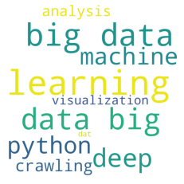
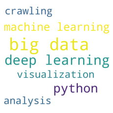

```python
#1
from wordcloud import WordCloud
import matplotlib.pyplot as plt

text='''python python python python python
big data big dat big data big data big data big data big data big data big data big data
crawling crawling crawling crawling
analysis analysis analysis analysis
visualization visualization visualization visualization
machine learning machine learning machine learning machine learning machine learning
deep learning deep learning deep learning deep learning deep learning deep learning'''

wc=WordCloud(width=1000, height=1000, background_color="white",random_state=0)
plt.imshow(wc.generate(text))
plt.axis("off")
plt.show()
```


    

    


```python
#2
frequency_d = {
    'python':5, 
    'big data':10,
    'crawling':4,
    'analysis':4,
    'visualization':4,
    'machine learning':5,
    'deep learning':6
}
wc=WordCloud(width=1000, height=1000, background_color="white",random_state=0)
plt.imshow(wc.generate_from_frequencies(frequency_d))
plt.axis("off")
plt.show()
```


    

    


```python

```
